# Gemini Enterprise Manager — Administrator & Engineer User Guide (`v0.0914.338`)
**Target Platform:** Google Cloud Gemini Enterprise (Discovery Engine & Vertex AI Console)  
**Target Audience:** IT Administrators ("Newcomer Nina") through Cloud DevOps & Security Engineers ("Engineer Eve")

---

## How to Use This Guide

This guide is designed for two distinct reader profiles who share the same administration console:

- **For IT & Workspace Administrators ("Newcomer Nina"):** Every section begins with a plain-English explanation of what the screen does, what each badge and button means, step-by-step **How to** workflows, and honest **Known limitations & gotchas** so you never waste time debugging expected platform behavior.
- **For Cloud & DevOps Engineers ("Engineer Eve"):** Every workflow includes collapsible **`<details><summary>Under the hood — the API call this makes</summary>`** blocks containing exact HTTP methods, URL templates, request headers, update masks, and copy-pasteable `gcloud` / `curl` commands verified directly against the TypeScript codebase.

---

## Master Table of Contents

- **[Chapter 0 — Getting Started, Authentication & Global Console Chrome](#chapter-0--getting-started-authentication--the-global-console-chrome)**
  - [How the app is configured & deployed](#how-the-app-is-configured--deployed)
  - [Signing in (Google OAuth SSO & Manual Bearer Token)](#signing-in)
  - [Pre-flight validation (Service Agent, User Access & 13 Required APIs)](#pre-flight-validation)
  - [The global console chrome & Sidebar structure (15 visible tabs)](#the-global-console-chrome)
  - [Show Interaction Details — the live cURL debugger](#show-interaction-details--the-curl-debugger)
  - [Glossary of Gemini Enterprise terms](#glossary)
  - [Decision Matrix: "Which tab do I need?"](#which-tab-do-i-need)
- **[Chapter 1 — Agent Management](#chapter-1--agent-management)**
  - [GE Agent Manager (Registering & managing ADK, A2A, and Low-Code agents)](#ge-agent-manager)
  - [Skills Registry (Enterprise SKILL.md archive catalog & publishing)](#skills-registry)
  - [ADK Studio (Interactive Python ADK 2.x & Cloud Run A2A code generator)](#adk-studio)
  - [Agent Runtimes (Vertex AI ReasoningEngines & Cloud Run A2A services)](#agent-runtimes)
  - [End-to-End Walkthrough: Build → Deploy → Register → Grant → Test](#end-to-end-build-deploy-register-grant-test)
- **[Chapter 2 — Knowledge, Resources, and Testing](#chapter-2--knowledge-resources-and-testing)**
  - [Connectors & Data Stores (Search/RAG stores, 22 third-party connectors, diagnostics)](#connectors--data-stores)
  - [Quota & Cost Estimator (Pooled license multiplier calculator & Cloud Monitoring usage)](#quota--cost-estimator)
  - [Engines & Assistants (Discovery Engine apps, grounding, and streaming chat Playground)](#engines--assistants)
  - [Architecture (Interactive React Flow topology graph & WCAG accessible matrix)](#architecture)
- **[Chapter 3 — Security & Access](#chapter-3--security--access)**
  - [Authorizations (OAuth 2.0 client credentials for agent tool execution)](#authorizations)
  - [Agent Permissions (Global IAM scanner & Workforce Identity Federation validator)](#agent-permissions)
  - [Model Armor (Content safety policies, prompt injection filters & violation logs)](#model-armor)
  - [Observability (BigQuery log sink discovery, 11 SQL analytics views & Live vs Mock badge)](#observability)
- **[Chapter 4 — System Operations & Appendices](#chapter-4--system-backup--recovery-app-config-audit-and-licenses)**
  - [Backup & Recovery (GCS JSON snapshots, the 8 resource cards & disaster recovery runbook)](#backup--recovery)
  - [App Config Audit (Read-only 5-pillar parity comparison between Source & Target apps)](#app-config-audit)
  - [Licenses (Discovery Engine user store seat assignments, IndexedDB cache & Auto-Pruner)](#licenses)
  - **[Appendix A — Complete Error Message Index](#appendix-a--error-message-index)**
  - **[Appendix B — Complete IAM & API Prerequisites Matrix (with copy-paste setup scripts)](#appendix-b--complete-iam--api-prerequisites-matrix)**

---

# Chapter 0 — Getting Started, Authentication, and the Global Console

**Who this chapter is for** — Everyone. Read this before any other chapter. It covers what the
application actually is, how to get it running, how to sign in, and every control that stays on
screen no matter which tab you are looking at.

**What you'll be able to do**

- Explain, to your security team, exactly where your credentials go when you use this tool.
- Start the console locally (`npm run dev`) or as a container (Docker / Cloud Run).
- Sign in with Google SSO **or** with a pasted `gcloud` access token — and recover when it expires.
- Run the pre-flight check, read all three result panels, and fix every failure it can report.
- Navigate the 5 sidebar groups and 15 tabs, and switch the active Google Cloud project.
- Turn on **Show Interaction Details** and hand a reproducible `curl` command to Google Cloud Support.

**Before you start**

| Requirement | Detail | Why |
|---|---|---|
| Node.js | `>=18.0.0` (declared in [package.json](file:///usr/local/google/home/wdufrin/Documents/Code/Gemini-Enterprise-Manager/package.json#L5-L7)); the Docker build image is `node:22-alpine` | Vite 8 will not run on older Node |
| A Google Cloud project | Billing enabled | Every screen is scoped to one project |
| Google Cloud SDK (`gcloud`) | Only needed for the pasted-token path and for manual remediation | `gcloud auth print-access-token` |
| Baseline IAM (read-only tour) | `roles/viewer` + `roles/serviceusage.serviceUsageConsumer` | Lets pre-flight list enabled APIs |
| Baseline IAM (normal admin work) | `roles/discoveryengine.admin` **or** `roles/discoveryengine.editor` | The three *critical* permissions the app checks are all `discoveryengine.engines.*` |
| IAM to self-remediate | `roles/serviceusage.serviceUsageAdmin` (enable APIs) and `roles/resourcemanager.projectIamAdmin` (grant the service agent) | Without these the fix buttons will fail with 403 |
| A modern browser | Chrome/Edge/Firefox, third-party script loading allowed | The page loads `accounts.google.com/gsi/client` and `apis.google.com/js/api.js` from [index.html](file:///usr/local/google/home/wdufrin/Documents/Code/Gemini-Enterprise-Manager/index.html#L7-L40) |

---

## At a glance

### What this application IS

Gemini Enterprise Manager is a **static single-page web app**. There is no backend. There is no
server that holds your data. When you click **Refresh**, your *browser* makes an HTTPS call
straight to `discoveryengine.googleapis.com` (or `aiplatform`, `run`, `bigquery`, `logging`,
`serviceusage`, `cloudresourcemanager`, `iam`, `modelarmor`, `dialogflow`, `storage`,
`cloudbilling`, `monitoring`, `agentregistry`) carrying **your** OAuth bearer token.

That design is the whole value proposition and the whole risk, so be clear about both:

- Everything you can do in this tool, you could already do with `curl`. It grants you **zero**
  extra permission. If IAM says no, the app shows you the 403.
- Conversely, the app applies **no policy of its own**. There is no approval workflow, no audit
  trail beyond Google Cloud Audit Logs, and no "are you sure" gate except the ones individual
  screens implement. Your IAM role *is* the security model.

### What this application is NOT

| It is not… | Because… |
|---|---|
| A Google-supported product | It is an Apache-2.0 sample console. `README.md` calls it "production-grade"; treat that as aspirational, not a support commitment. |
| A multi-tenant server | Nothing is stored server-side. Your project ID and token live in your browser tab only. |
| A replacement for the Cloud Console | It exposes `v1alpha` Discovery Engine surfaces the Console does not, and omits plenty the Console has. Most screens carry a **Cloud Console** link for exactly this reason. |
| Safe to expose publicly without thought | The README's Cloud Run recipes use `--allow-unauthenticated`. See the warning below. |

### Where your credentials actually go

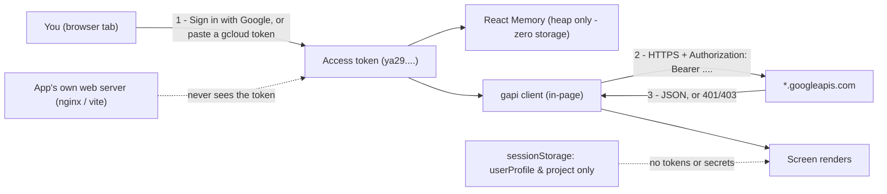
```mermaid
flowchart LR
  U["You (browser tab)"] -->|"1 - Sign in with Google, or paste a gcloud token"| T["Access token (ya29....)"]
  T --> M["React Memory (heap only - zero storage)"]
  T --> G["gapi client (in-page)"]
  G -->|"2 - HTTPS + Authorization: Bearer ...."| API["*.googleapis.com"]
  API -->|"3 - JSON, or 401/403"| G
  G --> UI["Screen renders"]
  X["App's own web server (nginx / vite)"] -. "never sees the token" .-> T
  P["sessionStorage: userProfile & project only"] -. "no tokens or secrets" .-> UI
```

1. The token is obtained in your browser.
2. It is held **strictly in transient JavaScript memory (React heap)**. Neither `sessionStorage`,
   `localStorage`, nor `IndexedDB` ever stores an access token. On startup, any legacy
   `agentspace-accessToken` key is defensively purged from browser storage.
3. It is handed to the Google API JavaScript client, which attaches it to every outbound call
   directly to `*.googleapis.com`.
4. The web server that served the HTML never receives, proxies, or logs the token.

> [!NOTE]
> **Zero-Storage Security Posture:** Because the token is never written to browser storage, malicious
> browser extensions, shared-origin scripts, and DevTools storage inspectors find zero credentials at
> rest. When the tab closes, the token is instantly garbage-collected from RAM. On page reload (`F5`),
> the application seamlessly obtains a fresh token in ~150ms via Google Identity Services silent
> refresh (`prompt: ''`).

> [!NOTE]
> The SSO path requests the scope `https://www.googleapis.com/auth/cloud-platform` plus
> `userinfo.profile` and `userinfo.email`
> ([App.tsx:298-301](file:///usr/local/google/home/wdufrin/Documents/Code/Gemini-Enterprise-Manager/App.tsx#L296-L302)).
> `cloud-platform` is the broadest Google Cloud scope there is — it is "everything your IAM roles
> allow". To ensure safety in enterprise environments, always log in with scoped IAM roles (see
> Appendix B) rather than `roles/owner`.

---

## Running the console

### What it's for

You need a copy of the app running somewhere your browser can reach, on an origin your OAuth
client trusts. Two supported shapes: a local dev server, or a container.

### How to: run it locally

1. Open a terminal in the repository root.
2. Run `npm install`.
3. Run `npm run dev`.
4. Open `http://localhost:5173`.

Expected result: the dark **Welcome to Gemini Enterprise Manager** screen.

Other scripts, verbatim from [package.json](file:///usr/local/google/home/wdufrin/Documents/Code/Gemini-Enterprise-Manager/package.json#L8-L21):
`npm run build` (production bundle into `dist/`), `npm run preview`, `npm start`
(serves `dist/` on port **8080**), `npm run typecheck`, `npm run lint`, `npm run test:run`.

> [!WARNING]
> `README.md` tells you to authorize `http://localhost:5173` and `http://localhost:3000` as OAuth
> JavaScript origins. **Nothing in this repo serves on port 3000.** `npm start` uses **8080** and
> `npm run preview` uses Vite's default **4173**. Authorize the port you will actually use, or
> Google sign-in will fail with a redirect/origin error.

### How to: run it in Docker (and Cloud Run)

1. `docker build -t gemini-enterprise-manager .`
2. `docker run -p 8080:8080 -e GOOGLE_CLIENT_ID="<your-id>.apps.googleusercontent.com" gemini-enterprise-manager`
3. Open `http://localhost:8080`.

The [Dockerfile](file:///usr/local/google/home/wdufrin/Documents/Code/Gemini-Enterprise-Manager/Dockerfile) is a two-stage build: `node:22-alpine` runs `npm ci && npm run build`, then
`nginx:alpine` serves `dist/` on port 8080 using [nginx.conf](file:///usr/local/google/home/wdufrin/Documents/Code/Gemini-Enterprise-Manager/nginx.conf).
At container start, [docker-entrypoint.sh](file:///usr/local/google/home/wdufrin/Documents/Code/Gemini-Enterprise-Manager/docker-entrypoint.sh) writes `/usr/share/nginx/html/config.json` from the
`GOOGLE_CLIENT_ID` environment variable and echoes what it wrote to the container log.

### Field reference — configuration

| Setting | Where it is read | Scope | Required? | What happens if unset |
|---|---|---|---|---|
| `custom-google-client-id` | `localStorage`, set by the UI ([App.tsx:104-108](file:///usr/local/google/home/wdufrin/Documents/Code/Gemini-Enterprise-Manager/App.tsx#L103-L114)) | Per browser | No | Falls through to the next source |
| `VITE_GOOGLE_CLIENT_ID` | `.env.local`, read at **build** time ([App.tsx:110](file:///usr/local/google/home/wdufrin/Documents/Code/Gemini-Enterprise-Manager/App.tsx#L110-L114)) | Baked into the bundle | No | Falls through |
| `GOOGLE_CLIENT_ID` | Container env → `config.json` at **runtime** | Per deployment | No | Entrypoint writes `""`, app falls through |
| `/config.json` | Fetched at page load ([App.tsx:116-127](file:///usr/local/google/home/wdufrin/Documents/Code/Gemini-Enterprise-Manager/App.tsx#L116-L128)) | Per deployment | No | Falls through |
| `DEFAULT_GOOGLE_CLIENT_ID` | Hardcoded constant ([AuthWelcomeScreen.tsx:27-28](file:///usr/local/google/home/wdufrin/Documents/Code/Gemini-Enterprise-Manager/components/auth/AuthWelcomeScreen.tsx#L27-L28)) | Last resort | — | Used |

Precedence, highest first: **localStorage → `VITE_GOOGLE_CLIENT_ID` → `/config.json` → hardcoded default.**

### Known limitations & gotchas

- **A client ID is shipped in the repo.** [public/config.json](file:///usr/local/google/home/wdufrin/Documents/Code/Gemini-Enterprise-Manager/public/config.json) contains
  `123456789012-exampleclientid.apps.googleusercontent.com`, identical to the
  hardcoded `DEFAULT_GOOGLE_CLIENT_ID`. It only works for origins its owner has authorized, so on
  your own host SSO will fail until you supply your own. That is not a leak (OAuth client IDs are
  public), but it does mean *"Sign in with Google does nothing"* is the expected first-run symptom
  on a custom domain.
- **Docker ignores `VITE_GOOGLE_CLIENT_ID`.** The Dockerfile passes no build arg, so the only
  container-time knob is `GOOGLE_CLIENT_ID` → `config.json`.
- **`.env.example` documents exactly one variable.** There are no others. Nothing else in this repo
  reads `import.meta.env`.
- **`vite.config.ts` defines no env handling at all** ([vite.config.ts](file:///usr/local/google/home/wdufrin/Documents/Code/Gemini-Enterprise-Manager/vite.config.ts)) — it only configures the React plugin,
  a watch-ignore list, Vitest, and `build.outDir`. `VITE_`-prefixed variables work purely through
  Vite's built-in behaviour.
- **The nginx CSP blocks Cloud Run agent endpoints.** `connect-src` allows only `'self'`,
  `https://*.googleapis.com` and `https://api.github.com`
  ([nginx.conf:17](file:///usr/local/google/home/wdufrin/Documents/Code/Gemini-Enterprise-Manager/nginx.conf#L17)). Any screen that calls a `*.run.app` service directly will
  be blocked in the container build but works fine under `npm run dev` (no CSP). If a feature works
  locally and dies in Docker with a console CSP error, this is why.

---

## Signing in

### What it's for

Two ways to prove who you are. Both end in the same place: a short-lived OAuth 2.0 **access token**
that the app puts in an `Authorization: Bearer` header.

### The screen, explained

The welcome screen ([AuthWelcomeScreen.tsx](file:///usr/local/google/home/wdufrin/Documents/Code/Gemini-Enterprise-Manager/components/auth/AuthWelcomeScreen.tsx)) is a single dark card, top to bottom:

| Region | Control | Notes |
|---|---|---|
| Header | **Welcome to Gemini Enterprise Manager** | — |
| Panel 1 | **Sign In with Google** → **Sign in with Google** button | Disabled while loading |
| Divider | `OR USE ACCESS TOKEN` | — |
| Panel 2 | **Manual Access Token**: a read-only `gcloud auth print-access-token` box with a **Copy** button, then a masked token field and **Set Token** | The Copy button copies the *command*, not a token |
| Panel 2 footer | **▼ Advanced: Configure OAuth Client ID** | Collapsed by default; reveals an input and a **Clear** button |
| Status | Spinners: *Initializing Google API Client… Please wait.* / *Validating access token permissions…* | — |
| Errors | Red banner with the raw `gapiError` text | — |

Once the token validates, the card switches to step 2: a green **API Client Initialized & Token
Validated Successfully!** banner, a **Project ID / Number** field, and two buttons —
**Validate APIs & Permissions** (indigo) and **Enter Application** (green).

````carousel
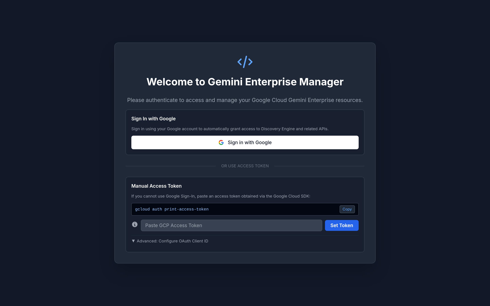
<!-- slide -->
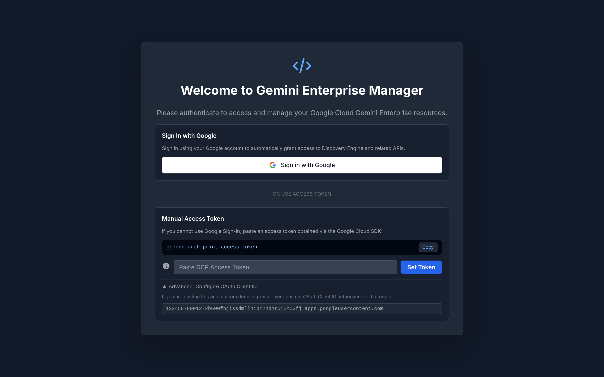
<!-- slide -->
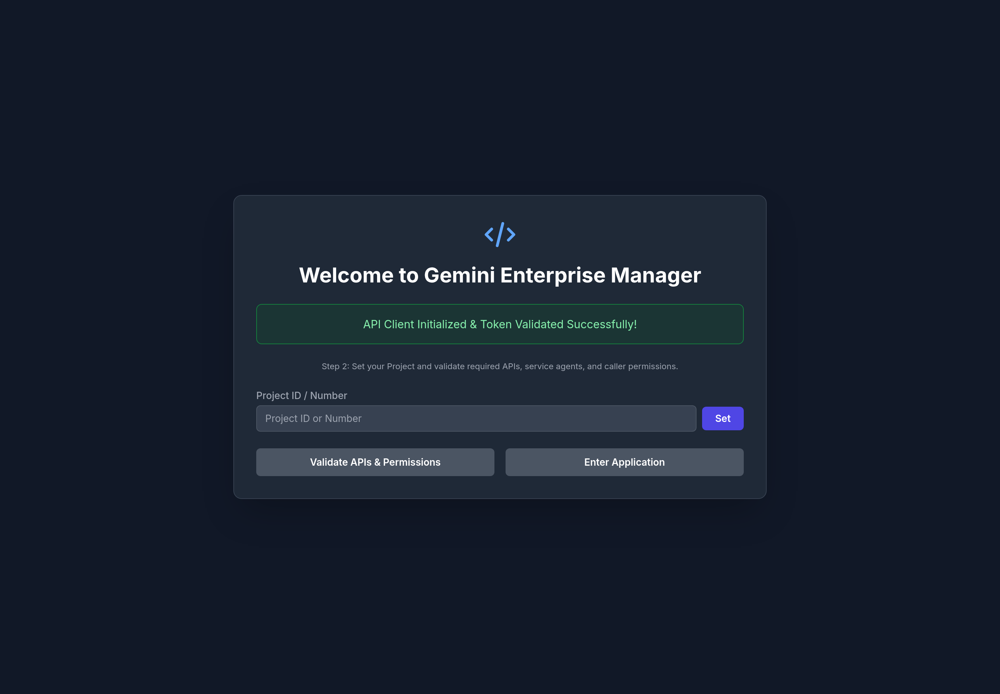
````

### How to: sign in with Google (recommended)

1. Click **Sign in with Google**.
2. In the Google popup, choose your account and approve the consent screen.
3. Wait for the green **API Client Initialized & Token Validated Successfully!** banner.

Expected result: your name, email and avatar appear in the top-right of the header after you enter
the app. Under the hood the app also calls `https://www.googleapis.com/oauth2/v3/userinfo`
to populate that profile ([App.tsx:316-326](file:///usr/local/google/home/wdufrin/Documents/Code/Gemini-Enterprise-Manager/App.tsx#L315-L329)); if that call fails, sign-in still succeeds and
the failure is only logged to the browser console.

### How to: get and paste an access token (no prior CLI experience needed)

Use this when SSO is blocked by policy, when you are on a locked-down network, or when you need to
act as a service account via `--impersonate-service-account`.

An access token is a long random string that means *"the bearer of this string is allowed to act as
me, for the next hour."* Google's access tokens start with the characters **`ya29.`** — that prefix
is just Google's marker for "this is an OAuth 2.0 access token". It is not a password and it cannot
be renewed; it simply expires.

1. Open a terminal. If you do not have one, open
   [Cloud Shell](https://console.cloud.google.com/) — the `>_` icon in the top-right of the Google
   Cloud Console. Cloud Shell is a terminal in your browser and already has `gcloud` installed.
2. If you are on your own machine and have never used `gcloud`, run `gcloud auth login` first and
   follow the browser prompt. In Cloud Shell you can skip this.
3. Run exactly this:
   ```bash
   gcloud auth print-access-token
   ```
4. One long line is printed, starting `ya29.`. Select the whole line and copy it. Do not include
   spaces or line breaks.
5. Back in Gemini Enterprise Manager, paste it into the **Paste GCP Access Token** field.
6. Press **Enter** or click **Set Token**.

Expected result: the green **API Client Initialized & Token Validated Successfully!** banner.

> [!CAUTION]
> That string is a live credential for the next hour. Do not paste it into chat, a ticket, an email,
> or a screenshot. If you ever do, run `gcloud auth revoke` immediately.

<details>
<summary>Under the hood — what "Set Token" actually does</summary>

`handleSetAccessToken` stores the token in React heap memory (actively removing any legacy tokens from
`sessionStorage`), then calls `initGapiClient(token)`
([App.tsx:257-276](file:///usr/local/google/home/wdufrin/Documents/Code/Gemini-Enterprise-Manager/App.tsx#L257-L276)). `initGapiClient` loads `https://apis.google.com/js/api.js`,
loads the `client` module with a 30-second timeout, enables CORS, and calls `gapi.client.init`
with nine discovery documents — `discoveryengine` v1alpha and v1beta, `aiplatform` v1beta1,
`cloudresourcemanager` v1, `logging` v2, `run` v2, `storage` v1, `serviceusage` v1, `dialogflow` v3
([gapiService.ts:63-141](file:///usr/local/google/home/wdufrin/Documents/Code/Gemini-Enterprise-Manager/services/gapiService.ts#L63-L141)).

**"Validated" is a weaker claim than it sounds.** The green banner means the discovery documents
loaded, not that your token is valid or has any permission. A garbage string can produce the green
banner; you will only find out at the first real API call.
</details>

### How to: use your own OAuth Client ID

Required whenever you host the app on anything other than an origin the built-in client ID trusts.

1. In the Google Cloud Console go to **APIs & Services → Credentials**.
2. **Create Credentials → OAuth client ID → Web application**.
3. Under **Authorized JavaScript origins**, add the exact origin you will browse to, including port
   (for example `http://localhost:5173` or `https://gem.example.com`).
4. Copy the generated Client ID.
5. On the welcome screen, click **▼ Advanced: Configure OAuth Client ID** and paste it.

Expected result: the value is saved to `localStorage` under `custom-google-client-id` and takes
effect immediately. A red **Clear** button appears next to the field; clicking it removes the
override and falls back to `/config.json`, then to the built-in default
([AuthWelcomeScreen.tsx:228-270](file:///usr/local/google/home/wdufrin/Documents/Code/Gemini-Enterprise-Manager/components/auth/AuthWelcomeScreen.tsx#L228-L270)).

> [!NOTE]
> The field saves on **every keystroke**. While you are part-way through pasting, the app is
> briefly configured with a truncated client ID. Harmless, but it explains transient
> "Sign-in failed" errors if you click too fast.

### Token lifetime, proactive renewal, and the Session Expired modal

Google access tokens last roughly **one hour**. The app treats `expires_in` as 3600 seconds when
the response omits it ([App.tsx:310-311](file:///usr/local/google/home/wdufrin/Documents/Code/Gemini-Enterprise-Manager/App.tsx#L309-L313)).

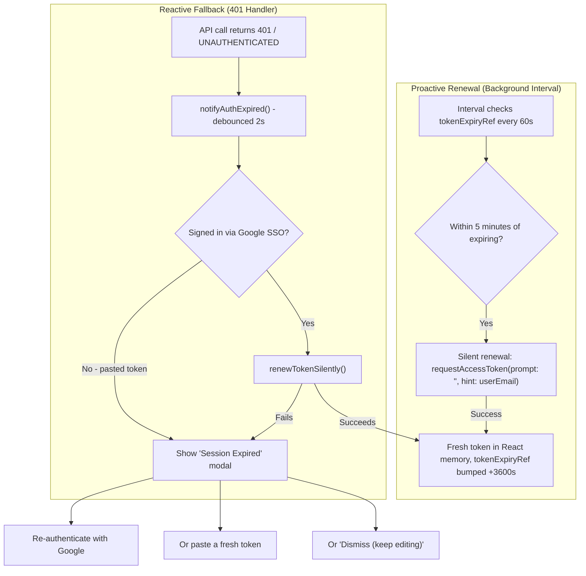
```mermaid
flowchart TD
  subgraph Proactive["Proactive Renewal (Background Interval)"]
    P1["Interval checks tokenExpiryRef every 60s"] --> P2{"Within 5 minutes of expiring?"}
    P2 -->|Yes| P3["Silent renewal: requestAccessToken(prompt: '', hint: userEmail)"]
    P3 -->|Success| P4["Fresh token in React memory, tokenExpiryRef bumped +3600s"]
  end

  subgraph Reactive["Reactive Fallback (401 Handler)"]
    A["API call returns 401 / UNAUTHENTICATED"] --> B["notifyAuthExpired() - debounced 2s"]
    B --> C{"Signed in via Google SSO?"}
    C -->|Yes| D["renewTokenSilently()"]
    D -->|Succeeds| P4
    D -->|Fails| F["Show 'Session Expired' modal"]
    C -->|"No - pasted token"| F
  end

  F --> G["Re-authenticate with Google"]
  F --> H["Or paste a fresh token"]
  F --> I["Or 'Dismiss (keep editing)'"]
```

The **Session Expired** modal ([AppModals.tsx:93-213](file:///usr/local/google/home/wdufrin/Documents/Code/Gemini-Enterprise-Manager/components/layout/AppModals.tsx#L93-L213)) is an amber-bordered dialog reading
*"Re-authenticate to continue without losing your current work or page state."* It offers
**Re-authenticate with Google** (only when an SSO token client exists), a paste field with the
placeholder `Paste GCP Bearer token (gcloud auth print-access-token)` and an
**Update Token & Continue** button, and a quiet **Dismiss (keep editing)** link.

> [!IMPORTANT]
> **Dismiss (keep editing)** does not fix anything. It closes the dialog so you can copy your
> unsaved form data somewhere safe. Every subsequent API call will still fail until you supply a
> fresh token.

### Known limitations & gotchas

- **Proactive renewal prevents mid-session expirations.** A background timer evaluates `tokenExpiryRef`
  every 60 seconds and triggers silent renewal whenever a token is within 5 minutes of expiring.
  Admins actively using the console rarely encounter 401 interruptions.
- **On page reload (`F5`), Google SSO sessions restore automatically.** Because Google session cookies
  remain active on `accounts.google.com`, the app silently requests a fresh access token on mount
  via `prompt: ''` in ~150ms without displaying login modals.
- **Manual-token users have pure ephemeral tokens.** Manual pasted tokens (`gcloud auth`) live solely
  in React component heap memory. If the tab is closed or reloaded, the token is instantly wiped,
  prompting re-entry or 1-click Google Sign-In.
- **A failed in-flight write is not retried after re-auth.** If a write call hit a 401 before a token
  refreshed, that specific call was rejected. Redo it once re-authenticated.
- **Sign Out is client-side only.** It clears state, React memory, and profile metadata
  ([App.tsx:185-197](file:///usr/local/google/home/wdufrin/Documents/Code/Gemini-Enterprise-Manager/App.tsx#L185-L197))
  but does **not** revoke the token at Google. The token remains valid at Google until its 1-hour
  expiry. To revoke immediately, run `gcloud auth revoke` or use your Google Account third-party access page.
- **Sign Out preserves project selection.** `agentspace-projectId` and `agentspace-projectNumber`
  survive in `sessionStorage` so the next login immediately remembers your working project.

### Troubleshooting

| Symptom / exact error text | Cause | Fix |
|---|---|---|
| `Google Identity Services script not loaded. Refresh or check network connectivity.` | `accounts.google.com/gsi/client` was blocked | Allow the domain; disable the blocking extension; reload |
| `Google Identity Services client is not initialized. Please check your OAuth Client ID.` | Clicked **Sign in with Google** before GIS finished loading, or the client ID is malformed | Wait a moment and retry; re-check the Advanced client-ID field |
| `Sign-in failed: <error>` | GIS returned an error — usually `idpiframe_initialization_failed` or an unauthorized origin | Add your exact origin (including port) to Authorized JavaScript origins |
| `Failed to initialize Google Sign-In client: <message>` | `initTokenClient` threw | Almost always a malformed client ID |
| `Token configuration failed: Timed out loading the gapi "client" module.` | `apis.google.com` unreachable within 30s | Network/proxy issue |
| `Token configuration failed: Failed to load the gapi "client" module.` | Same, hard failure | Same |
| `Cannot enter application. Ensure the API client is initialized and a project is set.` | Clicked **Enter Application** with no project | Fill in **Project ID / Number** first |
| Green banner, but every screen 401s | The "validation" never tested the token | Get a fresh token |

---

## Pre-flight validation

### What it's for

Before you waste an afternoon debugging a broken agent, this panel answers three questions about
your project: *Are the right APIs switched on? Does the Google-managed robot account have the role
it needs? Do **you** have the permissions to do the work?*

Click **Validate APIs & Permissions** on the welcome screen. The three checks run in parallel
([project.ts:360-375](file:///usr/local/google/home/wdufrin/Documents/Code/Gemini-Enterprise-Manager/services/api/project.ts#L360-L375)).

### The screen, explained

Results appear in [ApiValidationPanel.tsx](file:///usr/local/google/home/wdufrin/Documents/Code/Gemini-Enterprise-Manager/components/auth/ApiValidationPanel.tsx) under four sub-tabs:
**All Checks** (default), **Service Agent**, **User Access**, and **APIs (n/13)**.

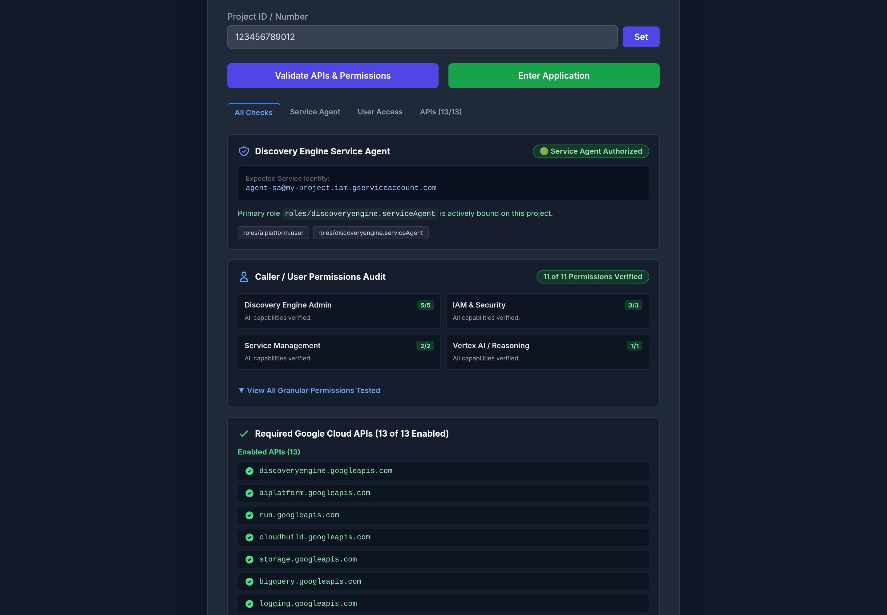

### Check 1 — Discovery Engine Service Agent

A *service agent* is a robot account Google creates for you, named
`service-<PROJECT_NUMBER>@gcp-sa-discoveryengine.iam.gserviceaccount.com`. Discovery Engine uses it
to crawl your data stores and run your agents. If it lacks its role, indexing and agent execution
fail with errors that look like your fault but are not.

| Badge | Meaning | What to do |
|---|---|---|
| 🟢 **Service Agent Authorized** | `roles/discoveryengine.serviceAgent` is bound | Nothing. Every role found on that member is listed as a chip. |
| ⚠️ **IAM Inspection Scoped** | You are not allowed to read the project IAM policy, so the check is inconclusive | Ask an admin to confirm, or get `roles/resourcemanager.projectIamViewer` |
| ❌ **Missing Service Agent Role** | Policy read OK, role absent | Click **+ Grant Discovery Engine Service Agent Role** |

The grant button calls `generateServiceIdentity` first (creating the robot account if it does not
exist yet), then read-modify-writes the project IAM policy to add **two** roles:
`roles/discoveryengine.serviceAgent` and `roles/aiplatform.user`
([App.tsx:429-431](file:///usr/local/google/home/wdufrin/Documents/Code/Gemini-Enterprise-Manager/App.tsx#L423-L447),
[project.ts:178-216](file:///usr/local/google/home/wdufrin/Documents/Code/Gemini-Enterprise-Manager/services/api/project.ts#L178-L216)).

> [!CAUTION]
> The grant performs a full-policy read-modify-write **without an etag precondition**
> ([iam.ts:118-131](file:///usr/local/google/home/wdufrin/Documents/Code/Gemini-Enterprise-Manager/services/api/iam.ts#L118-L131)). If another administrator or a Terraform run modifies
> the project IAM policy in the same window, their change can be silently overwritten. Avoid
> clicking this during a concurrent IAM deployment.

**Manual equivalent** (for anyone without `roles/resourcemanager.projectIamAdmin`, to hand to
someone who has it):

```bash
PROJECT_ID=my-project
PROJECT_NUMBER=$(gcloud projects describe "$PROJECT_ID" --format='value(projectNumber)')
SA="service-${PROJECT_NUMBER}@gcp-sa-discoveryengine.iam.gserviceaccount.com"

# Create the service identity if it does not exist yet
gcloud beta services identity create \
  --service=discoveryengine.googleapis.com --project="$PROJECT_ID"

gcloud projects add-iam-policy-binding "$PROJECT_ID" \
  --member="serviceAccount:${SA}" --role="roles/discoveryengine.serviceAgent"

gcloud projects add-iam-policy-binding "$PROJECT_ID" \
  --member="serviceAccount:${SA}" --role="roles/aiplatform.user"
```

> [!NOTE]
> The code also tracks three *recommended* roles for the service agent — `roles/aiplatform.user`,
> `roles/storage.objectViewer`, `roles/bigquery.dataViewer`
> ([project.ts:121-125](file:///usr/local/google/home/wdufrin/Documents/Code/Gemini-Enterprise-Manager/services/api/project.ts#L121-L125)) — but the panel never renders
> `missingRecommendedRoles`. If your data store reads from GCS or BigQuery, verify
> `storage.objectViewer` / `bigquery.dataViewer` yourself; the UI will not tell you.

### Check 2 — Caller / User Permissions Audit

Calls `projects:testIamPermissions` with **11** permissions and reports
`<granted> of <total> Permissions Verified` plus a 2×2 category grid
([project.ts:218-358](file:///usr/local/google/home/wdufrin/Documents/Code/Gemini-Enterprise-Manager/services/api/project.ts#L218-L358)). Click
**▼ View All Granular Permissions Tested** for the per-permission list.

| # | Permission | Category | What it unlocks | Recommended role | Critical? |
|---|---|---|---|---|---|
| 1 | `discoveryengine.engines.get` | Discovery Engine Admin | View Assistants & App Engines | `roles/discoveryengine.admin` | **Yes** |
| 2 | `discoveryengine.engines.update` | Discovery Engine Admin | Modify Assistant & Feature Configuration | `roles/discoveryengine.admin` | **Yes** |
| 3 | `discoveryengine.engines.list` | Discovery Engine Admin | List all Assistants & App Engines | `roles/discoveryengine.admin` | **Yes** |
| 4 | `discoveryengine.dataStores.get` | Discovery Engine Admin | View and query DataStores | `roles/discoveryengine.admin` | No |
| 5 | `discoveryengine.assistants.get` | Discovery Engine Admin | View Assistant chat configs & prompt chips | `roles/discoveryengine.admin` | No |
| 6 | `resourcemanager.projects.get` | IAM & Security | Get project metadata & number | `roles/viewer` | No |
| 7 | `resourcemanager.projects.getIamPolicy` | IAM & Security | Audit project IAM policy & service agents | `roles/resourcemanager.projectIamAdmin` | No |
| 8 | `resourcemanager.projects.setIamPolicy` | IAM & Security | Assign roles to service agents & users | `roles/resourcemanager.projectIamAdmin` | No |
| 9 | `serviceusage.services.list` | Service Management | Check enabled Google Cloud APIs | `roles/serviceusage.serviceUsageViewer` | No |
| 10 | `serviceusage.services.enable` | Service Management | 1-click enable required Google APIs | `roles/serviceusage.serviceUsageAdmin` | No |
| 11 | `aiplatform.reasoningEngines.list` | Vertex AI / Reasoning | List Vertex AI Agent Engines | `roles/aiplatform.user` | No |

Missing any of the three **critical** permissions produces a yellow box:
*"Missing Core Discovery Engine Privileges … Request `roles/discoveryengine.admin` or
`roles/discoveryengine.editor` from your project administrator."*

If the `testIamPermissions` call itself fails, you get a grey notice instead:
*"Could not test project IAM permissions: `<error>`. If you only have resource-scoped access, you
can still proceed into the app."*

> [!WARNING]
> **11 permissions is not full coverage.** No storage, BigQuery, Cloud Run, Cloud Build, Logging,
> Monitoring, Model Armor, Agent Registry or Compute permission is tested. A green
> "11 of 11 Permissions Verified" badge does **not** mean Backup & Recovery, Observability,
> Licenses, ADK Studio or Skills Registry will work.

**Manual equivalent:**

```bash
gcloud projects get-iam-policy my-project \
  --flatten="bindings[].members" \
  --filter="bindings.members:user:you@example.com" \
  --format="table(bindings.role)"
```

### Check 3 — Required Google Cloud APIs

The panel header reads **Required Google Cloud APIs (n of 13 Enabled)**. This is the complete list
copied verbatim from [project.ts:59-73](file:///usr/local/google/home/wdufrin/Documents/Code/Gemini-Enterprise-Manager/services/api/project.ts#L59-L73):

| # | API | Needed by |
|---|---|---|
| 1 | `discoveryengine.googleapis.com` | Everything Gemini Enterprise: engines, assistants, agents, data stores, authorizations, licences |
| 2 | `aiplatform.googleapis.com` | Agent Runtimes (Reasoning Engines), ADK Studio deployments |
| 3 | `run.googleapis.com` | Cloud Run–hosted agents, the licence pruner service |
| 4 | `cloudbuild.googleapis.com` | ADK Studio builds, pruner deployment |
| 5 | `storage.googleapis.com` | Backup & Recovery snapshots, `gs://` document import |
| 6 | `bigquery.googleapis.com` | Observability analytics |
| 7 | `logging.googleapis.com` | Model Armor audit log, error logs |
| 8 | `cloudbilling.googleapis.com` | Licences, cost estimation |
| 9 | `cloudresourcemanager.googleapis.com` | Project ID ↔ number resolution, IAM policy |
| 10 | `iam.googleapis.com` | Service accounts, workload identity pools |
| 11 | `serviceusage.googleapis.com` | This check itself, and the enable button |
| 12 | `dialogflow.googleapis.com` | Dialogflow CX agent inspection |
| 13 | `modelarmor.googleapis.com` | Model Armor templates |

Enabled APIs render green with a tick. Disabled ones render red with a checkbox and a
**[View in Console]** link to `console.cloud.google.com/apis/library/<api>?project=<n>`.

> [!WARNING]
> **Four APIs this console actually uses are NOT in the list**, so pre-flight will pass green while
> the relevant tab fails: `agentregistry.googleapis.com` (Skills Registry),
> `monitoring.googleapis.com` (Quota & Cost Estimator time series),
> `compute.googleapis.com` (load balancers / custom domains), and
> `cloudscheduler.googleapis.com` (scheduled pruning). Enable them by hand if you use those tabs.

> [!NOTE]
> The count `13` is hardcoded in two places
> ([ApiValidationPanel.tsx:137](file:///usr/local/google/home/wdufrin/Documents/Code/Gemini-Enterprise-Manager/components/auth/ApiValidationPanel.tsx#L137) and
> [:491](file:///usr/local/google/home/wdufrin/Documents/Code/Gemini-Enterprise-Manager/components/auth/ApiValidationPanel.tsx#L490-L492)) rather than derived from the array. It happens to
> be correct today; treat a mismatched denominator in a future build as a UI bug, not a real change.

### How to: enable missing APIs in bulk

1. Open the **APIs** sub-tab (or stay on **All Checks**).
2. Tick each disabled API, or use the **Select All** checkbox.
3. Click **Enable *n* Selected API(s)** (yellow button).
4. Watch the **API Enablement Log** panel below.

Expected result: log lines *"Starting to enable N API(s)…"*, *"Enablement operation started: …"*,
repeated *"Polling for operation status…"* every 3 seconds, then
*"API enablement successful! Re-validating…"*, after which the validation re-runs automatically.

<details>
<summary>Under the hood — the API calls</summary>

```bash
# Check
curl -X GET \
  "https://serviceusage.googleapis.com/v1/projects/PROJECT/services?filter=state:ENABLED&pageSize=200" \
  -H "Authorization: Bearer $(gcloud auth print-access-token)"

# Enable
curl -X POST \
  "https://serviceusage.googleapis.com/v1/projects/PROJECT/services:batchEnable" \
  -H "Authorization: Bearer $(gcloud auth print-access-token)" \
  -H "Content-Type: application/json" \
  -d '{"serviceIds":["discoveryengine.googleapis.com","aiplatform.googleapis.com"]}'
```

Or simply: `gcloud services enable discoveryengine.googleapis.com aiplatform.googleapis.com --project=my-project`
</details>

### Known limitations & gotchas

- **`pageSize=200` with no pagination.** `validateEnabledApis` reads one page of enabled services
  and never follows `nextPageToken` ([project.ts:75-82](file:///usr/local/google/home/wdufrin/Documents/Code/Gemini-Enterprise-Manager/services/api/project.ts#L75-L82)). In a project with
  more than 200 enabled services, APIs that *are* enabled can be reported as disabled. Clicking
  enable on them is harmless but the red flags are false.
- **The poll loop has no timeout.** `while (!currentOperation.done)` loops forever every 3 seconds
  ([App.tsx:484-488](file:///usr/local/google/home/wdufrin/Documents/Code/Gemini-Enterprise-Manager/App.tsx#L484-L488)). A stuck operation leaves the button spinning
  indefinitely; reload the page.
- **You cannot re-run pre-flight from inside the app.** The onboarding banner has a
  **Run Preflight Diagnostics** button, but it is only rendered when an `onOpenPreflight` prop is
  supplied — and [App.tsx:604-609](file:///usr/local/google/home/wdufrin/Documents/Code/Gemini-Enterprise-Manager/App.tsx#L604-L609) never supplies it. In practice you always see
  the fallback **Open Engines & Assistants** button instead. To re-run pre-flight you must
  **Sign Out** (or clear `sessionStorage`) and start again.
- **Changing the project clears prior results** silently ([App.tsx:388](file:///usr/local/google/home/wdufrin/Documents/Code/Gemini-Enterprise-Manager/App.tsx#L388)).
- **You can skip the whole thing.** **Enter Application** only requires a project to be set.

### Troubleshooting

| Symptom / exact error text | Cause | Fix |
|---|---|---|
| `Validation check failed: <msg>. Ensure the Service Usage API is enabled.` | `serviceusage.googleapis.com` off, or you lack `serviceusage.services.list` | `gcloud services enable serviceusage.googleapis.com`, or get `roles/serviceusage.serviceUsageViewer` |
| `Failed to grant Service Agent role: <msg>. You need roles/resourcemanager.projectIamAdmin or Project Owner privileges.` | Cannot `setIamPolicy` | Use the manual `gcloud` block above |
| `API enablement failed: <msg>` | Missing `serviceusage.services.enable`, or billing disabled | Get `roles/serviceusage.serviceUsageAdmin`; confirm billing |
| `Operation failed: <message>` | The long-running batch-enable operation returned an error | Read the message; usually an org policy blocking a service |
| ⚠️ **IAM Inspection Scoped** | Cannot read project IAM policy | Inconclusive, not a failure — verify out of band |

---

## The global console chrome

Everything in this section is present on **every** tab.

### The sidebar — 5 groups, 15 tabs

Verified against [Sidebar.tsx:108-151](file:///usr/local/google/home/wdufrin/Documents/Code/Gemini-Enterprise-Manager/components/Sidebar.tsx#L108-L151) and the `Page` enum at
[types.ts:18-41](file:///usr/local/google/home/wdufrin/Documents/Code/Gemini-Enterprise-Manager/types.ts#L18-L41):

| Group | Tabs (exact label) | Route |
|---|---|---|
| **Agent Management** | `GE Agent Manager` · `Skills Registry` · `ADK Studio` · `Agent Runtimes` | `/agents` `/skills` `/builder` `/runtimes` |
| **Knowledge & Resources** | `Connectors & Data Stores` · `Quota & Cost Estimator` | `/datastores` `/quota` |
| **Testing & Analysis** | `Engines & Assistants` · `Architecture` | `/assistant` `/architecture` |
| **Security & Access** | `Authorizations` · `Agent Permissions` · `Model Armor` · `Observability` | `/authorizations` `/permissions` `/model-armor` `/observability` |
| **System** | `Backup & Recovery` · `App Config Audit` · `Licenses` | `/backup` `/config-audit` `/licenses` |
| **Settings & Debug** (footer, expanded only) | `Show Interaction Details` toggle + request history | — |

Other sidebar behaviour:

- Each row has a second, purple **ⓘ** button on its right edge:
  *"Show API commands for `<tab>`"*. See the cURL section below.
- **Collapse Navigation** at the bottom shrinks the rail from `w-64` to `w-16`, showing icons with
  hover tooltips. **The Settings & Debug section, including the cURL toggle and history, is hidden
  entirely while collapsed** ([Sidebar.tsx:194](file:///usr/local/google/home/wdufrin/Documents/Code/Gemini-Enterprise-Manager/components/Sidebar.tsx#L194)). The collapsed state is not
  persisted across reloads.
- The header shows a hardcoded version string, currently `v0.0914.338`
  ([Sidebar.tsx:163](file:///usr/local/google/home/wdufrin/Documents/Code/Gemini-Enterprise-Manager/components/Sidebar.tsx#L163)).

### Pages that exist but are not in the sidebar

Five `Page` enum values have no nav entry. They are **not** dead code — all five have working
routes in [AppRoutes.tsx](file:///usr/local/google/home/wdufrin/Documents/Code/Gemini-Enterprise-Manager/components/layout/AppRoutes.tsx#L70-L119) and are reachable by URL hash:

| Page label | Reachable at | Status |
|---|---|---|
| `A2A Tester` | `#/a2a-tester` | Renders `A2aTesterPage`. Deep-link only. |
| `Cloud Run Agents` | `#/cloud-run` | Renders `CloudRunAgentsPage`. Deep-link only. |
| `Dialogflow Agents` | `#/dialogflow` | Renders `DialogflowAgentsPage`. Deep-link only. |
| `MCP Servers` | `#/mcp-servers` | Renders `McpServersPage`. Deep-link only. |
| `Test G.E. Agent` | `#/chat` | Renders the **same** `AssistantPage` as `Engines & Assistants` ([AppRoutes.tsx:91-92](file:///usr/local/google/home/wdufrin/Documents/Code/Gemini-Enterprise-Manager/components/layout/AppRoutes.tsx#L91-L92)). A duplicate, not a separate feature. |

The `Cloud Run Agents` and `Dialogflow Agents` pages are also surfaced as panels inside
**Agent Runtimes**. Four legacy routes silently redirect ([App.tsx:75-88](file:///usr/local/google/home/wdufrin/Documents/Code/Gemini-Enterprise-Manager/App.tsx#L74-L88)):
`/catalog` → `/agents`, `/connectors` → `/datastores?tab=connectors`,
`/vanity-urls` · `/domains` · `/custom-domains` → `/assistant`, and `/v_*` → `/observability?view=*`.

### Header: breadcrumbs and the project selector

**Breadcrumbs** ([Breadcrumbs.tsx](file:///usr/local/google/home/wdufrin/Documents/Code/Gemini-Enterprise-Manager/components/Breadcrumbs.tsx)) always start with the literal text
`Agent Space` — a legacy product name, not a link — followed by the current tab, then the selected
resource if one is open.

**Project selector** ([HeaderProjectInput.tsx](file:///usr/local/google/home/wdufrin/Documents/Code/Gemini-Enterprise-Manager/components/HeaderProjectInput.tsx)) shows
`Project: my-project (123456789012)`. To change it:

1. Click the project text.
2. Type either a **project ID** (`my-project`) or a **project number** (`123456789012`).
3. Press **Enter** or click **Set**.

**Project ID vs project number.** Both name the same project. The ID is the human string you chose;
the number is the immutable integer Google assigned. Some Google APIs want one, some the other —
so the app keeps both. Typing an ID triggers
`GET https://cloudresourcemanager.googleapis.com/v1/projects/<id>` to resolve the number
([HeaderProjectInput.tsx:53](file:///usr/local/google/home/wdufrin/Documents/Code/Gemini-Enterprise-Manager/components/HeaderProjectInput.tsx#L51-L55)); the app then re-resolves both values and caches
them in `sessionStorage` as `agentspace-projectId` and `agentspace-projectNumber`. Every tab
re-renders against the new project immediately — there is no extra "apply".

> [!WARNING]
> If resolution fails (typo, no `resourcemanager.projects.get`, project deleted) and you typed a
> **non-numeric** value, the app keeps your raw string as the project *number* and leaves the
> project *ID* blank ([App.tsx:389-394](file:///usr/local/google/home/wdufrin/Documents/Code/Gemini-Enterprise-Manager/App.tsx#L389-L394)). The header then reads
> `Project: Not Set` even though calls are being made. The only signal is a red inline tooltip and
> a browser-console `Failed to resolve project details`.

### Location / region and app selectors — not global

There is **no global region picker and no global Gemini Enterprise app picker**. The application
header contains exactly four things: breadcrumbs, the project selector, the help button, and the
profile/token control ([App.tsx:582-602](file:///usr/local/google/home/wdufrin/Documents/Code/Gemini-Enterprise-Manager/App.tsx#L582-L602)).

Region and app are chosen **per screen**. The shared widget is
[ProjectEngineSelector.tsx](file:///usr/local/google/home/wdufrin/Documents/Code/Gemini-Enterprise-Manager/components/common/ProjectEngineSelector.tsx), which offers a **Region Location** dropdown of
`global` / `us` / `eu` ([:38](file:///usr/local/google/home/wdufrin/Documents/Code/Gemini-Enterprise-Manager/components/common/ProjectEngineSelector.tsx#L38)) and a **Gemini Enterprise App ID**
dropdown populated by listing engines in `default_collection`, preferring `default_engine`, with
an **Enter manually** escape hatch. It is currently used by **App Config Audit** only; other tabs
roll their own. Setting the region on one tab does **not** change it on another.

### Help button and the built-in User Manual

The **?** icon in the header ([HelpButton.tsx](file:///usr/local/google/home/wdufrin/Documents/Code/Gemini-Enterprise-Manager/components/HelpButton.tsx)) opens
[UserManualModal.tsx](file:///usr/local/google/home/wdufrin/Documents/Code/Gemini-Enterprise-Manager/components/UserManualModal.tsx) — an 11-section in-app manual (Overview, Agent Management,
Skills Registry, Agent Engines, Builder & Catalog, Knowledge & Data, Security & Governance,
Observability, Operations, Setup & Configuration, API Reference). It is keyboard-accessible
(`role="dialog"`, Escape to close, focus trapping via `useModalA11y`).

> [!NOTE]
> The built-in manual uses **older tab names** than the live sidebar — "Agent Engines",
> "Data Stores", "Builder & Catalog", "Agent Builder". Its **Setup & Configuration** section also
> tells you to *"select the correct location (Global, US, EU) in the configuration bar"*, which
> implies a global control that does not exist. Trust the sidebar and this guide over the in-app
> manual.

### Cloud Console button

[CloudConsoleButton.tsx](file:///usr/local/google/home/wdufrin/Documents/Code/Gemini-Enterprise-Manager/components/CloudConsoleButton.tsx) renders a small **Cloud Console** link that
deep-links to the matching Google Cloud Console page for the current tab — Gen App Builder engines,
data stores, Cloud Run, Dialogflow CX, Model Armor, the licence page, or authorizations, defaulting
to the project dashboard. It is a **per-page** control (present on 10 pages), not a header control.
With no project set it links to `https://console.cloud.google.com/`.

### InfoTooltip

[InfoTooltip.tsx](file:///usr/local/google/home/wdufrin/Documents/Code/Gemini-Enterprise-Manager/components/InfoTooltip.tsx) is the small ⓘ glyph next to individual form fields. It
shows its text on **mouse hover only** — there is no focus or click handler, so it is **not
reachable by keyboard or screen reader**. Any information that appears only in an InfoTooltip is
effectively invisible to keyboard users.

### Onboarding banner

On first ever load, a blue **Welcome to Gemini Enterprise Manager — Quick Start Guide** banner
appears above the page content ([OnboardingBanner.tsx](file:///usr/local/google/home/wdufrin/Documents/Code/Gemini-Enterprise-Manager/components/OnboardingBanner.tsx)). Three status cards —
**1 Authenticate** (✓ Connected / Pending), **2 Set GCP Project** (✓ `<project>` / Not Set),
**3 Preflight Checks** — plus a **Quick Launch** row linking to Engines & Assistants,
Agent Builder (ADK), Agent Runtimes and Quota & Cost Estimator. **Collapse** hides the body;
**✕** or **Don't show again** dismisses it permanently via `localStorage` key
`gem_onboarding_dismissed_v1`. There is no UI to bring it back — clear that key in DevTools.

### Error boundary

[ErrorBoundary.tsx](file:///usr/local/google/home/wdufrin/Documents/Code/Gemini-Enterprise-Manager/components/ErrorBoundary.tsx) wraps both the whole app and each individual page. When a
page crashes you get *"Something went wrong in `<tab name>`"*, the raw error message, and three
buttons: **Try again**, **Reload application**, **Show technical details** (React component stack).
Navigating to another tab resets the boundary automatically.

> [!IMPORTANT]
> React error boundaries catch **render-phase** errors only. Failures inside click handlers,
> `async` callbacks and unhandled promise rejections are **not** caught here — they surface as a
> toast, an inline red banner, or nothing at all. If a button appears to do nothing, open the
> browser console (F12) before assuming success.

---

## Show Interaction Details — the cURL debugger

### What it's for

This is the single most useful feature in the console for a mixed-skill team. Switch it on and the
app records, in a form a machine can re-run, **every** HTTPS request it makes. Two payoffs:

- **Non-engineers** get to see what a button actually did — which Google service, which resource,
  which fields changed.
- **Engineers and support tickets** get a copy-pasteable `curl` command that reproduces the exact
  call outside the browser.

### How to: turn it on and read a request

1. Make sure the sidebar is **expanded** (the toggle is hidden when collapsed).
2. Scroll to **SETTINGS & DEBUG** at the bottom of the sidebar.
3. Flip **Show Interaction Details** on.
4. Do the thing you want to understand — click **Refresh**, save a form, open a tab.
5. A **History (n)** list appears beneath the toggle, newest first, capped at the **last 50** calls.
6. Click an entry to open the **API Details: `<METHOD> <resource>`** dialog.

Reading the history list:

| Badge colour | Method | Plain English |
|---|---|---|
| Blue | `GET` | Reading. Changes nothing. |
| Green | `POST` | Creating something, or invoking an action. |
| Yellow | `PATCH` | Modifying an existing thing. |
| Red | `DELETE` | Removing something. |

Each row shows the method badge, a timestamp, and the last path segment of the URL. Use the
**All / No GET** toggle to hide read traffic and isolate the calls that changed something — this is
the fastest way to answer *"what did that Save button actually modify?"*. **Clear** empties the list.

````carousel
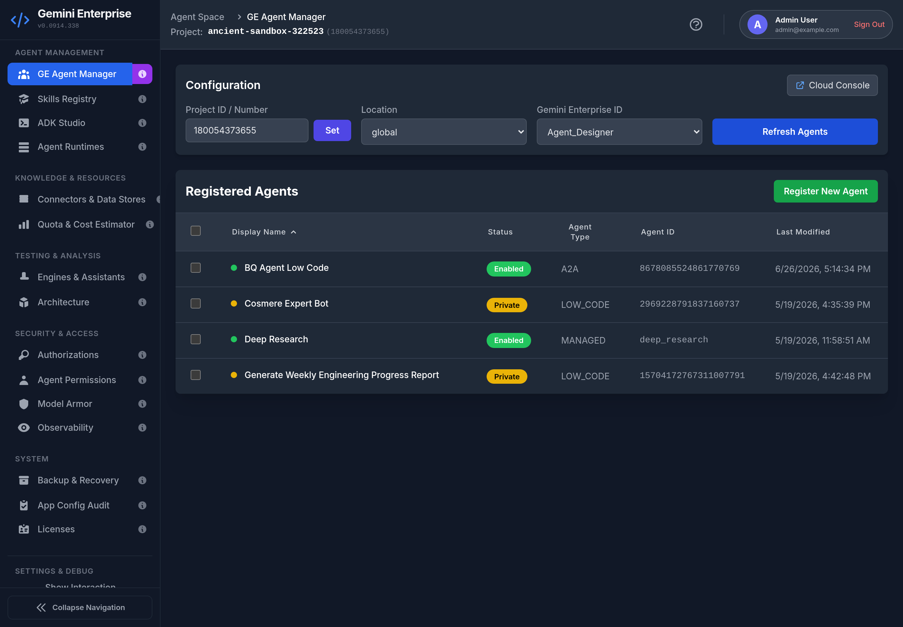
<!-- slide -->
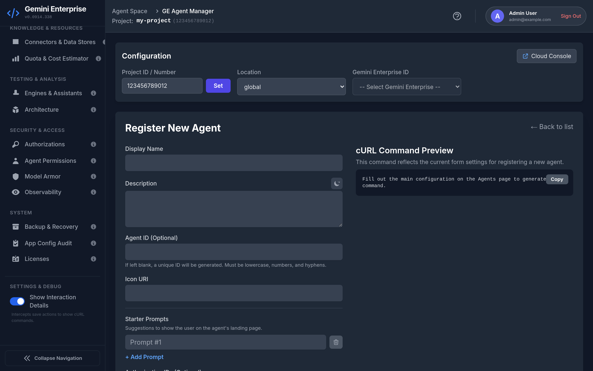
````

### How to: hand a reproducible cURL to Google Cloud Support

1. Turn on **Show Interaction Details**.
2. Reproduce the failure — do the exact thing that breaks.
3. Set the filter to **No GET** if the failure was a save; otherwise leave it on **All**.
4. Click the offending request in **History**.
5. Click **Copy** in the top-right of the code block.
6. Paste it into your support case. Add the timestamp from the history row and your project ID.

The pasted command is directly runnable by anyone with `gcloud` installed — the
`$(gcloud auth print-access-token)` substitution means **they** supply **their own** credential.

> [!TIP]
> Also copy the **error message** shown on the page. The debugger records the *request*, not the
> *response*. Support will need both.

### The per-tab ⓘ API reference

Separate from live capture: the purple **ⓘ** on each sidebar row opens
**API Commands for `<tab>`** ([CurlInfoModal.tsx](file:///usr/local/google/home/wdufrin/Documents/Code/Gemini-Enterprise-Manager/components/CurlInfoModal.tsx)) — a curated, static set of
`curl` templates for that tab's main operations, each with its own **Copy** button. Placeholders are
marked `[YOUR_PROJECT_ID]`, `[YOUR_ACCESS_TOKEN]`, `[LOCATION]`, `[ENGINE_ID]` and so on; the modal
reminds you to substitute them. All 15 sidebar tabs have entries, as do the individual Backup and
Restore scopes and the Architecture scan. Unmapped keys show
*"No specific API command examples are available for …"* rather than silently showing the wrong tab.

### Token redaction — precisely what is and is not protected

**Your access token is never written into the generated cURL.** Before logging, the code replaces
the `Authorization` header value with the literal string `Bearer $(gcloud auth print-access-token)`
([core.ts:186-199](file:///usr/local/google/home/wdufrin/Documents/Code/Gemini-Enterprise-Manager/services/api/core.ts#L184-L200)). Copying and pasting a command from the debugger
cannot leak your bearer token.

Request **bodies** are additionally scrubbed by [redaction.ts](file:///usr/local/google/home/wdufrin/Documents/Code/Gemini-Enterprise-Manager/services/redaction.ts) before display, which is
a genuinely careful piece of code:

- 33 exact key names are always replaced with `[REDACTED]` — `clientSecret`, `refreshToken`,
  `password`, `privateKey`, `apiKey`, `jwt`, `token`, `credential` and so on, matched after
  normalising case, underscores and hyphens.
- 10 substrings catch keys nobody enumerated (users can type arbitrary key names into custom
  action-param editors).
- Known-safe lookalikes are allow-listed so the log stays readable: `tokenUri`,
  `authorizationEndpoint`, `nextPageToken`, plural `authorizations` (a list of resource names).
- Five **value** patterns are scrubbed even under innocent key names: `Bearer …`, any `ya29.…`,
  Google API keys (`AIza…`), PEM private-key blocks, and JWTs.
- It never mutates the real request, never throws, handles cycles, and fails **closed** — an
  internal error yields `[REDACTION FAILED]`, never the raw value.

> [!WARNING]
> Redaction is good, not perfect. Three things are **not** protected:
> **(1) Resource names and IDs are shown in full** — project numbers, engine IDs, data store IDs,
> user emails in IAM bindings, `gs://` bucket paths. That is business-sensitive metadata.
> **(2) Non-secret body content is shown verbatim** — system instructions, prompts, connector
> configuration, display names.
> **(3) The browser DevTools Network tab is not redacted at all.** It shows the real
> `Authorization: Bearer ya29.…`. Never screenshot the Network tab into a ticket.

### Known limitations & gotchas

- **The toggle's own caption is wrong.** It reads *"Intercepts save actions to show cURL
  commands."* ([Sidebar.tsx:215](file:///usr/local/google/home/wdufrin/Documents/Code/Gemini-Enterprise-Manager/components/Sidebar.tsx#L214-L216)). Nothing is intercepted and nothing is
  paused for review. The feature is a passive recorder: requests go out immediately, exactly as
  they would with the toggle off. Do not rely on it as a confirmation step before a destructive
  action.
- **`CurlConfirmationModal` — the "Confirm & Execute" review dialog — is dead code.** It exists at
  [CurlConfirmationModal.tsx](file:///usr/local/google/home/wdufrin/Documents/Code/Gemini-Enterprise-Manager/components/CurlConfirmationModal.tsx) and is fully implemented, but a repository-wide
  search finds **zero** imports of it outside its own file. That is the review step the caption
  promises, and it is not wired up anywhere.
- **History is not retroactive.** Only requests made *after* you flip the toggle are recorded.
  Turn it on, *then* reproduce.
- **50-entry cap, in memory only.** Older calls are dropped; a page reload loses everything.
- **Responses are not captured.** Request line, headers and body only.
- **`X-Goog-User-Project` is added automatically** when a project is known — this is the quota and
  billing attribution header ([core.ts:173-175](file:///usr/local/google/home/wdufrin/Documents/Code/Gemini-Enterprise-Manager/services/api/core.ts#L173-L175)).
- **Retries are logged as separate entries.** `gapiRequest` retries 429/503 up to 3 times with
  exponential backoff ([core.ts:272-286](file:///usr/local/google/home/wdufrin/Documents/Code/Gemini-Enterprise-Manager/services/api/core.ts#L272-L286)), and a global limiter caps
  concurrency at 6. Duplicate-looking rows may be automatic retries, not double-clicks.
- **Body escaping is minimal.** `generateCurlCommand` escapes single quotes only
  ([core.ts:58-64](file:///usr/local/google/home/wdufrin/Documents/Code/Gemini-Enterprise-Manager/services/api/core.ts#L58-L64)). Bodies containing unusual characters may need
  hand-fixing before they run in a shell.

---

## Glossary

| Term | Plain English | Where you'll see it |
|---|---|---|
| **Gemini Enterprise** | Google's enterprise product for search and AI assistants over your own company data. The product this console administers. | The app title; the Cloud Console "Gemini Enterprise" section |
| **Discovery Engine** | The internal/API name for Gemini Enterprise. Same thing, older label. | `discoveryengine.googleapis.com` in every cURL command |
| **Engine / App** | One deployed Gemini Enterprise application — its data, assistant, agents and settings. Usually named `default_engine`. | **Engines & Assistants**; the **Gemini Enterprise App ID** dropdown |
| **Assistant** | The chat persona inside an Engine: its system instructions, model, safety settings and grounding. Usually `default_assistant`. | **Engines & Assistants** |
| **Data Store** | An indexed collection of your content — a GCS bucket, a BigQuery table, a website, or a SaaS connector — that an Assistant can search. | **Connectors & Data Stores** |
| **Agent** | A capability you attach to an Assistant so it can do something beyond answering from documents. | **GE Agent Manager** |
| **ADK** | *Agent Development Kit*. Google's Python framework for writing agents. | **ADK Studio** generates ADK code |
| **Agent Engine / Reasoning Engine** | Vertex AI's managed runtime that hosts a deployed agent. Two names for one thing (`reasoningEngines` in the API). | **Agent Runtimes** |
| **A2A** | *Agent-to-Agent*: an open protocol letting agents call each other over JSON-RPC. | `A2A Tester` (deep link `#/a2a-tester`) |
| **MCP** | *Model Context Protocol*: an open standard for exposing tools to an AI model. | `MCP Servers` (deep link `#/mcp-servers`); ADK Studio "Managed MCPs" |
| **Authorization / OAuth resource** | A saved OAuth 2.0 client config that lets an agent act on a user's behalf in a third-party system (Jira, Salesforce…). | **Authorizations** |
| **Collection** | A folder-like container grouping Engines and Data Stores within a project and location. | `collections/...` in resource paths |
| **`default_collection`** | The single collection Google creates automatically. In practice, always this one. | Hardcoded in most cURL templates |
| **Location / region** | Where your data physically lives and is processed: `global`, `us`, or `eu`. | The **Region Location** dropdown |
| **`global`** | Multi-region. The default. Uses `discoveryengine.googleapis.com`. | Most resource paths |
| **`us` / `eu`** | Data-residency regions. Use a **different hostname** — `us-discoveryengine.googleapis.com`. Resources in one region are invisible from another. | Regional resource paths |
| **Project ID** | The human-readable project name you chose, e.g. `my-gemini-project`. Cannot be changed. | Header **Project:** field |
| **Project number** | The immutable integer Google assigned, e.g. `123456789012`. Same project, different key. | Shown in parentheses after the ID |
| **Bearer token / access token** | A one-hour credential string (`ya29.…`) that proves who you are. Sent as `Authorization: Bearer …`. | Welcome screen; every cURL command |
| **`ya29.`** | The prefix Google puts on OAuth 2.0 access tokens. Seeing it means "this is a live credential". | Output of `gcloud auth print-access-token` |
| **IAM permission** | One atomic ability, e.g. `discoveryengine.engines.update`. | **User Access** pre-flight tab |
| **IAM role** | A named bundle of permissions, e.g. `roles/discoveryengine.admin`. You are granted roles, not permissions. | **Recommended role** column |
| **Service agent** | A robot account Google creates and manages for a service, so that service can act inside your project. | **Service Agent** pre-flight tab |
| **Service Usage** | The Google API that lists and enables other APIs. | The API enablement flow |

---

## Which tab do I need?

| I want to… | Go to | Group |
|---|---|---|
| See every agent attached to my assistant | **GE Agent Manager** | Agent Management |
| Turn an agent on or off | **GE Agent Manager** | Agent Management |
| Upload or version a reusable skill package | **Skills Registry** | Agent Management |
| Publish a skill to everyone in my organisation | **Skills Registry** | Agent Management |
| Generate and deploy a new Python (ADK) agent | **ADK Studio** | Agent Management |
| See which Vertex AI runtimes are deployed, and test one | **Agent Runtimes** | Agent Management |
| Inspect or kill a live agent session | **Agent Runtimes** | Agent Management |
| Add a GCS bucket, BigQuery table or website as knowledge | **Connectors & Data Stores** | Knowledge & Resources |
| Check why a Jira/SharePoint sync is failing | **Connectors & Data Stores** | Knowledge & Resources |
| Find out if I am about to hit a quota limit | **Quota & Cost Estimator** | Knowledge & Resources |
| Estimate next month's bill | **Quota & Cost Estimator** | Knowledge & Resources |
| Change the assistant's system instructions or model | **Engines & Assistants** | Testing & Analysis |
| Chat with the assistant to test it | **Engines & Assistants** | Testing & Analysis |
| Set up a custom domain / vanity URL | **Engines & Assistants** (`/vanity-urls` redirects here) | Testing & Analysis |
| See how engines, data stores and agents connect | **Architecture** | Testing & Analysis |
| Let an agent sign in to a third-party SaaS on a user's behalf | **Authorizations** | Security & Access |
| See who can access an agent or data store | **Agent Permissions** | Security & Access |
| Grant or revoke a user's access | **Agent Permissions** | Security & Access |
| Block prompt injection, jailbreaks, hate speech or PII leakage | **Model Armor** | Security & Access |
| See what got blocked by a safety filter | **Model Armor** | Security & Access |
| Check request volume, latency or error rates | **Observability** | Security & Access |
| Snapshot my configuration before a risky change | **Backup & Recovery** | System |
| Restore or migrate config to another project | **Backup & Recovery** | System |
| Check my project is production-ready | **App Config Audit** | System |
| See who has a Gemini licence and reclaim unused seats | **Licenses** | System |
| Understand what API call the app just made | **Show Interaction Details** toggle (sidebar footer) | Settings & Debug |
| Get a cURL template for a tab's operations | The purple **ⓘ** on that sidebar row | — |

---

## Chapter troubleshooting index

| Error text / symptom | Source | Cause | Fix |
|---|---|---|---|
| `Google Identity Services script not loaded. Refresh or check network connectivity.` | [App.tsx:291](file:///usr/local/google/home/wdufrin/Documents/Code/Gemini-Enterprise-Manager/App.tsx#L290-L293) | GIS script blocked | Allow `accounts.google.com`; reload |
| `Google Identity Services client is not initialized. Please check your OAuth Client ID.` | [App.tsx:284](file:///usr/local/google/home/wdufrin/Documents/Code/Gemini-Enterprise-Manager/App.tsx#L283-L285) | Clicked too early, or bad client ID | Wait, retry, verify client ID |
| `Sign-in failed: <error>` | [App.tsx:305](file:///usr/local/google/home/wdufrin/Documents/Code/Gemini-Enterprise-Manager/App.tsx#L304-L307) | GIS rejected the request | Add your exact origin to Authorized JavaScript origins |
| `Failed to initialize Google Sign-In client: <message>` | [App.tsx:333](file:///usr/local/google/home/wdufrin/Documents/Code/Gemini-Enterprise-Manager/App.tsx#L332-L334) | `initTokenClient` threw | Fix the client ID format |
| `Token configuration failed: <message>` | [App.tsx:268](file:///usr/local/google/home/wdufrin/Documents/Code/Gemini-Enterprise-Manager/App.tsx#L267-L272) | `gapi` init failed | Check network access to `apis.google.com` |
| `Timed out loading the gapi "client" module.` | [gapiService.ts:114](file:///usr/local/google/home/wdufrin/Documents/Code/Gemini-Enterprise-Manager/services/gapiService.ts#L114) | 30s timeout hit | Network/proxy |
| `Failed to load the gapi "client" module.` | [gapiService.ts:113](file:///usr/local/google/home/wdufrin/Documents/Code/Gemini-Enterprise-Manager/services/gapiService.ts#L112-L113) | Hard load failure | Network/proxy |
| `GAPI client has not been initialized. Call initGapiClient first.` | [gapiService.ts:149](file:///usr/local/google/home/wdufrin/Documents/Code/Gemini-Enterprise-Manager/services/gapiService.ts#L147-L150) | An API call fired before sign-in | Reload and sign in again |
| `Cannot enter application. Ensure the API client is initialized and a project is set.` | [App.tsx:510](file:///usr/local/google/home/wdufrin/Documents/Code/Gemini-Enterprise-Manager/App.tsx#L506-L512) | No project set | Enter a project ID or number |
| `Failed to resolve Project ID` (red inline tooltip) | [HeaderProjectInput.tsx:57](file:///usr/local/google/home/wdufrin/Documents/Code/Gemini-Enterprise-Manager/components/HeaderProjectInput.tsx#L56-L58) | Bad ID, or no `resourcemanager.projects.get` | Check spelling; request `roles/viewer` |
| `Validation check failed: <msg>. Ensure the Service Usage API is enabled.` | [App.tsx:417](file:///usr/local/google/home/wdufrin/Documents/Code/Gemini-Enterprise-Manager/App.tsx#L416-L418) | Service Usage off or not permitted | `gcloud services enable serviceusage.googleapis.com` |
| `Failed to grant Service Agent role: <msg>. You need roles/resourcemanager.projectIamAdmin or Project Owner privileges.` | [App.tsx:442](file:///usr/local/google/home/wdufrin/Documents/Code/Gemini-Enterprise-Manager/App.tsx#L439-L444) | Cannot `setIamPolicy` | Use the manual `gcloud` commands |
| `API enablement failed: <msg>` | [App.tsx:498](file:///usr/local/google/home/wdufrin/Documents/Code/Gemini-Enterprise-Manager/App.tsx#L497-L500) | Missing enable permission, or billing off | Grant `roles/serviceusage.serviceUsageAdmin`; check billing |
| `Operation failed: <message>` | [App.tsx:491](file:///usr/local/google/home/wdufrin/Documents/Code/Gemini-Enterprise-Manager/App.tsx#L490-L492) | Batch-enable LRO returned an error | Read the message; often an org policy |
| `Insufficient permissions to inspect project IAM policy (roles/resourcemanager.projectIamViewer or roles/owner required).` | [project.ts:172](file:///usr/local/google/home/wdufrin/Documents/Code/Gemini-Enterprise-Manager/services/api/project.ts#L171-L173) | Cannot read IAM policy | Inconclusive; verify out of band |
| `Could not check service agent status: <msg>` | [project.ts:173](file:///usr/local/google/home/wdufrin/Documents/Code/Gemini-Enterprise-Manager/services/api/project.ts#L173) | Non-permission failure | Read the underlying message |
| `Could not test project IAM permissions: <msg>. If you only have resource-scoped access, you can still proceed into the app.` | [project.ts:355](file:///usr/local/google/home/wdufrin/Documents/Code/Gemini-Enterprise-Manager/services/api/project.ts#L355) | `testIamPermissions` failed | Informational; you may continue |
| `Session Expired` modal appears | [AppModals.tsx:114](file:///usr/local/google/home/wdufrin/Documents/Code/Gemini-Enterprise-Manager/components/layout/AppModals.tsx#L113-L119) | A call returned 401 and silent renewal failed or was unavailable | Re-authenticate, or paste a fresh token |
| `Something went wrong in <tab>` | [ErrorBoundary.tsx:101](file:///usr/local/google/home/wdufrin/Documents/Code/Gemini-Enterprise-Manager/components/ErrorBoundary.tsx#L100-L102) | A page crashed while rendering | **Try again**; if it repeats, **Show technical details** and file a bug |
| `API request exceeded retry budget` | [core.ts:304](file:///usr/local/google/home/wdufrin/Documents/Code/Gemini-Enterprise-Manager/services/api/core.ts#L304) | 4 attempts all hit 429/503 | Wait; check quota in **Quota & Cost Estimator** |
| `No specific API command examples are available for "<name>".` | [CurlInfoModal.tsx:100](file:///usr/local/google/home/wdufrin/Documents/Code/Gemini-Enterprise-Manager/components/CurlInfoModal.tsx#L99-L102) | No curated templates for that key | Expected for some sub-flows; not a fault |
| Header reads `Project: Not Set` but calls still fire | [App.tsx:389-394](file:///usr/local/google/home/wdufrin/Documents/Code/Gemini-Enterprise-Manager/App.tsx#L389-L394) | Project resolution failed; the ID was never populated | Re-enter the project; check the browser console |
| A button appears to do nothing | — | Event-handler errors are not caught by the error boundary | Open DevTools (F12) → Console |
| Works in `npm run dev`, fails in Docker with a CSP error | [nginx.conf:17](file:///usr/local/google/home/wdufrin/Documents/Code/Gemini-Enterprise-Manager/nginx.conf#L17) | `connect-src` excludes `*.run.app` | Extend the CSP, or use the dev server |


---

# Chapter 1 — Agent Management

**Who this chapter is for** — Gemini Enterprise administrators who need to get an agent built,
deployed, registered, and reachable by their users. It covers the four tabs in the **Agent
Management** group of the left sidebar.

**What you'll be able to do**

- Register an existing agent with Gemini Enterprise so it appears in your users' assistant.
- Understand exactly which agent backends this app supports (and which it does not).
- Publish and manage enterprise Skills in the Google Cloud Agent Registry.
- Generate a complete, runnable ADK agent project from a form — and know what to do with the ZIP.
- Inspect, query, and delete the Vertex AI Agent Engines your agents actually run on.

**Before you start**

| Requirement | Detail |
|---|---|
| Signed in | The app runs entirely in your browser using **your** OAuth access token. Every API call is made as you. |
| Project ID **and** Project Number | Both are set in the app header and are used by different tabs. Agent Runtimes shows the **Project Number** read-only. |
| A Gemini Enterprise app (engine) | Required for **GE Agent Manager**. The app only ever looks inside the collection `default_collection` and the assistant `default_assistant`. |
| `discoveryengine.googleapis.com` | Enabled. Backs GE Agent Manager. |
| `aiplatform.googleapis.com` | Enabled. Backs Agent Runtimes and ADK deployment. |
| `agentregistry.googleapis.com` | Enabled. Backs Skills Registry. |
| `cloudbuild.googleapis.com`, `storage.googleapis.com` | Only needed if you use ADK Studio's in-app **Deploy** button. |
| IAM for deployment | Agent Engine target: `roles/aiplatform.user`, `roles/storage.objectViewer`. Cloud Run target: `roles/run.admin`, `roles/iam.serviceAccountUser`, `roles/storage.objectViewer`. Verified in [AgentDeploymentModal.tsx](file:///usr/local/google/home/wdufrin/Documents/Code/Gemini-Enterprise-Manager/components/agent-catalog/AgentDeploymentModal.tsx#L357-L361). |
| IAM for managed MCP tools | Generated agents that call Google-managed MCP endpoints need `roles/mcp.toolUser` plus the data role for each service (e.g. `roles/bigquery.dataViewer`, `roles/bigquery.jobUser`). |

---

## At a glance

These four tabs are a pipeline, not four unrelated screens.

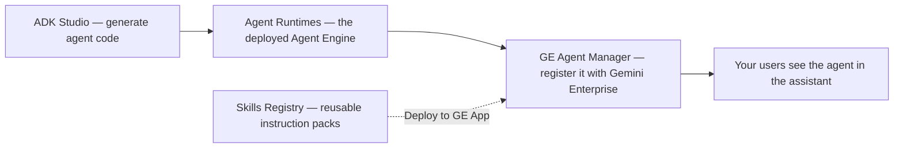
```mermaid
flowchart LR
  A["ADK Studio — generate agent code"] --> B["Agent Runtimes — the deployed Agent Engine"]
  B --> C["GE Agent Manager — register it with Gemini Enterprise"]
  C --> D["Your users see the agent in the assistant"]
  E["Skills Registry — reusable instruction packs"] -.->|Deploy to GE App| C
```

| Tab | Route | What it talks to |
|---|---|---|
| **GE Agent Manager** | `/agents` | Discovery Engine (`discoveryengine.googleapis.com`) |
| **Skills Registry** | `/skills-registry` | Agent Registry (`agentregistry.googleapis.com`) |
| **ADK Studio** | `/builder` | Nothing, until you click Deploy or Register. Code generation is 100% local to your browser. |
| **Agent Runtimes** | `/runtimes` | Vertex AI (`{region}-aiplatform.googleapis.com`) and Cloud Run |

Routes are defined in [routeUtils.ts](file:///usr/local/google/home/wdufrin/Documents/Code/Gemini-Enterprise-Manager/utils/routeUtils.ts#L19-L40) and the group is
assembled in [Sidebar.tsx](file:///usr/local/google/home/wdufrin/Documents/Code/Gemini-Enterprise-Manager/components/Sidebar.tsx#L108-L151).

---

## GE Agent Manager

### What it's for

This is the registry your end users actually see. An agent that runs somewhere in Google Cloud —
a Vertex AI Agent Engine, or an HTTP service that speaks the A2A protocol — is invisible to Gemini
Enterprise until you *register* it here. Registering creates an **agent** record under your Gemini
Enterprise app that says "here is the display name, the description, and the address to call."

Think of it as adding an app to a company app store. The app already exists; this is the listing.

### The screen, explained

**Configuration panel (top).** Four controls:

- **Location** — a dropdown with exactly three values: `global`, `us`, `eu`
  ([AgentsPage.tsx](file:///usr/local/google/home/wdufrin/Documents/Code/Gemini-Enterprise-Manager/pages/AgentsPage.tsx#L476-L480)).
- **App (engine)** — the Gemini Enterprise app to look inside. If your project has exactly one
  engine in that location, it is selected for you automatically
  ([AgentsPage.tsx](file:///usr/local/google/home/wdufrin/Documents/Code/Gemini-Enterprise-Manager/pages/AgentsPage.tsx#L154-L160)).
- **Cloud Console** button — opens
  `https://console.cloud.google.com/gemini-enterprise/locations/{location}/engines/{appId}/agentic/agents?project={projectNumber}`.
- **Refresh** — re-lists everything.

> [!IMPORTANT]
> The collection is hard-coded to `default_collection` and the assistant to `default_assistant`.
> A migration function actively overwrites any other value back to those defaults
> ([AgentsPage.tsx](file:///usr/local/google/home/wdufrin/Documents/Code/Gemini-Enterprise-Manager/pages/AgentsPage.tsx#L47-L63)).
> Agents living in a non-default collection are invisible in this app. This is not configurable
> from the UI.

**The agent table.** Sortable columns showing display name, type, state, and actions. Type is read
from the agent definition, with a fallback inference chain when the API doesn't say
([AgentsPage.tsx](file:///usr/local/google/home/wdufrin/Documents/Code/Gemini-Enterprise-Manager/pages/AgentsPage.tsx#L230-L240)):

| Signal in the API response | Type shown |
|---|---|
| `adkAgentDefinition` present | `ADK` |
| `a2aAgentDefinition` present | `A2A` |
| low-code or workflow definition present | `LOW_CODE` |
| an unusual `state` value | `LOW_CODE` |

**State badges** come from the agent's `state` field. A missing state means a *private no-code
agent* — those are read-only in this app (see Known limitations).

````carousel
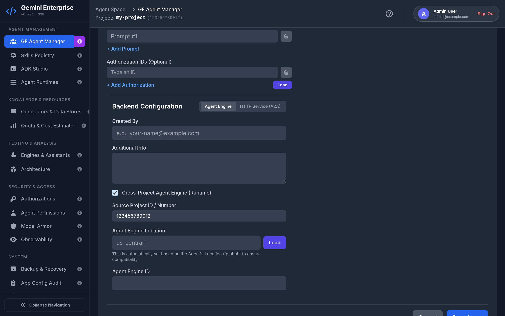
<!-- slide -->
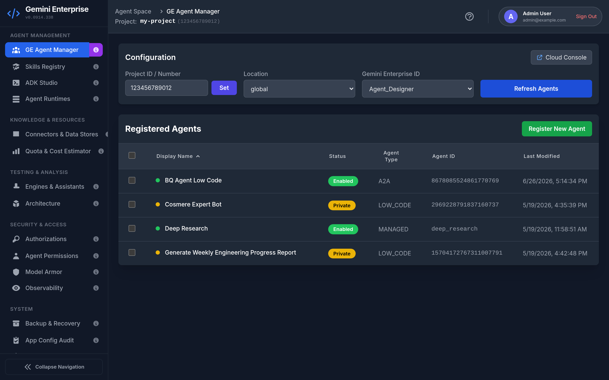
<!-- slide -->
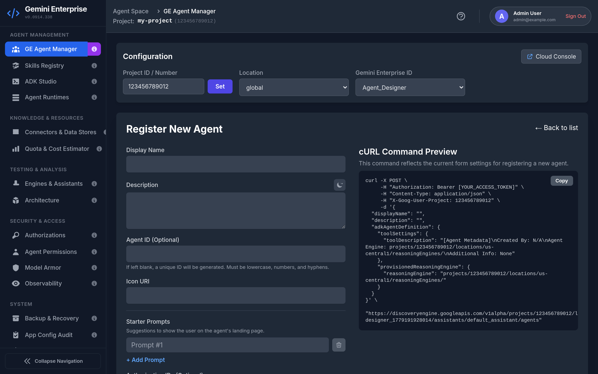
````

### How to: register a new agent

1. Set **Location** and pick your **App (engine)** at the top of the page.
2. Click **Register Agent**. The registration form opens.
3. Choose the backend type. There are exactly two buttons:
   **Agent Engine** and **HTTP Service (A2A)**
   ([AgentBackendConfig.tsx](file:///usr/local/google/home/wdufrin/Documents/Code/Gemini-Enterprise-Manager/components/agents/form/AgentBackendConfig.tsx#L86-L107)).
4. Fill in **Display Name** and **Description** — both are required.
5. Fill in the backend fields (see the field reference below).
6. Attach an **Authorization** if the agent needs to act as the signed-in user.
7. Click **Create**.

Expected result: the form closes, the list refreshes, and your agent appears with its type badge.

> [!WARNING]
> Authorizations are immutable. Once an agent is created you cannot add, remove, or change its
> authorizations from this app — the edit form renders them disabled with the note
> "Authorization cannot be changed after an agent is created", and the update payload deliberately
> omits `authorizationConfig`
> ([useAgentForm.ts](file:///usr/local/google/home/wdufrin/Documents/Code/Gemini-Enterprise-Manager/hooks/useAgentForm.ts#L525-L532)).
> Get this right the first time, or delete and re-create the agent.

<details>
<summary>Under the hood — the API call this makes</summary>

```
POST https://discoveryengine.googleapis.com/v1alpha/projects/{project}/locations/{location}
     /collections/default_collection/engines/{appId}/assistants/default_assistant/agents
     ?agentId={yourAgentId}
```

For a non-`global` location the host becomes `https://{location}-discoveryengine.googleapis.com`
([core.ts](file:///usr/local/google/home/wdufrin/Documents/Code/Gemini-Enterprise-Manager/services/api/core.ts#L20-L28)).

The body contains `displayName`, `description`, and one of `adkAgentDefinition` or
`a2aAgentDefinition`. Implementation: `createAgent` in
[agents.ts](file:///usr/local/google/home/wdufrin/Documents/Code/Gemini-Enterprise-Manager/services/api/discovery/agents.ts#L47-L60).

Edits use `PATCH` with an `updateMask` assembled from whichever keys are present in the payload
([agents.ts](file:///usr/local/google/home/wdufrin/Documents/Code/Gemini-Enterprise-Manager/services/api/discovery/agents.ts#L64)).
</details>

### How to: deploy, undeploy, or delete an agent

- **Enable / disable** — calls `:enableAgent` or `:disableAgent`
  ([agents.ts](file:///usr/local/google/home/wdufrin/Documents/Code/Gemini-Enterprise-Manager/services/api/discovery/agents.ts#L195-L213)).
- **Share** — calls `:share`; the code strips `/assistants/default_assistant` from the resource
  path before calling
  ([agents.ts](file:///usr/local/google/home/wdufrin/Documents/Code/Gemini-Enterprise-Manager/services/api/discovery/agents.ts#L215-L224)).
- **Delete from the list** — select one or more rows and click delete. You get a confirmation
  modal titled `Confirm Deletion of {n} Agent(s)`, listing each agent and warning
  "This action cannot be undone."
  ([AgentsPage.tsx](file:///usr/local/google/home/wdufrin/Documents/Code/Gemini-Enterprise-Manager/pages/AgentsPage.tsx#L507-L527)).

> [!CAUTION]
> There is a **second** Delete button, and it has no confirmation at all. Open an agent's detail
> view and scroll to **Advanced Actions** — the red **Delete** button there calls the delete API
> immediately on click. No modal, no prompt, no undo.
> See [AgentDetails.tsx:398](file:///usr/local/google/home/wdufrin/Documents/Code/Gemini-Enterprise-Manager/components/agents/AgentDetails.tsx#L398)
> calling `handleDelete` at
> [L133-L144](file:///usr/local/google/home/wdufrin/Documents/Code/Gemini-Enterprise-Manager/components/agents/AgentDetails.tsx#L133-L144).
> Treat that button as live ammunition.

### How to: check who can use an agent

In the agent detail view:

1. Click **Fetch Policy**. This calls `:getIamPolicy` on the agent resource.
2. Review the bindings.
3. Click **Edit Policy** — it stays disabled until step 1 succeeds, with the tooltip
   "Fetch the policy first to get the required ETag".
4. Save. On success you see "IAM Policy updated successfully.", which clears after 5 seconds.

<details>
<summary>Under the hood — the API call this makes</summary>

`getAgentIamPolicy` → `POST {agentResource}:getIamPolicy`
([iam.ts](file:///usr/local/google/home/wdufrin/Documents/Code/Gemini-Enterprise-Manager/services/api/iam.ts#L163-L167)).

`setAgentIamPolicy` → `POST {agentResource}:setIamPolicy`. If the etag is missing it silently
re-fetches the current policy first; that internal warning is swallowed
([iam.ts](file:///usr/local/google/home/wdufrin/Documents/Code/Gemini-Enterprise-Manager/services/api/iam.ts#L169-L191)).
</details>

### Field reference — registration form

| Field | What to enter | Required | Notes / Default |
|---|---|---|---|
| **Agent ID** | Lowercase letters, numbers, hyphens. Max 63 chars. | No (generated if blank) | Pattern `[a-z0-9-]{1,63}`. **Create-only** — cannot be changed later. |
| **Display Name** | What users will see. | **Yes** | — |
| **Description** | What the agent does. Shown to users. | **Yes** | An **AI rewrite** helper is available; it uses `gemini-2.5-flash`. |
| **Backend type** | **Agent Engine** or **HTTP Service (A2A)** | **Yes** | Disabled when editing. Only these two — see limitations. |
| **Agent Engine ID** | The reasoning engine's short ID or full resource name. | **Yes** (Agent Engine mode) | — |
| **Agent Engine Location** | — | — | **Read-only.** Derived from the app location: `us`/`global` → `us-central1`, `eu` → `europe-west1`, anything else → `us-central1` ([types.ts](file:///usr/local/google/home/wdufrin/Documents/Code/Gemini-Enterprise-Manager/components/agents/form/types.ts#L43-L53)). Default `us-central1`. |
| **Invoke URL** | Full HTTPS URL of your A2A endpoint. | **Yes** (A2A mode) | The Cloud Run picker sets this to `{serviceUri}/invoke`. |
| **Source Project ID** | The project owning the backend. | **Yes** when cross-project | — |
| **Created By** | Free text — a team or owner name. | No | Stored inside a synthesized metadata block, not a real API field. |
| **Additional Info** | Free text notes. | No | Same synthesized block. |
| **Authorizations** | Pick from your project's authorizations, or type IDs manually. | No | Default input mode is `manual`. Bare IDs expand to `projects/{project}/locations/global/authorizations/{id}` — **always `global`** ([useAgentForm.ts](file:///usr/local/google/home/wdufrin/Documents/Code/Gemini-Enterprise-Manager/hooks/useAgentForm.ts#L549)). |
| **Organization** (A2A) | Provider organization name for the agent card. | No | Default `My Organization`. |
| **Streaming** (A2A) | Whether the endpoint streams. | No | Default **on**. |
| **DCR extension URI** | Marketplace setup URL. | No | Default `https://cloud.google.com/marketplace/docs/partners/ai-agents/setup-dcr`. |

> [!NOTE]
> **Created By** and **Additional Info** are not first-class API fields. The form packs them into
> the agent's `toolDescription` as a text block, and parses them back out with regular expressions
> when you re-open the agent
> ([useAgentForm.ts](file:///usr/local/google/home/wdufrin/Documents/Code/Gemini-Enterprise-Manager/hooks/useAgentForm.ts#L119-L130)):
>
> ```
> [Agent Metadata]
> Created By: <value or N/A>
> Agent Engine: <path>
> Additional Info: <value or None>
> ```
>
> If you edit that description by any other means, these fields will read back wrong.

### Known limitations & gotchas

- **Only two backend types.** The UI offers `reasoning_engine` and `a2a`. There is **no Dialogflow
  option** in the registration form, despite a Dialogflow page existing elsewhere in the codebase.
- **Private no-code agents are read-only.** If an agent has no `state`, the whole form is disabled
  and you see the banner: *"Editing is disabled for this agent because it is a private no-code
  agent. Its configuration cannot be modified."*
- **The A2A agent card is fabricated.** When you register an A2A agent, the app synthesizes the
  card for you with `protocolVersion: '0.3.0'`, `version: '1.0.0'`, input/output modes
  `['text/plain']`, and exactly one hard-coded skill:
  `{ id: 'chat', name: 'Chat', description: 'Chat', examples: ['Hello'], tags: ['chat'] }`
  ([useAgentForm.ts](file:///usr/local/google/home/wdufrin/Documents/Code/Gemini-Enterprise-Manager/hooks/useAgentForm.ts#L498-L515)).
  There is no UI to change any of it. Your real agent's skills are not represented.
- **Permission errors are hidden by design.** Listing calls `getAgentView` per agent and swallows
  403s, returning `null`
  ([AgentsPage.tsx](file:///usr/local/google/home/wdufrin/Documents/Code/Gemini-Enterprise-Manager/pages/AgentsPage.tsx#L215-L222)).
  The table still renders, but an agent you lack permission on will show sparse or missing detail
  rather than an error. If a row looks empty, suspect IAM.
- **The Cloud Run service scan fails silently.** In A2A mode, clicking to load Cloud Run services
  catches the error and only writes to the browser console
  ([useAgentForm.ts](file:///usr/local/google/home/wdufrin/Documents/Code/Gemini-Enterprise-Manager/hooks/useAgentForm.ts#L403-L413)).
  An empty picker may mean "no services" or "the call failed" — you cannot tell from the UI.
  The picker covers 9 regions only: `us-central1`, `us-east1`, `us-east4`, `us-west1`,
  `europe-west1`, `europe-west2`, `europe-west4`, `asia-east1`, `asia-southeast1`.
- **Sorting by state is slightly wrong.** When an agent has no state, the sort comparator
  substitutes the literal string `'private'`
  ([AgentsPage.tsx](file:///usr/local/google/home/wdufrin/Documents/Code/Gemini-Enterprise-Manager/pages/AgentsPage.tsx#L400-L408)).
  Stateless agents therefore sort alphabetically among the `p`s.
- **Listing is slow on large tenants.** The page walks every assistant × every agent, then issues
  one `getAgentView` per agent.
- **Low-code model list is hard-coded** and includes preview model names that may not exist in your
  project: `gemini-3.1-pro-preview`, `gemini-3.6-flash`, `gemini-3.5-flash`, `gemini-2.5-pro`,
  `gemini-2.5-flash`, `gemini-1.5-pro`, `gemini-1.5-flash`
  ([AgentDetails.tsx](file:///usr/local/google/home/wdufrin/Documents/Code/Gemini-Enterprise-Manager/components/agents/AgentDetails.tsx#L455-L462)).
- **There is no agent catalog or gallery in this tab.** The `components/agent-catalog/` folder is
  used only by ADK Studio's deployment modal.
- **Data store discovery is heuristic.** The "data stores used by this agent" panel walks the
  agent-view JSON looking for any string whose key contains `datastore` and whose value starts with
  `projects/` and contains `/dataStores/`
  ([AgentDetails.tsx](file:///usr/local/google/home/wdufrin/Documents/Code/Gemini-Enterprise-Manager/components/agents/AgentDetails.tsx#L205-L232)).
  Unusual tool schemas will show "No data stores found in this agent's tool configuration."

### Troubleshooting

| Symptom / error text | Cause | Fix |
|---|---|---|
| Agent list is empty but agents exist in Console | Agents are in a non-default collection | Not fixable in-app. Use the Cloud Console link. |
| A row shows no type, no state, no detail | `getAgentView` returned 403 and was swallowed | Grant yourself the Discovery Engine viewer/editor role on that agent. |
| Cloud Run picker is empty in A2A mode | Scan failed silently, or no services in the 9 supported regions | Open the browser console to see the real error; or paste the Invoke URL manually. |
| `AI rewrite failed: {message}` | The `gemini-2.5-flash` call failed | Check `aiplatform.googleapis.com` is enabled and you have `roles/aiplatform.user`. |
| `Please enter some text to rewrite.` | You clicked AI rewrite with an empty description | Type something first. |
| Editing fields are greyed out with a yellow banner | Private no-code agent | Cannot be edited here. Manage it in the Console. |
| **Edit Policy** stays disabled | No policy fetched yet | Click **Fetch Policy** first — the app needs the ETag. |
| Agent deleted unexpectedly | You clicked Delete under **Advanced Actions** | Unrecoverable. Re-register the agent. |

---

## Skills Registry

### What it's for

A **Skill** here is a packaged instruction document — a `SKILL.md` file plus metadata — stored
centrally in the Google Cloud **Agent Registry** so multiple agents can reuse it. Think
"reusable playbook": a brand-voice guide, a sales-proposal structure, an incident postmortem
template. Skills are published once and then deployed into a Gemini Enterprise app.

> [!NOTE]
> This tab is **100% live API** against `https://agentregistry.googleapis.com` (`v1alpha`). There is
> no mock data and no GitHub dependency. The files `services/gitHubService.ts` (imported by nothing)
> and `services/githubApiCache.ts` (used only by ADK Studio's GitHub deploy modal) are unrelated to
> this screen.

### The screen, explained

- **Region selector** — three options, labelled exactly `🌍 Global`, `🇪🇺 EU (Europe)`,
  `🇺🇸 US (United States)`. Default `global`.
- **Stat cards** — Total Central Skills · 🟢 Active in Catalog · 🟡 Draft / Staging · 🏷️ Publishers.
- **Filters** — a publisher dropdown (`All Publishers`) and a status dropdown
  (`All Statuses` / `🟢 Active` / `🟡 Draft / Disabled`), plus a free-text search box.
- **Table** — columns `Skill Name & URN`, `Publisher`, `Status`, `Semantic Trigger & Description`,
  `Actions`. The only action is an eye icon titled "Inspect Skill & Revisions".

> [!WARNING]
> The table has **no sorting and no pagination**. The `nextPageToken` returned by the API is
> discarded, so if your registry has more skills than fit in one API page, the extras are simply
> never shown. There is no indication that this has happened.

**Empty state:** "No Enterprise Skills Found" with a **Publish First Skill** button. If filters are
active you instead get "No skills matched your search filter. Try clearing filters."

**Error state:** a red bar reading
`Failed to fetch enterprise skills from Google Cloud Agent Registry.` with an inline **Retry**.


### How to: publish a new skill

1. Click **Publish First Skill** (empty state) or the publish button in the header.
2. Optionally pick one of the three **templates** to prefill the form:
   - **🛡️ Brand Voice** — "Tone, style & guidelines" → ID `corporate-brand-voice`
   - **💼 Sales Proposals** — "B2B pitch & ROI decks" → ID `enterprise-sales-proposal`
   - **🚨 IT Incident SRE** — "Blameless postmortems" → ID `it-incident-postmortem`
3. Set the **Skill ID** (default `company-brand-voice`) and **Display Name**
   (default `Company Brand Voice`).
4. Choose a **Publisher Namespace**:
   `🏢 Organization Internal (Default)` (`default`),
   `Gemini Enterprise (discoveryengine)` (`discoveryengine.googleapis.com`), or
   `Google Cloud (cloud.google.com)`.
5. Write or paste the `SKILL.md` content.
6. Choose the target state (default **Active**).
7. Click publish.

Expected result: the modal closes and the skill appears in the table.

> [!CAUTION]
> **Your "Active" choice is not honoured on creation.** The create call always sends
> `targetState: 'TARGET_STATE_DRAFT'`
> ([PublishSkillModal.tsx:163](file:///usr/local/google/home/wdufrin/Documents/Code/Gemini-Enterprise-Manager/components/registry/PublishSkillModal.tsx#L163)).
> If you asked for Active, the app then polls up to 10 times at 2.5-second intervals (~25 seconds)
> waiting for the first revision to be ingested, and only then issues a PATCH to activate it.
> That poll **guesses** the resource name — `skills/private-{sanitizedId}` when no publisher is set
> ([L180-L182](file:///usr/local/google/home/wdufrin/Documents/Code/Gemini-Enterprise-Manager/components/registry/PublishSkillModal.tsx#L180-L182))
> — and every poll error is swallowed with a console warning
> ([L204-L206](file:///usr/local/google/home/wdufrin/Documents/Code/Gemini-Enterprise-Manager/components/registry/PublishSkillModal.tsx#L204-L206)).
> **Net effect: a skill can silently stay in DRAFT and the UI will never tell you.** Always re-check
> the Status column after publishing, and use **🟢 Activate in Company Catalog** in the detail modal
> if it is still yellow.

<details>
<summary>Under the hood — the API call this makes</summary>

The `SKILL.md` is zipped in the browser with JSZip, base64-encoded, and sent as
`initialRevision.archiveUploadSource.archiveContent`, with `type: 'SIMPLE'`.

```
POST https://agentregistry.googleapis.com/v1alpha/projects/{p}/locations/{loc}/skills?skillId={id}
PATCH https://agentregistry.googleapis.com/v1alpha/{skillName}?updateMask=...
```

Implementation: `createRegistrySkill`
([registry.ts](file:///usr/local/google/home/wdufrin/Documents/Code/Gemini-Enterprise-Manager/services/api/registry.ts#L49-L58)),
`updateRegistrySkill`
([L60-L73](file:///usr/local/google/home/wdufrin/Documents/Code/Gemini-Enterprise-Manager/services/api/registry.ts#L60-L73)).
A namespace equal to your own project ID is silently dropped from the request
([PublishSkillModal.tsx:172](file:///usr/local/google/home/wdufrin/Documents/Code/Gemini-Enterprise-Manager/components/registry/PublishSkillModal.tsx#L172)).
</details>

### How to: inspect, activate, deploy, or delete a skill

Click the eye icon on a row. The detail modal has three tabs:
**Overview & Specification**, **Revisions (n)**, and **Raw JSON Spec** (with a **Copy JSON** button
that flips to **✓ Copied**).

The footer holds the actions:

| Control | What it does |
|---|---|
| **Delete Skill** (red, far left) | Opens a type-to-confirm dialog — see below. |
| **App:** dropdown | Picks the Gemini Enterprise engine to deploy into. |
| **🚀 Deploy to GE App** | Registers the skill as an agent in that app. Shows **✓ Deployed to GE App!** for 3.5s. |
| **🟢 Activate in Company Catalog** / **🟡 Disable in Company Catalog** | Flips the registry state. |
| **Close** | Dismisses. |

> [!CAUTION]
> **🚀 Deploy to GE App has no confirmation and publishes to everyone.** The call hard-codes
> `state: 'ENABLED'` and `sharingConfig: { scope: 'ALL_USERS' }`
> ([RegistrySkillDetailModal.tsx:119-129](file:///usr/local/google/home/wdufrin/Documents/Code/Gemini-Enterprise-Manager/components/registry/RegistrySkillDetailModal.tsx#L119-L129)).
> One click makes the skill live for your entire organisation. If no engine is selected the app
> auto-picks one: the first engine with `solutionType === 'SOLUTION_TYPE_CHAT'`, else the first
> whose name contains `cosmere`, else simply `engines[0]`
> ([L140](file:///usr/local/google/home/wdufrin/Documents/Code/Gemini-Enterprise-Manager/components/registry/RegistrySkillDetailModal.tsx#L140)).
> **Always set the App dropdown explicitly before clicking Deploy.**

Delete, by contrast, is well guarded: a destructive-confirm dialog titled
`Delete Skill from Registry` that requires you to type the skill's display name, lists three
consequences, and has the button **Delete Skill**
([RegistrySkillDetailModal.tsx:523-539](file:///usr/local/google/home/wdufrin/Documents/Code/Gemini-Enterprise-Manager/components/registry/RegistrySkillDetailModal.tsx#L523-L539)).

### Field reference — Publish Skill

| Field | What to enter | Required | Notes / Default |
|---|---|---|---|
| **Skill ID** | Lowercase, hyphenated identifier. | **Yes** | Default `company-brand-voice`. Error if blank: `Skill ID is required (e.g. sales-pipeline-advisor).` |
| **Display Name** | Human-readable name. | **Yes** | Default `Company Brand Voice`. Error: `Display Name is required.` |
| **Publisher Namespace** | Who owns this skill. | No | Default `default`. A value equal to your project ID is dropped. |
| **Target State** | Active or Draft. | No | UI default **Active** — but see the caution above; creation always sends DRAFT first. |
| **SKILL.md content** | The instruction document. | **Yes in practice** | Zipped and uploaded as the initial revision. |

### Known limitations & gotchas

- **You cannot edit a skill.** There is no edit path — not for the description, not for the
  `SKILL.md`. `createRegistrySkillRevision` is only ever called internally when activating a skill
  that has zero revisions
  ([RegistrySkillDetailModal.tsx:192-200](file:///usr/local/google/home/wdufrin/Documents/Code/Gemini-Enterprise-Manager/components/registry/RegistrySkillDetailModal.tsx#L192-L200)).
  To change a skill you delete and re-publish.
- **The "Use New ID" button lies.** Its label reads `Use New ID ({id}-v2)`, but the code appends a
  random two-digit number: `Math.floor(Math.random() * 90 + 10)`
  ([PublishSkillModal.tsx:277](file:///usr/local/google/home/wdufrin/Documents/Code/Gemini-Enterprise-Manager/components/registry/PublishSkillModal.tsx#L277)).
  You will get e.g. `my-skill-47`, not `my-skill-v2`.
- **Deploy conflicts are resolved silently.** If the agent already exists (HTTP 409), the code
  quietly switches to `updateAgent` and overwrites it
  ([L147-L156](file:///usr/local/google/home/wdufrin/Documents/Code/Gemini-Enterprise-Manager/components/registry/RegistrySkillDetailModal.tsx#L147-L156)).
- **App context is hard-coded** to `appId: 'default_engine'`, `collectionId: 'default_collection'`,
  `assistantId: 'default_assistant'`.
- **No pagination** (see above).

### Troubleshooting

| Symptom / error text | Cause | Fix |
|---|---|---|
| `Failed to fetch enterprise skills from Google Cloud Agent Registry.` | API disabled, wrong region, or no permission | Enable `agentregistry.googleapis.com`; try a different region; check IAM. Use the inline **Retry**. |
| Skill stays 🟡 Draft after publishing as Active | The activation poll timed out or guessed the wrong resource name | Open the skill and click **🟢 Activate in Company Catalog**. |
| `Failed to update state: {message}` | The activate/disable PATCH failed | Usually permissions or a skill with no revisions yet. Wait and retry. |
| `Failed to deploy skill: {message}` | The Discovery Engine agent create/update failed | Check the App dropdown points at a real engine and you can write agents there. |
| `No engines found in project {projectId} ({appLocation}). Please ensure an engine exists in this region.` | No Gemini Enterprise app in that region | Create one, or switch region. |
| `Failed to delete skill: {message}` | Delete rejected | Check permissions; a deployed skill may need to be disabled first. |
| Skills missing from the list | More skills than one API page | Not fixable in-app — use the API or `gcloud` directly. |

---

## ADK Studio

### What it's for

ADK Studio generates a complete Python agent project for you from a form. You describe the agent —
name, model, instructions, which Google Cloud tools it may use — and the app writes the code live,
in your browser, as you type. You then download it as a ZIP, or let the app build and deploy it for
you.

**It is not a wizard.** There are no Next/Back buttons. It is a two-column workbench: settings on
the left, generated code on the right. The page's own heading is **"ADK Prototyper & Code Studio"**
with the subtitle *"Interactive ADK agent code generation, tool composition, and enterprise OAuth
delegation blueprints."*

### If you don't write code — read this first

Here is the honest version of what you get and what you must do.

**What you get:** a ZIP file containing a Python project. It is real, working source code — not a
document and not a configuration file.

**What you must have to use it yourself:**

- Python 3.11 installed.
- The `gcloud` CLI installed, and `gcloud auth application-default login` already run.
- A Google Cloud Storage bucket to use as a staging bucket.
- A terminal, and the willingness to run three or four commands.

**The three commands:**

```bash
unzip my_agent.zip && cd my_agent
make install     # installs the Python dependencies
make deploy      # deploys to Vertex AI Agent Engine
```

**If that sounds like too much:** don't download the ZIP. Use the **🚀 Deploy...** button in the
toolbar instead. That builds and deploys everything using Google Cloud Build — you never touch a
terminal. You only need a GCS bucket to stage the source in.

> [!IMPORTANT]
> Do **not** run `scripts/deploy.sh` from the ZIP. It is broken. The script `cd`s into its own
> `scripts/` directory and then looks for `deploy_re.py` or `app/deploy_re.py` relative to *there* —
> but the ZIP puts the file at `app/deploy_re.py` relative to the project **root**, i.e.
> `../app/deploy_re.py`. Both branches miss, so it always prints `Error: deploy_re.py not found.`
> and exits. Use `make deploy` (or `python -m app.deploy_re` from the project root) instead.
> See [adkDeployScriptTemplate.ts](file:///usr/local/google/home/wdufrin/Documents/Code/Gemini-Enterprise-Manager/services/adkTemplates/adkDeployScriptTemplate.ts#L4-L19)
> vs [agentZipGenerator.ts:121](file:///usr/local/google/home/wdufrin/Documents/Code/Gemini-Enterprise-Manager/utils/agentZipGenerator.ts#L121).

### The screen, explained

**Mode toggle (top).** Two modes:

- **ADK Agent (Engine)** — a full Google ADK agent for Vertex AI Agent Engine.
- **A2A Function (Cloud Run)** — a small Flask service that speaks the A2A JSON-RPC protocol.

**Utility buttons.** **Clear Draft** (titled "Reset form to default state" — no confirmation) and
**Check Build Status**.

**Left column — "1. Configure Agent"** (`AdkBasicSettings` + `AdkToolsConfig` +
`AdkDeploymentConfig`, or the A2A form).

**Right column — "2. Component & Code Explorer"**, with a toolbar:

| Button | Enabled when |
|---|---|
| **📋 Copy File** | agent name is a valid Python identifier |
| **📥 Download .zip** | same |
| **🚀 Deploy...** | same |
| **🔗 Register in GE...** | always |

Code regenerates on every keystroke. If a generator throws, you get an inline comment block
starting `# {label} cannot be generated with the current settings.` instead of a crash
([AgentBuilderPage.tsx](file:///usr/local/google/home/wdufrin/Documents/Code/Gemini-Enterprise-Manager/pages/AgentBuilderPage.tsx#L150-L163)).

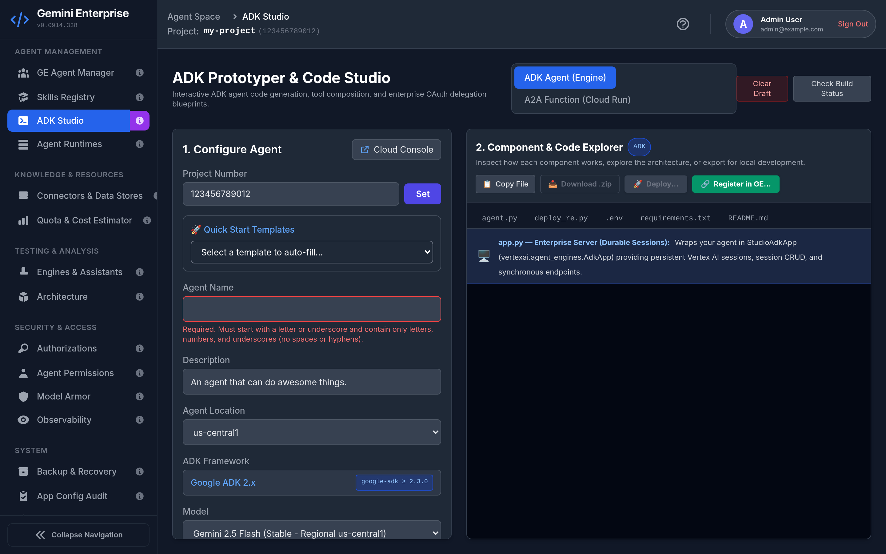

### Configuration reference — Basic settings

| Field | What to enter | Required | Notes / Default |
|---|---|---|---|
| **Quick Start Template** | One of five presets. | No | Placeholder "Select a template to auto-fill...". **Selecting one wipes your whole config** — see below. |
| **Agent Name** | A Python identifier. | **Yes** | Pattern `^[A-Za-z_][A-Za-z0-9_]*$`. Invalid input turns the border red. Three toolbar buttons stay disabled until it is valid. |
| **Description** | One line. | No | Default `An agent that can do awesome things.` |
| **Instruction** | The system prompt. | No, but effectively yes | Default `You are an awesome and helpful agent.` |
| **Agent Location** | Deployment region. | No | Only three choices: `us-central1`, `europe-west1`, `asia-east1`. |
| **ADK Framework** | — | — | **Read-only display text**: `Google ADK 2.x`, badge `google-adk ≥ 2.3.0`. |
| **Model** | Gemini model. | No | Default `gemini-2.5-flash`. See the model list below. |

**Model dropdown**, grouped exactly as shown in the UI:

- *Gemini 3.x — Cutting-Edge Reasoning (Global)*: `gemini-3.5-flash` (labelled
  "Recommended - Reasoning Depth"), `gemini-3.5-flash-lite`, `gemini-3.8-flash`,
  `gemini-3.1-pro-preview`, `gemini-3-flash-preview`
- *Gemini 2.x — Production & Auto-Updating*: `gemini-flash-latest`, `gemini-2.5-flash`,
  `gemini-2.5-flash-lite`, `gemini-2.5-pro`

> [!CAUTION]
> **Choosing a Quick Start Template destroys everything you have configured.** The handler builds a
> fresh default config and spreads the template over it — it does not merge with your current state
> ([AdkBasicSettings.tsx:75-147](file:///usr/local/google/home/wdufrin/Documents/Code/Gemini-Enterprise-Manager/components/agent-builder/AdkBasicSettings.tsx#L75-L147)).
> There is no warning and no undo. Pick your template **first**, then configure.

**The five templates** ([starterTemplates.ts](file:///usr/local/google/home/wdufrin/Documents/Code/Gemini-Enterprise-Manager/services/adkTemplates/starterTemplates.ts#L234-L240)):

| Template | Generated agent name | Turns on |
|---|---|---|
| `GCP Logs Reader` | `GCP_Logs_Reader` | Google Search, Cloud Logging MCP, OAuth |
| `GCP Health Monitoring Agent` | `GCP_Health_Monitor` | SCC, Recommender, Service Health, Network Mgmt, Cloud Assist, Logging/Monitoring/Resource Manager MCP, Cloud Run API, Admin Activity, Database Fleet, OAuth, Email, Code Execution |
| `GCP Health Monitoring Agent (API Version)` | `GCP_Health_Monitor_API` | Same domain, direct APIs instead of MCP |
| `GCP BigQuery Expert Agent` | `GCP_BigQuery_Orchestrator` | BigQuery MCP, OAuth, Code Execution |
| `GCP Architecture Diagram Agent` | `GCP_Architecture_Designer` | Google Search, Graphviz, Thinking, Network Mgmt, Compute/Resource Manager/GKE/Cloud SQL MCP, Cloud Run API, Email, OAuth |

> [!WARNING]
> The **GCP BigQuery Expert Agent** template's instruction text tells the model it has an
> `architecture_diagram_agent` sub-agent, but the same template sets `enableGraphvizRendering: false`
> so that tool is never generated. The agent will be prompted to call something that does not exist.

### Tool configuration

The **Agent Tools & Capabilities** card has six collapsible sections (they auto-open if any child is
checked), plus **Expand All** / **Collapse All**:

1. **🧠 Core Capabilities & Reasoning** — thinking toggle with a **Token Budget** input
   (placeholder `Limit (-1)`, helper text "(-1 for unlimited)"), **Code Execution Sub-Agent**,
   **Graphviz Local Renderer**.
2. **🔌 Managed MCP Tool Servers** — badge `{n}/12 active`. Twelve Google-managed MCP endpoints:
   `BigQuery MCP (SQL & Datasets)`, `Cloud Logging MCP`, `Bigtable Admin MCP`,
   `Cloud SQL Admin MCP`, `Cloud Monitoring MCP`, `Compute Engine MCP`, `Firestore MCP`,
   `GKE Kubernetes MCP`, `Resource Manager MCP`, `Cloud Spanner MCP`, `Developer Knowledge MCP`,
   `Maps Grounding Lite MCP`.
3. **⚡ Advanced Enterprise GCP APIs** — badge `{n}/12 active`: `Security Command Center`,
   `GCP Recommender`, `Service Health`, `Network Management`, `Cloud Logging API`,
   `Cloud Monitoring API`, `Cloud Run Discovery`, `Resource Manager`, `Admin Activity Auditing`,
   `Database Fleet Health`, `Gemini Cloud Assist`, `Email Dispatcher`.
4. **🌐 Custom MCP Endpoints** — badge `{n} configured`, with a **Verify Connection** check.
5. **🔐 Authentication & User Impersonation** — badge `OAuth Active` or `ADC / Service Account`.
   Contains **Enable End-User OAuth Delegation** and the ADC-fallback toggle, whose tooltip reads
   "If disabled, tools will fail with an error if no user token is present, instead of defaulting to
   the service account."
6. **📊 Observability & Telemetry** — telemetry (**on by default**) and message logging.

> [!WARNING]
> Four tool features cannot be reached from this panel:
> - **`enableDiscoveryApi`** (the "query Gemini Enterprise" tool) and **`enableBqAnalytics`** have
>   **no checkbox anywhere** in the tools card. They are only settable via a Quick Start Template or
>   the GitHub deploy modal.
> - **`enableStreaming`** and **`enableEvaluation`** exist in the config type and defaults but **no
>   generator reads them** — toggling them changes nothing in the output.

> [!CAUTION]
> Two shipped tools are not what their labels imply.
> **Network Management → `run_connectivity_test`** is a stub: it builds a request with a hardcoded
> `test_id="adk-temp-test"`, never sends it, and returns the literal string
> `"Not fully implemented in template."`
> ([cloudApiToolGenerators.ts:182-183](file:///usr/local/google/home/wdufrin/Documents/Code/Gemini-Enterprise-Manager/services/adkTemplates/tools/cloudApiToolGenerators.ts#L182-L183)).
> Two starter templates enable it and instruct the model to use it.
> **Model Armor** is cosmetic — the generated `model_armor_before_model_callback` reads the template
> name and then `return None`. No Model Armor API is ever called
> ([agentTemplate.ts:498-504](file:///usr/local/google/home/wdufrin/Documents/Code/Gemini-Enterprise-Manager/services/adkTemplates/agentTemplate.ts#L498-L504)).
> Also note **Database Fleet Health** is labelled "Cloud SQL, Spanner & AlloyDB" but the generated
> code only queries Cloud SQL Admin, Spanner, and Firestore — never AlloyDB.

### Deployment settings

The section is literally headed **"Lifecycle Management (WIP)"**
([AdkDeploymentConfig.tsx:71](file:///usr/local/google/home/wdufrin/Documents/Code/Gemini-Enterprise-Manager/components/agent-builder/AdkDeploymentConfig.tsx#L71)).

| Field | Options | Default |
|---|---|---|
| **Deployment Target** | `agent_engine`, `cloud_run` | `agent_engine` |
| **CI/CD Runner** | `none`, `github_actions`, `google_cloud_build` | `none` |
| **Cloud Run Access** | `authenticated`, `public`, `iap` | `authenticated` |

Cloud Run Access controls the flags in the generated Makefile:
`--no-allow-unauthenticated` (authenticated), `--allow-unauthenticated` (public), or
`--no-allow-unauthenticated --iap` (IAP). An unknown value fails **closed** (private).

> [!NOTE]
> This used to hardcode `--allow-unauthenticated`, meaning every agent built here was reachable by
> the entire internet without the user ever being asked. It now defaults to IAM-only. The service
> name is also validated by `assertValidGcpResourceName` before being interpolated into shell
> commands, because `cloudbuild.yaml` runs the Makefile from a `bash -c` step
> ([cicdTemplates.ts:80-101](file:///usr/local/google/home/wdufrin/Documents/Code/Gemini-Enterprise-Manager/services/adkTemplates/cicdTemplates.ts#L80-L101)).

There is also a **Workload Identity Federation** help link that toggles between
"How to set up WIF" and "Hide setup instructions" and prints four
`gcloud iam workload-identity-pools ...` commands, and a button
**Automated CI/CD Workflow Setup** (disabled with the tooltip
"Enter a valid agent name before setting up CI/CD.").

The **ADK STANDARDS VALIDATION** panel lists four checks:
"Standard Folder Structure (app/, tests/)", "Evaluation Configured", "CI/CD Pipeline Configured",
"Design Spec Generated". The first and last are both gated purely on
`isValidAdkAgentName(name) && Boolean(instruction?.trim())` — they are not real inspections.

For GitHub Actions you must supply, in your repository: the secret `GCP_WIF_PROVIDER` and a real
service account email (the generated caller workflow ships the placeholder
`my-service-account@my-project.iam.gserviceaccount.com`). The service account needs
`roles/aiplatform.user`, `roles/run.developer`, and `roles/iam.workloadIdentityUser`.

### How to: download and run the agent yourself

1. Enter a valid **Agent Name**.
2. Configure the model, instruction, and tools.
3. Click **📥 Download .zip**. The file is named `{agentName}.zip` (or `adk_agent.zip`).
4. Unzip it, then in a terminal:

```bash
cd <agent_name>
python3 -m venv .venv && source .venv/bin/activate
pip install -r app/requirements.txt
# edit .env — set GOOGLE_CLOUD_PROJECT, STAGING_BUCKET, DEPLOYMENT_LOCATION
make deploy
```

Expected result: the script either creates a new Agent Engine or updates an existing one with the
same display name, and prints the resource name.

**What is actually in the ZIP**
([agentZipGenerator.ts:101-200](file:///usr/local/google/home/wdufrin/Documents/Code/Gemini-Enterprise-Manager/utils/agentZipGenerator.ts#L101-L200)):

```
<agent_name>.zip
├── app/
│   ├── app.py            always
│   ├── agent.py          always  — the agent itself
│   ├── __init__.py       always
│   ├── requirements.txt  always
│   ├── deploy_re.py      always  — the real deployer
│   ├── auth.py           only if End-User OAuth is on
│   └── tools.py          only if at least one tool is on
├── tests/eval/test_config.json
├── tests/eval/evalsets/basic.evalset.json
├── scripts/launch_local.sh
├── scripts/deploy.sh                    <-- BROKEN, see warning above
├── deployment/terraform/main.tf         <-- contains only "# Terraform config placeholder"
├── installation_scripts/install_graphviz.sh   only if Graphviz is on
├── agent.py              3-line shim re-exporting root_agent from app.agent
├── .env, .gitignore, .gcloudignore
├── README.md, DESIGN_SPEC.md, Makefile
├── Dockerfile                    only if target is cloud_run
├── cloudbuild.yaml               only if runner is google_cloud_build
└── .github/workflows/deploy.yaml only if runner is github_actions
```

The **A2A ZIP** is much simpler — five flat files: `main.py`, `Dockerfile`, `requirements.txt`,
`deploy.sh`, `env.yaml`, named `{serviceName}-source.zip`.

**Generated Makefile targets**
([cicdTemplates.ts:75-142](file:///usr/local/google/home/wdufrin/Documents/Code/Gemini-Enterprise-Manager/services/adkTemplates/cicdTemplates.ts#L75-L142)):

| Target | What it runs |
|---|---|
| `make install` | `pip install -r app/requirements.txt` |
| `make test` | `pytest tests/unit` (if present), then `adk eval ./app tests/eval/evalsets/basic.evalset.json --config_file_path=tests/eval/test_config.json` |
| `make deploy` | Alias for `deploy-agent-engine` (`python -m app.deploy_re`) or `deploy-cloud-run` (`gcloud run deploy`) |

### How to: deploy without a terminal

1. Click **🚀 Deploy...**.
2. Pick a **GCS bucket** for staging.
3. Confirm the target (Agent Engine or Cloud Run) and environment variables.
4. Click deploy. You'll see `Build triggered! ID: {id}`.
5. Use **Check Build Status** in the page header to follow it.

<details>
<summary>Under the hood — the API call this makes</summary>

The browser builds the ZIP, writes `.env` from your environment variables plus
`STAGING_BUCKET=gs://<bucket>`, uploads to
`gs://{bucket}/source/{agentName}-{timestamp}.zip`, then submits a Cloud Build with
`timeout: '1200s'`
([AgentDeploymentModal.tsx:225-341](file:///usr/local/google/home/wdufrin/Documents/Code/Gemini-Enterprise-Manager/components/agent-catalog/AgentDeploymentModal.tsx#L225-L341)).

**Agent Engine** — one step on `python:3.11`:
```
pip install --upgrade pip && \
pip install --root-user-action=ignore -r requirements.txt && \
pip install --root-user-action=ignore "google-cloud-aiplatform[adk,agent_engines]>=1.75.0" && \
python deploy_re.py
```
`DEPLOYMENT_LOCATION=us-central1` is injected if absent.

**Cloud Run** — three steps: `docker build -t {region}-docker.pkg.dev/{project}/cloud-run-source-deploy/{name} .`,
`docker push`, then a `gcr.io/google.com/cloudsdktool/cloud-sdk` bash step.
</details>

> [!WARNING]
> The Cloud Build upload uses a **different, flatter file layout** than the ZIP: no `app/` directory,
> no `__init__.py`, no README, no Makefile, no tests
> ([AgentBuilderPage.tsx:206-228](file:///usr/local/google/home/wdufrin/Documents/Code/Gemini-Enterprise-Manager/pages/AgentBuilderPage.tsx#L206-L228)).
> The GitHub push uses a **third** layout
> ([L238-L280](file:///usr/local/google/home/wdufrin/Documents/Code/Gemini-Enterprise-Manager/pages/AgentBuilderPage.tsx#L238-L280)),
> including a different pair of eval files. Three delivery paths, three project shapes. Debugging
> one does not tell you about the others.

### How to: register straight from the Studio

Click **🔗 Register in GE...**. The modal defaults to `location: 'global'`,
`collectionId: 'default_collection'`, `assistantId: 'default_assistant'`. For A2A it appends
`/invoke` to the URL if you left it off.

Success message: `Successfully registered agent "{name}" (ID: {id}) in Gemini Enterprise!`

> [!NOTE]
> Engine and authorization lists in this modal fail silently (`console.warn` only). If the dropdowns
> look empty, the load failed. This path also never sets an icon or starter prompts — use
> **GE Agent Manager** afterwards if you want those.

### Known limitations & gotchas

- **Six generated files have no preview tab.** `ADK_TABS` contains only seven entries: `agent.py`,
  `deploy_re.py`, `.env`, `requirements.txt`, `README.md`, `auth.py` (if OAuth), `tools.py` (if
  tools) ([types.ts:278-286](file:///usr/local/google/home/wdufrin/Documents/Code/Gemini-Enterprise-Manager/services/adkTemplates/types.ts#L278-L286)).
  `app.py`, `__init__.py`, `Makefile`, `Dockerfile`, `cloudbuild.yaml`, and
  `.github/workflows/deploy.yml` ship in the ZIP but you cannot read them before downloading.
- **ADK version `2.2` does not deploy anything.** Its `deploy_re.py` loads the agent, runs a single
  local chat turn, prints the reply, and logs "Antigravity Agent Execution Completed Successfully."
  It never calls `agent_engines.create`. The test suite pins this as known-broken. Use the default
  version.
- **The `cloud_run` deployment target does not produce a working project.** It adds a Dockerfile
  whose `CMD` is `gunicorn ... main:app` — but the ADK ZIP contains no `main.py` and no
  FastAPI/uvicorn server. `deploy_re.py` only ever targets Agent Engine.
- **`deployment/terraform/main.tf` is an empty stub** — the single line
  `# Terraform config placeholder`.
- **README contradicts the ZIP layout.** It lists `agent.py`, `.env`, `requirements.txt` etc. as if
  they were at the root and tells you to run `python deploy_re.py`; in the ZIP they are inside
  `app/`.
- **Two different eval configurations.** The ZIP ships rubric-based scoring (threshold `0.7`);
  the GitHub push ships `tool_trajectory_avg_score: 1.0` and `response_match_score: 0.8` against an
  evalset expecting the literal reply `"Hello! How can I help you today?"` — which will fail for
  almost any real agent.
- **Custom MCP endpoints get no authentication.** Unlike the 12 managed endpoints, custom ones are
  built with no `header_provider`
  ([agentTemplate.ts:236](file:///usr/local/google/home/wdufrin/Documents/Code/Gemini-Enterprise-Manager/services/adkTemplates/agentTemplate.ts#L236)),
  so any endpoint needing a bearer token will return 401.
- **"Disable ADC fallback" is not fully enforced.** It gates `auth.py` only. The MCP header provider
  and the Discovery tool both call `google.auth.default()` unconditionally
  ([mcpToolGenerators.ts:28-40](file:///usr/local/google/home/wdufrin/Documents/Code/Gemini-Enterprise-Manager/services/adkTemplates/tools/mcpToolGenerators.ts#L28-L40)).
  Do not rely on this toggle for zero-trust guarantees.
- **Tools without OAuth silently fail at runtime.** `tools.py` imports `get_user_credentials` from
  `auth.py`, but `auth.py` is only included when OAuth is enabled. The fallback stub returns `None`,
  so every API tool answers `"Error: Authentication required."`
- **Three different Python versions in one project.** GitHub Actions pins `3.10`, `cloudbuild.yaml`
  uses `python:3.11`, the Dockerfile uses `python:3.11-slim`.
- **Hard-coded regions.** `CLOUD_RUN_DEPLOY_REGION = "us-central1"` in the Makefile generator, with
  no UI control; `deploy_re.py` forces `us-central1` whenever the location is empty or `global`.
- **Generated `agent.py` monkey-patches private ADK/MCP internals** (the MCP
  `StreamableHTTPTransport._handle_post_request` and ADK's `_dereference_schema`). Both are wrapped
  in `try/except ImportError: pass`, so an upstream refactor will silently disable them
  ([agentTemplate.ts:387-466](file:///usr/local/google/home/wdufrin/Documents/Code/Gemini-Enterprise-Manager/services/adkTemplates/agentTemplate.ts#L387-L466)).
- **`DESIGN_SPEC.md` contains a fabricated example exchange** ("User: Hello / Agent: Hello! How can
  I help you today?") regardless of what your agent actually does.
- **The generated A2A service sets `Access-Control-Allow-Origin: '*'`** when CORS is enabled, and
  publishes your full system instruction as the public agent-card `description`.
- **`cloudbuild.yaml` never interpolates your project ID** — you must create the Cloud Build trigger
  yourself and grant the Cloud Build service account deploy permissions.
- **The tests only prove the code compiles.** `tests/codegen/codegenMatrix.test.ts` runs
  `py_compile` across ~50 configurations and asserts string shapes (no shell injection, correct
  Cloud Run access flags, correct thinking config). It does not prove anything runs, that
  dependencies are sufficient, or that deployment succeeds.

### Troubleshooting

| Symptom / error text | Cause | Fix |
|---|---|---|
| **Download .zip**, **Copy File**, **Deploy** all greyed out | Agent Name is not a valid Python identifier | Use letters, digits, underscores; don't start with a digit. |
| Code pane shows `# {label} cannot be generated with the current settings.` | A generator threw for your config | Change the offending setting (usually a tool needing a missing sub-field, e.g. BQ analytics without a dataset ID). |
| `Error: deploy_re.py not found.` | You ran `scripts/deploy.sh` | Run `make deploy` or `python -m app.deploy_re` from the project root. |
| `No GCS bucket selected. Please select a bucket for staging.` | Bucket not chosen in the deploy modal | Pick one. |
| `Deployment failed` / `Validation failed: {message}` | Cloud Build rejected the request | Check `cloudbuild.googleapis.com` is enabled and you hold the deploy roles. |
| Deployment succeeds but nothing appears in Agent Runtimes | You selected ADK version `2.2` | The 2.2 deploy script only runs one local chat turn. Use the default version. |
| All tools return `Error: Authentication required.` | Tools enabled, OAuth disabled | Enable **End-User OAuth Delegation**, or deploy with ADC available. |
| Managed MCP tool returns 403 | Missing `roles/mcp.toolUser` or the data role | Grant both. |
| Custom MCP endpoint returns 401 | Custom endpoints get no auth headers | Use a managed endpoint, or add auth to the generated code by hand. |
| Everything I configured vanished | You picked a Quick Start Template | Reconfigure. Pick templates first next time. |

---

## Agent Runtimes

### What it's for

This tab shows the *machines* — the Vertex AI Agent Engines (and A2A Cloud Run services) that
actually execute your agents. GE Agent Manager shows the listing; this shows the running thing
behind the listing. Use it to confirm a deployment landed, see how many conversations are open,
inspect the deployment spec, and clean up engines you no longer need.

### The screen, explained

**Configuration card.**

- **Project ID / Number** — **read-only**. It mirrors the header. Shows italic `Not set` if empty.
- **GCP Location** — a dropdown with nine regions:
  `us-central1` (default), `us-east1`, `us-east4`, `us-west1`, `europe-west1`, `europe-west2`,
  `europe-west4`, `asia-east1`, `asia-southeast1`.
- **Cloud Console** button →
  `https://console.cloud.google.com/vertex-ai/agents/agent-engines?project={projectNumber}`.
- **Refresh Resources** button (shows `Loading...` while busy).

> [!IMPORTANT]
> **One region at a time.** There is no "all regions" option. Changing the dropdown immediately
> refetches — there is no Apply button. If an engine is missing, check the other eight regions
> before concluding it doesn't exist.

**The table.** Its header actually reads **Available Agents** (not "Agent Runtimes").

| Column | Sortable | Content |
|---|---|---|
| *(checkbox)* | no | Row select; header checkbox selects all |
| **Display Name** | yes | The engine's display name |
| **Type** | yes | `Agent Engine` (purple pill) or `Cloud Run (A2A)` (teal pill) |
| **Resource ID** | yes | Last path segment, monospace |
| **Used By Agents** | yes (by count) | Clickable agent names, or italic `Not in use` |
| **Actions** | no | See below |

Sort indicators are `↑` and `↓`. Default is unsorted (API order). Clicking an agent name in
**Used By Agents** jumps you to GE Agent Manager with that agent open for editing.

**Row actions.** Agent Engine rows get: a session-count pill (green and clickable when > 0, grey and
disabled at 0, titled `{n} active session(s)`), **Direct Query**, **Agent Card**, **Details**,
**Delete**. Cloud Run rows get only **Direct Query**, **Details**, **Delete**.

When rows are selected, the header shows `{n} selected` and a red **Delete Selected** button.

Empty state: `No available agent resources found in this location.`

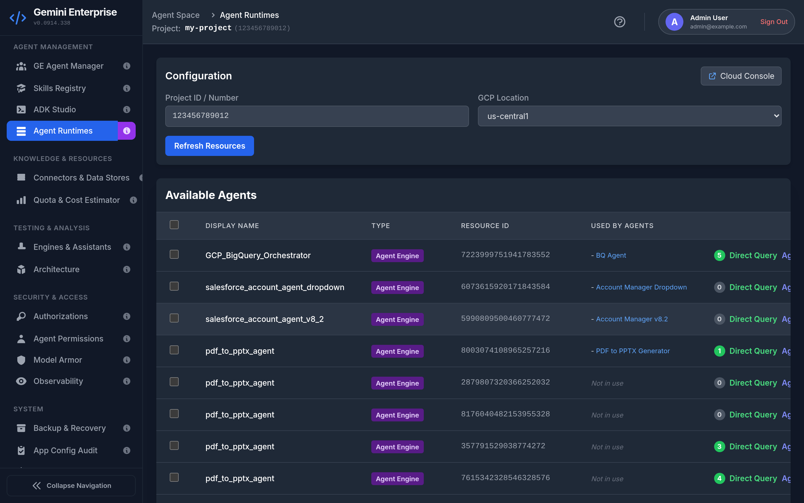

### How to: confirm a deployment landed

1. Set **GCP Location** to the region you deployed into (ADK Studio defaults to `us-central1`).
2. Click **Refresh Resources**.
3. Find your engine by **Display Name** — this is the agent name you typed in ADK Studio.

Expected result: a row with type `Agent Engine` and a **Resource ID**. Copy that ID; you need it
when registering in GE Agent Manager.

### How to: inspect an engine

Click **Details**. You get two tabs.

**Details tab** shows: `Full Resource Name`, `Location`, `Created On`, `Last Modified`, then a
**Deployment Specification** section with `Agent Framework`, `Python Version`, `Pickle GCS URI`,
`Requirements GCS URI`, and **Environment Variables**. Empty values render as `Not set`.

It also shows `Agents Using This Engine ({n})`, an **Active Sessions** section with a
**View Active Sessions** button, and a **Content Security** card offering **Enable via CLI** for
Model Armor. That button opens a modal with a copyable command:

```
gcloud services content-security add \
  "https://{location}-aiplatform.googleapis.com/v1beta1/{engineName}:query" \
  modelarmor.googleapis.com \
  --project="{projectId}"
```

**Metrics tab** embeds the Agent Engine metrics viewer, filtered by `tool_id`.

### How to: test an engine without leaving the app

Click **Direct Query**. A 450×600 chat panel opens in the bottom-right, headed
`Direct Query: {displayName}`. Type in the box (placeholder `Type a direct query...`) and press
Enter or click **Send**. The info icon (`Show cURL commands`) shows the request for every turn.

<details>
<summary>Under the hood — the API call this makes</summary>

```
POST https://{location}-aiplatform.googleapis.com/v1beta1/{engineName}:streamQuery
Authorization: Bearer <your token>
Content-Type: application/json
X-Goog-User-Project: {projectId}

{ "input": { "message": "<your text>", "user_id": "<effectiveUserId>" } }
```

`effectiveUserId` is `oid:{your OID}` when available, otherwise the random session UUID
([DirectQueryChatWindow.tsx](file:///usr/local/google/home/wdufrin/Documents/Code/Gemini-Enterprise-Manager/components/agent-engines/DirectQueryChatWindow.tsx#L71)).
Note the cURL modal always prints the session UUID as `user_id`, even when the live request used
`oid:` — so the copied command is not byte-identical to what was sent.
</details>

Cloud Run (A2A) rows open a similar panel that POSTs JSON-RPC to `{serviceUri}/invoke`.

> [!WARNING]
> Two documented endpoints in this area disagree with the code:
> - The **Agent Card** modal's help text tells you the card lives at `/.well-known/agent-card.json`,
>   but the app fetches `/a2a/v1/card`
>   ([AgentCardModal.tsx:177](file:///usr/local/google/home/wdufrin/Documents/Code/Gemini-Enterprise-Manager/components/agent-engines/AgentCardModal.tsx#L177)
>   vs [vertexReasoning.ts:142](file:///usr/local/google/home/wdufrin/Documents/Code/Gemini-Enterprise-Manager/services/api/vertexReasoning.ts#L142)).
> - The Cloud Run query panel's generated cURL targets `{uri}/message`, while the app calls
>   `{uri}/invoke`.
>
> Trust the code paths above, not the copied snippets.

### How to: terminate sessions

1. Click the green session-count pill on an Agent Engine row.
2. The modal **Terminate Sessions** appears: "Are you sure you want to terminate active sessions for
   **{displayName}**?"
3. Click **Terminate All**.

Expected result: the pill drops to `0`.

> [!CAUTION]
> The pill showing `0` afterwards is **not proof that it worked.** Session deletes run under
> `Promise.allSettled` and the results are never inspected; the count is optimistically set to zero
> regardless of failures
> ([useAgentEngines.ts:437-448](file:///usr/local/google/home/wdufrin/Documents/Code/Gemini-Enterprise-Manager/hooks/useAgentEngines.ts#L437-L448)).
> Click **Refresh Resources** to see the true count.

### How to: delete a runtime

1. Select rows (or click **Delete** on a single row).
2. The modal `Confirm Deletion of {n} Resource(s)` lists each resource and warns:
   "This action cannot be undone. Active sessions (direct queries) will be automatically terminated
   before deletion."
3. Click **Delete**.

<details>
<summary>Under the hood — the API call this makes</summary>

For each Agent Engine: list sessions → delete each session → then

```
DELETE https://{location}-aiplatform.googleapis.com/v1beta1/{engineName}?force=true
```

The returned long-running operation is polled every 5 seconds, up to 60 times (300 seconds)
([useAgentEngines.ts:342-364](file:///usr/local/google/home/wdufrin/Documents/Code/Gemini-Enterprise-Manager/hooks/useAgentEngines.ts#L342-L364)).

For Cloud Run: `DELETE https://{region}-run.googleapis.com/v2/{name}` — **the LRO is not polled**,
so the list may still show the service immediately afterwards.
</details>

> [!CAUTION]
> Two things the modal does not tell you:
> 1. `?force=true` **cascades**, deleting child resources server-side. The modal only mentions
>    sessions.
> 2. Clicking **Delete** on a single row **silently discards** any checkboxes you had already
>    ticked, replacing the selection with just that row
>    ([useAgentEngines.ts:337-340](file:///usr/local/google/home/wdufrin/Documents/Code/Gemini-Enterprise-Manager/hooks/useAgentEngines.ts#L337-L340)).
>    The modal's list does reflect the new selection — read it before confirming.

### Known limitations & gotchas

- **"Used By Agents" can under-report — and you might delete a live engine because of it.** The
  mapping is built by walking collections → engines → assistants → agents across the three
  hard-coded Discovery locations `['global', 'us', 'eu']`. Every failure is a `console.warn` only:
  `[AgentEngines] Failed to enumerate agents under collection "{name}" in "{loc}". Agent list may be
  incomplete.` and `[AgentEngines] Failed to list collections in location "{loc}". Agent list may be
  incomplete.` A row can read `Not in use` while an agent is bound to it.
- **Cloud Run listing failures are entirely invisible.** `console.warn("Cloud Run fetch failed", e)`
  and nothing else
  ([useAgentEngines.ts:245-247](file:///usr/local/google/home/wdufrin/Documents/Code/Gemini-Enterprise-Manager/hooks/useAgentEngines.ts#L245-L247)).
  Agent Engine failures *do* surface as `Agent Engines: {message}`.
- **Non-A2A Cloud Run services are hidden.** A service is listed only if it has an `AGENT_URL` or
  `PROVIDER_ORGANIZATION` env var, or its name contains `a2a`
  ([useAgentEngines.ts:51-55](file:///usr/local/google/home/wdufrin/Documents/Code/Gemini-Enterprise-Manager/hooks/useAgentEngines.ts#L51-L55)).
  The types `Cloud Run (Agent)` and `Cloud Run Service` exist in the code but are never produced.
- **Session counts cap at 100 and are silently wrong above that.** Only the first page is counted;
  `nextPageToken` is ignored. A count failure yields `undefined`, which simply hides the pill —
  indistinguishable from "no sessions".
- **Engine listing is one page of 200.** No pagination.
- **The permission-warnings panel is dead UI.** `permissionWarnings` is only ever set to `[]`, so it
  can never render.
- **Three names for one screen**: route/label `Agent Runtimes`, table header `Available Agents`,
  component folder `agent-engines`.
- **Session counts do not update after a Direct Query.** Only a full **Refresh Resources** updates
  them.

### Troubleshooting

| Symptom / error text | Cause | Fix |
|---|---|---|
| `Project ID/Number and Location are required to list resources.` | Project Number not set in the header | Set it in the app header. |
| `Agent Engines: {message}` | The Vertex list call failed | Usually `aiplatform.googleapis.com` disabled or missing `roles/aiplatform.user`. |
| `No available agent resources found in this location.` | Wrong region, or nothing deployed there | Try the other eight regions. |
| `Failed to fetch resources.` | Generic outer failure | Check network and token; click **Refresh Resources**. |
| A2A Cloud Run services missing | Fetch failed silently, or they lack the A2A markers | Check the browser console; add `AGENT_URL` to the service. |
| `Operation timed out after 300s waiting for completion. It may still be running in Google Cloud: {operation}` | The delete LRO exceeded 60 polls | It is probably still progressing. Refresh in a few minutes. |
| `Operation failed: {message}` | The delete LRO failed server-side | Read the message; often a child resource still references the engine. |
| `Failed to delete some resources:` followed by `- {id}: {reason}` | Partial batch failure | Retry the listed ones individually. |
| `Failed to clear sessions: {message}` | Session listing failed | Refresh and retry. |
| Session pill missing on a row | Session count call failed, or the engine has no sessions API | Not distinguishable in the UI. Use **Details → View Active Sessions**. |
| `Failed to fetch full engine details.` | `getReasoningEngine` failed | Check IAM on that specific engine. |
| `Failed to retrieve agent card for this engine.` | Engine was not deployed with A2A enabled | Redeploy with `enable_a2a=True`. Ignore the modal's `/.well-known/` advice. |
| Deleted a Cloud Run service but it still shows | The Cloud Run delete LRO is not polled | Click **Refresh Resources** again after a few seconds. |

---

## Pages in this group that are not in the sidebar

Three page components exist and have working routes but are not in the navigation. Verified by
grepping every reference to `Page.CLOUD_RUN_AGENTS`, `Page.DIALOGFLOW_AGENTS`, and
`Page.A2A_TESTER` across the repository.

| Page | Route | Reachable? |
|---|---|---|
| **A2A Tester** | `/a2a-tester` | **Yes, but not from the sidebar.** The sidebar entry is commented out at [Sidebar.tsx:129](file:///usr/local/google/home/wdufrin/Documents/Code/Gemini-Enterprise-Manager/components/Sidebar.tsx#L129). The only in-app navigation is the **Test A2A Endpoint** button on a Cloud Run node in the **Architecture** tab ([DetailsPanel.tsx:156](file:///usr/local/google/home/wdufrin/Documents/Code/Gemini-Enterprise-Manager/components/architecture/DetailsPanel.tsx#L156)). |
| **Cloud Run Agents** | `/cloud-run` | **No.** Zero navigation sources anywhere in the app. It renders only if you type the URL. |
| **Dialogflow Agents** | `/dialogflow` | **No.** Same — URL only. |

> [!NOTE]
> This explains the missing Dialogflow option in the GE Agent Manager registration form. A
> Dialogflow CX page exists (titled `Dialogflow CX Agents`, listing agents and offering a test chat
> that hard-codes `languageCode: "en"`), but it is not part of the supported navigation and
> Dialogflow agents cannot be registered with Gemini Enterprise from this app.

The router also redirects several legacy paths
([routeUtils.ts:57-68](file:///usr/local/google/home/wdufrin/Documents/Code/Gemini-Enterprise-Manager/utils/routeUtils.ts#L57-L68)):
`/v_*` → Observability, `/catalog` → GE Agent Manager, `/connectors` → Connectors & Data Stores,
and `/domains` · `/custom-domains` · `/vanity-urls` → Assistant.

---

## End-to-end: build, deploy, register, grant, test

This is the path the code actually supports.

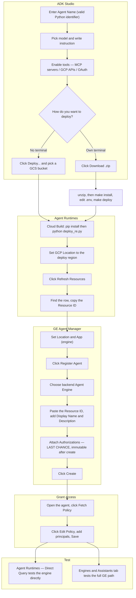
```mermaid
flowchart TD
  subgraph S1["ADK Studio"]
    A1["Enter Agent Name (valid Python identifier)"] --> A2["Pick model and write instruction"]
    A2 --> A3["Enable tools — MCP servers / GCP APIs / OAuth"]
    A3 --> A4{"How do you want to deploy?"}
    A4 -->|No terminal| A5["Click Deploy... and pick a GCS bucket"]
    A4 -->|Own terminal| A6["Click Download .zip"]
  end

  A5 --> B1["Cloud Build: pip install then python deploy_re.py"]
  A6 --> A7["unzip, then make install, edit .env, make deploy"]
  A7 --> B1

  subgraph S2["Agent Runtimes"]
    B1 --> B2["Set GCP Location to the deploy region"]
    B2 --> B3["Click Refresh Resources"]
    B3 --> B4["Find the row, copy the Resource ID"]
  end

  subgraph S3["GE Agent Manager"]
    B4 --> C1["Set Location and App (engine)"]
    C1 --> C2["Click Register Agent"]
    C2 --> C3["Choose backend Agent Engine"]
    C3 --> C4["Paste the Resource ID, add Display Name and Description"]
    C4 --> C5["Attach Authorizations — LAST CHANCE, immutable after create"]
    C5 --> C6["Click Create"]
  end

  subgraph S4["Grant access"]
    C6 --> D1["Open the agent, click Fetch Policy"]
    D1 --> D2["Click Edit Policy, add principals, Save"]
  end

  subgraph S5["Test"]
    D2 --> E1["Agent Runtimes — Direct Query tests the engine directly"]
    D2 --> E2["Engines and Assistants tab tests the full GE path"]
  end
```

> [!IMPORTANT]
> Step **C5** is the one that catches people. Authorizations cannot be changed after creation. If
> you get it wrong, your only remedy is to delete the agent and register it again.

Shortcut: ADK Studio's **🔗 Register in GE...** button collapses S2 and S3 into one dialog. It is
faster, but it never sets an icon or starter prompts, and its dropdowns fail silently — so for a
production agent, do the full path above.

---

## Chapter troubleshooting index

Every error string this chapter's code can surface.

### GE Agent Manager

| Error / symptom | Cause | Fix |
|---|---|---|
| `AI rewrite failed: {message}` | Vertex `gemini-2.5-flash` call failed | Enable `aiplatform.googleapis.com`; grant `roles/aiplatform.user`. |
| `Please enter some text to rewrite.` | AI rewrite clicked with an empty field | Enter text first. |
| Empty agent list | Non-default collection, or wrong location/engine | Only `default_collection` is visible. Check Location and App. |
| Row with missing type/state | 403 on `getAgentView`, swallowed | Fix IAM on that agent. |
| Empty Cloud Run picker | Scan failed silently, or no services in the 9 regions | Check the console; paste the URL manually. |
| Form disabled + yellow banner | Private no-code agent | Not editable here. |
| **Edit Policy** disabled | No ETag yet | Click **Fetch Policy**. |
| `IAM Policy updated successfully.` disappears | Intentional — clears after 5s | None. |
| Agent gone with no prompt | **Advanced Actions → Delete** has no confirmation | Unrecoverable. Re-register. |

### Skills Registry

| Error / symptom | Cause | Fix |
|---|---|---|
| `Failed to fetch enterprise skills from Google Cloud Agent Registry.` | API disabled / wrong region / IAM | Enable `agentregistry.googleapis.com`; use **Retry**. |
| `Skill ID is required (e.g. sales-pipeline-advisor).` | Blank Skill ID | Enter one. |
| `Display Name is required.` | Blank display name | Enter one. |
| `Failed to update state: {message}` | Activate/disable PATCH failed | Check permissions; skill may have no revision yet. |
| `Failed to deploy skill: {message}` | Discovery Engine agent create/update failed | Verify the App dropdown and write permissions. |
| `Failed to delete skill: {message}` | Delete rejected | Disable it first; check IAM. |
| `No engines found in project {projectId} ({appLocation}). Please ensure an engine exists in this region.` | No GE app in that region | Create one or change region. |
| Skill stuck 🟡 Draft after choosing Active | Activation poll timed out / guessed wrong name | Open it and click **🟢 Activate in Company Catalog**. |
| Skill deployed to everyone unexpectedly | **🚀 Deploy to GE App** hardcodes `ALL_USERS` with no confirmation | Disable it, then manage sharing in the Console. |
| `Use New ID ({id}-v2)` produced a different ID | Label is wrong; code appends a random 2-digit number | Set the ID manually. |
| Some skills never appear | No pagination | Use the API directly. |

### ADK Studio

| Error / symptom | Cause | Fix |
|---|---|---|
| Toolbar buttons disabled | Invalid Agent Name | Must match `^[A-Za-z_][A-Za-z0-9_]*$`. |
| `# {label} cannot be generated with the current settings.` | Generator threw | Fix the incomplete tool config. |
| `Error: deploy_re.py not found.` | `scripts/deploy.sh` is broken | Use `make deploy`. |
| `Error: Failed to get access token. Please run 'gcloud auth login' first.` | `launch_local.sh` has no gcloud token | Run `gcloud auth login`. |
| `No GCS bucket selected. Please select a bucket for staging.` | No bucket chosen | Pick one in the deploy modal. |
| `Deployment failed` | Cloud Build submit failed | Enable `cloudbuild.googleapis.com`; check roles. |
| `Validation failed: {message}` | Pre-flight validation rejected the config | Read the message; usually the agent name. |
| `{name} is not a valid Google Cloud resource name` | Agent name unsafe for shell interpolation | Rename using lowercase letters, digits, hyphens. |
| `Error: Authentication required.` (at runtime) | Tools on, OAuth off | Enable End-User OAuth Delegation. |
| `Not fully implemented in template.` (at runtime) | `run_connectivity_test` is a stub | Don't rely on it; remove the tool. |
| Deploy "succeeds" but no engine exists | ADK version `2.2` never deploys | Use the default version. |
| Cloud Run target won't start | No `main.py` for the gunicorn `CMD` | Use the Agent Engine target. |
| `Project ID is required.` / `Target Engine ID is required.` / `Agent Display Name or Name is required.` | Register-in-GE modal validation | Fill the field. |

### Agent Runtimes

| Error / symptom | Cause | Fix |
|---|---|---|
| `Project ID/Number and Location are required to list resources.` | Project Number unset | Set it in the header. |
| `Agent Engines: {message}` | Vertex list failed | Enable `aiplatform.googleapis.com`; grant `roles/aiplatform.user`. |
| `Failed to fetch resources.` | Generic failure | Refresh; check the token. |
| `No available agent resources found in this location.` | Wrong region | Check the other eight. |
| `Operation timed out after 300s waiting for completion. It may still be running in Google Cloud: {operation}` | Delete LRO exceeded 60 polls | Wait and refresh. |
| `Operation failed: {message}` | Delete LRO failed | Read the message. |
| `Failed to delete some resources:` + `- {id}: {reason}` | Partial batch failure | Retry individually. |
| `Failed to clear sessions: {message}` | Session listing failed | Refresh and retry. |
| `Failed to fetch full engine details.` | `getReasoningEngine` failed | Check IAM. |
| `Failed to fetch active sessions.` | Session list failed | Check IAM; retry. |
| `Failed to delete session {id}` | Session delete failed | Retry. |
| `Failed to retrieve agent card for this engine.` | Not deployed with A2A | Redeploy with `enable_a2a=True`. |
| `No agent card data available.` | Engine returned an empty card | Same. |
| `Reasoning Engine Stream API Error: {status} - {text}` | Direct Query failed | Check the status: 403 = IAM, 404 = wrong engine/region. |
| `Error: Failed to get response from agent.` | Direct Query got no usable reply | Check Cloud Logging for the engine. |
| `HTTP {status}: {text}` | Non-A2A Cloud Run query failed | Check the service's auth settings. |
| Row says `Not in use` but an agent uses it | Enumeration failed silently | Verify in GE Agent Manager before deleting. |
| Session pill missing | Count call failed, or no sessions | Use **Details → View Active Sessions**. |
| My checkbox selection vanished | Clicking a row's **Delete** replaces the selection | Read the modal's list before confirming. |


---

# Chapter 2 — Knowledge, Resources, and Testing

**Who this chapter is for** — Administrators who need to get content *into* Gemini Enterprise, keep an eye on what that content costs in quota, then prove the whole thing actually answers questions correctly.

**What you'll be able to do**

- Create a Discovery Engine **data store**, import documents into it, and query it without leaving the app.
- Diagnose a broken third-party connector (Jira, SharePoint, Salesforce, …) and read its real failure reason.
- Model your pooled Gemini Enterprise quota against your licence count and see live 24-hour usage.
- Open any engine in a live chat playground, restrict it to specific data stores, and inspect the citations and tool calls behind an answer.
- Scan the whole project and see a topology graph of every agent, engine, data store, runtime, and authorization — and how they link.

**Before you start**

| Requirement | Why | Where it bites if missing |
|---|---|---|
| Project **ID** *and* **Number** configured | Almost every call needs the number for `X-Goog-User-Project`; console deep links need it too | All four tabs show `Not set (configure on Agents page)` |
| `discoveryengine.googleapis.com` enabled | Data stores, engines, assistants, agents | Every list call 403s |
| `roles/discoveryengine.admin` (or editor) | Create / edit / delete data stores and engines | Create + Delete buttons return 403 |
| `roles/discoveryengine.viewer` **and** `roles/resourcemanager.organizationViewer` | Detecting whether ACL-aware (identity-restricted) data stores are supported | **Connected DataStores** tab silently disappears — see [checkDataStoreAclSupport](file:///usr/local/google/home/wdufrin/Documents/Code/Gemini-Enterprise-Manager/services/api/dataStores.ts#L106-L117) |
| `monitoring.timeSeries.list` | Live quota usage numbers | Every quota card reads **Unavailable** |
| `roles/storage.objectAdmin` on a staging bucket + a CORS rule on it | Browser-side upload of documents before import | Upload dies with a CORS error; the app prints the exact `gcloud` fix |
| `logging.logEntries.list` | Connector diagnostics pulls recent error logs | Diagnostics warns `Could not fetch Cloud Logging entries.` |
| `roles/run.viewer` | Cloud Run services appear in the architecture scan | Scan logs `NOTE: Could not scan Cloud Run in <loc>: <msg>` and simply omits them |

---

## At a glance

These four tabs are the "content in, answers out" half of the product. Two of them live under **Knowledge & Resources** and two under **Testing & Analysis**:

| Tab | Group | One-line job |
|---|---|---|
| **Connectors & Data Stores** | Knowledge & Resources | Where your content lives and how it gets indexed |
| **Quota & Cost Estimator** | Knowledge & Resources | How much of your pooled daily quota you're burning |
| **Engines & Assistants** | Testing & Analysis | Configure the app your users talk to, and talk to it yourself |
| **Architecture** | Testing & Analysis | A map of everything and how it's wired |

### How an answer actually gets made

This is the path your content takes, end to end. Every arrow below corresponds to a real call in the codebase.

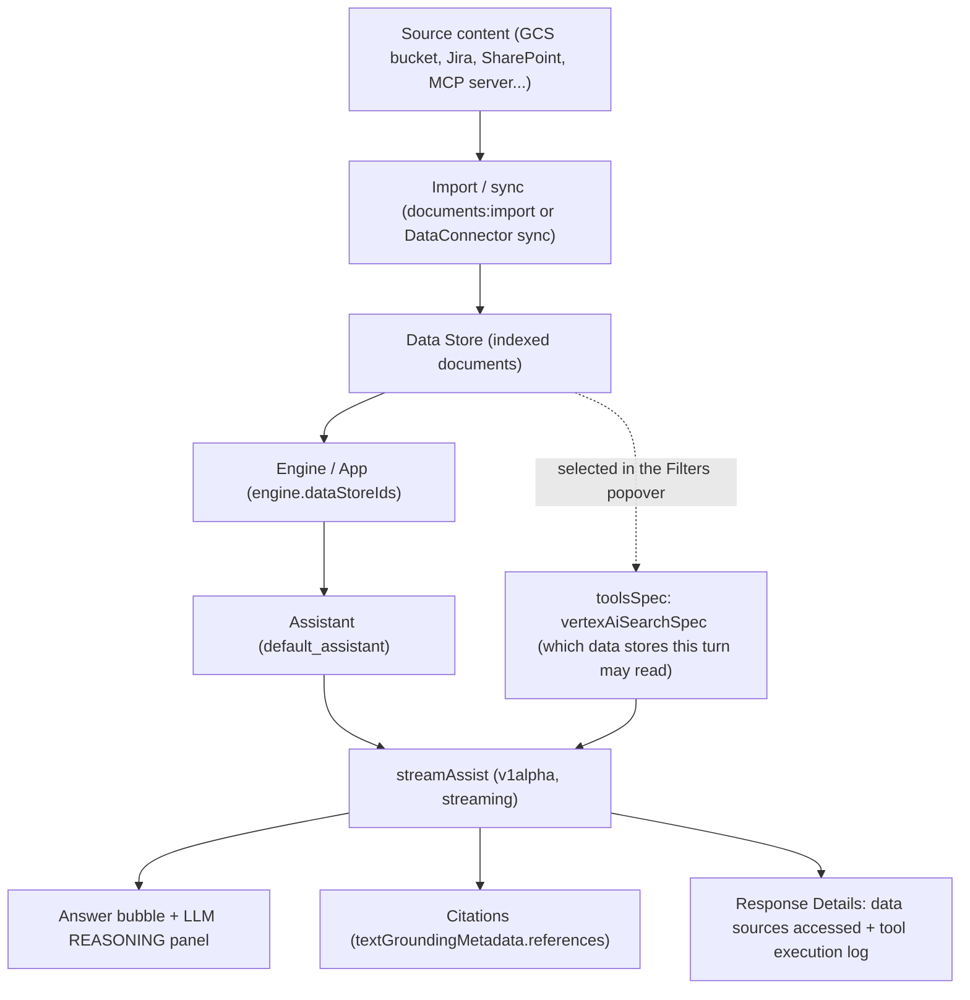
```mermaid
flowchart TD
  src["Source content (GCS bucket, Jira, SharePoint, MCP server...)"]
  imp["Import / sync (documents:import or DataConnector sync)"]
  ds["Data Store (indexed documents)"]
  eng["Engine / App (engine.dataStoreIds)"]
  asst["Assistant (default_assistant)"]
  tools["toolsSpec: vertexAiSearchSpec (which data stores this turn may read)"]
  sa["streamAssist (v1alpha, streaming)"]
  ans["Answer bubble + LLM REASONING panel"]
  cite["Citations (textGroundingMetadata.references)"]
  det["Response Details: data sources accessed + tool execution log"]

  src --> imp --> ds
  ds --> eng
  eng --> asst
  asst --> sa
  tools --> sa
  ds -. "selected in the Filters popover" .-> tools
  sa --> ans
  sa --> cite
  sa --> det
```

**Reading it in plain English:** content is imported into a **data store**; a **data store** is attached to an **engine**; an engine exposes an **assistant**; when you ask a question the assistant is told which data stores it is allowed to read this turn, it retrieves matching passages, the model writes an answer from those passages, and the passages it used come back as **citations**. "Grounding" is exactly that: forcing the model to answer *from retrieved text* instead of from memory. A citation is the receipt.

> [!NOTE]
> The sidebar shows 15 tabs. Three pages exist in the code but are **not** in the sidebar and are still reachable: **MCP Servers** at `#/mcp-servers` ([AppRoutes.tsx](file:///usr/local/google/home/wdufrin/Documents/Code/Gemini-Enterprise-Manager/components/layout/AppRoutes.tsx#L95-L96)), **A2A Tester** at `#/a2a-tester` (also reachable from the Architecture details panel), and **Test G.E. Agent**. `Page.CHAT` and `Page.A2A_TESTER` are explicitly commented out of the nav in [Sidebar.tsx](file:///usr/local/google/home/wdufrin/Documents/Code/Gemini-Enterprise-Manager/components/Sidebar.tsx#L128-L129).

---

## Connectors & Data Stores

Route: `#/datastores` (the alias `#/connectors` also lands here). Source: [DataStoresPage.tsx](file:///usr/local/google/home/wdufrin/Documents/Code/Gemini-Enterprise-Manager/pages/DataStoresPage.tsx).

### What it's for

A **data store** is a labelled bucket of indexed content. You put documents in it; Gemini Enterprise searches it. Nothing your users ask can be answered from your own content unless that content is in a data store that is attached to their engine.

This tab has two sub-tabs. **Data Stores** manages the containers and the documents inside them. **Connectors** manages *collections* — the plumbing that pulls content in from a third-party system like Jira or SharePoint on a schedule.

### The screen, explained

At the top is a configuration panel, then a sub-tab switcher, then the list.

**Configuration panel** ([DataStoresPage.tsx](file:///usr/local/google/home/wdufrin/Documents/Code/Gemini-Enterprise-Manager/pages/DataStoresPage.tsx#L465-L521))

| Control | Behaviour |
|---|---|
| **Project ID** / **Project Number** | Read-only here. Placeholder is `Not set (configure on Agents page)` — set them on **GE Agent Manager** |
| **Location** | `global`, `us`, or `eu`. Changing it re-queries |
| **Collection ID** | A dropdown *only* if the project has more than one collection; otherwise read-only text |
| **Fetch Data Stores** | Runs the list call |
| Cloud Console button | Opens `console.cloud.google.com/gen-app-builder/data-stores?project=<projectNumber>` |

**Sub-tabs** — **Data Stores** and **Connectors** ([L411-L442](file:///usr/local/google/home/wdufrin/Documents/Code/Gemini-Enterprise-Manager/pages/DataStoresPage.tsx#L411-L442)). You can deep-link straight to the second one with `?tab=connectors`.

**The list** ([DataStoreList.tsx](file:///usr/local/google/home/wdufrin/Documents/Code/Gemini-Enterprise-Manager/components/datastores/DataStoreList.tsx)) has a checkbox column, **Display Name**, **Data Store ID**, **Solution Types**, and **Actions** (View, Edit, Delete). Above it sit **Create New** (green) and **Delete Selected** (red) plus an `N selected` counter. With no results you get `No data stores found for the provided configuration.`

> [!WARNING]
> The pager is off by one. The footer renders `Page {currentPage + 1}` at [DataStoreList.tsx#L206](file:///usr/local/google/home/wdufrin/Documents/Code/Gemini-Enterprise-Manager/components/datastores/DataStoreList.tsx#L206) while the page index already starts at `1` ([DataStoresPage.tsx#L89](file:///usr/local/google/home/wdufrin/Documents/Code/Gemini-Enterprise-Manager/pages/DataStoresPage.tsx#L89)). **The first page of results is labelled "Page 2."** Cosmetic only — the data is correct.


### How to: create a data store

1. Confirm **Location** and **Collection ID** are the ones you want — a data store cannot be moved afterwards.
2. Click **Create New**.
3. Enter a **Display Name** (what humans see).
4. Enter a **Data Store ID**. Lowercase letters, digits and hyphens only, 1–63 characters. The hint reads *"A unique ID for the data store. Must use lowercase, numbers, and hyphens."* This ID is permanent.
5. Choose a **Default Parser**. The three options are labelled verbatim:
   - `Digital Parser - Default for all file types unless overridden.`
   - `Layout Parser - Recommended for HTML, PDF, or DOCX files for RAG.`
   - `OCR Parser - For scanned PDFs or PDFs with text inside images.`
6. Optionally set **Parser Overrides** per file type — `pdf`, `docx`, `xlsx`, `pptx`, `html`. Each defaults to `Use Default ({defaultParser})`.
7. Click create. You'll see `Submitting data store creation request...` then `Provisioning Data Store in Google Cloud... (this may take 2-4 minutes)`.

**Expected result:** the modal closes and the new store appears in the list. The app polls the long-running operation every 5 seconds for up to 60 attempts (5 minutes); if it's still going you get `Data Store creation is taking longer than expected. It is still provisioning in Google Cloud: <operation>` — which is informational, not a failure.

> [!IMPORTANT]
> **This app can only create one kind of data store: an unstructured, generic, search-solution store.** The creation payload is hard-coded at [CreateDataStoreModal.tsx#L111-L117](file:///usr/local/google/home/wdufrin/Documents/Code/Gemini-Enterprise-Manager/components/datastores/CreateDataStoreModal.tsx#L111-L117) to `industryVertical: 'GENERIC'`, `solutionTypes: ["SOLUTION_TYPE_SEARCH"]`, `contentConfig: "CONTENT_REQUIRED"`.
> There is **no** option anywhere in this UI to create a BigQuery-backed, website/sitemap, structured, media, healthcare, or third-party-connector data store. For those, use the Google Cloud Console. Existing stores of any type will still be *listed*, *queried* and *deleted* here.

<details>
<summary>Under the hood — the API call this makes</summary>

```http
POST https://discoveryengine.googleapis.com/v1beta/projects/{project}/locations/{location}/collections/{collection}/dataStores?dataStoreId={dataStoreId}
```

```json
{
  "displayName": "My Docs",
  "industryVertical": "GENERIC",
  "solutionTypes": ["SOLUTION_TYPE_SEARCH"],
  "contentConfig": "CONTENT_REQUIRED",
  "documentProcessingConfig": { "defaultParsingConfig": { "digitalParsingConfig": {} } }
}
```

Source: [createDataStore](file:///usr/local/google/home/wdufrin/Documents/Code/Gemini-Enterprise-Manager/services/api/dataStores.ts#L128-L137). Returns a long-running operation which the UI polls.
</details>

### How to: import documents into a data store

Click **View** on a row to open [DataStoreDetails.tsx](file:///usr/local/google/home/wdufrin/Documents/Code/Gemini-Enterprise-Manager/components/datastores/DataStoreDetails.tsx). The detail view shows **Full Resource Name**, **Data Store ID**, **Industry Vertical**, **Solution Types** and **Content Config**, three buttons (**Query Data Store** teal, **Edit** indigo, **Delete Data Store** red), an import panel and the document list.

The import panel is two steps:

1. **Step 1: Select GCS Bucket for Staging** — pick a bucket and click **Load**. Every import goes through Cloud Storage; there is no direct browser→index path.
2. **Step 2: Select or Upload Document** — two sub-tabs:
   - **Select Existing File** — optionally type a prefix (placeholder `Folder path (optional, e.g., my-docs/)`), click **Load Files**, pick one.
   - **Upload New File** — choose a local file. Accepted extensions: `.pdf .txt .html .htm .md .markdown .csv .json .xlsx .docx .pptx`. The same list filters what's shown from the bucket ([L164-L166](file:///usr/local/google/home/wdufrin/Documents/Code/Gemini-Enterprise-Manager/components/datastores/DataStoreDetails.tsx#L164-L166)).
3. Click the import button — it reads **Import Selected File**, **Upload & Import New File**, or **Importing...** depending on state.
4. Watch the **Import Log**. It polls every 5 seconds up to 60 times, logging `Polling operation status... (n/60)`.

**Expected result:** the log reports success and the document appears in the list below (100 per page, with **Load More Documents**). Indexing can lag the operation by a few minutes.

> [!CAUTION]
> Browser uploads to GCS require a CORS rule on the bucket. If it's missing, the upload fails and the app prints the exact fix into the log before throwing `GCS upload failed due to bucket CORS policy on gs://<bucket>. See instructions above.` The printed remedy ([L196-L206](file:///usr/local/google/home/wdufrin/Documents/Code/Gemini-Enterprise-Manager/components/datastores/DataStoreDetails.tsx#L196-L206)) is:
> ```bash
> echo '[{"origin":["*"],"method":["GET","PUT","POST","HEAD"],"responseHeader":["Content-Type"],"maxAgeSeconds":3600}]' > cors.json
> gcloud storage buckets update gs://<bucket> --cors-file=cors.json
> ```
> `"origin":["*"]` is broad. Narrow it to the origin you serve this app from before using it on a bucket that holds anything sensitive.

<details>
<summary>Under the hood — the import call</summary>

```http
POST .../dataStores/{dataStoreId}/branches/default_branch/documents:import
```
```json
{
  "reconciliationMode": "INCREMENTAL",
  "gcsSource": { "inputUris": ["gs://bucket/path/file.pdf"], "dataSchema": "content" }
}
```
`INCREMENTAL` means *add/update*, never delete. Source: [importDocuments](file:///usr/local/google/home/wdufrin/Documents/Code/Gemini-Enterprise-Manager/services/api/dataStores.ts#L560-L577). Documents are listed via `GET .../branches/default_branch/documents?pageSize=100`.
</details>

### How to: rename or delete a data store

**Rename** — click **Edit**. Only **Display Name** is editable; the ID is shown read-only ([EditDataStoreModal.tsx](file:///usr/local/google/home/wdufrin/Documents/Code/Gemini-Enterprise-Manager/components/datastores/EditDataStoreModal.tsx)). The PATCH builds its `updateMask` from whatever keys are in the payload ([updateDataStore](file:///usr/local/google/home/wdufrin/Documents/Code/Gemini-Enterprise-Manager/services/api/dataStores.ts#L139-L154)).

**Delete** — tick rows and click **Delete Selected**, or use **Delete Data Store** in the detail view. You get a confirmation that says, verbatim: `This action cannot be undone and will delete all documents within the store(s).`

> [!CAUTION]
> Deleting a data store destroys every document in it. If an engine still references it, that engine keeps a dangling ID — the Architecture scan will flag it as a placeholder node. Detach it from the engine first. Partial failures surface as `Failed to delete N data store(s):` followed by one line per store.

### How to: query a data store directly

Click **Query Data Store**. The modal ([DataStoreQueryModal.tsx](file:///usr/local/google/home/wdufrin/Documents/Code/Gemini-Enterprise-Manager/components/datastores/query/DataStoreQueryModal.tsx)) gives you a query box, a **Results per query** control, an **Auth** toggle (**Default** or **WIF**) and a code icon tooltipped `View exportable code snippets`.

This bypasses the engine and the model completely — it's raw retrieval. Use it to answer "is this content even indexed?" before you blame the assistant.

<details>
<summary>Under the hood — the search call</summary>

`POST .../dataStores/{id}/servingConfigs/default_serving_config:search` — see [QueryCodeGenerator.tsx#L79](file:///usr/local/google/home/wdufrin/Documents/Code/Gemini-Enterprise-Manager/components/datastores/query/QueryCodeGenerator.tsx#L79). The **WIF** option signs the request with a Workforce Identity Federation token so you can test what a *specific end user* is allowed to see, rather than what your admin account can see.
</details>

### The Connectors sub-tab

Source: [ConnectorsPage.tsx](file:///usr/local/google/home/wdufrin/Documents/Code/Gemini-Enterprise-Manager/pages/ConnectorsPage.tsx) over [useConnectorsPage.ts](file:///usr/local/google/home/wdufrin/Documents/Code/Gemini-Enterprise-Manager/hooks/useConnectorsPage.ts).

A **collection** is the wrapper around a connector. The header card (`Connector Configuration`) has editable **Project ID** / **Project Number**, a **Location**, a **Log Scan Duration (Hours)** box (default `2`, minimum `1`), and two buttons: **Scan Collections** (blue) and **Run Bulk Diagnosis** (green).

The table is headed `Collections (N)` with columns **Display Name** (editable inline via a pencil icon, with Save/Cancel), **Collection ID**, **Status**, **Associated App**, **Action**. Status renders as `PASS`, `FAIL`, `N/A`, `CHECKING`, or italic `Not checked`. Per-row actions: **Run Diagnostics**, **Details**, **Duplicate**, **Delete** — Delete is hidden for `default_collection`.

> [!WARNING]
> The **Associated App** column is a guess, not a lookup. [getAssociatedApps](file:///usr/local/google/home/wdufrin/Documents/Code/Gemini-Enterprise-Manager/hooks/useConnectorsPage.ts#L146-L170) matches any data store whose ID `startsWith` or `includes` the collection ID, then finds engines referencing those stores. `default_collection` is hard-coded to return `["Default Search"]`. Worse, the data-store lookup it searches only ever queries `collectionId: "default_collection"` ([L96-L99](file:///usr/local/google/home/wdufrin/Documents/Code/Gemini-Enterprise-Manager/hooks/useConnectorsPage.ts#L96-L99)). Treat this column as a hint; confirm real linkage on the **Architecture** tab.

### How to: diagnose a failing connector

1. Set **Log Scan Duration (Hours)** to cover the period you care about.
2. Click **Run Diagnostics** on one row, or **Run Bulk Diagnosis** for all of them.
3. Read the **Status** badge, then click **Details** for the full story.

Diagnostics runs a fixed sequence ([connectorDiagnostics.ts](file:///usr/local/google/home/wdufrin/Documents/Code/Gemini-Enterprise-Manager/components/connectors/connectorDiagnostics.ts)):

| Step | What it checks |
|---|---|
| `Fetch DataConnector` | Connector exists; reports `Connector Active`, `Connector State: FAILED`, `Sync Error: <msg>` or `Connector Error: <msg>` |
| `Fetch Recent Operations` | Recent sync operations; `Sync Failures Detected: N failed operations in the last 24h.` |
| `Operation Failed: <name>` | One entry per failed operation; may add `Import errors written to GCS prefix: <prefix>` |
| `Verify MCP Connectivity` | **Only** when `dataSource === 'custom_mcp'`. Can report `MCP Server returned empty tools list` or `MCP Connectivity Failed: <msg>` |
| `Fetch Recent Error Logs` | Cloud Logging over your chosen window; `Validation Failed: N Recent Errors` |

`default_collection` short-circuits to `N/A` with `Not Applicable for Default Connector` / `Default connector does not require validation.`

> [!WARNING]
> **Any** error log entry inside the scan window flips the overall verdict to `FAIL` ([L257-L266](file:///usr/local/google/home/wdufrin/Documents/Code/Gemini-Enterprise-Manager/components/connectors/connectorDiagnostics.ts#L257-L266)), even if the connector is syncing perfectly. A long **Log Scan Duration** makes false FAILs more likely. Also, only the **first 5** operations are retained (`recentOps.slice(0, 5)`), so a busy connector's older failures are invisible here.

### The connector Details modal

[ConnectorDetailsModal.tsx](file:///usr/local/google/home/wdufrin/Documents/Code/Gemini-Enterprise-Manager/components/ConnectorDetailsModal.tsx) — four tabs:

- **Diagnostics** — the step list above, plus collapsibles for **Raw Data Connector State**, **Recent Operations (N)** (auto-opens and gains the suffix `(Failures Detected)` if any op errored) and **Recent Error Logs (N)**. Three canned remediations are matched on the error text ([L151-L175](file:///usr/local/google/home/wdufrin/Documents/Code/Gemini-Enterprise-Manager/components/ConnectorDetailsModal.tsx#L151-L175)): `JIRA_INVALID_AUTH` → *Jira Authentication Error*; `FORBIDDEN`/`403`/`PERMISSION_DENIED` → *Access Denied (403)*; `NOT_FOUND`/`404` → *Resource Not Found (404)*. Anything else gets no advice.
- **Pre-Flight Checklist** — headed `Pre-Flight Readiness Checklist` ([ConnectorVerificationTab.tsx](file:///usr/local/google/home/wdufrin/Documents/Code/Gemini-Enterprise-Manager/components/connectors/ConnectorVerificationTab.tsx)). The vendor is auto-detected by lowercased substring match against the connector JSON and name, across JIRA, JIRA_DC, CONFLUENCE, CONFLUENCE_DC, SALESFORCE, SERVICENOW, ENTRA_ID, SHAREPOINT, OUTLOOK, TEAMS, ONEDRIVE, SLACK, DROPBOX, NOTION, ZENDESK, BOX, GITHUB, HUBSPOT, LINEAR, MONDAY, SHOPIFY, and a GENERIC fallback. It distinguishes `INGESTION` from `FEDERATED` data modes for the 12 vendors that support both.
- **Filters** — indexing include/exclude rules, with a badge counting active rules. The banner reads `Indexing Filters: N active rules configured` or `None configured (indexing all accessible data)`. Available keys are per-vendor ([filterDefinitions.ts](file:///usr/local/google/home/wdufrin/Documents/Code/Gemini-Enterprise-Manager/components/connectors/filters/filterDefinitions.ts)) — SharePoint offers `Path`, `Site`, `Folder`, `InformationProtectionLabelId`, `FileType`; OneDrive offers `Path`, `User`, `Folder`, `FileType`.
- **Configuration** — relabelled **BYOMCP Settings & JSON** when `dataSource === 'custom_mcp'` ([L233](file:///usr/local/google/home/wdufrin/Documents/Code/Gemini-Enterprise-Manager/components/ConnectorDetailsModal.tsx#L233)). Holds auth settings, agent guidelines, advanced params, discovered tools, and a raw JSON editor.


### Connector credentials, and how they relate to Authorizations

Connector credentials (client ID, client secret, refresh token, instance/tenant IDs) are stored inside the connector itself, under `dataConnector.params` and `actionConfig.actionParams`. **Nothing on this tab reads or writes `projects/*/locations/*/authorizations/*`.** The **Authorizations** tab governs a different resource — OAuth clients that *agents* use for *tool* calls. The two are unrelated except that the Architecture scanner draws Agent → Authorization edges.

The in-modal **Token Help** panel points at [docs/Connectors_Auth_Guide.md](file:///usr/local/google/home/wdufrin/Documents/Code/Gemini-Enterprise-Manager/docs/Connectors_Auth_Guide.md), which covers exactly two families — Atlassian (Jira / Confluence) and Microsoft (SharePoint / Teams / Outlook) — and both require the `offline_access` scope so a refresh token is issued. That doc is consistent with the in-app panel.

### How to: clone a connector to another project

For a supported vendor, **Copy cURL** produces a ready-to-run `:setUpDataConnector` request ([L584-L699](file:///usr/local/google/home/wdufrin/Documents/Code/Gemini-Enterprise-Manager/components/ConnectorDetailsModal.tsx#L584-L699)). It builds `{ collectionId: "<id>-clone", collectionDisplayName: "Cloned <id>", dataConnector: {...} }`, redacts `client_id`, `client_secret`, `refresh_token`, `instance_id`, `tenant_id` and `azure_tenant` to `[YOUR_...]` placeholders, strips `static_ip_enabled`, and leaves a literal `PROJECT_ID` for you to substitute. The button appears only for a 28-vendor allowlist (jira, confluence, sharepoint, onedrive, ms-onedrive, outlook, ms-outlook, teams, ms-teams, entraid, entra, azure_active_directory, salesforce, servicenow, slack, box, dropbox, notion, zendesk, github, gitlab, hubspot, linear, monday, shopify, asana, smartsheet, trello, workday).

> [!CAUTION]
> The redaction applies to the **cURL button only**. The raw JSON block rendered below it on the Configuration tab is **not** redacted — real secrets are visible on screen. Do not screen-share or screenshot that panel.

**Duplicate** (the table action) is stricter than the cURL button. It refuses unless `connectorType === 'THIRD_PARTY_FEDERATED'` **and** the source is one of `jira, confluence, sharepoint, onedrive, ms-onedrive, teams, ms-teams, outlook, ms-outlook` ([L235-L258](file:///usr/local/google/home/wdufrin/Documents/Code/Gemini-Enterprise-Manager/hooks/useConnectorsPage.ts#L235-L258)).

### BYO-MCP (bring your own MCP server)

If a connector's `dataSource` is `custom_mcp`, the Configuration tab becomes **BYOMCP Settings & JSON** ([BYOMCPConfigTab.tsx](file:///usr/local/google/home/wdufrin/Documents/Code/Gemini-Enterprise-Manager/components/connectors/BYOMCPConfigTab.tsx)) with sections for auth settings, agent guidelines, advanced params, discovered tools, and a validating raw-JSON editor.

> [!WARNING]
> **Refresh Tools has no confirmation and no diff.** [handleRefreshMcpTools](file:///usr/local/google/home/wdufrin/Documents/Code/Gemini-Enterprise-Manager/components/ConnectorDetailsModal.tsx#L82-L144) queries the MCP server, marks **every** discovered tool `enabled: true`, and **replaces** `bapConfig.enabledActions` with the complete list. Any deliberate disabling you had configured is silently undone. Success reads `Tools refreshed successfully! Updated dynamicTools and bapConfig.`

<details>
<summary>Under the hood — how tools are discovered</summary>

[listMcpTools](file:///usr/local/google/home/wdufrin/Documents/Code/Gemini-Enterprise-Manager/services/api/mcp.ts#L66-L111) posts JSON-RPC `{"jsonrpc":"2.0","id":0,"method":"tools/list"}`. For first-party Google endpoints it deliberately sends **no credentials** and uses `Content-Type: text/plain;charset=UTF-8` to dodge a CORS preflight those endpoints answer with 404 — there's a long comment explaining this at [L80-L99](file:///usr/local/google/home/wdufrin/Documents/Code/Gemini-Enterprise-Manager/services/api/mcp.ts#L80-L99). Failures surface as `MCP endpoint <url> returned HTTP <status>: <body>`.

The separate **MCP Servers** page (`#/mcp-servers`, not in the sidebar) is a discovery helper: pick a **GCP Region** from 9 options and click **Scan for Services** to find Cloud Run services that might be MCP servers. See [McpServersPage.tsx](file:///usr/local/google/home/wdufrin/Documents/Code/Gemini-Enterprise-Manager/pages/McpServersPage.tsx).
</details>

### Field reference — Create Data Store

| Field | What to enter | Required | Notes / Default |
|---|---|---|---|
| **Display Name** | Human-readable name | Yes | Editable later |
| **Data Store ID** | `[a-z0-9-]{1,63}` | Yes | **Permanent** |
| **Default Parser** | Digital / Layout / OCR | Yes | Digital |
| **Parser Overrides** | Per-type parser for `pdf`, `docx`, `xlsx`, `pptx`, `html` | No | `Use Default ({defaultParser})` |

### Field reference — Connector Configuration header

| Field | What to enter | Required | Notes / Default |
|---|---|---|---|
| **Project ID** | GCP project ID | Yes | Editable here |
| **Project Number** | Numeric project number | Yes | Needed for `X-Goog-User-Project` |
| **Location** | `global` / `us` / `eu` | Yes | `global` |
| **Log Scan Duration (Hours)** | Hours of Cloud Logging to scan | Yes | `2`, minimum `1` |

### Known limitations & gotchas

- **Only generic unstructured search stores can be created here.** No GCS-source, BigQuery, website, structured, media, or connector store types. See the IMPORTANT callout above.
- **Pagination label is off by one** — first page says "Page 2".
- **Collection fetch failures are swallowed** to `console.warn` ([DataStoresPage.tsx#L133-L135](file:///usr/local/google/home/wdufrin/Documents/Code/Gemini-Enterprise-Manager/pages/DataStoresPage.tsx#L133-L135)). If collections can't be listed you just see a read-only Collection ID and no explanation.
- **Engine and data-store fetch failures on the Connectors tab are swallowed** to `console.error` ([useConnectorsPage.ts#L90-L103](file:///usr/local/google/home/wdufrin/Documents/Code/Gemini-Enterprise-Manager/hooks/useConnectorsPage.ts#L90-L103)), which is why **Associated App** can be silently empty.
- **Raw connector JSON is unredacted** on screen.
- **Refresh Tools re-enables everything** without asking.
- Only the **first 5** operations are shown in diagnostics.
- [DiscoveryActionsCard.tsx](file:///usr/local/google/home/wdufrin/Documents/Code/Gemini-Enterprise-Manager/components/discovery/DiscoveryActionsCard.tsx) is **dead code** — imported nowhere. Its "List Engines" / "List Agents" buttons are not reachable in the app. Ignore any older documentation that mentions a "Discovery Actions" card.

### Troubleshooting

| Symptom / exact error | Cause | Fix |
|---|---|---|
| `No data stores found for the provided configuration.` | Wrong Location or Collection ID, or genuinely none | Try `global`, `us`, `eu` in turn; confirm the collection |
| First page reads "Page 2" | Off-by-one in the pager | Cosmetic; ignore |
| `Data Store creation is taking longer than expected. It is still provisioning in Google Cloud: <op>` | Provisioning exceeded 5 min of polling | Wait, then click **Fetch Data Stores** again |
| `GCS upload failed due to bucket CORS policy on gs://<bucket>. See instructions above.` | Bucket has no CORS rule | Apply the printed `gcloud storage buckets update` command |
| `Failed to delete N data store(s):` | Permissions, or store in use | Read the per-store lines; detach from engines first |
| `MCP endpoint <url> returned HTTP <status>: <body>` | MCP server down, wrong URL, or auth rejected | Verify the URL responds to `tools/list`; check the auth settings |
| `MCP Server returned empty tools list` | Server reachable but exposes nothing | Fix the server's tool registration |
| Status `FAIL` but the connector looks fine | Any log error in the window forces FAIL | Lower **Log Scan Duration (Hours)**; read the actual log entries |
| **Associated App** empty for a working connector | Heuristic matching + swallowed fetch errors | Confirm linkage on **Architecture** |

---

## Quota & Cost Estimator

Route: `#/quota`. Source: [GEQuotaUsagePage.tsx](file:///usr/local/google/home/wdufrin/Documents/Code/Gemini-Enterprise-Manager/pages/GEQuotaUsagePage.tsx) → [CostsUI.tsx](file:///usr/local/google/home/wdufrin/Documents/Code/Gemini-Enterprise-Manager/components/dashboard/CostsUI.tsx).

### What it's for

Gemini Enterprise quota is **pooled**: your daily allowance for each capability is your licence count multiplied by a per-licence rate. This tab lets you enter (or auto-fill) your licence count and edition, then shows your modelled daily ceiling next to the last 24 hours of real usage pulled from Cloud Monitoring.

> [!WARNING]
> **Despite the tab name, this page contains no cost, price, or currency logic of any kind.** There is nothing in [CostsUI.tsx](file:///usr/local/google/home/wdufrin/Documents/Code/Gemini-Enterprise-Manager/components/dashboard/CostsUI.tsx) that reads a price list, a billing SKU, or a rate card. It estimates **quota units**, not money.
> Further, every per-licence multiplier is a **hard-coded constant in the front-end source** ([L246-L267](file:///usr/local/google/home/wdufrin/Documents/Code/Gemini-Enterprise-Manager/components/dashboard/CostsUI.tsx#L246-L267)) — not fetched from any API. If Google changes an entitlement, this page keeps showing the old number until someone edits the code and redeploys.
> **Never use this page as billing truth, a contractual limit, or evidence in a support case.** Confirm real entitlements with your Google Cloud account team and real spend in Cloud Billing.

Note also that the in-page heading is `Gemini Enterprise Quota Usage`, which does not match the sidebar label **Quota & Cost Estimator**.

### The screen, explained

| Region | Contents |
|---|---|
| Header | Title `Gemini Enterprise Quota Usage`, subtitle *"Model and calculate your organization's pooled Gemini Enterprise quota limits."*, Cloud Console button to `console.cloud.google.com/gemini-enterprise/user-license?project=<p>` |
| **How to Check Usage in Console** | Collapsible 4-step walkthrough for verifying numbers in the Console |
| Auto-fill row | **Project-Local Licenses (Auto-fill)** (green) and **Auto-fill from Cloud Billing** (blue) |
| Inputs | **Subscription Profile**, **Project Region (Auto-fill)**, **Gemini Enterprise Edition**, **Number of User Licenses** |
| Panel | Heading `Gemini Enterprise Quota Usage` with a `Project Level` badge |
| Cards | Three groups: `Data & actions`, `Unified search & assistant`, `Agents` |
| Footer | **How Quota Pooling Works** explainer |

**Project Region (Auto-fill)** offers `All Regions (Total Pooled)`, `Global`, `US`, `EU`. **Gemini Enterprise Edition** is `Standard` or `Plus`. **Number of User Licenses** has a minimum of 1.


### The multipliers (hard-coded)

Daily limit = **licences × multiplier**.

| Capability | Card title | Unit | Standard | Plus |
|---|---|---|---|---|
| Tasks and actions | `Tasks and actions` | tasks / day | 160 | 200 |
| Text answer generation | `Text answer generation` | generations / day | 160 | 200 |
| Image generation | `Image generation` | images / day | 5 | 10 |
| Video generation | `Video generation` | videos / day | 2 | 3 |
| Grounding with Google Search | `Grounding with Google search` | queries / day | 160 | 200 |
| Web grounding for enterprise | `Web grounding for enterprise` | queries / day | 160 | 200 |
| Idea generation | `Idea generation` | ideas / day | 1 | 1 |
| Deep research | `Deep research` | queries / day | 3 | 10 |

Source: [CostsUI.tsx#L246-L281](file:///usr/local/google/home/wdufrin/Documents/Code/Gemini-Enterprise-Manager/components/dashboard/CostsUI.tsx#L246-L281).

### Where the live numbers come from

Each card queries one Cloud Monitoring metric of the form `discoveryengine.googleapis.com/quota/<SUFFIX>/usage`, filtered to `resource.type="discoveryengine.googleapis.com/Location"`, aligned with `ALIGN_SUM` over an `86400s` window covering the **last 24 hours**. One request per metric, fired together via `Promise.allSettled` ([L318-L326](file:///usr/local/google/home/wdufrin/Documents/Code/Gemini-Enterprise-Manager/components/dashboard/CostsUI.tsx#L318-L326)) — the Monitoring API only allows a single `metric.type` per call.

| Capability | Standard metric suffix | Plus metric suffix |
|---|---|---|
| Tasks and actions | `tasks_and_actions_tier_enterprise_regional` | `tasks_and_actions_tier_enterprise_plus_regional` |
| Text answer generation | `text_answer_gen_tier_enterprise_standard_regional` | `text_answer_gen_tier_enterprise_plus_regional` |
| Image generation | `image_gen_tier_enterprise_regional` | `image_gen_tier_enterprise_plus_regional` |
| Video generation | `video_gen_numbers_tier_enterprise_regional` | `video_gen_numbers_tier_enterprise_plus_regional` |
| Grounding with Google Search | `grounding_with_search_tier_enterprise_regional` | `grounding_with_search_tier_enterprise_plus_regional` |
| Web grounding | `web_grounding_for_enterprise_tier_enterprise_regional` | `web_grounding_for_enterprise_tier_enterprise_plus_regional` |
| Idea generation | `idea_gen_start_instance_tier_enterprise_standard_regional` | `idea_gen_start_instance_tier_enterprise_regional` |
| Deep research | `deep_research_query_total_tier_enterprise_standard_regional` | `deep_research_query_total_tier_enterprise_regional` |

> [!WARNING]
> Look at the last two rows. Six capabilities switch to a `..._plus_regional` metric on the Plus edition, but **Idea generation and Deep research do not** — their "Plus" suffix is `..._tier_enterprise_regional`, with no `_plus_` ([L293-L314](file:///usr/local/google/home/wdufrin/Documents/Code/Gemini-Enterprise-Manager/components/dashboard/CostsUI.tsx#L293-L314)). Either those two metrics genuinely have different names upstream, or this is a copy-paste bug. On a Plus tenancy, verify those two cards against the Console before trusting them.

### How to: model your quota

1. Click **Project-Local Licenses (Auto-fill)** to read licence configs directly from the project, or **Auto-fill from Cloud Billing** to sum licences across the billing account.
2. If you used the billing path, pick a **Subscription Profile**.
3. Optionally narrow **Project Region (Auto-fill)**.
4. Confirm **Gemini Enterprise Edition** — this changes both the multipliers and which metric is queried.
5. Adjust **Number of User Licenses** by hand if the auto-fill is wrong.

**Expected result:** every card shows `used / limit` with a coloured bar — blue normally, **yellow above 75%**, **red above 90%** ([QuotaCard L391-L423](file:///usr/local/google/home/wdufrin/Documents/Code/Gemini-Enterprise-Manager/components/dashboard/CostsUI.tsx#L391-L423)). If you leave the licence box blank the denominator shows `-`.

> [!IMPORTANT]
> **There is no Refresh button and no time-range control.** The data refetches only when the **project number** or the **edition** changes ([L389](file:///usr/local/google/home/wdufrin/Documents/Code/Gemini-Enterprise-Manager/components/dashboard/CostsUI.tsx#L389)). To get fresh numbers, reload the page or toggle the edition and back. Changing licence count or region recalculates the *limit* but does **not** re-query usage.

<details>
<summary>Under the hood — the auto-fill chain</summary>

**Billing path:** `listBillingAccounts` → `listBillingAccountLicenseConfigs` → sum `licenseConfigDistributions`, filtered to `projects/<p>/locations/<loc>` when a region is selected.

**Project-local path:** `listLicenseConfigsUsageStats` probed across `['global','us','eu']`, then `getLicenseConfig` for `licenseCount` and `subscriptionTier`. Tier mapping: `GEMINI_ENTERPRISE_PLUS` → Plus, `GEMINI_ENTERPRISE` → Standard, and anything matching `*internal_only_agent_space` falls back to Standard.

Both paths hide their failures: the project-licence catch only does `console.error` ([L236-L240](file:///usr/local/google/home/wdufrin/Documents/Code/Gemini-Enterprise-Manager/components/dashboard/CostsUI.tsx#L236-L240)) and the per-region probe has a completely empty `catch (_e)` ([L188-L190](file:///usr/local/google/home/wdufrin/Documents/Code/Gemini-Enterprise-Manager/components/dashboard/CostsUI.tsx#L188-L190)). A region you lack permission on is indistinguishable from a region with zero licences.
</details>

### Field reference

| Field | What to enter | Required | Notes / Default |
|---|---|---|---|
| **Subscription Profile** | Billing-account licence config | No | Only populated after billing auto-fill |
| **Project Region (Auto-fill)** | `All Regions (Total Pooled)` / `Global` / `US` / `EU` | No | All Regions |
| **Gemini Enterprise Edition** | `Standard` / `Plus` | Yes | Standard; **re-triggers the metric fetch** |
| **Number of User Licenses** | Integer ≥ 1 | Yes | Auto-filled or manual; changes limits only |

### Known limitations & gotchas

- **No cost calculation exists.** The "Cost Estimator" half of the tab name is unbacked by code.
- **All multipliers are front-end constants**, not live entitlements.
- **No refresh control and a fixed 24-hour window.**
- **Idea generation / Deep research Plus metrics look wrong** (missing `_plus_`).
- **Auto-fill failures are silent** — an empty licence count may mean "none found" or "no permission".
- Cards read `Unavailable` (amber) with the footnote `Requires monitoring.timeSeries.list` when a metric can't be fetched; a banner summarises `N metric(s) could not be fetched and are marked as Unavailable.`

### Troubleshooting

| Symptom / exact error | Cause | Fix |
|---|---|---|
| `Missing 'monitoring.timeSeries.list' permission to view live usage.` | Caller lacks Monitoring Viewer | Grant `roles/monitoring.viewer` on the project |
| `Failed to fetch live usage metrics from Cloud Monitoring.` | API disabled or transient | Enable `monitoring.googleapis.com`; reload |
| `Failed to load live usage metrics from Cloud Monitoring.` | Same, at initial load | As above |
| `N metric(s) could not be fetched and are marked as Unavailable.` | Subset failed | Check which cards are amber; usually a metric that doesn't exist on your tier |
| `Failed to load billing accounts.` | No `billing.accounts.list` | Grant Billing Account Viewer, or enter licences manually |
| `Failed to load subscription profiles.` | No licence configs on the billing account | Enter licences manually |
| Card shows `Unavailable` + `Requires monitoring.timeSeries.list` | That single metric failed | See rows above |
| Limit shows `-` | Licence count blank | Enter **Number of User Licenses** |
| Numbers look stale | No auto-refresh | Reload the page |

---

## Engines & Assistants

Route: `#/assistant`. Source: [AssistantPage.tsx](file:///usr/local/google/home/wdufrin/Documents/Code/Gemini-Enterprise-Manager/pages/AssistantPage.tsx).

### What it's for

An **engine** (also called an app) is the thing your users actually talk to. It bundles a set of data stores, a set of agents, and a configuration — system instructions, web grounding, retention, safety. Every engine exposes an **assistant**, which is the conversational front door.

This tab lists every engine in a location, lets you edit its configuration, and — most usefully — lets you **chat with it right here** to see whether it answers correctly and what it cited.

### The screen, explained

**Project Configuration** sits at the top: Project ID, Project Number, Location, and a Cloud Console button to `console.cloud.google.com/gemini-enterprise/apps?project=<p>`. All calls from this page pin `collectionId: 'default_collection'` and `assistantId: 'default_assistant'`.

**The engine table** ([AssistantListTable.tsx](file:///usr/local/google/home/wdufrin/Documents/Code/Gemini-Enterprise-Manager/components/assistants/page/AssistantListTable.tsx)) has a search box (placeholder `Filter Engines...`), a **Refresh** button, and 10 rows per page:

| Column | Meaning |
|---|---|
| **Display Name** | The engine's name |
| **Engine ID** | Resource ID |
| **App Type** | Derived, not stored — see below |
| **Web Grounding** | Active only if `webGroundingType` is `WEB_GROUNDING_TYPE_GOOGLE_SEARCH` or `WEB_GROUNDING_TYPE_ENTERPRISE_WEB_SEARCH` |
| **System Instructions** | Badge. Tooltip: `Custom system instructions configured (may cause issues for Gemini Enterprise). Click to view/edit.` or `No custom system instructions` |
| **Customer Policy** | Whether a policy (e.g. retention) is set |
| **Vertex Agents** | Count of attached Vertex AI agent configs |
| Actions | Green chat-bubble icon (`Chat with Assistant`) and **View / Edit** |

**App Type** is computed in [determineAppType](file:///usr/local/google/home/wdufrin/Documents/Code/Gemini-Enterprise-Manager/hooks/useAssistantList.ts#L42-L69): `SOLUTION_TYPE_CHAT` → `Chat`; `SOLUTION_TYPE_SEARCH` with `appType === 'APP_TYPE_INTRANET'` → `Gemini Enterprise`, otherwise `Search`; `SOLUTION_TYPE_RECOMMENDATION` → `Recommendation`; `SOLUTION_TYPE_GENERATIVE_CHAT` → `Gemini Enterprise`; anything else is title-cased. Empty list shows `No engines found in this location.`

Every column is sortable (displayName, engineId, solutionType, webGrounding, instructions, policy, vertexAgents).

### The detail view

Clicking **View / Edit** opens [AssistantDetailView.tsx](file:///usr/local/google/home/wdufrin/Documents/Code/Gemini-Enterprise-Manager/components/assistants/page/AssistantDetailView.tsx), with **Backup Usage Logging** (blue) and **Backup Analytics** (green) in the header and eight tabs:

| Tab | Badge | Notes |
|---|---|---|
| **Overview** | — | Engine + assistant configuration forms |
| **Agents** | — | Agents attached to this assistant |
| **Skills** | `Capabilities` | |
| **User Memories** | `Personalization` | |
| **Connected DataStores** | `Beta` | **Only appears if ACL support was detected** |
| **Notebooks** | — | |
| **History** | — | |
| **Customize** | — | Vanity URL provisioning and teardown |

> [!NOTE]
> **Connected DataStores** is conditional. On load the page probes whether this project supports ACL-aware (identity-restricted) data stores ([AssistantPage.tsx#L98-L154](file:///usr/local/google/home/wdufrin/Documents/Code/Gemini-Enterprise-Manager/pages/AssistantPage.tsx#L98-L154)). The probe needs `roles/discoveryengine.viewer` and `roles/resourcemanager.organizationViewer`; without them the tab simply isn't rendered, and if you were already on it you get bounced off. You can force the answer with the `localStorage` key `feature_flag_datastore_acls` set to `'true'` or `'false'`.

The **Customize** tab hosts vanity-URL provisioning *and* teardown together — a deliberate choice, per a source comment, so nobody provisions a billed load balancer and then can't find the button to remove it.

### Key configuration fields

**Assistant editor** ([AssistantDetailsForm.tsx](file:///usr/local/google/home/wdufrin/Documents/Code/Gemini-Enterprise-Manager/components/assistants/AssistantDetailsForm.tsx)):

| Field | What to enter | Required | Notes / Default |
|---|---|---|---|
| **Display Name (Read-only)** | — | — | Disabled input |
| **Web Grounding Type** | `Disabled` / `Google Search (not Data Residency compliant)` / `Enterprise Web Search (Data Residency compliant)` | No | See warning below |
| **System & Style Instructions** | Free text | No | Orange warning: *User-added instructions may impact Gemini Enterprise behavior* |
| **Chat History Retention (Days)** | Integer | No | Stored in the Customer Policy |
| Model Armor section | Safety templates | No | |
| Feature management | `enableEndUserAgentCreation`, `disableLocationContext`, `defaultWebGroundingToggleOff`, `vertexAiSearchToolConfig` | No | |
| **App-level IAM Permissions** | Collapsible viewer | — | |
| **Attached Vertex AI Agent Configs** | Remove only | — | **You cannot add one here** |

Before saving, an **API Command Preview (Pending Changes)** block shows the exact request with a copy button, captioned *"This command reflects the changes you are about to save."* Then click **Save Changes**.

> [!WARNING]
> **Web Grounding Type has a data-residency consequence and the UI says so in the option label itself.** `Google Search (not Data Residency compliant)` sends queries to public Google Search. If you are bound by EU/US data-residency commitments, use `Enterprise Web Search (Data Residency compliant)` or `Disabled`.

**Engine editor** ([EngineDetailsForm.tsx](file:///usr/local/google/home/wdufrin/Documents/Code/Gemini-Enterprise-Manager/components/assistants/EngineDetailsForm.tsx)) adds `marketplaceAgentVisibility` (5 options including `Show All Marketplace Agents`), a **Disable Analytics** checkbox, model configuration, search engine config (`searchTier`, `requiredSubscriptionTier`, `searchAddOnLlm`), web-app UI settings (`enableWebApp`, `enableAutocomplete`, `enableQualityFeedback`), mobile access (`mobile-app-access`, `qr-code-widget`), IdP configuration, a collapsible **Connected DataStores & Permissions (Beta)** (ACL-gated), **Prompt Chips Administration**, and a **Raw GE App Configuration JSON** viewer.

### How to: chat with an engine (the playground)

1. Click the green chat-bubble icon on an engine row.
2. A floating chat window opens bottom-right (450 × 600).
3. Optionally click **Filters (N)** and choose which data stores this conversation may read.
4. Type a question and press Enter, or click **Send**.
5. Click the **(i)** icon on any response to open **Response Details**.

**Expected result:** an answer bubble appears. If the model produced reasoning, it renders above the answer in an italic **LLM REASONING** panel. Citations render from the response's grounding metadata.

Source: [ChatWindow.tsx](file:///usr/local/google/home/wdufrin/Documents/Code/Gemini-Enterprise-Manager/components/agents/ChatWindow.tsx).

**Window controls:** the header shows the engine display name, a **Default | WIF** auth toggle, a **Filters (N)** popover, a purple **Memories** button, an info **(i)** button (tooltip `Show Assistant API commands (streamAssist)`) and a close `×`.

**The Filters popover** is headed `Active Data Stores` with **Select All** and **Clear All**. It resolves the engine's linked stores by intersecting `engine.dataStoreIds` with the project's data store list; if nothing matches you see `No linked data stores found.` **All stores are selected by default.**

> [!WARNING]
> **"Clear All" does the opposite of what you'd expect.** The retrieval restriction (`toolsSpec`) is only built when at least one store is selected; with zero selected it is sent as `undefined` ([ChatWindow.tsx#L253-L257](file:///usr/local/google/home/wdufrin/Documents/Code/Gemini-Enterprise-Manager/components/agents/ChatWindow.tsx#L253-L257)). So clearing every checkbox **removes the restriction entirely** and lets the assistant use all of its data stores, rather than none. To test "no grounding", disable grounding on the engine instead.

#### Grounding and citations, in plain English

- **Grounding** means the assistant is required to find real passages in your indexed content, and write its answer from those passages.
- A **citation** is the record of which passage was used. In the response payload they arrive as `answer.replies[].groundedContent.textGroundingMetadata.references`.
- If an answer has no citations, it was not grounded in your content — it came from the model's general knowledge or from web grounding. That's the single most useful signal in this playground.

> [!IMPORTANT]
> The answer bubble is rendered as **plain text** with `white-space: pre-wrap`. There is **no markdown rendering, no clickable links, and no inline citation markers** in the bubble. To see which sources were used, open **Response Details** — that is the only place the grounding is surfaced in a readable form.

#### Response Details

[ResponseDetailsModal.tsx](file:///usr/local/google/home/wdufrin/Documents/Code/Gemini-Enterprise-Manager/components/agents/ResponseDetailsModal.tsx), titled **Response Details**, has two sections:

- **Data Sources Accessed** (green) — one entry per data store, showing the data store ID and its full resource path.
- **Tool Execution Log** (blue) — one entry per tool call, with an `Input:` code block and an `Output:`.

If neither is present: `No detailed tool or data store information was found for this response.`

> [!WARNING]
> Two caveats on this modal. First, tool names are **inferred by regex** — it matches `print\(([^.]+)\.search` in the generated code and labels the result `Tool: <var>`, falling back to `Code Execution`. Second, any data store whose tool output contains `permission_denied` or `access was denied` is **removed from the Data Sources Accessed list** ([L109-L123](file:///usr/local/google/home/wdufrin/Documents/Code/Gemini-Enterprise-Manager/components/agents/ResponseDetailsModal.tsx#L109-L123)). A store the assistant tried and was blocked on looks identical to a store it never touched — which makes ACL misconfiguration genuinely hard to spot here. Check Cloud Logging when an answer is inexplicably thin.

````carousel

<!-- slide -->

````

<details>
<summary>Under the hood — the streaming call</summary>

```http
POST https://discoveryengine.googleapis.com/v1alpha/projects/{p}/locations/{l}/collections/{c}/engines/{e}/assistants/{a}:streamAssist
Authorization: Bearer <token>
Content-Type: application/json
X-Goog-User-Project: <projectNumber>
```
```json
{ "query": { "text": "..." }, "toolsSpec": { "...": "..." }, "session": "projects/.../sessions/..." }
```

Source: [streamChat](file:///usr/local/google/home/wdufrin/Documents/Code/Gemini-Enterprise-Manager/services/api/vertexReasoning.ts#L173-L220). Errors are thrown as `Chat API Error: <status> <statusText> - <first 500 chars of body>...`.

The response is a stream, decoded by [streamParser.ts](file:///usr/local/google/home/wdufrin/Documents/Code/Gemini-Enterprise-Manager/services/streamParser.ts), which copes with NDJSON, streamed JSON arrays, SSE envelopes (`data:`, `event:`, `id:`, `retry:`, comments, `[DONE]`), escaped quotes and braces inside strings, and objects split across network chunks.

The handler reads `sessionInfo.session` (to keep the conversation), `answer.diagnosticInfo` (when `answer.state === 'SUCCEEDED'`), `answer.assistSkippedReasons`, the grounding references, and `groundedContent.content` — where a part with both `.thought` and `.text` becomes the **LLM REASONING** panel and a plain `.text` part becomes the answer.

**Sessions:** a session is created before the first message with `userPseudoId` set to your email, so history is attributed to you. If that fails it silently falls back to anonymous auto-creation with only a `console.warn` ([L296-L298](file:///usr/local/google/home/wdufrin/Documents/Code/Gemini-Enterprise-Manager/components/agents/ChatWindow.tsx#L296-L298)).
</details>

### How to: test as a specific end user (WIF)

Switch the header toggle from **Default** to **WIF**. The panel tries to auto-discover your workforce pool from the engine's ACL config (`idpConfig.externalIdpConfig.workforcePoolName`), then lists pools and providers, fetches the provider's OIDC discovery document, opens a sign-in popup, and exchanges the resulting token via STS. Click **Apply & Close**.

If auto-discovery can't work, expand **Advanced: paste token manually** and supply a token yourself.

This is how you verify document-level ACLs: sign in as a user who *shouldn't* see a document and confirm they don't.

### Known limitations & gotchas

- **"Clear All" in the data-store filter disables the restriction** instead of blocking everything.
- **Answers render as plain text** — no markdown, no links, no inline citations.
- **Blocked data stores are hidden** from Response Details rather than flagged.
- **Tool names are regex-guessed** from generated code.
- **There is no Stop button** — a long stream must run to completion or you close the window.
- The message input submits on the deprecated React `onKeyPress` event, which can misbehave in some browsers/IMEs.
- **You cannot attach a new Vertex AI agent config from the assistant editor** — only remove existing ones.
- **Display Name is read-only** in the assistant editor.
- Session-creation failure degrades silently to an anonymous session.
- Clicking a row for an engine with no assistant shows: `This engine (<name>) has not been fully initialized with an assistant yet. Please open the Assistant configuration or check Discovery Engine status.`

### Troubleshooting

| Symptom / exact error | Cause | Fix |
|---|---|---|
| `No engines found in this location.` | Wrong location, or none exist | Try `global`, `us`, `eu`; click **Refresh** |
| `This engine (<name>) has not been fully initialized with an assistant yet. Please open the Assistant configuration or check Discovery Engine status.` | Engine has no `default_assistant` | Finish provisioning in the Console |
| `Failed to load agents for this assistant.` | Agent list call failed | Check `discoveryengine` permissions |
| `Chat API Error: <status> <statusText> - <body>...` | streamAssist rejected the call | Read the body; usually IAM, a bad `toolsSpec`, or an unprovisioned assistant |
| `Failed to get response from agent.` | Stream failed or produced nothing | Retry; check the network tab |
| `[The agent ignored the greeting as it was not a direct question. Please ask a specific question to get a response.]` | `NON_ASSIST_SEEKING_QUERY_IGNORED` | Ask a real question, not "hi" |
| `[The agent processed your request but did not provide a response. Please try rephrasing or ask something else.]` | Empty reply | Rephrase; confirm content is indexed |
| `No linked data stores found.` | Engine has no `dataStoreIds`, or they don't resolve | Attach data stores to the engine |
| `This provider is not configured for OIDC. Only OIDC providers support automatic sign-in.` | SAML workforce provider | Use **Advanced: paste token manually** |
| `Sign-in failed.` / `Token exchange failed.` | Popup blocked, or STS rejected the token | Allow popups; verify the workforce pool config |
| **Connected DataStores** tab missing | ACL probe failed or unsupported | Grant `roles/discoveryengine.viewer` + `roles/resourcemanager.organizationViewer`, or set `feature_flag_datastore_acls` in `localStorage` |
| Answer has no citations | Not grounded in your content | Check the store is attached, indexed, and selected in **Filters** |

---

## Architecture

Route: `#/architecture`. Source: [ArchitecturePage.tsx](file:///usr/local/google/home/wdufrin/Documents/Code/Gemini-Enterprise-Manager/pages/ArchitecturePage.tsx).

### What it's for

This tab crawls your project and draws a map of everything Gemini Enterprise is using — projects, locations, collections, engines, assistants, agents, agent runtimes, data stores, authorizations and Cloud Run services — with lines showing what is wired to what. It is the fastest way to answer "what is this engine actually connected to?" and "is anything orphaned?"

### The screen, explained

**Top bar:** Project ID, Project Number, a **Scan Project** button (which becomes `Scanning... (Ns)` with a live timer), a red **Cancel Scan** button that appears only while scanning, and an info button that opens the cURL reference for the scan.

**Metric cards:** **Agents**, **Agent Engines**, **Data Stores**, **Cloud Run Services**.

> [!NOTE]
> Only 4 of the 10 node types get a metric card ([L241-L256](file:///usr/local/google/home/wdufrin/Documents/Code/Gemini-Enterprise-Manager/pages/ArchitecturePage.tsx#L241-L256)). Engines, assistants, authorizations, collections and locations are drawn on the canvas but not counted. "Agent Engines" counts `ReasoningEngine` nodes — the same resource the sidebar calls **Agent Runtimes**.

**Scan Log:** a collapsible panel that auto-expands when a scan starts and auto-collapses when it finishes. Read it — it is where every partial failure is reported.

**Floating toolbar:** a view switcher with **Graph** and **Table (WCAG)** (aria-label `Accessible Table Matrix View (WCAG 2.1.1)`), a search box (placeholder `Filter resources...`) with a clear `×`, and a full-screen toggle.

Before your first scan the canvas reads `No Architecture to Display` / `Click "Scan Project" to begin.` During a scan it reads `Scanning project resources...`.

### What gets discovered, and where

[useArchitectureScanner.ts](file:///usr/local/google/home/wdufrin/Documents/Code/Gemini-Enterprise-Manager/hooks/useArchitectureScanner.ts) sweeps fixed location lists:

| Resource | Locations scanned |
|---|---|
| Discovery Engine (engines, data stores, assistants, agents) | `global`, `us`, `eu` |
| Agent Runtimes (ReasoningEngine) | `us-central1`, `us-east1`, `us-east4`, `us-west1`, `europe-west1`, `europe-west2`, `europe-west4`, `asia-east1`, `asia-southeast1` |
| Cloud Run services | `us-central1`, `us-east1`, `us-west1`, `europe-west1`, `asia-northeast1` |

> [!WARNING]
> These lists are hard-coded. **Anything outside them is invisible** — a Cloud Run service in `asia-south1`, or an agent runtime in `australia-southeast1`, will never appear, and no warning is shown. Also, only `default_collection` is scanned ([L221-L226](file:///usr/local/google/home/wdufrin/Documents/Code/Gemini-Enterprise-Manager/hooks/useArchitectureScanner.ts#L221-L226)), so resources in custom collections are omitted entirely.

### Node types and what the colours mean

| Node type | Accent colour | What it is |
|---|---|---|
| Project | Blue | The GCP project root |
| Location | Emerald | A region/multi-region |
| Collection | Gray | Always `default_collection` |
| Engine | Violet | An app |
| Assistant | Orange | The conversational front door |
| Agent | Pink | An agent registered on the assistant |
| ReasoningEngine | Red | An Agent Runtime |
| DataStore | Cyan | Indexed content |
| Authorization | Amber | An OAuth client for agent tools |
| CloudRunService | Teal | A container service (often an A2A endpoint) |

Each card shows an icon, the type in small caps, the label and a short ID; hovering shows the full resource name. Source: [Node.tsx](file:///usr/local/google/home/wdufrin/Documents/Code/Gemini-Enterprise-Manager/components/architecture/Node.tsx).

> [!IMPORTANT]
> **There are no health or status badges on nodes.** Nothing in [Node.tsx](file:///usr/local/google/home/wdufrin/Documents/Code/Gemini-Enterprise-Manager/components/architecture/Node.tsx) renders health, uptime, or a red/green indicator. Older documentation describing "Architecture Health Badges" is describing a feature that does not exist. Node colour encodes **type only**.

### What the edges mean

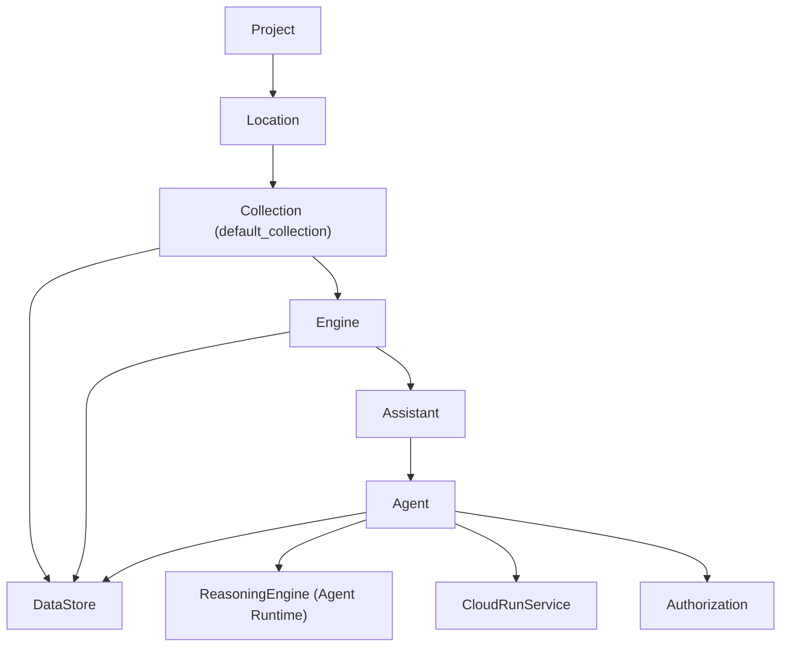
```mermaid
flowchart TD
  P["Project"] --> L["Location"]
  L --> C["Collection (default_collection)"]
  C --> E["Engine"]
  C --> D["DataStore"]
  E --> D
  E --> A["Assistant"]
  A --> G["Agent"]
  G --> R["ReasoningEngine (Agent Runtime)"]
  G --> CR["CloudRunService"]
  G --> Z["Authorization"]
  G --> D
```

| Edge | Derived from |
|---|---|
| Engine → DataStore | `engine.dataStoreIds` |
| Agent → ReasoningEngine | `adkAgentDefinition.provisionedReasoningEngine.reasoningEngine` |
| Agent → ReasoningEngine / CloudRunService | the `url` inside `a2aAgentDefinition.jsonAgentCard` |
| Agent → Authorization | `authorizationConfig.toolAuthorizations` plus `authorizations` |
| Agent → DataStore | a recursive walk of the agent view for any string containing `/dataStores/` ([L371-L379](file:///usr/local/google/home/wdufrin/Documents/Code/Gemini-Enterprise-Manager/hooks/useArchitectureScanner.ts#L371-L379)) |

That last one is a heuristic: it finds a data store reference anywhere in the agent's JSON. It catches real links that a stricter parser would miss, but it can also draw an edge from a data store ID that merely appears in a prompt or description.

### How to: scan and read the graph

1. Confirm Project ID and Project Number.
2. Click **Scan Project** and watch the elapsed-time counter.
3. When it completes, expand **Scan Log** and read any `NOTE:`, `WARNING:` or `SKIPPED_EDGE:` lines.
4. Hover a node to highlight everything upstream and downstream of it.
5. Click a node to *filter* the canvas down to its connected subgraph and open the details panel.
6. Use **Filter resources...** to find something by label, ID, or type.

**Expected result:** a graph laid out in horizontal rows, one row per node type, with animated `smoothstep` edges. The view auto-fits after each change.

> [!NOTE]
> **The layout is grouped by type, not by dependency.** [ArchitectureGraph.tsx](file:///usr/local/google/home/wdufrin/Documents/Code/Gemini-Enterprise-Manager/components/architecture/ArchitectureGraph.tsx#L102-L140) places all nodes of a type in one row with a fixed 320px horizontal and 200px vertical gap. Edges therefore frequently run sideways or backwards across the canvas. It is not a dependency diagram — don't read top-to-bottom as a call order.

> [!WARNING]
> **Search hides edges as well as nodes.** Any edge with a filtered-out endpoint is dropped ([L86-L89](file:///usr/local/google/home/wdufrin/Documents/Code/Gemini-Enterprise-Manager/components/architecture/ArchitectureGraph.tsx#L86-L89)), so a searched node usually appears completely isolated. That is a rendering artefact, not a finding. Clear the search and click the node instead.

### How to: cancel a scan

Click **Cancel Scan**.

> [!CAUTION]
> **Cancelling throws away everything the scan found.** [cancelScan](file:///usr/local/google/home/wdufrin/Documents/Code/Gemini-Enterprise-Manager/hooks/useArchitectureScanner.ts#L79-L86) only sets a flag that is checked between loop iterations — no `AbortSignal` is passed to any API call, so in-flight requests keep running and still bill against your quota. Worse, the cancel path returns early and skips `setNodes` / `setEdges` ([L410-L411](file:///usr/local/google/home/wdufrin/Documents/Code/Gemini-Enterprise-Manager/hooks/useArchitectureScanner.ts#L410-L411)), so **the canvas is left empty** and all partial results are discarded. On a large project, let the scan finish.

### The details panel

Clicking a node opens [DetailsPanel.tsx](file:///usr/local/google/home/wdufrin/Documents/Code/Gemini-Enterprise-Manager/components/architecture/DetailsPanel.tsx) on the right. It always shows **Full Resource Name**, **Created** and **Last Updated**, plus type-specific fields:

| Node type | Extra fields | Action button |
|---|---|---|
| Agent | Status, Description | **Test in Playground** → opens **Engines & Assistants** on that engine |
| ReasoningEngine | Location | **Direct Query** |
| DataStore | Content Config | — |
| Engine | Solution Type | — |
| Authorization | Client ID (`serverSideOauth2.clientId`) | — |
| CloudRunService | URL, Location, Image | **Test A2A Endpoint** → opens the (sidebar-hidden) **A2A Tester** |

Every node also gets a **View in Cloud Console** link, built per type in [getGcpConsoleUrl](file:///usr/local/google/home/wdufrin/Documents/Code/Gemini-Enterprise-Manager/components/architecture/DetailsPanel.tsx#L29-L72).

### The Table (WCAG) view

[ArchitectureMatrixTable.tsx](file:///usr/local/google/home/wdufrin/Documents/Code/Gemini-Enterprise-Manager/components/architecture/ArchitectureMatrixTable.tsx) renders the same topology as a sortable table (`aria-label="Architecture Topology Matrix"`, sticky header) with columns **Resource Name**, **Type**, **Called By (Inbound)**, **Connects To (Outbound)** and **Actions**.

> [!TIP]
> Use this view for anything you need to read carefully or copy out — auditing orphans, listing every consumer of a data store, or working with a screen reader. It is genuinely easier to scan than the graph.


### Known limitations & gotchas

- **Hard-coded location lists** — resources outside them are silently invisible.
- **Only `default_collection` is scanned.**
- **Cancel discards all results** and does not abort in-flight requests.
- **No export of any kind** — there is no PNG, SVG, JSON or CSV export anywhere in the architecture components.
- **No health badges** on nodes.
- **Layout is by type, not dependency.**
- **Searching isolates nodes** by dropping their edges.
- Partial failures are logged, not surfaced as banners — if you don't open **Scan Log**, a missing region looks like a missing resource.
- Engines referencing a data store that wasn't found get a **placeholder node** plus a warning in the log — that is your orphan detector.

### Troubleshooting

| Symptom / exact log line | Cause | Fix |
|---|---|---|
| `Project ID/Number is required to scan the architecture.` | Missing project config | Set both on **GE Agent Manager** |
| `NOTE: Could not scan Agent Engines in <loc>: <msg>` | Vertex AI API disabled or no permission in that region | Enable `aiplatform.googleapis.com`; grant viewer |
| `NOTE: Could not scan Cloud Run in <loc>: <msg>` | Cloud Run API disabled or no `roles/run.viewer` | Enable + grant |
| `NOTE: Could not scan for Data Stores in <loc>: <msg>` | Discovery Engine permission in that location | Grant `roles/discoveryengine.viewer` |
| `WARNING: Could not fetch authorizations: <msg>` | No permission on authorizations | Grant viewer; Agent → Authorization edges will be missing |
| `WARNING: Could not list assistants for engine '<n>': <msg>` | Engine not fully provisioned | Check the engine in the Console |
| `WARNING: Could not list agents for assistant '<n>': <msg>` | Permission or provisioning | As above |
| `WARNING: Failed to parse A2A agent card JSON for agent '<n>': <msg>` | Malformed `jsonAgentCard` | Fix the agent card; the A2A edge is skipped |
| `WARNING: Engine '<n>' links to DataStore '<id>' which was not found in the initial scan. Adding a placeholder node.` | **Orphaned reference** — store deleted or in an unscanned location/collection | Detach it from the engine, or confirm where it lives |
| `WARNING: Could not fetch details for DataStore <id>: <msg>` | Permission on that store | Grant viewer |
| `NOTE: Could not get full details for engine '<n>' to find linked data stores: <msg>` | Engine get failed | Engine → DataStore edges will be missing |
| `NOTE: Could not get agent view for <n> to find data stores: <msg>` | Agent view failed | Agent → DataStore edges will be missing |
| `SKIPPED_EDGE: Cannot draw link from X to Y as one of the resources was not found in the scan.` | One endpoint outside the scanned scope | Usually a hard-coded-location gap |
| `FATAL ERROR: <msg>` | Scan aborted | Read the message; typically auth expiry — reload and re-auth |
| Canvas empty after clicking **Cancel Scan** | Results are discarded on cancel | Re-run and let it finish |
| A node looks isolated | Search dropped its edges | Clear **Filter resources...** |

---

## Chapter troubleshooting index

Every error string this chapter's code can produce.

| Error / message (verbatim) | Where | Cause | Fix |
|---|---|---|---|
| `Not set (configure on Agents page)` | Data Stores config panel | Project ID/Number unset | Set them on **GE Agent Manager** |
| `No data stores found for the provided configuration.` | Data store list | Wrong location/collection | Try `global`/`us`/`eu` |
| `This action cannot be undone and will delete all documents within the store(s).` | Delete confirm | Informational | Confirm only if intended |
| `Failed to delete N data store(s):` | Delete | Permission or in-use | Read per-store lines |
| `Submitting data store creation request...` | Create modal | Progress | Wait |
| `Provisioning Data Store in Google Cloud... (this may take 2-4 minutes)` | Create modal | Progress | Wait |
| `Data Store creation is taking longer than expected. It is still provisioning in Google Cloud: <op>` | Create modal | Poll timed out at 5 min | Re-fetch later |
| `Polling operation status... (n/60)` | Import log | Progress | Wait |
| `GCS upload failed due to bucket CORS policy on gs://<bucket>. See instructions above.` | Import | Missing CORS rule | Run the printed `gcloud storage buckets update` |
| `MCP endpoint <url> returned HTTP <status>: <body>` | MCP tools | Endpoint error | Verify URL/auth |
| `MCP Server returned empty tools list` | Connector diagnostics | Server exposes no tools | Fix tool registration |
| `MCP Connectivity Failed: <msg>` | Connector diagnostics | Unreachable | Check network/URL |
| `Tools refreshed successfully! Updated dynamicTools and bapConfig.` | BYOMCP | Success — **also re-enabled every tool** | Re-disable unwanted tools |
| `Not Applicable for Default Connector` / `Default connector does not require validation.` | Diagnostics | `default_collection` | Expected |
| `Connector Active` | Diagnostics | Healthy | — |
| `Connector State: FAILED` | Diagnostics | Connector in FAILED state | Re-auth / re-run setup |
| `Sync Error: <msg>` | Diagnostics | Last sync failed | Read the message |
| `Connector Error: <msg>` | Diagnostics | Connector-level error | Read the message |
| `Sync Failures Detected: N failed operations in the last 24h.` | Diagnostics | Failed operations | Inspect **Recent Operations** |
| `Import errors written to GCS prefix: <prefix>` | Diagnostics | Per-document import errors | Read the GCS error files |
| `Validation Failed: N Recent Errors` | Diagnostics | Error logs in the window | Lower the scan window; read logs |
| `Check Failed: <msg>` | Diagnostics | A diagnostic step threw | Read the message |
| `Could not list operations. Diagnostics might be incomplete.` | Diagnostics | No operations permission | Grant viewer |
| `Could not fetch Cloud Logging entries.` | Diagnostics | No `logging.logEntries.list` | Grant `roles/logging.viewer` |
| `Indexing Filters: N active rules configured` / `None configured (indexing all accessible data)` | Filters tab | Informational | — |
| `Project ID/Number is required to scan for services.` | MCP Servers page | Missing project config | Set it |
| `Failed to fetch Cloud Run services.` | MCP Servers page | No `roles/run.viewer` | Grant it |
| `Missing 'monitoring.timeSeries.list' permission to view live usage.` | Quota | No Monitoring Viewer | Grant `roles/monitoring.viewer` |
| `Failed to fetch live usage metrics from Cloud Monitoring.` | Quota | API disabled/transient | Enable `monitoring.googleapis.com` |
| `Failed to load live usage metrics from Cloud Monitoring.` | Quota | Same, at load | As above |
| `N metric(s) could not be fetched and are marked as Unavailable.` | Quota | Subset failed | Check amber cards |
| `Requires monitoring.timeSeries.list` | Quota card footnote | That metric failed | As above |
| `Failed to load billing accounts.` | Quota | No billing list permission | Enter licences manually |
| `Failed to load subscription profiles.` | Quota | No licence configs | Enter licences manually |
| `No engines found in this location.` | Engines list | Wrong location | Try `global`/`us`/`eu` |
| `This engine (<name>) has not been fully initialized with an assistant yet. Please open the Assistant configuration or check Discovery Engine status.` | Engines list | No `default_assistant` | Finish provisioning |
| `Failed to load agents for this assistant.` | Detail view | Agent list failed | Check permissions |
| `Chat API Error: <status> <statusText> - <body>...` | Playground | streamAssist rejected | Read the body |
| `Failed to get response from agent.` | Playground | Stream failed | Retry |
| `[The agent ignored the greeting as it was not a direct question. Please ask a specific question to get a response.]` | Playground | Query skipped | Ask a real question |
| `[The agent processed your request but did not provide a response. Please try rephrasing or ask something else.]` | Playground | Empty reply | Rephrase |
| `No linked data stores found.` | Filters popover | No resolvable `dataStoreIds` | Attach stores to the engine |
| `No detailed tool or data store information was found for this response.` | Response Details | No diagnostic info returned | Expected for ungrounded answers |
| `This provider is not configured for OIDC. Only OIDC providers support automatic sign-in.` | WIF panel | SAML provider | Paste a token manually |
| `Sign-in failed.` | WIF panel | Popup blocked / auth failed | Allow popups |
| `Token exchange failed.` | WIF panel | STS rejected the token | Check the workforce pool |
| `Project ID/Number is required to scan the architecture.` | Architecture | Missing project config | Set it |
| `NOTE: Could not scan Agent Engines in <loc>: <msg>` | Scan log | Region permission/API | Enable + grant |
| `NOTE: Could not scan Cloud Run in <loc>: <msg>` | Scan log | Region permission/API | Enable + grant |
| `NOTE: Could not scan for Data Stores in <loc>: <msg>` | Scan log | Location permission | Grant viewer |
| `WARNING: Could not fetch authorizations: <msg>` | Scan log | No permission | Grant viewer |
| `WARNING: Could not list assistants for engine '<n>': <msg>` | Scan log | Provisioning/permission | Check engine |
| `WARNING: Could not list agents for assistant '<n>': <msg>` | Scan log | Provisioning/permission | Check assistant |
| `WARNING: Failed to parse A2A agent card JSON for agent '<n>': <msg>` | Scan log | Malformed agent card | Fix the JSON |
| `WARNING: Engine '<n>' links to DataStore '<id>' which was not found in the initial scan. Adding a placeholder node.` | Scan log | Orphaned reference | Detach or locate the store |
| `WARNING: Could not fetch details for DataStore <id>: <msg>` | Scan log | Permission | Grant viewer |
| `NOTE: Could not get full details for engine '<n>' to find linked data stores: <msg>` | Scan log | Engine get failed | Check permissions |
| `NOTE: Could not get agent view for <n> to find data stores: <msg>` | Scan log | Agent view failed | Check permissions |
| `SKIPPED_EDGE: Cannot draw link from X to Y as one of the resources was not found in the scan.` | Scan log | Endpoint out of scope | Expected for unscanned regions |
| `Architecture scan cancelled by user.` / `Architecture scan cancelled.` | Scan log | You cancelled | Re-run; results were discarded |
| `FATAL ERROR: <msg>` | Scan log | Scan aborted | Usually auth expiry — reload |


---

# Chapter 3 — Security & Access

**Who this chapter is for** — Administrators who decide *what an agent may do on a user's behalf*, *who may talk to an agent*, *what content is allowed through*, and *what gets recorded*. If you own the audit story for Gemini Enterprise, this is your chapter.

**What you'll be able to do**

- Create, inspect, edit and delete Discovery Engine **Authorization** resources, and know exactly where the OAuth client secret travels.
- Audit which humans, groups and service accounts can reach each agent across `global`, `us` and `eu` — and know precisely what this app can and cannot change.
- Build a **Model Armor** safety template, attach it to an app, and tune thresholds without blocking your security team's own questions.
- Stand up BigQuery-backed **Observability**, understand the 11 analytics views, and keep the query bill under control.

**Before you start**

| Prerequisite | Detail |
|---|---|
| Project ID or number | Set on the **GE Agent Manager** tab. Several tabs here render "Not set (configure on Agents page)" until you do. |
| Enabled APIs | `discoveryengine.googleapis.com`, `cloudresourcemanager.googleapis.com`, `iam.googleapis.com`, `modelarmor.googleapis.com`, `logging.googleapis.com`, `bigquery.googleapis.com` |
| Signed in | The app calls Google APIs **directly from your browser** with your own OAuth token. Everything you do here runs as *you*, not as a service account. |
| Existing resources | At least one Discovery Engine engine ("app") with an assistant. Observability additionally needs a Cloud Logging **sink** that writes to BigQuery. |
| IAM | See [Least-privilege IAM roles for this chapter](#least-privilege-iam-roles-for-this-chapter). |

> [!IMPORTANT]
> This app has **no backend**. Every request in this chapter is issued by your browser to `googleapis.com` using your signed-in identity ([core.ts](file:///usr/local/google/home/wdufrin/Documents/Code/Gemini-Enterprise-Manager/services/api/core.ts#L158-L212)). There is no server-side audit trail of what the *console* did — only the normal Cloud Audit Logs of what *your user* did.

---

## At a glance

Four tabs, four different layers of the same question: *is this safe?*

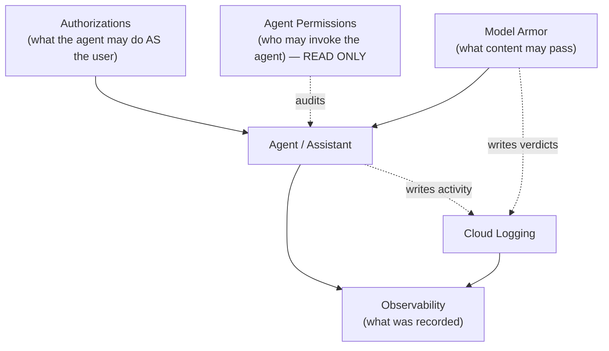
```mermaid
graph TD
    A["Authorizations<br/>(what the agent may do AS the user)"] --> E["Agent / Assistant"]
    B["Agent Permissions<br/>(who may invoke the agent) — READ ONLY"] -.audits.-> E
    C["Model Armor<br/>(what content may pass)"] --> E
    E --> D["Observability<br/>(what was recorded)"]
    C -.writes verdicts.-> L["Cloud Logging"]
    E -.writes activity.-> L
    L --> D
```

| Tab | Reads | Writes | Backing API |
|---|---|---|---|
| **Authorizations** | Yes | **Yes** — create / patch / delete | Discovery Engine `v1alpha` |
| **Agent Permissions** | Yes | **No** — audit only | Cloud Resource Manager `v1` + Discovery Engine `v1alpha` |
| **Model Armor** | Yes | **Partial** — create template, attach to assistant | Model Armor `v1` + Discovery Engine `v1alpha` |
| **Observability** | Yes | **Yes** — creates and drops BigQuery views | Cloud Logging `v2` + BigQuery `v2` |

---

## Authorizations

### What it's for

A Discovery Engine **Authorization** is a stored OAuth 2.0 client configuration. It lets an agent act *as the signed-in end user* against some other system — read their Gmail, list their Drive files, query their Jira, call a Google Cloud API on their behalf.

You are not storing a token here. You are storing the *recipe* Gemini Enterprise uses to go get a token: which OAuth client to use, where to send the user to consent, and where to exchange the resulting code. When a user first hits an agent that needs it, they get a consent screen; after that, Gemini Enterprise injects their token into the agent's tool context.

One Authorization can be reused by many agents. Deleting one breaks every agent that references it.

### The screen, explained

The tab has two views: a list and a form.

**Configuration panel** (top, always visible)

| Control | Behaviour |
|---|---|
| **Project ID / Number** | Read-only echo of the project set elsewhere. Shows `Not set (configure on Agents page)` when empty. |
| **Region** | Dropdown: **Global**, **US (Multi-region)**, **EU (Multi-region)**. |
| **Refresh Authorizations** | Re-runs the scan. Label flips to `Loading...`. |

> [!NOTE]
> The **Region** dropdown is a *display filter*, not a scope limiter. The page always calls `listAuthorizations` against all three locations — `global`, `us`, `eu` — on every refresh ([AuthorizationsPage.tsx:123-141](file:///usr/local/google/home/wdufrin/Documents/Code/Gemini-Enterprise-Manager/pages/AuthorizationsPage.tsx#L123-L141)) and then filters the table down to the selected one ([line 394](file:///usr/local/google/home/wdufrin/Documents/Code/Gemini-Enterprise-Manager/pages/AuthorizationsPage.tsx#L394)). New Authorizations, however, *are* created in the selected region.

**Show Advanced Tools (Workforce Pool Validator)** — a link that expands a separate Workforce Identity Pool checker. Unrelated to OAuth Authorizations; useful when your users sign in via an external IdP.

**Partial results banner** — if any of the three regions, or any collection / engine / assistant / agent listing fails, the page still renders what it got and shows a banner with the per-resource reason and HTTP status. It does not silently pretend the list is complete.

**Authorization Resources table** ([AuthList.tsx](file:///usr/local/google/home/wdufrin/Documents/Code/Gemini-Enterprise-Manager/components/authorizations/AuthList.tsx#L64-L140))

| Column | Contents |
|---|---|
| (checkbox) | Multi-select for bulk delete |
| **Auth ID** | Last path segment of the resource name |
| **Region** | `global` (blue pill) or the multi-region (green pill) |
| **Client ID** | The OAuth client ID, or `N/A` |
| **Used By Agent** | Live scan result — agent display names, `Scanning...`, or `Not in use` |
| (actions) | **View** · **ADK Code** · **Edit** · **Delete** |

Header buttons: **Create New Authorization** (green) and, once anything is ticked, **Delete Selected** (red) with an `N selected` counter.

> [!TIP]
> The **Used By Agent** column is the single most valuable thing on this screen. Before you delete anything, make sure it says `Not in use`. The scan walks every collection → engine → assistant → agent in all three regions and matches both `agent.authorizations` and `agent.authorizationConfig.toolAuthorizations` ([AuthorizationsPage.tsx:231-248](file:///usr/local/google/home/wdufrin/Documents/Code/Gemini-Enterprise-Manager/pages/AuthorizationsPage.tsx#L231-L248)).

![The Authorizations tab, captured while the list is still loading. The Configuration panel shows the read-only **Project ID / Number** echo (here the project *number*, 123456789012), the **Region** dropdown set to *Global* with the helper text "Select the region where you want to manage authorizations.", and the refresh button in its `Loading...` state. Remember that this dropdown filters what the table displays -- the fetch underneath always covers global, us and eu. Below it sits the **Show Advanced Tools (Workforce Pool Validator)** link. The spinner marks where the Authorization Resources table renders once the tri-region fetch and the Used By Agent scan complete.](./assets/20-authorizations.png)

### How to: create an Authorization

Before you touch this screen you need an OAuth client from the identity provider that owns the data.

- **Google APIs** — Google Cloud console → **APIs & Services → Credentials → Create Credentials → OAuth client ID → Web application**. Add `https://vertexaisearch.cloud.google.com/oauth-redirect` as an Authorized redirect URI. Copy the client ID and client secret.
- **Microsoft Entra ID** — Entra admin centre → **App registrations → New registration**. Add the same redirect URI as a Web platform. Copy the **Application (client) ID**, the **Directory (tenant) ID**, and create a **Client secret** under *Certificates & secrets*.

Then:

1. Click **Create New Authorization**.
2. Enter the **Authorization ID** — a short unique ID such as `gmail-delegation`. (You may paste a full resource name; only the last segment is used.)
3. Choose a **Provider**: **Google** or **Microsoft Entra ID**. This prefills sensible scopes and token URI.
4. For Microsoft only, enter the **Tenant ID**. The **OAuth Token URI** updates itself to `https://login.microsoftonline.com/<tenant>/oauth2/v2.0/token`.
5. Paste the **OAuth 2.0 Client ID**.
6. Paste the **OAuth 2.0 Client Secret**. The field is masked. Read the warning below before you do this on a shared screen.
7. Set **OAuth 2.0 Scopes** as a **comma-separated** list. Hover the `i` icon for common Google scopes.
8. Leave **OAuth Redirect URI** at `https://vertexaisearch.cloud.google.com/oauth-redirect` unless your IdP requires otherwise.
9. Leave **Auto-generate Auth URI** ticked. The **Authorization URI** field builds itself from provider + client ID + redirect URI + scopes. Untick it only if you need a URI this app cannot express.
10. Check the **cURL Command Preview** on the right — it mirrors exactly what will be sent.
11. Click **Create**.

**Expected result:** you return to the list and it refreshes. Your new Authorization appears under the region you had selected, with `Not in use` in the last column until you attach it to an agent.

<details><summary>Under the hood — the API call this makes</summary>

```bash
curl -X POST \
     -H "Authorization: Bearer $(gcloud auth print-access-token)" \
     -H "Content-Type: application/json" \
     -H "X-Goog-User-Project: PROJECT_ID" \
     -d '{
  "serverSideOauth2": {
    "clientId": "...",
    "clientSecret": "[YOUR_CLIENT_SECRET]",
    "authorizationUri": "https://accounts.google.com/o/oauth2/auth?client_id=...&redirect_uri=...&scope=...&response_type=code&access_type=offline&prompt=consent",
    "tokenUri": "https://oauth2.googleapis.com/token"
  }
}' \
     "https://discoveryengine.googleapis.com/v1alpha/projects/PROJECT_ID/locations/global/authorizations?authorizationId=AUTH_ID"
```

For `us` / `eu` the host becomes `us-discoveryengine.googleapis.com` / `eu-discoveryengine.googleapis.com`. Source: [dataStores.ts:604-618](file:///usr/local/google/home/wdufrin/Documents/Code/Gemini-Enterprise-Manager/services/api/dataStores.ts#L604-L618).

</details>

> [!WARNING]
> **The `scopes` and `redirectUri` fields are never sent to the API as fields.** The submit payload contains only `clientId`, `clientSecret`, `authorizationUri` and `tokenUri` ([AuthForm.tsx:282-300](file:///usr/local/google/home/wdufrin/Documents/Code/Gemini-Enterprise-Manager/components/authorizations/AuthForm.tsx#L282-L300)). Scopes exist purely to build the query string inside the Authorization URI. If you untick **Auto-generate Auth URI** and hand-write a URI, whatever you typed in **Scopes** is discarded.

### Client secret handling — read this before you type one

This is the one field in the product that can cause a real breach. Here is exactly what the code does with it, verified line by line.

| Question | Answer | Source |
|---|---|---|
| Is it sent over the wire from the browser? | **Yes.** In plaintext JSON, over TLS, straight from your browser to `discoveryengine.googleapis.com`. There is no proxy or backend. | [core.ts:202-212](file:///usr/local/google/home/wdufrin/Documents/Code/Gemini-Enterprise-Manager/services/api/core.ts#L202-L212) |
| Is it displayed on screen? | **No.** The input is `type="password"`. | [AuthForm.tsx:397](file:///usr/local/google/home/wdufrin/Documents/Code/Gemini-Enterprise-Manager/components/authorizations/AuthForm.tsx#L397) |
| Is it in the cURL preview pane? | **No.** Replaced with the literal string `[YOUR_CLIENT_SECRET]` before rendering — for both create and update. | [AuthForm.tsx:210-212](file:///usr/local/google/home/wdufrin/Documents/Code/Gemini-Enterprise-Manager/components/authorizations/AuthForm.tsx#L210-L212), [252-255](file:///usr/local/google/home/wdufrin/Documents/Code/Gemini-Enterprise-Manager/components/authorizations/AuthForm.tsx#L252-L255) |
| Is it logged into the **Show Interaction Details** cURL history? | **No.** Every request body passes through `redactRequestBody` before it reaches the debug logger. `clientSecret` normalises to `clientsecret`, which is in the sensitive-key set, so it renders as `[REDACTED]`. | [core.ts:191-199](file:///usr/local/google/home/wdufrin/Documents/Code/Gemini-Enterprise-Manager/services/api/core.ts#L191-L199), [redaction.ts:60-93](file:///usr/local/google/home/wdufrin/Documents/Code/Gemini-Enterprise-Manager/services/redaction.ts#L60-L93) |
| Is my bearer token logged? | **No.** Replaced with the literal `Bearer $(gcloud auth print-access-token)`. | [core.ts:186-190](file:///usr/local/google/home/wdufrin/Documents/Code/Gemini-Enterprise-Manager/services/api/core.ts#L186-L190) |
| Does the debug history persist? | **No.** Last 50 entries, in memory only, gone on reload. | [GlobalDebugContext.tsx:55](file:///usr/local/google/home/wdufrin/Documents/Code/Gemini-Enterprise-Manager/context/GlobalDebugContext.tsx#L55) |
| Does the API ever hand the secret back? | **No.** `getAuthorization` returns `clientId`, `authorizationUri` and `tokenUri`. The View modal has no secret field at all, and the Edit form deliberately blanks it. | [ViewAuthModal.tsx:160-212](file:///usr/local/google/home/wdufrin/Documents/Code/Gemini-Enterprise-Manager/components/authorizations/ViewAuthModal.tsx#L160-L212), [AuthForm.tsx:113](file:///usr/local/google/home/wdufrin/Documents/Code/Gemini-Enterprise-Manager/components/authorizations/AuthForm.tsx#L113) |

> [!CAUTION]
> Redaction is **display-only by design**. The comment at the top of [redaction.ts](file:///usr/local/google/home/wdufrin/Documents/Code/Gemini-Enterprise-Manager/services/redaction.ts#L17-L32) says so explicitly: callers keep passing the *original* object to the transport layer. That means:
> - **Browser DevTools → Network → Request Payload shows your client secret in cleartext.**
> - **A HAR file exported from that session contains it.**
> - A browser extension with request-reading permission can see it.
>
> Screenshots and copy-pasted bug reports are safe. DevTools captures and HAR files are **not**. Treat any HAR taken while creating an Authorization as a credential and destroy it.

> [!TIP]
> Practical hygiene: create Authorizations from a clean browser profile with no extensions, don't record a HAR while doing it, and rotate the client secret at the IdP if you ever suspect a capture. Rotation is cheap — see the update flow below.

### How to: edit an Authorization

1. In the table, click **Edit** on the row.
2. The form loads in **Update Authorization** mode. **Authorization ID** shows the full resource name and is disabled. A read-only **Region** field appears.
3. Change what you need. Leave **OAuth 2.0 Client Secret** blank to keep the existing one; type a new value to rotate it.
4. Watch the cURL preview — it shows `# No changes detected.` until something actually differs.
5. Click **Update**.

**Expected result:** back to the list, refreshed. Only the fields you changed are in the `updateMask`.

<details><summary>Under the hood — the API call this makes</summary>

```bash
curl -X PATCH \
     -H "Authorization: Bearer $(gcloud auth print-access-token)" \
     -H "Content-Type: application/json" \
     -H "X-Goog-User-Project: PROJECT_ID" \
     -d '{"serverSideOauth2": {"clientSecret": "[YOUR_CLIENT_SECRET]"}}' \
     "https://discoveryengine.googleapis.com/v1alpha/projects/PROJECT_ID/locations/global/authorizations/AUTH_ID?updateMask=serverSideOauth2.clientSecret"
```

The mask is assembled field-by-field from what actually differs: `serverSideOauth2.clientId`, `serverSideOauth2.authorizationUri`, `serverSideOauth2.tokenUri`, `serverSideOauth2.clientSecret` ([AuthForm.tsx:304-313](file:///usr/local/google/home/wdufrin/Documents/Code/Gemini-Enterprise-Manager/components/authorizations/AuthForm.tsx#L304-L313)). If the mask is empty, **no call is made at all** — the form just closes.

</details>

> [!WARNING]
> **Opening Edit can silently rewrite a hand-crafted Authorization URI.** On load, the form forces **Auto-generate Auth URI** back on regardless of what is stored ([AuthForm.tsx:120-122](file:///usr/local/google/home/wdufrin/Documents/Code/Gemini-Enterprise-Manager/components/authorizations/AuthForm.tsx#L120-L122)). It then re-derives the URI from scopes and redirect URI that it *parsed back out of the stored URI*. Any parameter the parser doesn't understand — `login_hint`, `hd`, a custom `state`, a non-standard `prompt` — is dropped, the regenerated URI now differs from the stored one, so `serverSideOauth2.authorizationUri` lands in the update mask and **Update** overwrites it.
>
> If you have a hand-built Authorization URI, untick **Auto-generate Auth URI** and paste the original back before saving, or do the edit with `curl` instead.

### How to: delete an Authorization

1. Confirm the **Used By Agent** column reads `Not in use`.
2. Click **Delete** on a single row, or tick several and click **Delete Selected**.
3. A modal titled `Confirm Deletion of N Authorization(s)` lists each ID with its client ID and warns: *"This action cannot be undone and may break agents that rely on them."*
4. Click **Delete**.

**Expected result:** the list refreshes. Any per-item failures are collected and shown as a combined error listing each name and message; deletion of the others still proceeds ([AuthorizationsPage.tsx:306-325](file:///usr/local/google/home/wdufrin/Documents/Code/Gemini-Enterprise-Manager/pages/AuthorizationsPage.tsx#L306-L325)).

> [!CAUTION]
> The confirmation is generic. **The app does not block deletion of an Authorization that the usage scan just found attached to live agents**, and it does not repeat the agent names in the modal. Check the table before you click.

### How to: attach an Authorization to an agent

This tab **cannot** attach anything. Attachment happens on the agent itself, via `authorizations` / `authorizationConfig.toolAuthorizations` on the agent resource — see the **GE Agent Manager** chapter. What this tab gives you is the read-back: once attached, the agent's display name appears in **Used By Agent** after the next refresh.

For the ADK code side, click **ADK Code** on any row (or **View** → **ADK Python Blueprint** tab). It renders a ready-to-copy `tool_oauth_delegation.py` snippet showing how to pull the delegated user token out of `ToolContext` inside an ADK tool. Click **Copy Python Snippet**.

### Field reference — Create / Update Authorization

| Field | What to enter | Required | Notes / Default |
|---|---|---|---|
| **Authorization ID** | Unique short ID, e.g. `gmail-delegation` | Yes | Default `your-auth-id`. Disabled when editing. Full resource paths are accepted; only the last segment is used. |
| **Provider** | `Google` or `Microsoft Entra ID` | Yes (create only) | Default `Google`. Not shown when editing — it is inferred from the stored URIs. |
| **Tenant ID** | Entra Directory (tenant) ID | Only for Microsoft | Drives the token URI. |
| **OAuth 2.0 Client ID** | From your IdP | Yes | Default `your-oauth-client-id` — **change it**. |
| **OAuth 2.0 Client Secret** | From your IdP | Yes on create | Masked. Blank on edit = keep existing. |
| **OAuth 2.0 Scopes** | Comma-separated scope URLs | Yes | Google default `https://www.googleapis.com/auth/cloud-platform`. Microsoft default `https://graph.microsoft.com/Mail.Read,https://graph.microsoft.com/Calendars.Read,offline_access`. Not sent as a field — folded into the Authorization URI. |
| **OAuth Redirect URI** | Must match the IdP registration | No (but effectively yes) | Default `https://vertexaisearch.cloud.google.com/oauth-redirect`. |
| **Authorization URI** | Consent endpoint | Yes | Auto-generated by default. Disabled while auto-generate is ticked. |
| **OAuth Token URI** | Token exchange endpoint | No | Google default `https://oauth2.googleapis.com/token`. |

### Known limitations & gotchas

- **`cloud-platform` is the default scope.** It is an extremely broad grant. Replace it with the narrowest scope the tool actually needs.
- **No scope validation.** Typos are accepted and only surface as a failed consent screen for your end users.
- **The Region dropdown does not limit the scan** — you always pay three `listAuthorizations` calls plus a full multi-region agent crawl per refresh.
- **The agent usage scan is expensive.** Collections → engines → assistants → agents, sequentially, across three regions. On a large estate this takes a while; the **Used By Agent** column shows `Scanning...` throughout.
- **No pagination in the UI.** `listAuthorizations` requests `pageSize=200` and the page ignores `nextPageToken` ([dataStores.ts:580-592](file:///usr/local/google/home/wdufrin/Documents/Code/Gemini-Enterprise-Manager/services/api/dataStores.ts#L580-L592)). Beyond 200 Authorizations in one region, the rest are invisible.
- **Edit rewrites non-standard Authorization URIs** — see the warning above.
- The API version is `v1alpha`. Field names and behaviour can change without notice.

### Troubleshooting

| Symptom / exact error text | Cause | Fix |
|---|---|---|
| `Project ID/Number is required to list authorizations.` | No project set | Set it on **GE Agent Manager**. |
| `No authorizations found for the provided project number.` | None exist in the **selected region** | Switch the **Region** dropdown — the resource may live in `us` or `eu`. |
| Banner: `Failed to load authorizations for region 'eu': ...` | Region not enabled, or missing permission | Grant `discoveryengine.authorizations.list`; ignore if you do not use that multi-region. |
| `Authorization with ID <id> not found in the current list.` | Clicked **Edit** on a stale row | Click **Refresh Authorizations**. |
| `Authorization ID cannot be empty.` | ID field blank or only slashes | Enter a valid ID. |
| Create returns `ALREADY_EXISTS` | ID collision in that region | Pick a different ID or delete the old one. |
| `Failed to delete some authorizations:` followed by a list | Per-item failures | Read each line; usually a 403 or the resource was already gone. |
| Users see "invalid redirect_uri" at consent | Redirect URI not registered at the IdP | Add `https://vertexaisearch.cloud.google.com/oauth-redirect` to the OAuth client. |

---

## Agent Permissions

### What it's for

This tab answers one question: **who can currently reach each agent?** It sweeps every Gemini Enterprise app in `global`, `us` and `eu`, pulls the IAM policy attached to each agent, folds in the inherited project-level roles, and lays the result out as a filterable table you can export to CSV.

It is an **audit tool**. Read it as a report, not a control panel.

> [!IMPORTANT]
> **This tab cannot grant or revoke anything.** There is no Add, Edit, Save or Remove control anywhere on it, and the page never calls `setAgentIamPolicy` — the only IAM functions it imports are `getProjectIamPolicy`, `listResources` and `getAgentIamPolicy` ([AgentPermissionsPage.test.tsx:24-28](file:///usr/local/google/home/wdufrin/Documents/Code/Gemini-Enterprise-Manager/pages/AgentPermissionsPage.test.tsx#L24-L28)). To actually change access, use **Edit IAM Policy for Agent** in **GE Agent Manager** → agent details (covered below, because that is where the risk is).

### The screen, explained

**Configuration bar** — a **Project ID / Number** input and a single blue **Refetch All Locations** button (label `Loading...` while running). There is no region selector: it always scans all three.

**Partial results banner** — every failure is captured individually with its HTTP status: project IAM policy, engines per location, assistants per app, agents per assistant, and IAM policy per agent. If the scan returns nothing *and* there were failures, the empty state says **"Permissions Could Not Be Fully Retrieved"** rather than pretending there are no permissions. That distinction is deliberate and tested.

**Results toolbar** — `Showing X of Y records`, plus **View Python Script** and **Export to CSV** (downloads `agent_permissions_export.csv`).

![The Agent Permissions tab in its initial state, before any scan has run. The Configuration bar holds the **Project ID / Number** input, a **Set** button and the blue **Refetch All Locations** button. The body shows the neutral empty state -- **"No agent permissions found."** with the sub-line *"Select a project and click refetch to globally scan all agent permissions."* This is the *good* empty state: if the scan had run and hit errors it would instead read **"Permissions Could Not Be Fully Retrieved"**. Learn to tell those two apart -- one means no access is granted, the other means the tool could not find out.](./assets/21-agent-permissions.png)

**Permission matrix** — six columns, each with its own free-text filter box in the header:

| Column | Contents |
|---|---|
| **Location** | `global`, `us` or `eu` |
| **Gemini Enterprise App** | Engine display name, falling back to its ID |
| **Agent Name** | Agent display name |
| **Agent Type** | `ADK`, `Low-Code`, the raw `agentType`, or `N/A` |
| **User ID** | Principal with its prefix stripped, suffixed ` (Inherited)` for project-level roles |
| **Permission** | Pill: `owner` (purple), `user` (blue), `unknown` (grey) |

### How to: audit who can reach your agents

1. Confirm the **Project ID / Number**.
2. Click **Refetch All Locations**. You'll see *"Fetching IAM policies..."*.
3. Wait. The scan is sequential: project policy → for each of 3 locations → engines → assistants → agents → per-agent `getIamPolicy`.
4. Read the partial-results banner if one appears. **A 403 here means the report is incomplete, not that access is absent.**
5. Filter by typing in any column header — e.g. `owner` in **Permission**, or a domain fragment in **User ID**.
6. Click **Export to CSV** for evidence.

**Expected result:** one row per (agent, principal, coarse permission) combination.

<details><summary>Under the hood — the API calls this makes</summary>

Project-level inherited roles:

```bash
curl -X POST \
  -H "Authorization: Bearer $(gcloud auth print-access-token)" \
  -H "Content-Type: application/json" \
  -d '{"options": {"requestedPolicyVersion": 3}}' \
  "https://cloudresourcemanager.googleapis.com/v1/projects/PROJECT_ID:getIamPolicy"
```

Per-agent policy (note: a **GET**, not the usual POST):

```bash
curl -X GET \
  -H "Authorization: Bearer $(gcloud auth print-access-token)" \
  -H "X-Goog-User-Project: PROJECT_ID" \
  "https://discoveryengine.googleapis.com/v1alpha/projects/PROJECT_ID/locations/global/collections/default_collection/engines/ENGINE_ID/assistants/ASSISTANT_ID/agents/AGENT_ID:getIamPolicy"
```

Sources: [iam.ts:118-123](file:///usr/local/google/home/wdufrin/Documents/Code/Gemini-Enterprise-Manager/services/api/iam.ts#L118-L123) and [iam.ts:163-167](file:///usr/local/google/home/wdufrin/Documents/Code/Gemini-Enterprise-Manager/services/api/iam.ts#L163-L167).

</details>

> [!TIP]
> Click **View Python Script** for a standalone script that reproduces this scan with `google.auth` + `requests`. It is **more accurate than the UI**: its CSV columns are `Location, App Name, Agent Name, Member, Role` — it prints the **real role ID**, which the on-screen table throws away. Use the script for compliance evidence.

### How the `owner` / `user` / `unknown` pill is decided

This is a **case-insensitive substring match on the role string**, not a capability model ([AgentPermissionsPage.tsx:217-221](file:///usr/local/google/home/wdufrin/Documents/Code/Gemini-Enterprise-Manager/pages/AgentPermissionsPage.tsx#L217-L221)):

| Role string contains | Pill |
|---|---|
| `admin`, `editor` or `owner` | `owner` |
| `viewer` or `user` | `user` |
| anything else | `unknown` |

Checked in that order, so `roles/discoveryengine.admin` → `owner`, `roles/discoveryengine.viewer` → `user`, a custom `roles/agentOwnerAudit` → `owner` (because it contains "owner"), and `roles/discoveryengine.agentUser` → `user`.

Only project roles matching `roles/owner`, `roles/editor`, `roles/viewer` or `roles/discoveryengine.` are pulled in as inherited ([lines 140-148](file:///usr/local/google/home/wdufrin/Documents/Code/Gemini-Enterprise-Manager/pages/AgentPermissionsPage.tsx#L140-L148)).

> [!WARNING]
> **The table never shows the actual role ID, and it de-duplicates across roles.** Rows are keyed on `<member>-<owner|user>` within each agent ([line 229](file:///usr/local/google/home/wdufrin/Documents/Code/Gemini-Enterprise-Manager/pages/AgentPermissionsPage.tsx#L229)), so a principal holding both `roles/discoveryengine.admin` directly *and* `roles/owner` at the project appears **once**, as a single `owner` row, and the `(Inherited)` marker reflects whichever binding was seen first — explicit bindings are processed first, so an inherited-only grant can be masked. **IAM conditions are not displayed at all.** For anything that has to stand up in an audit, use the Python script output.

### `allUsers` and `allAuthenticatedUsers`

> [!CAUTION]
> This tab does **not** flag public bindings. `member.replace(/^(user:|serviceAccount:|group:|domain:)/, '')` strips known prefixes ([line 226](file:///usr/local/google/home/wdufrin/Documents/Code/Gemini-Enterprise-Manager/pages/AgentPermissionsPage.tsx#L226)); `allUsers` and `allAuthenticatedUsers` have no prefix, so they render as plain grey text in the **User ID** column with no warning, no red badge, and — unless the role name happens to contain a matching substring — an `unknown` pill.
>
> **Make this part of your routine:** after each scan, type `all` into the **User ID** filter. Any row is an escalation.

And on the write side:

> [!CAUTION]
> The **Edit IAM Policy for Agent** modal accepts `allUsers` and `allAuthenticatedUsers` without objection. The member box is free text split on whitespace and commas ([SetIamPolicyModal.tsx:92-104](file:///usr/local/google/home/wdufrin/Documents/Code/Gemini-Enterprise-Manager/components/agents/SetIamPolicyModal.tsx#L92-L104)); the helper panel lists only `user:`, `group:`, `serviceAccount:`, `principal://` and `principalSet://` ([lines 200-209](file:///usr/local/google/home/wdufrin/Documents/Code/Gemini-Enterprise-Manager/components/agents/SetIamPolicyModal.tsx#L200-L209)) but nothing validates against that list. There is no confirmation step, no warning banner, and no domain-restricted-sharing pre-check. **A single typo can make an internal agent world-reachable.** Enforce the `constraints/iam.allowedPolicyMemberDomains` org policy so the API rejects it even if the UI does not.

### The write path and etag / lost-update risk

Where changes actually happen: **GE Agent Manager → select an agent → Edit IAM Policy**.

The modal is a genuine read-modify-write. Behaviour, verified:

- The role field is a **free-text input**, not a dropdown. New bindings default to `roles/discoveryengine.agentUser` ([line 69](file:///usr/local/google/home/wdufrin/Documents/Code/Gemini-Enterprise-Manager/components/agents/SetIamPolicyModal.tsx#L69)). Any string can be typed; a typo'd role ID fails server-side.
- Bindings with no members or an empty role are **silently dropped** on save ([line 140](file:///usr/local/google/home/wdufrin/Documents/Code/Gemini-Enterprise-Manager/components/agents/SetIamPolicyModal.tsx#L140)).
- IAM **conditions** are supported: title, description, and a CEL expression. If any binding has a condition, `version` is forced to `3`.
- **Concurrency is protected — at the modal.** Submit is blocked outright if the fetched policy had no etag: *"Cannot update policy: ETag is missing. Please fetch the policy again."* ([lines 131-134](file:///usr/local/google/home/wdufrin/Documents/Code/Gemini-Enterprise-Manager/components/agents/SetIamPolicyModal.tsx#L131-L134)). Otherwise `finalPolicy.etag = currentPolicy.etag` is set explicitly.

> [!WARNING]
> **There is a lost-update hole one layer down.** `setAgentIamPolicy` in [iam.ts:169-191](file:///usr/local/google/home/wdufrin/Documents/Code/Gemini-Enterprise-Manager/services/api/iam.ts#L169-L191) tries to be helpful: if the caller supplies no etag, it re-fetches the current policy to get one. But if that re-fetch **throws**, it only `console.warn`s and then issues the `setIamPolicy` **with no etag at all** — an unconditional overwrite that will happily clobber a concurrent change made by another admin or by `gcloud`.
>
> The interactive modal never hits this path because it refuses to submit without an etag. The **Backup & Recovery** restore flow does call `setAgentIamPolicy` ([restoreOperations.ts:166](file:///usr/local/google/home/wdufrin/Documents/Code/Gemini-Enterprise-Manager/services/backup/restoreOperations.ts#L166), [:255](file:///usr/local/google/home/wdufrin/Documents/Code/Gemini-Enterprise-Manager/services/backup/restoreOperations.ts#L255)) and is therefore exposed. Do IAM restores in a maintenance window with no other admins editing, and re-run this Agent Permissions scan afterwards to confirm the result.

### Field reference — Edit IAM Policy for Agent

| Field | What to enter | Required | Notes / Default |
|---|---|---|---|
| **Role** | Full role ID, e.g. `roles/discoveryengine.agentUser` | Yes | Free text. New bindings prefill `roles/discoveryengine.agentUser`. Not validated client-side. |
| **Members** | One or more principals | Yes | Whitespace- or comma-separated. Duplicates are merged. `allUsers` is accepted. |
| **Condition → Title** | Short label | No | Only if you add a condition. |
| **Condition → Description** | Free text | No | |
| **Condition → Expression** | CEL, e.g. `request.time < timestamp("2026-01-01T00:00:00Z")` | Yes if a condition exists | Forces policy `version: 3`. |

### Known limitations & gotchas

- **Read-only tab.** No grant/revoke here.
- **Coarse permission bucketing** hides the real role ID; conditions are invisible.
- **Public principals are not highlighted.**
- **Sequential, unbounded scan.** No pagination on engines / assistants / agents; no concurrency control beyond the global 6-request limiter. Large estates are slow.
- **No etag concern on this tab** (it never writes), but see the write-path warning above.
- Results are cleared whenever the project number changes ([lines 28-30](file:///usr/local/google/home/wdufrin/Documents/Code/Gemini-Enterprise-Manager/pages/AgentPermissionsPage.tsx#L28-L30)).

### Troubleshooting

| Symptom / exact error text | Cause | Fix |
|---|---|---|
| `Project must be selected to list permissions.` | No project | Enter a project ID or number. |
| `Permissions Could Not Be Fully Retrieved` | One or more calls returned an error, often 403 | Read the banner; grant the missing permission and refetch. |
| Banner: `Could not fetch inherited project IAM policy: ...` | Missing `resourcemanager.projects.getIamPolicy` | Grant `roles/iam.securityReviewer` (or `roles/viewer`). The agent-level scan still runs. |
| Banner: `Failed listing apps in location 'us': ...` | API off in that multi-region, or no access | Safe to ignore if unused. |
| Banner: `Could not fetch IAM policy for agent '<name>': ...` | Missing `discoveryengine.*.getIamPolicy` | Grant `roles/discoveryengine.admin`. |
| `No agent permissions found.` with **no** banner | Genuinely no bindings found | Confirm agents exist; project-level roles alone should still produce `(Inherited)` rows. |
| Row shows `No Members` / `unknown` | Agent policy is empty and no inherited role matched the filter | Normal for a brand-new agent. |
| `Cannot update policy: ETag is missing. Please fetch the policy again.` (write path) | Fetched policy had no etag | Close the modal, reload the agent, reopen. |

---

## Model Armor

### What it's for

Model Armor is Google Cloud's content-safety gate. It inspects text **going into** the model (the user's prompt) and **coming out of** it (the model's answer), and can block or redact. You define a reusable **template** — a bundle of filters and thresholds — and attach it to an assistant.

Four things it can check:

| Filter | What it does |
|---|---|
| **Responsible AI** | Scores text for Hate Speech, Harassment, Sexually Explicit and Dangerous Content, and blocks above your chosen confidence level. |
| **Sensitive Data Protection** | Finds PII and replaces it inline. As generated here: phone numbers and email addresses only. |
| **Prompt Injection & Jailbreak** | Detects attempts to override the system instructions. |
| **Malicious URI** | Blocks known-bad URLs. |

### The screen, explained

Header: **Model Armor Manager** with a shield icon, subtitle *"Monitor content safety violations and configure protection policies."*, and a **Cloud Console** button that deep-links to a pre-filtered Logs Explorer query. Two tabs: **Activity Logs** and **Policy Configuration**.

![The Model Armor tab as it opens. It lands on **Activity Logs**, not on Policy Configuration -- the first thing the page does is ask you to look at violations, not to create a template. The controls read left to right: **Search Filters** (placeholder `e.g. jsonPayload.sanitizationResult.verdict="BLOCKED"`), **Time Range** defaulting to **Last 7 Days**, an unticked **Blocked Only** checkbox, and the blue **Fetch Logs** button. Beneath them a grey info line shows the base filter the app always applies: `resource.type="modelarmor.googleapis.com/SanitizeOperation"`; anything you type is ANDed onto it. The empty state reads **"No Logs Found -- No violation logs matched your criteria. Try adjusting your filters or ensure Model Armor is active on your resources."** On this project no template is attached to anything, so there is nothing to log.](./assets/22-model-armor.png)

#### Tab: Activity Logs

| Control | Behaviour |
|---|---|
| **Search Filters** | Free-text Cloud Logging filter. Placeholder: `e.g. jsonPayload.sanitizationResult.verdict="BLOCKED"` |
| **Time Range** | `Last 24 Hours`, `Last 3 Days`, `Last 7 Days`, `Last 30 Days`. Default **Last 7 Days**. |
| **Blocked Only** | Checkbox. Adds a verdict filter for both `BLOCKED` and `MODEL_ARMOR_SANITIZATION_VERDICT_BLOCK`. |
| **Fetch Logs** | Runs the query. Results render as cards. |

> [!WARNING]
> **You only ever see 50 entries.** The query hardcodes `pageSize: 50` and the UI ignores `nextPageToken` ([monitoring.ts:95-106](file:///usr/local/google/home/wdufrin/Documents/Code/Gemini-Enterprise-Manager/services/api/monitoring.ts#L95-L106)). On a busy day, 50 newest entries over 30 days is a keyhole. Use **Cloud Console** for any real investigation.

#### Tab: Policy Configuration

Three stacked panels plus an optional modal.

1. **Active Policies Viewer** — every Model Armor template in the project, with **Refresh List** and a per-template **Clone** button. Each shows an attachment status: **Protected** (an assistant really references it), **Not attached** (scan completed, nothing references it), or **Unknown** (the scan could not read that assistant's config). The distinction is deliberate — the note reads *"Unknown may or may not be protected."*
2. **Attached Protection Panel** — the inverse view: every engine/assistant and whether it is **Protected** or **Not protected**.
3. **Policy Template Generator** — where you build and deploy.
4. **Clone Template Modal** — copy an existing template to another project/location/ID.

> [!NOTE]
> Templates are listed with a location wildcard: `GET https://modelarmor.googleapis.com/v1/projects/{p}/locations/-/templates` ([modelArmor.ts:32-38](file:///usr/local/google/home/wdufrin/Documents/Code/Gemini-Enterprise-Manager/services/api/modelArmor.ts#L32-L38)). You see templates from every location in one list.

### How to: create a safety template

1. Go to **Policy Configuration**.
2. In **Policy Template Generator**, optionally click a preset:
   - **Best Practice: Input Filter** — PII on, all four RAI filters at `HIGH`, jailbreak on, malicious URI off. Names it `my-safety-policy-input`, binds as Input.
   - **Best Practice: Output Filter** — PII on, RAI at `HIGH`, jailbreak **off**, malicious URI **on**. Names it `my-safety-policy-output`, binds as Output.
   - **Strict Compliance** — PII on, all RAI at `LOW_AND_ABOVE`, jailbreak on, malicious URI on. Names it `my-safety-policy-strict`, binds as Both.
3. Set the **Template ID**.
4. Tick/untick the four **Responsible AI Filters** and pick a confidence level for each: **Low & above**, **Medium & above**, **High only**.
5. Toggle **Sensitive Data Protection (PII)**, **Prompt Injection Defense**, **Malicious URI Filter**.
6. Review the generated cURL on the right.
7. Click **Create Template**.

**Expected result:** a green box reading `Created projects/.../templates/<id>.` If the API accepts the request but returns no name, you instead get an honest *"The API accepted the request but returned no template name. Use 'Refresh List' above to confirm it exists."* — the app does not claim success it cannot prove.

<details><summary>Under the hood — the API call this makes</summary>

```bash
curl -X POST \
  -H "Authorization: Bearer $(gcloud auth print-access-token)" \
  -H "Content-Type: application/json" \
  -d '{
  "filterConfig": {
    "raiSettings": { "raiFilters": [
      {"filterType":"HATE_SPEECH","confidenceLevel":"HIGH"},
      {"filterType":"HARASSMENT","confidenceLevel":"HIGH"},
      {"filterType":"SEXUALLY_EXPLICIT","confidenceLevel":"HIGH"},
      {"filterType":"DANGEROUS_CONTENT","confidenceLevel":"HIGH"}
    ]},
    "sdpSettings": { "sdpFilters": [
      {"infoType":"PHONE_NUMBER","filterConfig":{"replaceWithInfoTypeConfig":{}}},
      {"infoType":"EMAIL_ADDRESS","filterConfig":{"replaceWithInfoTypeConfig":{}}}
    ]},
    "piAndJailbreakFilterSettings": {"filterEnforcement":"ENABLED","confidenceLevel":"MEDIUM_AND_ABOVE"},
    "maliciousUriFilterSettings": {"filterEnforcement":"ENABLED"}
  },
  "templateMetadata": {"ignorePartialInvocationFailures": false, "enforcementType": "INSPECT_AND_BLOCK"}
}' \
  "https://modelarmor.googleapis.com/v1/projects/PROJECT_ID/locations/global/templates?templateId=TEMPLATE_ID"
```

Payload shape: [PolicyGenerator.tsx:121-166](file:///usr/local/google/home/wdufrin/Documents/Code/Gemini-Enterprise-Manager/components/model-armor/PolicyGenerator.tsx#L121-L166).

</details>

> [!WARNING]
> **The generator always creates the template in `global`.** The resource name is hardcoded as `projects/{projectId}/locations/global/templates/{id}` ([PolicyGenerator.tsx:168](file:///usr/local/google/home/wdufrin/Documents/Code/Gemini-Enterprise-Manager/components/model-armor/PolicyGenerator.tsx#L168)) even when the engine you attach it to lives in `us` or `eu`. If your data-residency posture forbids a global Model Armor resource, use **Clone Template Modal** (which does expose a **Target Location**) or the API directly.

### How to: attach a template to an app

1. In the generator, pick a **Target App to Attach To**. Default is `-- Create template only, do not attach --`.
2. Choose **Bind Template As**: **Input Filter (User Prompt)**, **Output Filter (Model Response)**, or **Both (Prompt & Response)**.
3. Choose **If Model Armor cannot evaluate a request**:
   - **Fail Closed – reject the request (recommended)** — the default, and what the API does when `failureMode` is unset.
   - **Fail Open – let it through unfiltered** — the UI turns the helper text red: *"during a Model Armor outage this app will pass prompts and responses through with no filtering at all. Chat stays up, your protection does not."*
4. Read the grey box showing what is *currently* attached to that assistant (input template, output template, failure mode).
5. Make sure you have already clicked **Create Template**.
6. Click **Attach Now**.

**Expected result:** *"Verified from the API response: `<assistant>` on `<app>` now reports this template (failure mode: FAIL_CLOSED)."*

<details><summary>Under the hood — the API call this makes</summary>

```bash
curl -X PATCH \
  -H "Authorization: Bearer $(gcloud auth print-access-token)" \
  -H "Content-Type: application/json" \
  -d '{"customerPolicy":{"modelArmorConfig":{"userPromptTemplate":"projects/P/locations/global/templates/T","failureMode":"FAIL_CLOSED"}}}' \
  "https://discoveryengine.googleapis.com/v1alpha/projects/P/locations/global/collections/default_collection/engines/E/assistants/default_assistant?updateMask=customerPolicy"
```

The app performs a **merge**, not a replace: it spreads the existing `customerPolicy` and the existing `modelArmorConfig` before setting its own keys ([PolicyGenerator.tsx:181-194](file:///usr/local/google/home/wdufrin/Documents/Code/Gemini-Enterprise-Manager/components/model-armor/PolicyGenerator.tsx#L181-L194), [:287-303](file:///usr/local/google/home/wdufrin/Documents/Code/Gemini-Enterprise-Manager/components/model-armor/PolicyGenerator.tsx#L287-L303)). Sibling settings such as `bannedPhrases` survive — this is covered by a regression test.

</details>

> [!IMPORTANT]
> **Attach does not create.** If you attach before creating, the assistant points at a template that does not exist. With `FAIL_CLOSED` your users get errors; with `FAIL_OPEN` you have a filter that filters nothing. The UI says so: *"It does not create the template – do step 1 first, or the app will point at a template that does not exist."*

> [!NOTE]
> If the PATCH succeeds but the response does not echo your template back, the app refuses to celebrate: *"The API accepted the update but its response does not show this template attached. Treat this app as unprotected and re-check with 'Refresh List'."* Believe it and investigate.

### How to: clone a template

1. Click **Clone** on a row in **Active Policies Viewer**.
2. Set **Target GCP Project ID**, **Target Location** and **New Template ID** (prefilled `<source>-clone`).
3. Submit.

Cloning issues a fresh `createModelArmorTemplate` against the target. It is the only way in this app to get a template into a non-global location.

### Editing and deleting templates

> [!WARNING]
> **You cannot edit or delete a Model Armor template from this app.** The entire Model Armor service layer is two functions — `fetchModelArmorTemplates` and `createModelArmorTemplate` ([modelArmor.ts](file:///usr/local/google/home/wdufrin/Documents/Code/Gemini-Enterprise-Manager/services/api/modelArmor.ts)). There is no PATCH and no DELETE anywhere in the codebase. Re-running **Create Template** with an existing ID returns `ALREADY_EXISTS`; it does not update.
>
> To change a template: `gcloud model-armor templates update` or the REST `PATCH`. To remove one: `gcloud model-armor templates delete`. **Detach it from every assistant first** — deleting a template that an assistant still references will, under `FAIL_CLOSED`, take that app's chat down.

> [!WARNING]
> **There is no sanitize / test path in this app.** Model Armor exposes `:sanitizeUserPrompt` and `:sanitizeModelResponse` for dry-running content against a template; nothing in this codebase calls them. You cannot preview what a template would do to a sample prompt from here — test with `gcloud model-armor templates sanitize-user-prompt`, then verify via **Activity Logs**.

### Threshold tuning

Only the values below exist in the UI. Anything else is not offered.

| Setting | UI option | Sent as | Expected behaviour |
|---|---|---|---|
| RAI filter | *(unticked)* | filter omitted entirely | No blocking for that category. Nothing logged for it. |
| RAI filter | **Low & above** | `LOW_AND_ABOVE` | Most aggressive. Blocks even low-confidence matches. **Highest false-positive rate** — expect security, HR-policy, legal and medical queries to be blocked. |
| RAI filter | **Medium & above** | `MEDIUM_AND_ABOVE` | Middle ground. Moderate false positives; most everyday business language passes. |
| RAI filter | **High only** | `HIGH` | Blocks only high-confidence violations. **Lowest false-positive rate**, highest chance a borderline item slips through. |
| Prompt Injection Defense | on / off | `filterEnforcement: ENABLED \| DISABLED`, `confidenceLevel: MEDIUM_AND_ABOVE` (**hardcoded, no UI control**) | Binary. You cannot loosen or tighten the jailbreak threshold from this app. |
| Malicious URI Filter | on / off | `filterEnforcement: ENABLED \| DISABLED` | Binary. No threshold. |
| Sensitive Data Protection | on / off | `sdpFilters` for `PHONE_NUMBER` + `EMAIL_ADDRESS` with `replaceWithInfoTypeConfig` | **Redacts, does not block.** The turn continues with `[EMAIL_ADDRESS]` substituted. Only these two infoTypes. |
| Enforcement type | *(none)* | `INSPECT_AND_BLOCK` (**hardcoded**) | Always enforcing. There is no inspect-only / monitor mode in this UI. |
| `ignorePartialInvocationFailures` | *(none)* | `false` (**hardcoded**) | A partial filter failure is treated as a failure. |

> [!TIP]
> A practical starting posture for an internal knowledge assistant: **two templates**, not one.
> - **Input template** — RAI at `High only`, Prompt Injection Defense **on**, PII **on**, Malicious URI **off**.
> - **Output template** — RAI at `High only`, Prompt Injection Defense **off** (your own system prompt produced the text; scanning it for jailbreaks costs latency and buys nothing), PII **on**, Malicious URI **on**.
>
> That is exactly what the **Best Practice: Input Filter** and **Best Practice: Output Filter** presets build. Start there, watch **Activity Logs**, and only tighten to `Medium & above` for a category you can prove is leaking.

### Known limitations & gotchas

- **No edit. No delete. No sanitize/test.**
- **Activity Logs are capped at 50 entries**, no pagination.
- **Templates are always created in `global`** by the generator.
- **Jailbreak confidence is hardcoded** to `MEDIUM_AND_ABOVE`.
- **SDP covers two infoTypes only** — phone number and email address. No names, credit cards, national IDs, or custom infoTypes.
- **`enforcementType` is hardcoded to `INSPECT_AND_BLOCK`** — no audit-only rollout mode from this UI.
- **Display bug: templates created here will show SDP as inactive.** The generator writes `filterConfig.sdpSettings.sdpFilters` ([PolicyGenerator.tsx:150-152](file:///usr/local/google/home/wdufrin/Documents/Code/Gemini-Enterprise-Manager/components/model-armor/PolicyGenerator.tsx#L150-L152)), but the badge renderer reads `filterConfig.sdpSettings.basicConfig.filterEnforcement === 'ENABLED'` ([types.ts:57](file:///usr/local/google/home/wdufrin/Documents/Code/Gemini-Enterprise-Manager/components/model-armor/types.ts#L57)). Those are different shapes, so **Active Policies Viewer** will show SDP off for a template that genuinely has it on. Verify with `gcloud model-armor templates describe`, not the badge.
- The attach flow targets `default_assistant`, or the first assistant if that is absent ([PolicyGenerator.tsx:172-179](file:///usr/local/google/home/wdufrin/Documents/Code/Gemini-Enterprise-Manager/components/model-armor/PolicyGenerator.tsx#L172-L179)). Multi-assistant apps need the copy-command path.

### Troubleshooting

| Symptom / exact error text | Cause | Fix |
|---|---|---|
| `Project ID is required to fetch logs.` | No project set | Set it on **GE Agent Manager**. |
| `Set a Project ID before creating a template.` | Project is unset or still the `[YOUR_PROJECT_ID]` placeholder | Set a real project. |
| `Template ID is required.` | Blank Template ID | Enter one. |
| `Failed to create the Model Armor template.` + API message | Usually 403 or `ALREADY_EXISTS` | Grant `roles/modelarmor.admin`; or pick a new ID — create cannot update. |
| `Select a target app first.` | Clicked **Attach Now** with no app chosen | Pick one from **Target App to Attach To**. |
| `Cannot attach: this app's assistant configuration could not be read (...)` | Assistant lookup 403'd or failed | Grant read on the engine, or use **Copy Attach Command**. |
| `Cannot attach: this app reports no assistants, so there is nothing to attach the template to.` | Engine has no assistant | Create an assistant first. |
| `The API accepted the update but its response does not show this template attached.` | PATCH succeeded, read-back disagrees | **Treat the app as unprotected.** Click **Refresh List** and re-check. |
| Template status shows `Unknown` | An assistant config could not be read during the scan | Fix the permission and refresh. Do **not** read `Unknown` as "safe". |
| Badge shows SDP off on a template you enabled it for | Known display bug (see above) | Verify with `gcloud model-armor templates describe`. |
| `Failed to fetch violation logs.` | Logging API off, or missing `logging.logEntries.list` | Enable the API; grant `roles/logging.viewer`. |
| Zero log entries right after a test | Sink latency | Model Armor logs land in ~5–15s; wait and refetch. |

---

## Observability

### What it's for

Gemini Enterprise writes audit and telemetry logs into Cloud Logging. On their own they are unreadable. This tab finds the **BigQuery log sink** you already configured, deploys a set of **SQL views** that turn those raw JSON logs into readable tables, and charts them.

It answers: how much is this being used, by whom, with which agents, burning how many tokens, through which connectors, and are people happy with the answers?

### The screen, explained

**Header** — title **Observability**, a **Data Dictionary & Tables Reference** button, and an **Cloud Console** button to Logs Explorer.

**Log Router Sinks & Tables panel**

- Lists only sinks whose destination starts with `bigquery.googleapis.com/` ([ObservabilityPage.tsx:66-68](file:///usr/local/google/home/wdufrin/Documents/Code/Gemini-Enterprise-Manager/pages/ObservabilityPage.tsx#L66-L68)). Pub/Sub, GCS and log-bucket sinks are not shown.
- Each card shows the sink name, its dataset, a **Click to select** / **● Selected** hint, and a badge:

| Badge | Means |
|---|---|
| **4 Core Tables (Full Sink)** | Filter mentions both `gen_ai` and user activity — the richest option. |
| **User & Assistant Logs** | Filter mentions user activity. |
| **Search Logs Only** | Filter pins `methodName="Search"` with no negation. |
| **BQ Sink** | Anything else that writes to BigQuery. |

- One sink is auto-selected by a four-tier preference: full sink → user-activity-not-search-only → any user-activity → first BigQuery sink ([lines 70-99](file:///usr/local/google/home/wdufrin/Documents/Code/Gemini-Enterprise-Manager/pages/ObservabilityPage.tsx#L70-L99)). Click any card to override.
- **Tables in `<dataset>`** lists the tables with date shards collapsed (`_YYYYMMDD` stripped) and each marked `Partitioned`.

> [!IMPORTANT]
> **This page does not configure log export.** There is no create-sink button. It *discovers* sinks via `logging.googleapis.com/v2/.../sinks`. If **BigQuery Sinks** reads `No BigQuery log sinks found.`, go to Cloud Console → **Logging → Log Router → Create sink**, destination BigQuery dataset, with a filter covering `discoveryengine.googleapis.com/gemini_enterprise_user_activity` and the `gen_ai` streams. A **Log Analytics linked dataset** also works — it surfaces as an `_AllLogs` table.

**Dashboard tabs** — **Live Activity** and **Operational Analytics** (badged `11 Views`).

![Sink discovery on a project with three BigQuery sinks. The header chip reads **Active Dataset: User_Backups**. Note the three different badges: `bq_logs` carries the plain grey **BQ Sink** badge (dataset `Argolis_billing_data` -- nothing to do with Gemini Enterprise, but it is still offered because the only test applied is "destination starts with bigquery.googleapis.com/"); `gemini_enterprise_search_audit_logs` carries the purple **Search Logs Only** badge; and `gemini_enterprise_user_audit_logs` is the auto-selected one, showing the blue **Active** pill, the emerald **4 Core Tables (Full Sink)** badge and **- Selected**. The **Tables in User_Backups** grid below lists the four `discoveryengine_googleapis_com_*` log tables alongside installed `v_*` analytics views (`v_admin_feedback_review`, `v_agent_feedback`, `v_agent_feedback_detailed`, `v_consolidated_ai_choices`, `v_consolidated_user_activity`) -- so this dataset already has views deployed and will show **Live**, not **Mock**, data. It also contains `legal_holds` and `export_errors`, which belong to Backup & Recovery, not to logging.](./assets/23-observability.png)

### Live Activity

One consolidated BigQuery query over the raw, date-sharded activity tables. Controls: a **Time Range** select — **1 Day** (default), **7 Days**, **30 Days**.

| Time range | Bucket | Time label format |
|---|---|---|
| 1 Day | 15 minutes | `%H:%M` |
| 7 Days | 1 hour | `%m-%d %H:00` |
| 30 Days | 1 day | `%Y-%m-%d` |

Only these method names count: `WriteUserEvent`, `StreamAssist`, `Assist`, `Search`. KPIs are **Total Queries**, **Total Sessions**, **Unique Users** and **Used Agents**. Charts are [recharts](file:///usr/local/google/home/wdufrin/Documents/Code/Gemini-Enterprise-Manager/components/dashboard/ObservabilityDashboard.tsx) area/bar/pie.

Behaviour worth knowing:

- Results are cached in memory keyed `projectId:datasetId:timeRange`. The cache is cleared when the dataset or table list changes, and on reload.
- If BigQuery returns `jobComplete: false`, the page polls the job every 1.5s up to 30 times (**45s ceiling**) and then throws *"BigQuery query timed out after multiple polling attempts."* If there is no job reference to poll it says so rather than rendering zeros.
- Shard pruning: only tables whose `_YYYYMMDD` suffix is on or after the window start are unioned in ([lines 162-172](file:///usr/local/google/home/wdufrin/Documents/Code/Gemini-Enterprise-Manager/pages/ObservabilityPage.tsx#L162-L172)).

> [!WARNING]
> **The "errors" series on the Live Activity volume chart is hardcoded to zero.** Every bucket is pushed with `errors: 0` ([ObservabilityPage.tsx:461-465](file:///usr/local/google/home/wdufrin/Documents/Code/Gemini-Enterprise-Manager/pages/ObservabilityPage.tsx#L461-L465)). It is not computed from anything. A flat zero error line here means **nothing is being measured**, not that nothing is failing. Use Cloud Logging or Error Reporting for real error rates.

### Operational Analytics — the 11 views

This is the real reporting layer. Each view is a `CREATE OR REPLACE VIEW` the app can deploy into your dataset. Below is the complete, code-verified list — names exactly as they appear in BigQuery.

| # | View name | UI title | Category | The business question it answers |
|---|---|---|---|---|
| 1 | `v_consolidated_user_activity` | User Activity & Sessions | User Interactions | *Who used which agent, when, and in what session?* The backbone timeline — every interaction with user email, agent name, method and session ID. |
| 2 | `v_consolidated_user_messages` | Consolidated User Messages | User Interactions | *What did people actually type, and how rich were the turns?* Per-turn message envelopes with author role and part counts. |
| 3 | `v_gemini_assist_activity` | Gemini Assist Activity | Gemini Enterprise | *What was asked, what came back, and did it finish cleanly?* Prompt, full synthesized answer, completion state. |
| 4 | `v_gemini_search_activity` | Gemini Search Operations | Gemini Enterprise | *What are people searching the corpus for, and what came back?* Search keywords, caller email, returned document IDs. |
| 5 | `v_gemini_genai_telemetry` | GenAI Telemetry & Tool Invocations | Model & Telemetry | *Where are my tokens and tool calls going?* Input/output tokens, tool names with arguments, finish reason, reasoning step number. **Your cost-attribution view.** |
| 6 | `v_consolidated_ai_choices` | AI Generation Choices | Model & Telemetry | *Why did generations stop?* `STOP` / `MAX_TOKENS` / `SAFETY` / `RECITATION`. A `MAX_TOKENS` spike means answers are being cut off. A `SAFETY` spike means your filters are firing. |
| 7 | `v_user_connector_usage` | Connector Usage (All-Time) | Connectors & Tools | *Which enterprise systems are agents actually reaching into, ever?* Invocation counts per connector, split into Agent Tool vs Search Data Source. |
| 8 | `v_user_connector_usage_30d` | Connector Usage (Past 30 Days) | Connectors & Tools | *Which connectors are still live?* Rolling 30-day counts with first/last usage — your decommissioning evidence. |
| 9 | `v_agent_feedback` | Agent Feedback Summary | Feedback & Quality | *Are users happy?* Thumbs up vs thumbs down counts, reason codes, comments. Your CSAT input. |
| 10 | `v_admin_feedback_review` | Admin Feedback Review | Feedback & Quality | *Show me the bad answers so I can fix them.* Each rating joined to the exact prompt and the exact reply. The triage queue. |
| 11 | `v_agent_feedback_detailed` | Detailed Feedback Turns | Feedback & Quality | *Which specific agent and engine produced this bad answer?* Turn-level, with agent display name, agent ID, engine name and assist token. |

> [!NOTE]
> The **Data Dictionary & Tables Reference** modal shows **12** entries — these 11 views plus a `Live Activity Query` pseudo-entry describing the direct query, which is **not** a BigQuery object. Its three tabs are **Views**, **Metrics** and **Tables**. Sources: [analyticsMetadata.ts:61-103](file:///usr/local/google/home/wdufrin/Documents/Code/Gemini-Enterprise-Manager/components/dashboard/operational/analyticsMetadata.ts#L61-L103) and [ObservabilityDataDictionaryModal.tsx:39](file:///usr/local/google/home/wdufrin/Documents/Code/Gemini-Enterprise-Manager/components/dashboard/operational/ObservabilityDataDictionaryModal.tsx#L39).

Category filter chips above the charts: **All Analytics Views**, **User Activity**, **GenAI Telemetry & Tokens**, **Connector Usage**, **AI Model Choices**, **Agent Feedback**.

### How to: deploy an analytics view

1. Open **Observability → Operational Analytics**.
2. Check the status line: *"Target BigQuery Dataset: `<dataset>` (N of 11 Views deployed)"*.
3. Use the **Jump to Detailed View (11 Views)** dropdown. Each entry is marked 🟢 `[Live]` or 🟡 `[Mock]`.
4. Select a 🟡 view.
5. Click **+ Add View to BigQuery**.

**Expected result:** *"Successfully created view `<dataset>.<view_name>` in BigQuery!"*. The table list refreshes and the view flips to 🟢 Live.

<details><summary>Under the hood — the API call this makes</summary>

```bash
curl -X POST \
  -H "Authorization: Bearer $(gcloud auth print-access-token)" \
  -H "Content-Type: application/json" \
  -d '{"query": "CREATE OR REPLACE VIEW `PROJECT.DATASET.v_consolidated_user_activity` AS SELECT ...", "useLegacySql": false}' \
  "https://bigquery.googleapis.com/bigquery/v2/projects/PROJECT_ID/queries"
```

DDL is generated per view by `getDdl(projectId, dataset, tableNames)` and adapts to which raw tables exist ([useOperationalDashboardState.ts:542-543](file:///usr/local/google/home/wdufrin/Documents/Code/Gemini-Enterprise-Manager/hooks/useOperationalDashboardState.ts#L542-L543)).

</details>

> [!TIP]
> Click the `?` next to any view's buttons to see its full `CREATE VIEW` SQL and the `SELECT` used to populate the table, each with a copy button. Paste them into a Terraform or Dataform pipeline so your views are reproducible instead of click-deployed.

### How to: drop, recreate and repair views

- **Drop View** (installed views) — click it and an inline red confirm appears: *"Drop view? [Yes] [Cancel]"*. Runs `DROP VIEW IF EXISTS`.
- **Recreate View** (broken views, amber button) — re-runs the DDL.
- **Drop** (broken views, small grey button) — **fires immediately with no confirmation** ([ViewControlHeader.tsx:209-217](file:///usr/local/google/home/wdufrin/Documents/Code/Gemini-Enterprise-Manager/components/dashboard/operational/ViewControlHeader.tsx#L209-L217)).
- **Repair All** — loops every broken view and re-runs its DDL. Reports *"Successfully repaired and upgraded N view(s) in BigQuery!"*.

> [!CAUTION]
> The small **Drop** button on a *broken* view has **no confirmation step** — one click executes `DROP VIEW IF EXISTS` against your dataset. The confirm only exists on the healthy-view path. Views are cheap to recreate (all DDL is in the app), but if you have hand-edited a view in place, that edit is gone.

> [!NOTE]
> **`CREATE OR REPLACE` means your customisations are overwritten.** If you tuned `v_gemini_genai_telemetry` by hand, clicking **Recreate View** or **Repair All** silently reverts it to the app's definition. Keep local edits in a separate, differently named view.

### Mock data

> [!CAUTION]
> When a view is not installed, the app renders **simulated rows from a bundled snapshot** instead of an empty table ([useOperationalDashboardState.ts:239-242](file:///usr/local/google/home/wdufrin/Documents/Code/Gemini-Enterprise-Manager/hooks/useOperationalDashboardState.ts#L239-L242)). It is labelled — a `MOCK` badge, a 🟡 `[Mock]` marker in the dropdown, and a banner reading *"Views labeled MOCK display simulated data until created in this dataset."* — and if no dataset is found at all the header says *"No BigQuery dataset identified from log sinks. Showing offline mock analytics."*
>
> The labelling is honest, but a screenshot of a `MOCK` chart looks exactly like a screenshot of a real one. **Before you put any number from this tab into a report, confirm the header reads `11 of 11 Views deployed` and the view is 🟢 Live.**

> [!WARNING]
> **Hardcoded fallback dataset.** When the selected dataset has no `_AllLogs` table, the DDL generator falls back to the literal path `` `<projectId>.ge_analytics_link._AllLogs` `` ([views/helpers.ts](file:///usr/local/google/home/wdufrin/Documents/Code/Gemini-Enterprise-Manager/components/dashboard/operational/views/helpers.ts#L32-L41)). Unless you happen to have a dataset named exactly `ge_analytics_link`, views depending on `_AllLogs` — `v_gemini_assist_activity` and `v_gemini_search_activity` — will fail to create or query with `Not found: Dataset ... ge_analytics_link`.

> [!NOTE]
> The app also recognises legacy view names and treats them as installed: `v_user_activity`, `v_genai_telemetry`, `v_ai_choices`, `v_feedback`, `v_detailed_feedback`, `v_user_messages`, `v_assist_activity`, `v_search_activity` ([useOperationalDashboardState.ts:180-192](file:///usr/local/google/home/wdufrin/Documents/Code/Gemini-Enterprise-Manager/hooks/useOperationalDashboardState.ts#L180-L192)). Queries are rewritten to hit the alias.

### BigQuery cost — read before you leave this tab open

Every query here is **on-demand**, billed on bytes scanned.

| Cost factor | Detail |
|---|---|
| **No byte cap** | `runBigQueryQuery` sends only `{ query, useLegacySql: false }` ([bigquery.ts:207-221](file:///usr/local/google/home/wdufrin/Documents/Code/Gemini-Enterprise-Manager/services/api/bigquery.ts#L207-L221)). No `maximumBytesBilled`, no `dryRun`, no `maxResults`. **Nothing in this app can stop a runaway scan.** |
| **Full JSON column reads** | The Live Activity query does `TO_JSON_STRING(jsonPayload)` per row, union'd across every matching shard. `jsonPayload` is the widest column in the table. |
| **Time range multiplies directly** | Switching 1 Day → 30 Days is roughly a 30× scan. Each distinct range is a separate cache key, so flipping back and forth re-bills. |
| **Views are not materialised** | These are logical views. Every chart render re-scans the underlying tables. |
| **Per-view chart queries** | Opening **Operational Analytics** fires separate `SELECT ... LIMIT` queries for daily activity, agent popularity, token totals, tool invocations, connector usage, top users, AI choices and feedback. |
| **Caching is weak** | In-memory only, keyed `projectId:datasetId:timeRange`, cleared on dataset/table change and on page reload. |

> [!TIP]
> Controls that actually work:
> 1. Set a **custom quota** on the BigQuery API: *Query usage per day per user*. This is the only hard stop, because the app sets no byte cap.
> 2. Partition and **cluster** your sink tables; partition pruning is what keeps these queries affordable.
> 3. Add a **table expiration** on the sink dataset so old shards age out.
> 4. Leave **Time Range** on **1 Day** for routine checks; reserve 30 Days for monthly reporting.
> 5. Keep the tab **closed** when you are not using it — opening **Operational Analytics** fires a batch of queries immediately.
> 6. Set a **BigQuery budget alert** before you roll this out to a team.

### Field reference — Observability controls

| Control | What it does | Default |
|---|---|---|
| **BigQuery sink card** | Selects the active dataset for all queries on the page | Auto-picked by the 4-tier heuristic |
| **Time Range** (Live Activity) | 1 Day / 7 Days / 30 Days | 1 Day |
| **Dashboard tab** | Live Activity / Operational Analytics | Live Activity |
| **Jump to Detailed View** | Opens one of the 11 views | Global Overview |
| **Filter Charts** chips | Narrows the overview grid to one category | All Analytics Views |
| **+ Add View to BigQuery** | Runs `CREATE OR REPLACE VIEW` | — |
| **Drop View** | Runs `DROP VIEW IF EXISTS` (confirm on healthy views only) | — |
| **Recreate View** / **Repair All** | Re-runs DDL for broken views | — |
| **Data Dictionary & Tables Reference** | Views / Metrics / Tables reference modal | Closed |

### Known limitations & gotchas

- **Only BigQuery sinks are discovered.** Pub/Sub, GCS and log-bucket sinks are invisible.
- **The app never creates a sink.** Do that in Cloud Console.
- **Live Activity "errors" is hardcoded to `0`.**
- **45-second polling ceiling** on the Live Activity query.
- **Mock rows for uninstalled views** — labelled, but still simulated.
- **No `maximumBytesBilled`** — no cost guardrail in the app.
- **`ge_analytics_link` is hardcoded** as the `_AllLogs` fallback dataset.
- **`CREATE OR REPLACE`** overwrites hand-tuned views.
- **Broken-view Drop has no confirmation.**
- Sink → BigQuery latency is typically 1–3 minutes, and up to ~5 minutes when a new daily shard is being created at `00:00 UTC`.

### Troubleshooting

| Symptom / exact error text | Cause | Fix |
|---|---|---|
| `No BigQuery log sinks found.` | No sink writes to BigQuery | Create one in **Logging → Log Router**. |
| `Failed to fetch BigQuery tables: ...` | Missing dataset access, or dataset in another project | Grant `roles/bigquery.metadataViewer` on the dataset; confirm project ID vs number. |
| `No tables found or unable to list.` | Dataset exists but is empty | Wait for the first logs, or widen the sink filter. |
| `BigQuery query timed out after multiple polling attempts.` | Query exceeded ~45s | Reduce **Time Range**; partition/cluster the sink tables. |
| `BigQuery reported the query as incomplete but returned no job reference to poll.` | Malformed BigQuery response | Retry; if persistent, file a support case with the request ID. |
| `Failed to create view: ... Access Denied` | Cannot write to the dataset | Grant `roles/bigquery.dataEditor` on the dataset and `roles/bigquery.jobUser` on the project. |
| `Failed to create view: Not found: Dataset ...ge_analytics_link` | `_AllLogs` fallback path (see warning) | Point the sink at a Log Analytics linked dataset containing `_AllLogs`, or create the views manually with corrected SQL. |
| A view shows a red/amber **broken** state | Its query failed — usually a missing source table | Read the message; click **Recreate View** or **Repair All**. |
| Charts show plausible data but the header says `0 of 11 Views deployed` | You are looking at **mock** data | Deploy the views. Do not report these numbers. |
| Error line reads `Failed to refresh BigQuery tables: ...` (toast) | Manual refresh failed | Check dataset permissions. |
| Numbers look stale after a test | Sink latency + in-memory cache | Wait 1–3 minutes, then toggle **Time Range** to bust the cache. |

---

## Least-privilege IAM roles for this chapter

Grant at the **project** level unless noted. Roles marked *(read-only)* are enough for an auditor who will not change anything.

| Tab / action | Permission actually needed | Predefined role (exact ID) |
|---|---|---|
| Authorizations — list & view | `discoveryengine.authorizations.list`, `.get` | `roles/discoveryengine.viewer` *(read-only)* |
| Authorizations — create / update / delete | `discoveryengine.authorizations.create`, `.update`, `.delete` | `roles/discoveryengine.admin` |
| Authorizations — "Used By Agent" scan | list collections, engines, assistants, agents | `roles/discoveryengine.viewer` *(read-only)* |
| Agent Permissions — inherited project roles | `resourcemanager.projects.getIamPolicy` | `roles/iam.securityReviewer` *(read-only)*, or `roles/viewer` |
| Agent Permissions — per-agent policy read | `discoveryengine.agents.getIamPolicy` | `roles/discoveryengine.admin` |
| Edit IAM Policy for Agent (write path, in GE Agent Manager) | `discoveryengine.agents.setIamPolicy` | `roles/discoveryengine.admin` |
| Model Armor — list templates | `modelarmor.templates.list`, `modelarmor.templates.get` | `roles/modelarmor.viewer` *(read-only)* |
| Model Armor — create / clone template | `modelarmor.templates.create` | `roles/modelarmor.editor`, or `roles/modelarmor.admin` |
| Model Armor — delete / update template *(CLI only — not in this app)* | `modelarmor.templates.delete`, `modelarmor.templates.update` | `roles/modelarmor.admin` |
| Model Armor — attach template to an assistant | `discoveryengine.assistants.update` | `roles/discoveryengine.admin` |
| Model Armor — read violation logs | `logging.logEntries.list` | `roles/logging.viewer` *(read-only)* |
| Observability — discover log sinks | `logging.sinks.list`, `logging.sinks.get` | `roles/logging.viewer` *(read-only)* |
| Observability — list dataset tables | `bigquery.tables.list`, `bigquery.tables.get` | `roles/bigquery.metadataViewer` *(read-only)* on the dataset |
| Observability — run queries | `bigquery.jobs.create` | `roles/bigquery.jobUser` on the project |
| Observability — read table/view data | `bigquery.tables.getData` | `roles/bigquery.dataViewer` *(read-only)* on the dataset |
| Observability — create / drop views | `bigquery.tables.create`, `bigquery.tables.update`, `bigquery.tables.delete` | `roles/bigquery.dataEditor` on the dataset |

> [!TIP]
> Two sensible bundles:
> - **Security auditor (no writes):** `roles/discoveryengine.viewer`, `roles/iam.securityReviewer`, `roles/modelarmor.viewer`, `roles/logging.viewer`, `roles/bigquery.jobUser`, plus `roles/bigquery.dataViewer` + `roles/bigquery.metadataViewer` on the log dataset. Everything renders; nothing can be changed.
> - **Platform administrator:** add `roles/discoveryengine.admin`, `roles/modelarmor.editor`, and `roles/bigquery.dataEditor` on the log dataset.
>
> `roles/discoveryengine.admin` grants both `getIamPolicy` and `setIamPolicy` on agents — there is no read-only split for agent IAM. Scope it tightly.

---

## Where Model Armor and logging sit in a user request

The path a single end-user question takes, with the two enforcement points and the two logging streams marked.

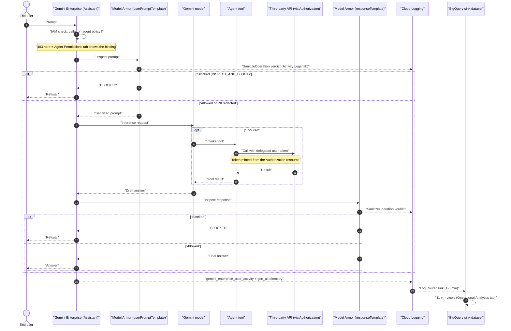
```mermaid
sequenceDiagram
    autonumber
    actor U as End user
    participant GE as "Gemini Enterprise (Assistant)"
    participant MAin as "Model Armor (userPromptTemplate)"
    participant M as "Gemini model"
    participant T as "Agent tool"
    participant TP as "Third-party API (via Authorization)"
    participant MAout as "Model Armor (responseTemplate)"
    participant CL as "Cloud Logging"
    participant BQ as "BigQuery sink dataset"

    U->>GE: Prompt
    GE->>GE: "IAM check: caller on agent policy?"
    Note over GE: "403 here = Agent Permissions tab shows the binding"
    GE->>MAin: "Inspect prompt"
    MAin-->>CL: "SanitizeOperation verdict (Activity Logs tab)"
    alt "Blocked (INSPECT_AND_BLOCK)"
        MAin-->>GE: "BLOCKED"
        GE-->>U: "Refusal"
    else "Allowed or PII redacted"
        MAin-->>GE: "Sanitized prompt"
        GE->>M: "Inference request"
        opt "Tool call"
            M->>T: "Invoke tool"
            T->>TP: "Call with delegated user token"
            Note over T,TP: "Token minted from the Authorization resource"
            TP-->>T: "Result"
            T-->>M: "Tool result"
        end
        M-->>GE: "Draft answer"
        GE->>MAout: "Inspect response"
        MAout-->>CL: "SanitizeOperation verdict"
        alt "Blocked"
            MAout-->>GE: "BLOCKED"
            GE-->>U: "Refusal"
        else "Allowed"
            MAout-->>GE: "Final answer"
            GE-->>U: "Answer"
        end
    end
    GE-->>CL: "gemini_enterprise_user_activity + gen_ai telemetry"
    CL-->>BQ: "Log Router sink (1-3 min)"
    BQ-->>BQ: "11 v_* views (Operational Analytics tab)"
```

Read it as four control points:

1. **IAM on the agent** decides whether the request happens at all. Audited on **Agent Permissions**; changed in **GE Agent Manager**.
2. **Model Armor input filter** decides whether the prompt reaches the model. If Model Armor is unreachable, `failureMode` decides: `FAIL_CLOSED` refuses, `FAIL_OPEN` passes it through unfiltered.
3. **The Authorization** decides what the agent may reach on the user's behalf — the widest blast radius on the page, because the token is the *user's*.
4. **Model Armor output filter** is the last gate before the user sees anything.

Everything from steps 2–4 lands in Cloud Logging. Only what your **sink filter** captures reaches BigQuery, and only what you have **deployed views** for is readable on the Observability tab.

---

## Chapter troubleshooting index

| Error string (verbatim) | Tab | Cause | Fix |
|---|---|---|---|
| `Project ID/Number is required to list authorizations.` | Authorizations | No project | Set on **GE Agent Manager** |
| `No authorizations found for the provided project number.` | Authorizations | None in the selected region | Switch the **Region** dropdown |
| `Failed to load authorizations for region '<loc>': <msg>` | Authorizations | Region API off or 403 | Grant `discoveryengine.authorizations.list` |
| `Could not list collections for location '<loc>': <msg>` | Authorizations | Collection listing failed | Grant read on Discovery Engine |
| `Could not list engines for collection '<id>': <msg>` | Authorizations | Engine listing failed | Grant read on Discovery Engine |
| `Could not list assistants for app '<id>': <msg>` | Authorizations | Assistant listing failed | Grant read on Discovery Engine |
| `Could not list agents for assistant '<id>': <msg>` | Authorizations | Agent listing failed | Grant read on Discovery Engine |
| `Authorization with ID <id> not found in the current list.` | Authorizations | Stale row | **Refresh Authorizations** |
| `Failed to fetch authorization <id> for editing.` | Authorizations | GET failed | Check permission and region |
| `Failed to fetch details for authorization.` | Authorizations | GET failed from **View** | As above |
| `Authorization ID cannot be empty.` | Authorizations | Blank ID | Enter an ID |
| `Failed to save authorization.` | Authorizations | POST/PATCH failed | Read the API message; often 403 or `ALREADY_EXISTS` |
| `Failed to delete some authorizations:` + per-item list | Authorizations | Partial delete failure | Read each line |
| `Project ID must be set.` (cURL preview) | Authorizations | Project unset | Set the project |
| `# No changes detected. Modify the form to see the update command.` | Authorizations | Nothing differs | Informational — not an error |
| `No OAuth2 configuration found for this authorization.` | Authorizations | Resource has no `serverSideOauth2` | Created outside this app; inspect via API |
| `Project must be selected to list permissions.` | Agent Permissions | No project | Enter one |
| `Permissions Could Not Be Fully Retrieved` | Agent Permissions | One or more calls errored | Read the banner |
| `Could not fetch inherited project IAM policy: <msg>` | Agent Permissions | Missing `resourcemanager.projects.getIamPolicy` | `roles/iam.securityReviewer` |
| `Failed listing apps in location '<loc>': <msg>` | Agent Permissions | Engine listing failed | Ignore if the multi-region is unused |
| `Could not fetch IAM policy for agent '<name>': <msg>` | Agent Permissions | Missing `getIamPolicy` on the agent | `roles/discoveryengine.admin` |
| `No agent permissions found.` | Agent Permissions | Genuinely empty (no banner) | Confirm agents exist |
| `Cannot update policy: ETag is missing. Please fetch the policy again.` | GE Agent Manager (write path) | No etag on the fetched policy | Reload the agent and reopen the modal |
| `Project ID is required to fetch logs.` | Model Armor | No project | Set it |
| `Failed to fetch violation logs.` | Model Armor | Logging API off / missing permission | Enable API; `roles/logging.viewer` |
| `Set a Project ID before creating a template.` | Model Armor | Placeholder project | Set a real one |
| `Template ID is required.` | Model Armor | Blank ID | Enter one |
| `Failed to create the Model Armor template.` | Model Armor | 403 or `ALREADY_EXISTS` | `roles/modelarmor.editor`; or use a new ID |
| `Select a target app first.` | Model Armor | No app chosen | Pick one |
| `Cannot attach: this app's assistant configuration could not be read (...)` | Model Armor | Assistant read failed | Fix permission or use the copy command |
| `Cannot attach: this app reports no assistants, so there is nothing to attach the template to.` | Model Armor | No assistant | Create one |
| `Failed to attach the template to this app.` | Model Armor | PATCH failed | `discoveryengine.assistants.update` |
| `The API accepted the update but its response does not show this template attached. Treat this app as unprotected and re-check with "Refresh List".` | Model Armor | Read-back mismatch | Treat as unprotected; investigate |
| `The API accepted the request but returned no template name. Use "Refresh List" above to confirm it exists.` | Model Armor | No name echoed | **Refresh List** |
| `Failed to fetch policies and associations.` | Model Armor | Template list or engine scan failed | Check Model Armor + Discovery Engine permissions |
| `Could not list apps in "<loc>": <msg>` | Model Armor | Engine listing failed | Ignore if unused |
| `Could not read assistant config for "<app>" (<loc>): <msg>` | Model Armor | Assistant read failed — status becomes `Unknown` | Do **not** read `Unknown` as protected |
| `No BigQuery log sinks found.` | Observability | No BigQuery sink | Create one in Log Router |
| `Failed to fetch BigQuery tables: <msg>` | Observability | Dataset access | `roles/bigquery.metadataViewer` |
| `No tables found or unable to list.` | Observability | Empty dataset | Wait for logs |
| `BigQuery query timed out after multiple polling attempts.` | Observability | >45s | Reduce **Time Range**; partition tables |
| `BigQuery reported the query as incomplete but returned no job reference to poll.` | Observability | Malformed response | Retry |
| `BigQuery query failed` / `BigQuery polling failed` | Observability | Query error | Read the nested API message |
| `Failed to create view: <msg>` | Observability | No write access, or missing source table | `roles/bigquery.dataEditor`; check `_AllLogs` |
| `Failed to repair views: <msg>` | Observability | Bulk DDL failed | Repair views one at a time |
| `Failed to drop view: <msg>` | Observability | No delete permission | `roles/bigquery.dataEditor` |
| `Failed to refresh BigQuery tables: <msg>` (toast) | Observability | Table list failed | Check dataset permissions |
| `No BigQuery dataset identified from log sinks. Showing offline mock analytics.` | Observability | No sink selected | Create/select a BigQuery sink — **numbers shown are fake** |
| `Views labeled MOCK display simulated data until created in this dataset.` | Observability | Views not deployed | Deploy them before reporting anything |


---

# Chapter 4 — System: Backup & Recovery, App Config Audit, and Licenses

**Who this chapter is for** — Administrators who have to move a Gemini Enterprise app between
projects, prove that two environments match before a cutover, or control who holds a paid seat.

**What you'll be able to do**

- Export your Gemini Enterprise configuration to a Cloud Storage bucket, and restore it into another project.
- Know precisely which resources are captured by a backup — and which are silently left behind.
- Run a read-only parity audit between a source and a destination app, and export it as a report.
- See every user who holds a licence, find the ones who never sign in, and reclaim those seats.
- Deploy an automated, scheduled licence pruner into your own project.

**Before you start**

| Requirement | Detail |
|---|---|
| Signed in | You must be signed in with Google. The app requests the `https://www.googleapis.com/auth/cloud-platform`, `.../auth/userinfo.profile` and `.../auth/userinfo.email` scopes — see [App.tsx](file:///usr/local/google/home/wdufrin/Documents/Code/Gemini-Enterprise-Manager/App.tsx#L296-L301). |
| Core IAM roles | `roles/discoveryengine.admin` on **both** the source and the target project. Backup/restore and licences all fail without it. |
| Storage roles | `roles/storage.admin` (or `objectAdmin` + `buckets.list`) on the project that owns the backup bucket. The bucket dropdown is populated by listing buckets. |
| Agent Engine restore | `roles/aiplatform.user` on the target project. |
| Auto-pruner deploy | `roles/cloudbuild.builds.editor` plus the ability to grant roles to the Cloud Build service account. See [Appendix B](#appendix-b--complete-iam--api-prerequisites-matrix). |
| Enabled APIs | At minimum `discoveryengine`, `storage`, `aiplatform`, `cloudresourcemanager`, `serviceusage`. The full 13-API list is in [Appendix B](#appendix-b--complete-iam--api-prerequisites-matrix). |
| A GCS bucket | Backups are written to a bucket **you already own**. The app never creates one for you. |

> [!IMPORTANT]
> Everything in this chapter operates on **live production resources**. Backup and the Config
> Audit are safe. Restore and the Licenses tab are not — both can destroy or duplicate data.
> Read the **Known limitations & gotchas** section of a tab before you use it for the first time.

---

## At a glance

The three **System** tabs are the lifecycle tools. You typically use them in this order when
promoting an app from a dev project to production:

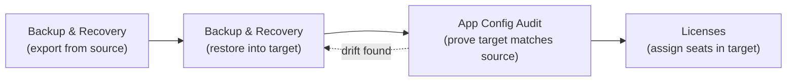
```mermaid
flowchart LR
  A["Backup & Recovery<br/>(export from source)"] --> B["Backup & Recovery<br/>(restore into target)"]
  B --> C["App Config Audit<br/>(prove target matches source)"]
  C --> D["Licenses<br/>(assign seats in target)"]
  C -. "drift found" .-> B
```

| Tab | Mutates anything? | What it touches |
|---|---|---|
| **Backup & Recovery** | Yes — restore and delete are destructive | Discovery Engine, Vertex AI Agent Engines, NotebookLM, Cloud Storage |
| **App Config Audit** | **No.** Read-only by design | Discovery Engine, Agent Registry, licence counts |
| **Licenses** | Yes — revoke and delete are destructive | Discovery Engine user stores, Cloud Billing, Cloud Run, Cloud Build |

---

## Backup & Recovery

### What it's for

This tab copies your Gemini Enterprise configuration out of one Google Cloud project and into a
JSON file in a Cloud Storage bucket, and copies it back in again — into the same project or a
different one. It is how you clone a working app into a new environment, and how you keep a
recoverable snapshot before a risky change.

It is a **configuration** backup, not a data backup. It captures the definitions of your engines,
assistants, agents, data store settings and authorizations. It does not capture the documents you
have indexed.

### The screen, explained

The page is laid out in three bands — see [BackupPage.tsx](file:///usr/local/google/home/wdufrin/Documents/Code/Gemini-Enterprise-Manager/pages/BackupPage.tsx).

1. **Configuration header** (top) — where you tell the tool which project, location, app, Agent
   Engine and bucket to work against. Every card below inherits these values.
2. **Metadata Scope Notice** — a standing banner reminding you that backups capture configuration
   metadata, not indexed content. It is not dismissible.
3. **Eight backup/restore cards** — one per resource family. Each card has a **Backup** button on
   the left and a restore row on the right.
4. **Log console** — appended to live during any operation. It is wiped at the start of every new
   operation.

Every card is built from the same component, [BackupRestoreCard.tsx](file:///usr/local/google/home/wdufrin/Documents/Code/Gemini-Enterprise-Manager/components/backup/BackupRestoreCard.tsx), so the controls are identical:

| Control | Behaviour |
|---|---|
| **Backup** | Runs the export. Label changes to **Backing up to GCS...** while it runs. |
| **-- Select Backup File --** | Dropdown of existing backup files in the bucket, filtered to this card's resource type. |
| **Restore** | Enabled only once a file is selected. Opens a confirmation modal. |
| **Download** | Downloads the selected JSON to your computer. |
| **Delete** | Permanently deletes the selected file from the bucket. Opens a confirmation modal. |
| ⓘ | Shows the equivalent REST/cURL commands. Tooltip is `Show backup API command` / `Show restore API command`. |

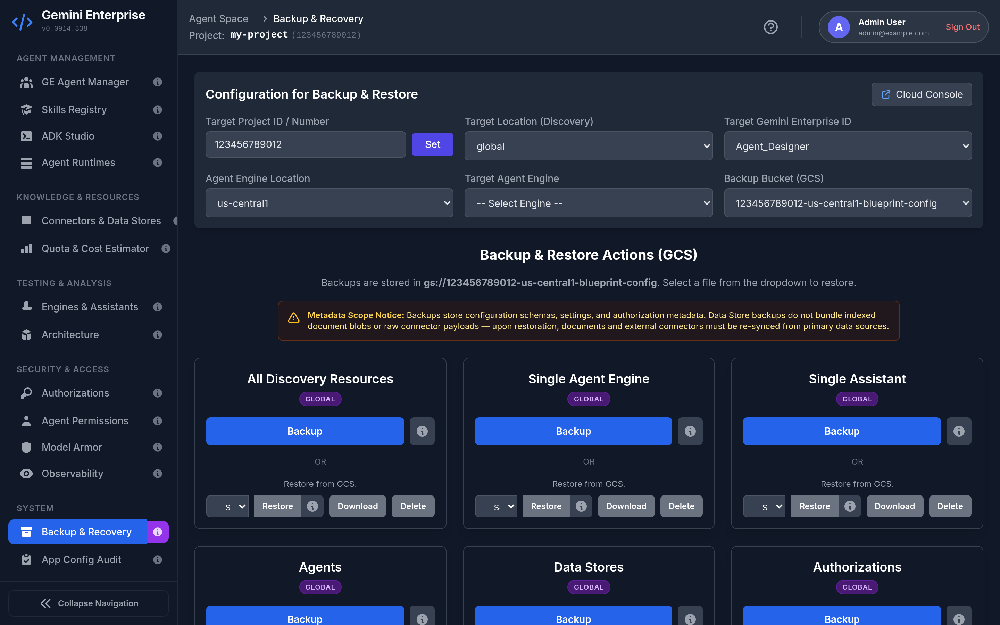

### What is actually backed up

There are exactly eight cards, declared at [BackupPage.tsx#L46-L111](file:///usr/local/google/home/wdufrin/Documents/Code/Gemini-Enterprise-Manager/pages/BackupPage.tsx#L46-L111). This table is the honest inventory — it was read out of [backupOperations.ts](file:///usr/local/google/home/wdufrin/Documents/Code/Gemini-Enterprise-Manager/services/backup/backupOperations.ts), not from any older documentation.

| Card | Scope | What the export really contains | GCS filename prefix |
|---|---|---|---|
| **All Discovery Resources** | Global | Collections filtered to `/default_collection`, the engines inside them, and assistants filtered to `/default_assistant`. **Nothing else.** | `agentspace-discovery-backup` |
| **Single Agent Engine** | Global | One Vertex AI Reasoning (Agent) Engine definition, from the **Agent Engine Location** you selected. | contains `-reasoning-engine-` |
| **Single Assistant** | Global | The `default_assistant` object plus the agents attached to it, plus each agent's IAM policy. | contains `-assistant-` |
| **Agents** | Global | The agent definitions attached to the assistant, plus their IAM policies. | contains `-agents-` |
| **Data Stores** | Global | Data store **configuration objects only** — name, industry vertical, solution types, content config. **Not the indexed documents.** | `agentspace-data-stores-backup` |
| **Authorizations** | Global | Authorization resources (OAuth connections). Client **secrets are not returned by the API** and are not in the file. | `agentspace-authorizations-backup` |
| **NotebookLMs** | User Specific | Notebooks belonging to the signed-in user. | `agentspace-notebooklm-backup` |
| **Chat History** | User Specific | Sessions and their turns for the signed-in user. | `agentspace-chat-history-backup` |

> [!WARNING]
> **"All Discovery Resources" is not a complete snapshot.** Despite the name, it contains only
> collections, engines and assistants — see [backupOperations.ts#L58-L133](file:///usr/local/google/home/wdufrin/Documents/Code/Gemini-Enterprise-Manager/services/backup/backupOperations.ts#L58-L133). To capture an app fully you must run the
> **Agents**, **Data Stores** and **Authorizations** cards as well. Earlier documentation claimed
> this one card covered all six — it does not.

### What is NOT backed up

Be explicit with yourself about this list before you rely on a backup for disaster recovery.

- **Indexed documents and their content.** Data store *settings* are saved; the corpus is not.
- **OAuth client secrets** on authorizations. The API never returns them, so the restore side
  prompts you to re-enter them.
- **Licence assignments.** Who holds a seat is not part of any backup. Use the Licenses tab's
  **Export Data** button separately.
- **IAM policy of the project itself.** Only per-agent IAM policies are captured.
- **Model Armor templates, Observability config, Quota settings, Cloud Run services.**
- **Other users' notebooks and chat history.** The last two cards are scoped to *you*, the signed-in
  user, which is why they are labelled `User Specific`.
- **Anything in an Agent Engine location other than the one selected** — only `us-central1`,
  `europe-west1` and `asia-east1` are offered.

### How to: back up a resource type

1. Fill in the **Configuration header** — at minimum **Target Project ID**, **Target Project
   Number**, **Target Location (Discovery)** and **Target Gemini Enterprise ID**.
2. Choose a **Backup Bucket (GCS)** from the dropdown. If the dropdown is empty, see
   [Troubleshooting](#troubleshooting-2) below.
3. Find the card for the resources you want, and click **Backup**.
4. Watch the log console. Each step is appended as it completes.

**Expected result:** a line in the log confirming the upload, and a new file in your bucket named
`<prefix>-<timestamp>.json` — for example `agentspace-discovery-backup-2025-03-14T09-12-04-517Z.json`.
The file appears in that card's **-- Select Backup File --** dropdown after the next refresh.

<details>
<summary>Under the hood — the API calls this makes</summary>

The exports are ordinary Discovery Engine `list`/`get` calls, assembled client-side and then
uploaded. For example **All Discovery Resources** calls, in order:

```
GET  https://discoveryengine.googleapis.com/v1alpha/projects/{project}/locations/{loc}/collections
GET  https://discoveryengine.googleapis.com/v1beta/{collection}/engines
GET  https://discoveryengine.googleapis.com/v1alpha/{engine}/assistants
```

Collections are then filtered client-side to those ending in `/default_collection`, and assistants
to those ending in `/default_assistant`.

The upload is a direct, un-retried `fetch` to the GCS JSON upload endpoint —
[uploadFileToGcs](file:///usr/local/google/home/wdufrin/Documents/Code/Gemini-Enterprise-Manager/services/api/cloudStorage.ts):

```
POST https://storage.googleapis.com/upload/storage/v1/b/{bucket}/o?uploadType=media&name={file}
Content-Type: application/json
Authorization: Bearer <token>
```

Every backup file is wrapped with three metadata fields — `type`, `createdAt` and `sourceConfig` —
which is how the restore side knows what it is looking at.
</details>

### How to: restore a backup into a project

> [!CAUTION]
> Restore writes into whatever project is in the **Target Project ID** field — which may not be the
> project the backup came from. Read the confirmation modal. It names the destination project and
> makes you type that project ID to proceed.

1. Set the **Configuration header** to the **destination**. This is the single most common mistake:
   the header is the *target*, not the source.
2. On the relevant card, pick a file from **-- Select Backup File --**.
3. Click **Restore**.
4. A confirmation modal lists the consequences. Type the **target project ID** exactly into the
   confirmation box.
5. Click **Restore into `<project>`**.
6. Watch the log console for the per-resource results.

**Expected result:** a summary line of the form `restored=12, skipped=3, failed=0`. A red banner
appears if anything failed.

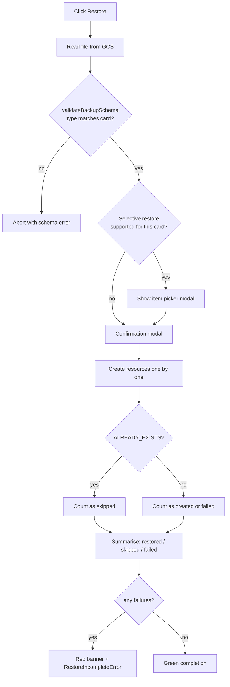
```mermaid
flowchart TD
  A["Click Restore"] --> B["Read file from GCS"]
  B --> C{"validateBackupSchema<br/>type matches card?"}
  C -- "no" --> X["Abort with schema error"]
  C -- "yes" --> D{"Selective restore<br/>supported for this card?"}
  D -- "yes" --> E["Show item picker modal"]
  D -- "no" --> F["Confirmation modal"]
  E --> F
  F --> G["Create resources one by one"]
  G --> H{"ALREADY_EXISTS?"}
  H -- "yes" --> I["Count as skipped"]
  H -- "no" --> J["Count as created or failed"]
  I --> K["Summarise: restored / skipped / failed"]
  J --> K
  K --> L{"any failures?"}
  L -- "yes" --> M["Red banner + RestoreIncompleteError"]
  L -- "no" --> N["Green completion"]
```

> [!NOTE]
> The schema check runs on **restore**, not on backup. A malformed or mismatched file is caught at
> the moment you try to use it — see [useBackupOperations.ts#L643-L700](file:///usr/local/google/home/wdufrin/Documents/Code/Gemini-Enterprise-Manager/hooks/useBackupOperations.ts#L643-L700).

### How to: restore only some items (selective restore)

Some cards open an item picker before the confirmation modal, letting you cherry-pick.

1. Select the backup file and click **Restore**.
2. The **Restore Selection** modal appears — *"Select the items you wish to restore from the backup
   file."*
3. Tick the items you want, or use **Select All** / **Deselect All**.
   Items that cannot be restored are greyed out with a red reason next to them.
4. Click **Restore N Item(s)**.
5. Complete the confirmation modal as above.

**Expected result:** only the ticked items are attempted; the rest are absent from the outcome
summary entirely (they are not counted as "skipped").

### How to: download or delete a backup file

- **Download** — select a file, click **Download**. The JSON is saved by your browser.
- **Delete** — select a file, click **Delete**, then type the **exact filename** into the
  confirmation box. This is permanent; there is no undo and no trash.

> [!CAUTION]
> Delete removes the object from Cloud Storage immediately. If your bucket does not have object
> versioning enabled, the backup is gone. Consider enabling versioning on your backup bucket.

### Field reference

Fields are defined in [BackupConfigHeader.tsx#L66-L178](file:///usr/local/google/home/wdufrin/Documents/Code/Gemini-Enterprise-Manager/components/backup/BackupConfigHeader.tsx#L66-L178).

| Field | What to enter | Required | Notes / Default |
|---|---|---|---|
| **Target Project ID** | The destination project's ID, e.g. `my-ge-prod`. | Yes | Also used as the typed confirmation keyword on restore. |
| **Target Project Number** | The destination project's numeric ID. | Yes | Used to build resource paths and the `X-Goog-User-Project` header. |
| **Target Location (Discovery)** | Where the Gemini Enterprise app lives. | Yes | Dropdown: `global`, `us`, `eu`. Default `global`. |
| **Target Gemini Enterprise ID** | The app (engine) ID in the destination. | Yes | |
| **Agent Engine Location** | Vertex AI region for Agent Engines. | Only for the Agent Engine card | Dropdown: `us-central1`, `europe-west1`, `asia-east1`. **No other region is selectable.** |
| **Target Agent Engine** | Which Agent Engine to back up or restore into. | Only for the Agent Engine card | Populated by listing engines in the chosen region. |
| **Backup Bucket (GCS)** | The bucket that holds backup files. | Yes | Dropdown, populated by listing buckets in the project. Files are written at the bucket **root**, not in a folder. |

> [!NOTE]
> The collection and assistant IDs are **not** editable in the UI. They are hardcoded to
> `default_collection` and `default_assistant` — [useBackupOperations.ts#L100-L107](file:///usr/local/google/home/wdufrin/Documents/Code/Gemini-Enterprise-Manager/hooks/useBackupOperations.ts#L100-L107). Non-default collections
> and assistants are invisible to this tab.

### Known limitations & gotchas

Every item here was verified in source. None of them are hypothetical.

1. **Restoring Agents always creates new agents.** There is no update path. Run the same agents
   restore twice and you get two copies of every agent, with new IDs. The same is true for
   **NotebookLMs** and **Agent Engines**. Only collections, engines, data stores and authorizations
   treat `ALREADY_EXISTS` as a benign skip.
2. **The "Single Assistant" card's restore only restores its agents.** The assistant object itself
   (its `displayName` and `generationConfig`) is written only via the **All Discovery Resources**
   path — [useBackupOperations.ts#L380-L410](file:///usr/local/google/home/wdufrin/Documents/Code/Gemini-Enterprise-Manager/hooks/useBackupOperations.ts#L380-L410).
3. **Cross-project name rewriting is partial.** Only authorization resource names and the ADK
   agent's `provisionedReasoningEngine.reasoningEngine` reference are rewritten to the new project
   — [restoreOperations.ts#L109-L145](file:///usr/local/google/home/wdufrin/Documents/Code/Gemini-Enterprise-Manager/services/backup/restoreOperations.ts#L109-L145). Everything else keeps its original ID. If a resource ID
   embeds the old project, it will carry over.
4. **The backup file dropdown does not paginate.** The listing call fetches one page, and GCS caps
   a page at 1000 objects. In a long-lived bucket, older backups become invisible in the UI (they
   are still in the bucket — use the Cloud Console).
5. **A failed Agents restore can look silent.** Because the Agents card's handler discards its
   outcome object ([useBackupOperations.ts#L560-L562](file:///usr/local/google/home/wdufrin/Documents/Code/Gemini-Enterprise-Manager/hooks/useBackupOperations.ts#L560-L562)), a restore in which every agent failed still ends
   with the neutral log line `Restore process for Agents finished.` and **no red banner**. Always
   read the individual log lines for this card; do not trust the absence of a banner.
6. **Chat History backup degrades quietly.** If a session's turns cannot be fetched, a summary stub
   is written in its place with no log line.
7. **Download bypasses automatic re-authentication.** If your token expired, **Download** fails with
   a bare `Failed to download object: 401` instead of showing the **Session Expired** prompt.
   Refresh the page and sign in again.
8. **Logs are cleared at the start of every operation** and are never persisted. Copy anything you
   need before starting the next action.
9. **The ⓘ button on "Single Agent Engine" has no content.** It shows
   `No specific API command examples are available for "Backup - ReasoningEngine".` The examples were
   registered under a different key. Harmless, but not a bug in your setup.
10. **Long operations have hard timeouts.** Engine operations poll for 300 s; Agent Engine restores
    poll for 600 s. Exceeding that produces a timeout error even if the server-side operation
    eventually succeeds.

### Troubleshooting

| Symptom / exact error text | Cause | Fix |
|---|---|---|
| **Backup Bucket (GCS)** dropdown is empty | The bucket listing call failed; the error is logged to the browser console only. | Confirm `storage.googleapis.com` is enabled and you hold `storage.buckets.list` on the project. Open DevTools → Console for the real error. |
| Backup file dropdown is empty although files exist | Either the filename prefix does not match that card, or you are past the first 1000 objects in the bucket. | Check the object name matches the prefix in the table above. Clean out old backups or use a dedicated bucket. |
| `Invalid backup file: expected type "<X>" but found "<Y>"` | You selected a file produced by a different card. | Pick the file whose prefix matches the card. |
| `Restore of <section> did not complete: N of M resource(s) failed. <detail>` | Some resources could not be created in the target. | Read the per-resource lines in the log. Usually missing IAM in the target, or a referenced resource (data store, authorization) that does not exist there yet. |
| `<Resource> operation timed out after 300s` | The Discovery Engine long-running operation did not finish in the poll budget. | Check the operation in Cloud Console; it may have completed. Re-run only if it genuinely failed — re-running agents creates duplicates. |
| `Agent Engine restore timed out after 600s` | Vertex AI Agent Engine creation is slow or stuck. | Verify in Vertex AI Console before retrying. |
| `Lost contact with the Agent Engine restore operation after N consecutive polling failures` | Five consecutive poll requests failed (network or permission). | Check `aiplatform.googleapis.com` access and network stability. |
| `GCS Upload Failed: 403 - ...` | No write permission on the bucket. | Grant `roles/storage.objectAdmin` on the bucket. |
| `Failed to download object: 401` | Expired token on the raw download path. | Reload the page and sign in again. |
| Restore succeeded but the agent does not work in the target | A referenced authorization or data store was not restored, or the client secret is missing. | Restore **Authorizations** and **Data Stores** first, then re-enter OAuth client secrets. |

---

## App Config Audit

### What it's for

This tab compares two Gemini Enterprise apps — a source and a destination — and tells you, setting
by setting, where they differ. It is the pre-cutover checklist: you run it after a restore to prove
the new environment actually matches the old one.

It changes nothing. The page advertises this with two badges, **Read-Only Parity Check** and
**Zero Mutations**, and the code contains no write calls on this path.

### The screen, explained

The page heading is **App Configuration Audit** (the sidebar label is the shorter
`App Config Audit`) — [ConfigAuditPage.tsx](file:///usr/local/google/home/wdufrin/Documents/Code/Gemini-Enterprise-Manager/pages/ConfigAuditPage.tsx).

1. **Two selector panels**, side by side — Source on the left, Destination on the right. Each is a
   **Project ID or Number** field, a **Region Location** dropdown, and a **Gemini Enterprise App ID**
   field with an `Enter manually` / `Select from list` toggle.
2. **Action bar** — the **Run Parity Audit** button and the two export buttons.
3. **Progress indicator** — a labelled bar that steps through the five pillars.
4. **Summary card** — an overall score out of 100 with a verdict and a coloured dot.
5. **Filter toolbar** — a status dropdown offering `All Statuses`,
   `Differences Only (⚠️ / ❌)` and `Matches Only (✅)`.
6. **Comparison table** — columns `Pillar`, `Asset / Component`, `Source Setting`,
   `Destination Setting`, `Status`, `Guidance / Remediation`.

````carousel
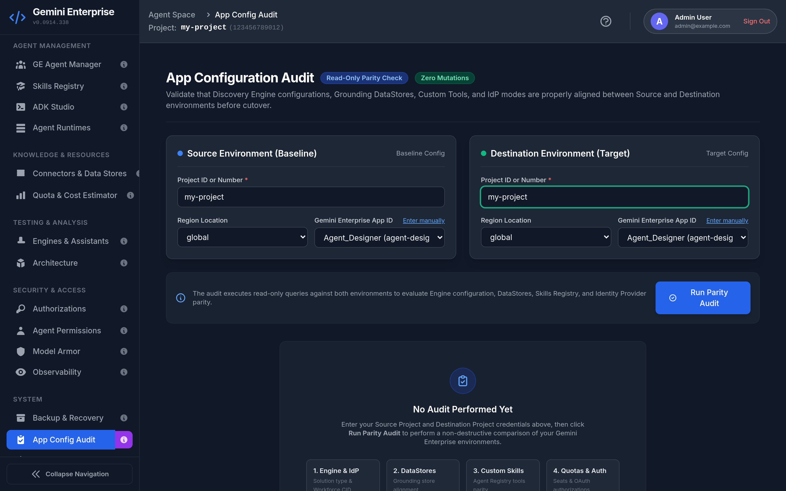
<!-- slide -->
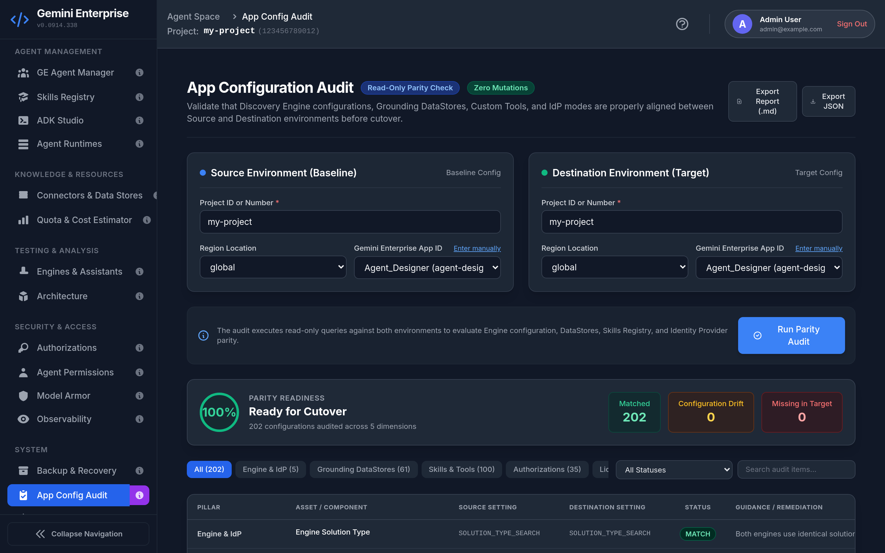
````

### What it checks — the complete rule catalogue

The audit runs five pillars in sequence. This table is the full set of checks, taken from
[configAuditService.ts](file:///usr/local/google/home/wdufrin/Documents/Code/Gemini-Enterprise-Manager/services/configAuditService.ts).

Status values are `MATCH` ✅, `DRIFT` ⚠️, `MISSING_IN_TARGET` ❌, `INFO` ℹ️ and `UNKNOWN` ⚪.

#### Pillar 1 — Engine & Identity Provider (progress 15%)

| Check (internal id) | What it compares | Severity if different | Why you should care | Remediation |
|---|---|---|---|---|
| `src-engine-inaccessible` | Whether the source app could be read at all | `UNKNOWN` | You cannot audit what you cannot see — the whole report is meaningless. | Fix read access on the source project first. |
| `tgt-engine-inaccessible` | Whether the destination app could be read | `UNKNOWN` | Same, for the destination. | Grant `roles/discoveryengine.viewer` or higher on the target. |
| `engine-solution-type` | The engine's solution type | `DRIFT` | A search app and an assistant app behave completely differently for end users. | Recreate the destination app with the matching solution type — it cannot be changed in place. |
| `engine-search-tier` | The configured search tier | `DRIFT` | The wrong tier silently changes result quality and your bill. | Update the tier on the destination engine. |
| `engine-idp-mode` | Identity provider mode (Google vs third-party / workforce federation) | `DRIFT` | Users may be unable to sign in at all, or see documents they should not. | Reconfigure the destination IdP to match. |
| `engine-widget-cid` | The widget config / client ID | `DRIFT` | An embedded widget on your intranet will point at the wrong app. | Re-issue or align the widget configuration. |
| `location-alignment` | Source region vs destination region | `DRIFT` | Data residency and latency; some features are region-limited. | Confirm the difference is intentional. |

#### Pillar 2 — Grounding Data Stores (progress 40%)

| Check | What it compares | Severity | Why you should care | Remediation |
|---|---|---|---|---|
| `src-datastores-error` / `tgt-datastores-error` | Whether the data store list could be fetched | `UNKNOWN` | Silence is not the same as "none". | Grant `discoveryengine.dataStores.list`. |
| `no-source-datastores` | Source has zero data stores | `INFO` | Nothing to ground against — the app will answer from the model only. | Informational. |
| `ds-<id>` (one row per source data store) | Presence of a matching data store in the destination | `MISSING_IN_TARGET` if absent, else `MATCH` | Missing grounding is the number-one cause of "the assistant got dumber after we migrated". | Restore or recreate the data store, then re-index it. |

#### Pillar 3 — Skills & Tools (progress 65%)

| Check | What it compares | Severity | Why you should care | Remediation |
|---|---|---|---|---|
| `src-skills-error` / `tgt-skills-error` | Whether the Agent Registry could be read | `UNKNOWN` | Skills may exist but be unreadable. | Enable `agentregistry.googleapis.com` and grant read access. |
| `no-source-skills` | Source has no registered skills | `INFO` | Nothing to compare. | Informational. |
| `skill-<id>` (one row per source skill) | Presence of the matching skill in the destination | `MISSING_IN_TARGET` if absent | Agents will fail at runtime when they try to call a tool that is not registered. | Register the skill in the destination registry. |

#### Pillar 4 — Authorizations (progress 80%)

| Check | What it compares | Severity | Why you should care | Remediation |
|---|---|---|---|---|
| `src-auths-error` / `tgt-auths-error` | Whether authorizations could be listed | `UNKNOWN` | Auth gaps are invisible until a user hits them. | Grant read on authorizations in both projects. |
| `auth-<id>` (one row per source authorization) | Presence of the matching authorization in the destination | `MISSING_IN_TARGET` if absent | Users get an OAuth consent failure mid-conversation. | Recreate the authorization and re-enter its client secret. |

#### Pillar 5 — Licenses & Quotas (progress 95%)

| Check | What it compares | Severity | Why you should care | Remediation |
|---|---|---|---|---|
| `license-stats-active` | Assigned-user counts, source vs destination | `INFO` | Nobody can use the new app until seats are assigned there. | Assign licences in the destination via the **Licenses** tab. |
| `license-stats-error` | Whether licence stats could be read | `UNKNOWN` | Count reads as zero when it is really "unknown". | Grant `discoveryengine.userStores.list`. |

> [!WARNING]
> The licence row frequently reports `0 Assigned Users` even when seats exist. The audit sums a
> response field that the licence API does not return under that name —
> [configAuditService.ts#L537-L544](file:///usr/local/google/home/wdufrin/Documents/Code/Gemini-Enterprise-Manager/services/configAuditService.ts#L537-L544) versus the declared shape in [licenses.ts#L162-L167](file:///usr/local/google/home/wdufrin/Documents/Code/Gemini-Enterprise-Manager/services/api/licenses.ts#L162-L167). Treat this
> row as decorative and confirm real numbers on the **Licenses** tab.

### How the score is calculated

```
score = max(0, 100 − 15 × (missing checks) − 5 × (drift checks))
```

If there were **zero** actionable checks — because everything came back `UNKNOWN` — the score is
`null` and the verdict is *"Unable to assess"*, not 100. That is deliberate: a permissions failure
must never look like a clean bill of health.

| Score | Verdict | Dot |
|---|---|---|
| 90–100 | Ready for Cutover | 🟢 |
| 70–89 | Minor Remediations Recommended | 🟡 |
| Below 70 | Blockers Detected in Target | 🔴 |
| `null` | Unable to assess | ⚪ |

### How to: run a parity audit

1. In the **Source** panel, enter the **Project ID or Number**, pick the **Region Location**, and set
   the **Gemini Enterprise App ID**. Use **Select from list** if you want to pick it from a dropdown
   rather than type it.
2. Repeat in the **Destination** panel.
3. Click **Run Parity Audit**.
4. Watch the progress bar move through Engine & IdP → Grounding DataStores → Skills & Tools →
   Authorizations → Licenses & Quotas.

**Expected result:** the summary card shows a score and verdict, and the comparison table fills with
one row per check.

> [!TIP]
> Set the status filter to `Differences Only (⚠️ / ❌)` immediately. On a real app the table is long,
> and only the differences need action.

<details>
<summary>Under the hood — the API calls this makes</summary>

The audit is pure `GET` traffic against Discovery Engine and the Agent Registry, run once per side:

```
GET https://{loc}-discoveryengine.googleapis.com/v1beta/projects/{p}/locations/{loc}/collections/default_collection/engines/{engineId}
GET .../v1beta/projects/{p}/locations/{loc}/collections/default_collection/dataStores?pageSize=100
GET .../v1alpha/projects/{p}/locations/{loc}/authorizations
GET https://discoveryengine.googleapis.com/v1/projects/{p}/locations/{loc}/userStores/{store}/userLicenses
GET https://agentregistry.googleapis.com/... (skills)
```

For `global`, the host is `https://discoveryengine.googleapis.com` with no region prefix.

Errors matching `401`, `403`, `PERMISSION_DENIED`, `UNAUTHENTICATED`, `forbidden` or
`insufficient scopes` are classified as **access failures** and become `UNKNOWN` rows rather than
`MISSING_IN_TARGET` — see [isAccessFailure](file:///usr/local/google/home/wdufrin/Documents/Code/Gemini-Enterprise-Manager/services/configAuditService.ts#L51-L62). This is why the audit never
falsely accuses a target of being empty when you simply lack permission.
</details>

### How to: export the audit report

With a completed audit on screen:

- Click the Markdown export to get `ge-config-audit-<source>-to-<target>.md`.
- Click the JSON export to get `ge-config-audit-<source>-to-<target>.json`.

The Markdown file has three sections, generated by
[generateAuditMarkdown](file:///usr/local/google/home/wdufrin/Documents/Code/Gemini-Enterprise-Manager/services/configAuditService.ts#L612-L705):

1. **Executive Summary** — a table with the score, verdict and counts.
2. **Granular Audit Matrix** — the full comparison table.
3. **Recommended Cutover Actions** — a bullet list of the remediations for every non-matching row.

The Markdown version is the one to attach to a change-management ticket. The JSON version is the one
to diff in CI.

### Field reference

| Field | What to enter | Required | Notes / Default |
|---|---|---|---|
| **Project ID or Number** | Either form is accepted. | Yes | One per side. |
| **Region Location** | The Discovery Engine location of that app. | Yes | Must match how the app was created; `global` is the common case. |
| **Gemini Enterprise App ID** | The engine ID. | Yes | Toggle between `Enter manually` and `Select from list`. The list shows `-- Select Gemini Enterprise App --` and `+ Enter Custom App ID...`. |

### Known limitations & gotchas

1. **Data stores are capped at 100 per side** and there is no pagination. If you have more, the
   report is incomplete but does not say so.
2. **Skills are not paginated either.** Same risk.
3. **Identity-provider detection is a substring match.** The code decides an engine uses workforce
   federation by testing whether the engine name contains `wif`. Any engine whose ID happens to
   contain those three letters is misclassified.
4. **The licence row is unreliable** — see the warning above.
5. **`UNKNOWN` rows do not lower the score, but they do not raise it either.** A report full of
   `UNKNOWN` yields *Unable to assess*. Fix permissions and re-run rather than shipping the report.
6. **Only `default_collection` is inspected.** Apps in a non-default collection are out of scope.
7. **The audit does not check Model Armor, Observability, or quota limits** despite "Quotas" in the
   pillar name — only licence counts are read.

### Troubleshooting

| Symptom / exact error text | Cause | Fix |
|---|---|---|
| Score shows *Unable to assess* ⚪ | Every check returned `UNKNOWN` — almost always missing read access on one or both sides. | Grant `roles/discoveryengine.viewer` on both projects and re-run. |
| Many rows show ⚪ **UNKNOWN** with a permission message | A 401/403 on that specific API. | Check which pillar; grant the corresponding read permission from [Appendix B](#appendix-b--complete-iam--api-prerequisites-matrix). |
| Everything shows ❌ **MISSING_IN_TARGET** | The destination app ID or region is wrong, so you are comparing against an empty/nonexistent app. | Re-check **Gemini Enterprise App ID** and **Region Location** on the destination side. |
| Licence row says `0 Assigned Users` | Known field-name defect in the audit. | Verify on the **Licenses** tab instead. |
| A data store you know exists is reported missing | Beyond the 100-item cap, or in a non-default collection. | Verify manually in the Console. |
| **Run Parity Audit** does nothing | A required field is empty. | Fill all three fields on both sides. |

---

## Licenses

### What it's for

This tab shows every user who holds a Gemini Enterprise seat in your project, lets you assign,
revoke or delete those seats in bulk, and helps you find seats that are being paid for but never
used. It also lets you deploy a scheduled job that does the cleanup automatically.

### Where the numbers come from

> [!IMPORTANT]
> The user list comes from the **Discovery Engine user store**, not from Cloud Identity and not from
> the Admin SDK. A person who exists in your Google Workspace directory but has never been granted
> a Gemini Enterprise licence will **not** appear here.

Reads go to:

```
GET https://discoveryengine.googleapis.com/v1/projects/{project}/locations/{loc}/userStores/{store}/userLicenses?pageSize=1000
```

Results are cached in your browser in IndexedDB (database `GeminiLicenseCache`, store
`user_licenses`), keyed by `"<projectNumber>:<userStoreId>"` —
[licenseCache.ts](file:///usr/local/google/home/wdufrin/Documents/Code/Gemini-Enterprise-Manager/services/licenseCache.ts).

**The cache lives for 15 minutes** (`DEFAULT_LICENSE_CACHE_TTL_MS = 15 * 60 * 1000`). Within that
window the page loads instantly from cache and shows a pill reading
`Cached (N users) • Synced HH:MM:SS` with a **Sync Now** link. After 15 minutes the cache is treated
as expired and a fresh fetch happens.

> [!WARNING]
> You can be looking at a list that is up to 15 minutes old. Before any destructive action, click
> **Sync Now** and confirm the timestamp updates. Acting on stale data is how the wrong person loses
> access.

### The screen, explained

Three tabs across the top:

| Tab | Purpose |
|---|---|
| **User Assignments** | The main per-user table and all bulk actions. |
| **Allocation Management (Billing Account)** | Total seats purchased against the billing account, and how many are consumed. |
| **Group License Assignments** | Manage licence assignment by Google Group, via a deployed Cloud Run service. |

On **User Assignments** the action row contains, left to right:
**Apply (N)** · **Refresh List** · **Export Data** · **Prune Inactive** · **Setup Auto-Pruner**,
preceded by the bulk-action dropdown.

The bulk-action dropdown offers:

- `Select Target License...` (disabled placeholder)
- `Revoke License`
- `Delete Users`
- `Apply: <displayName> (Exp: YYYY-MM-DD)` — one entry per licence configuration in the project

The table columns are: a selection checkbox, **User Principal**, **State**, **License Config**,
**License ID**, **Last Login**, **Actions**. Page size is 25 / 50 / 100 / 250, defaulting to 50.
Filters sit above the columns: a contains-match on principal, a **State** dropdown
(`All States` / `ASSIGNED` / `UNASSIGNED`), a contains-match on config, and a date filter with
`>`, `<` and `=` operators.

While a full fetch is running you see `Fetching from Google Cloud... N loaded`.

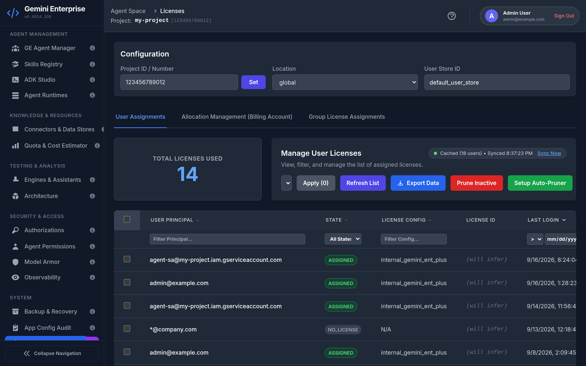

### What "revoke" and "delete" actually do

This distinction matters more than any other thing on this page.

| Action | API flag sent | Effect |
|---|---|---|
| **Revoke License** | `deleteUnassignedUserLicenses: false` | The seat is released. The **user record stays** in the user store, moving to state `UNASSIGNED`. Their history is retained. Reversible — re-assign the licence. |
| **Delete Users** | `deleteUnassignedUserLicenses: **true**` | The seat is released **and the unassigned user record is removed from the user store**. Not reversible from this UI. |

Both go to the same endpoint:

```
POST https://discoveryengine.googleapis.com/v1/projects/{p}/locations/{loc}/userStores/{store}:batchUpdateUserLicenses
```

> [!CAUTION]
> **Delete Users** is the destructive one. It removes the user record, not just the seat. The user
> loses access to Gemini Enterprise immediately and their per-user artifacts (such as the notebooks
> and chat history that the Backup tab describes as `User Specific`) may become unreachable.
> Test this against a non-production user store before you run it at scale.

### How to: assign, revoke or delete seats in bulk

1. Click **Refresh List** (or **Sync Now**) so you are acting on current data.
2. Use the filters to narrow the table — for example State = `UNASSIGNED`.
3. Tick the users you want to act on.
4. Choose the action from the dropdown:
   - `Apply: <licence name>` to grant that licence,
   - `Revoke License` to release the seat,
   - `Delete Users` to release the seat and remove the record.
5. Click **Apply (N)** — the number is the count of selected users.
6. For **Revoke** and **Delete** a confirmation modal appears. Type `REVOKE` or `DELETE`
   respectively, in **upper case**, exactly.
7. Confirm.

**Expected result:** a success toast, and the table updates to reflect the new state.

> [!WARNING]
> **Assigning** a licence has *no* confirmation step — [useLicenseManagement.ts#L478-L485](file:///usr/local/google/home/wdufrin/Documents/Code/Gemini-Enterprise-Manager/hooks/useLicenseManagement.ts#L478-L485).
> Selecting 500 users and choosing `Apply: <licence>` commits immediately when you click **Apply**.
> Check your selection count before clicking.

<details>
<summary>Under the hood — the API calls this makes</summary>

All three operations post to `:batchUpdateUserLicenses` in chunks of **100 users**:

```http
POST https://discoveryengine.googleapis.com/v1/projects/{p}/locations/{loc}/userStores/{store}:batchUpdateUserLicenses
Content-Type: application/json

{
  "inlineSource": {
    "userLicenses": [ { "userPrincipal": "user@example.com", "licenseConfig": "..." } ],
    "updateMask": "userPrincipal,licenseConfig"
  },
  "deleteUnassignedUserLicenses": false
}
```

- **Revoke** sends `deleteUnassignedUserLicenses: false` with the update mask shown.
- **Delete** sends `deleteUnassignedUserLicenses: true` with the same mask.
- **Assign** sends **no `updateMask` at all**. The source carries an explicit comment at
  [licenses.ts#L80](file:///usr/local/google/home/wdufrin/Documents/Code/Gemini-Enterprise-Manager/services/api/licenses.ts#L80): *"API limitation: updateMask breaks the reassignment
  payload, setting it to NO_LICENSE. Do not include it."* If you automate this yourself, reproduce
  that quirk or your assignments will silently no-op.

Each chunk returns a long-running operation, polled up to 45 times at 2-second intervals.
</details>

### How to: find and remove inactive seats (the pruner)

The **Prune Inactive** button opens a modal titled **Prune Inactive Licenses**, subtitled
*"Identify and revoke licenses with no recent user activity"* —
[PruneLicensesModal.tsx](file:///usr/local/google/home/wdufrin/Documents/Code/Gemini-Enterprise-Manager/components/license/PruneLicensesModal.tsx).

1. Click **Prune Inactive**.
2. Set **Inactive threshold (Days)**. Default is `30`; minimum is `1`.
3. Decide whether to tick **Include never-logged-in users**. Leave it off for a conservative first
   pass — a user provisioned yesterday has no login record.
4. The **Dry-Run Preview Result** panel updates live, showing the count and a three-column table of
   **Principal**, **Last Login** and **Assigned Date**.
5. *(Recommended)* Click **Export Inactive Users (CSV)**. You get
   `license_prune_dryrun_<days>days_<count>_users.csv` — keep it as your record of who was affected.
6. Type `PRUNE` in the confirmation box. This box is case-insensitive.
7. Click **Confirm Prune (N)**.

**Expected result:** the listed users are **revoked** (not deleted), and the affected rows disappear
from the table.

> [!NOTE]
> The dry-run preview is genuinely read-only — it is computed from the already-loaded list in your
> browser and issues no API calls. You can open the modal, explore thresholds and close it with
> total safety.

> [!WARNING]
> After the prune, the pruned users vanish from the table entirely rather than flipping to
> `UNASSIGNED` — [useLicenseManagement.ts#L436-L439](file:///usr/local/google/home/wdufrin/Documents/Code/Gemini-Enterprise-Manager/hooks/useLicenseManagement.ts#L436-L439). They are **not** deleted; the display is simply
> wrong. Click **Refresh List** and they reappear correctly as `UNASSIGNED`.

### How to: deploy the automated pruner

**Setup Auto-Pruner** does not prune anything itself. It generates a small containerised job and
deploys it into *your* project on a schedule — [usePrunerDeployment.ts](file:///usr/local/google/home/wdufrin/Documents/Code/Gemini-Enterprise-Manager/hooks/usePrunerDeployment.ts).

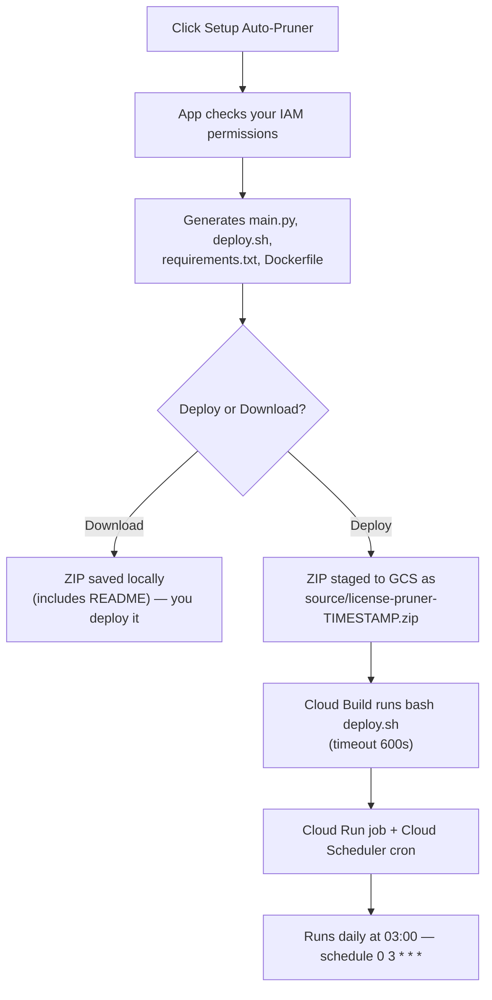
```mermaid
flowchart TD
  A["Click Setup Auto-Pruner"] --> B["App checks your IAM permissions"]
  B --> C["Generates main.py, deploy.sh,<br/>requirements.txt, Dockerfile"]
  C --> D{"Deploy or Download?"}
  D -- "Download" --> E["ZIP saved locally<br/>(includes README) — you deploy it"]
  D -- "Deploy" --> F["ZIP staged to GCS as<br/>source/license-pruner-TIMESTAMP.zip"]
  F --> G["Cloud Build runs bash deploy.sh<br/>(timeout 600s)"]
  G --> H["Cloud Run job + Cloud Scheduler cron"]
  H --> I["Runs daily at 03:00 — schedule 0 3 * * *"]
```

1. Click **Setup Auto-Pruner**.
2. Review the permission check. It verifies you hold `roles/discoveryengine.admin`,
   `roles/logging.logWriter` and `roles/serviceusage.serviceUsageConsumer`.
3. Choose **Download** to inspect the generated code first, or **Deploy** to submit it to Cloud Build.
4. If deploying, you may be prompted to grant roles to the Cloud Build service account
   `<projectNumber>@cloudbuild.gserviceaccount.com`.

**Expected result:** a Cloud Run job and a Cloud Scheduler entry in your project, running on the
cron schedule `0 3 * * *` (03:00 daily).

> [!CAUTION]
> Two things about this deployment deserve your full attention.
>
> 1. **The deployed pruner deletes; the in-app button revokes.** The generated `main.py` sends
>    `"deleteUnassignedUserLicenses": True` — [prunerTemplates.ts#L143](file:///usr/local/google/home/wdufrin/Documents/Code/Gemini-Enterprise-Manager/components/license/pruner/prunerTemplates.ts#L143). The scheduled job is
>    therefore **more destructive** than the manual **Prune Inactive** button, running unattended
>    every night. Download and read the generated code before you deploy it.
> 2. **The grant block is broad.** It asks for `roles/resourcemanager.projectIamAdmin`,
>    `roles/iam.serviceAccountAdmin`, `roles/run.admin`, `roles/cloudscheduler.admin`,
>    `roles/iam.serviceAccountUser` and `roles/serviceusage.serviceUsageConsumer` on the Cloud Build
>    service account — [usePrunerDeployment.ts#L268-L295](file:///usr/local/google/home/wdufrin/Documents/Code/Gemini-Enterprise-Manager/hooks/usePrunerDeployment.ts#L268-L295). `projectIamAdmin` plus
>    `serviceAccountAdmin` on a build service account is effectively project-admin. Grant it for the
>    deployment, then remove it.

### Allocation Management (Billing Account)

This tab reads seat allocation from the **billing account**, not the project. If your account has
many projects on one billing account, the totals here span all of them while the **User
Assignments** tab shows only the current project. A mismatch between the two is normal and not a
defect.

Reading it requires billing-account-level permission (`roles/billing.viewer` on the *billing
account*, which is a separate IAM surface from the project). Without it the tab is empty and the
failure is logged to the browser console only.

### Group License Assignments

Assigns licences by Google Group rather than one user at a time, by deploying a helper Cloud Run
service. You can trigger a run on demand; the resulting toast reports the message the service
returned.

> [!WARNING]
> The region for this service is hardcoded to `us-central1` —
> [useGroupLicensing.ts#L54](file:///usr/local/google/home/wdufrin/Documents/Code/Gemini-Enterprise-Manager/hooks/useGroupLicensing.ts#L54). A service you deployed in any other region is invisible
> here and cannot be managed from this tab.

Deleting a group service requires typing the **service name** into the confirmation box, exactly,
including case.

### Field reference

| Field / control | What to enter | Required | Notes / Default |
|---|---|---|---|
| **User Principal** filter | Any substring of an email. | No | Contains-match, not exact. |
| **State** filter | `All States`, `ASSIGNED`, `UNASSIGNED` | No | Default `All States`. |
| **License Config** filter | Any substring of the config name. | No | Contains-match. |
| Date filter | A date plus `>`, `<` or `=`. | No | Applies to **Last Login**. |
| Page size | 25 / 50 / 100 / 250 | No | Default `50`. |
| Bulk action dropdown | One of the actions listed above. | Yes, to enable **Apply** | Starts on the disabled `Select Target License...`. |
| **Inactive threshold (Days)** | Whole number of days. | Yes | Default `30`, minimum `1`. |
| **Include never-logged-in users** | Checkbox. | No | Off by default. |
| Prune confirmation | `PRUNE` | Yes | **Case-insensitive** — input is trimmed and upper-cased. |
| Revoke / Delete confirmation | `REVOKE` / `DELETE` | Yes | **Case-sensitive** — the generic destructive modal compares exactly. |

> [!NOTE]
> Yes, those two confirmation boxes behave differently. The prune modal accepts `prune`; the bulk
> revoke/delete modal does not accept `revoke`. Type in upper case everywhere and you will never hit
> it — [DestructiveConfirmModal.tsx#L90](file:///usr/local/google/home/wdufrin/Documents/Code/Gemini-Enterprise-Manager/components/common/DestructiveConfirmModal.tsx#L90).

### Known limitations & gotchas

1. **15-minute cache.** The list you see may be stale. Always **Sync Now** before acting.
2. **Assign has no confirmation.** Only revoke and delete are gated.
3. **Bulk operations are not transactional.** They run in chunks of 100. If chunk 4 of 10 fails, the
   first three are already committed. On failure the on-screen list is not updated at all, so the UI
   shows the *pre-action* state even though part of the action succeeded. **Refresh List** to see
   the truth.
4. **Post-prune display is wrong** until you refresh (see the warning above).
5. **The scheduled pruner deletes rather than revokes** (see the caution above).
6. **The licence list is fetched with `pageSize=1000`.** Very large user stores may require multiple
   fetches; watch the `Fetching from Google Cloud... N loaded` counter settle before acting.
7. **Group licensing is `us-central1`-only.**
8. **Several dropdowns fail silently.** Licence configs, billing accounts, and the billing
   permission probe all log to the browser console and leave the control empty rather than showing
   an error.
9. **`deleteUnassignedUserLicenses` is interpreted server-side.** The app sends the flag; the scope
   of what gets deleted is decided by the Discovery Engine service, not by the app.

### Troubleshooting

| Symptom / exact error text | Cause | Fix |
|---|---|---|
| User list is empty but you know seats exist | Wrong project number, wrong location, or wrong user store ID. | Verify the project and location selectors. Remember this reads the Discovery Engine user store, not Cloud Identity. |
| A recently changed user shows the old state | 15-minute IndexedDB cache. | Click **Sync Now**, or **Refresh List**. |
| **Apply (N)** is greyed out | No users selected, or the action dropdown is still on `Select Target License...`. | Tick at least one row and choose an action. |
| Confirmation button stays disabled | Keyword mismatch. The bulk modal is case-sensitive. | Type `REVOKE` / `DELETE` / `PRUNE` in capitals. |
| `PERMISSION_DENIED` on a licence update | Missing `roles/discoveryengine.admin`. | Grant it on the project that owns the user store. |
| Licence assignment appears to succeed but the user still has no access | Known API quirk — assign must be sent **without** an update mask. If you are scripting this yourself, that is your bug. | Use the UI, or drop `updateMask` from your payload. |
| Allocation tab is blank | No billing-account-level permission. | Grant `roles/billing.viewer` on the **billing account**, not the project. |
| Auto-pruner deployment fails in Cloud Build | The Cloud Build service account lacks the roles listed above. | Accept the in-app grant prompt, or grant them manually, then re-run. |
| Group service you deployed is not listed | It is not in `us-central1`. | Redeploy to `us-central1` or manage it from the Cloud Run console. |
| Pruned users reappear after refresh as `UNASSIGNED` | Correct behaviour — prune revokes, it does not delete. | None. Use **Delete Users** if you truly want the records gone. |

---

## Chapter troubleshooting index

Every error string the three System tabs can surface, with cause and fix.

| Error text (verbatim) | Surfaced by | Cause | Fix |
|---|---|---|---|
| `Invalid backup file: expected type "<X>" but found "<Y>"` | Backup restore | File/card mismatch. | Select a file whose prefix matches the card. |
| `Restore of <section> did not complete: N of M resource(s) failed. <detail>` | Backup restore | Partial failure. | Read the log lines; usually target IAM or a missing dependency. |
| `<Resource> operation timed out after 300s` | Backup restore | Discovery Engine LRO exceeded the 60 × 5 s poll budget. | Check the operation in Console before retrying. |
| `Agent Engine restore timed out after 600s` | Backup restore | Vertex AI LRO exceeded the 60 × 10 s budget. | Check Vertex AI Console before retrying. |
| `Lost contact with the Agent Engine restore operation after N consecutive polling failures` | Backup restore | 5 consecutive poll errors. | Check network and `aiplatform` access. |
| `GCS Upload Failed: <status> - <body>` | Backup | Raw upload path failed. | 403 → grant `storage.objects.create`; 404 → bucket does not exist. |
| `Failed to download object: <status> - <body>` | Backup download | Raw download path failed. | 401 → reload and sign in; 403 → grant `storage.objects.get`. |
| `No specific API command examples are available for "Backup - ReasoningEngine".` | ⓘ on the Agent Engine card | Missing registration for that key. | Cosmetic. Ignore. |
| `Restore process for Agents finished.` **with no success or failure detail** | Backup restore (Agents) | The Agents handler discards its outcome. | Read the individual log lines to confirm success. |
| `Unable to assess` / ⚪ score | Config Audit | Every check returned `UNKNOWN`. | Grant read access on both projects and re-run. |
| `0 Assigned Users` in the licence pillar | Config Audit | Known field-name defect. | Verify on the Licenses tab. |
| `Session Expired` modal | Anywhere | OAuth token expired; silent renewal failed. | Click **Re-authenticate with Google**. |
| `Token configuration failed: <e>` | Sign-in | OAuth client misconfiguration. | Check the OAuth Client ID configuration. |
| `Google Identity Services script not loaded. Refresh or check network connectivity.` | Sign-in | `accounts.google.com` blocked or slow. | Check network/proxy, reload. |
| `Google Identity Services client is not initialized. Please check your OAuth Client ID.` | Sign-in | Missing or invalid client ID. | Configure a valid OAuth Client ID. |
| `Sign-in failed: <error>` | Sign-in | User cancelled or consent denied. | Retry and accept the consent screen. |
| `Validation check failed: <e>. Ensure the Service Usage API is enabled.` | Setup validation | `serviceusage.googleapis.com` disabled. | `gcloud services enable serviceusage.googleapis.com`. |
| `Failed to grant Service Agent role: <e>. You need roles/resourcemanager.projectIamAdmin or Project Owner privileges.` | Setup validation | Insufficient IAM to modify the policy. | Ask a project owner to run the grant. |
| `GAPI client has not been initialized. Call initGapiClient first.` | Any tab, early | The Google API client script has not finished loading. | Reload the page. If persistent, `apis.google.com` is blocked. |
| `Unknown API Error` | Any tab | The API returned an unparseable error body. | Open DevTools → Network, find the failing request, read the raw response. |
| `An unknown error occurred.` | Any tab | Generic fallback from the error formatter. | Same as above. |

---

## Appendix A — Error message index

This appendix is guide-wide. It applies to every tab, not just this chapter.

### How errors flow through the app

Almost every Google Cloud call in the app goes through a single function,
[gapiRequest](file:///usr/local/google/home/wdufrin/Documents/Code/Gemini-Enterprise-Manager/services/api/core.ts#L158-L306). Understanding what it does explains most of the behaviour you
will see.

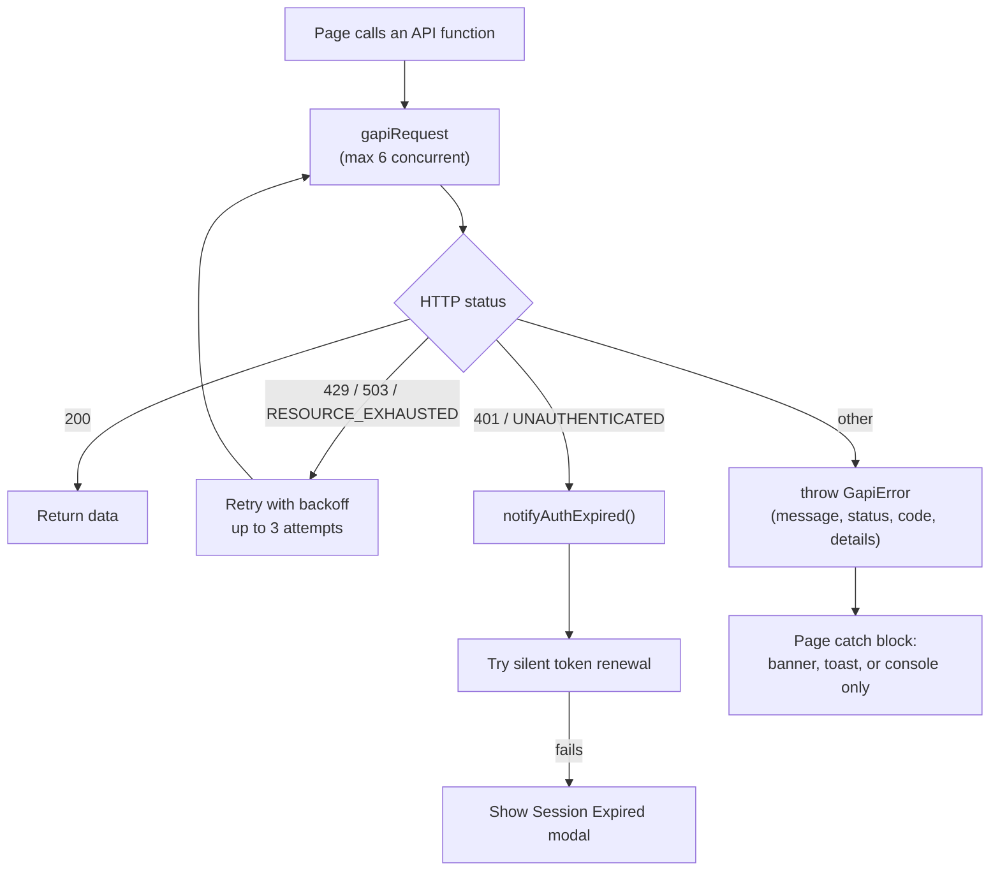
```mermaid
flowchart TD
  A["Page calls an API function"] --> B["gapiRequest<br/>(max 6 concurrent)"]
  B --> C{"HTTP status"}
  C -- "200" --> D["Return data"]
  C -- "429 / 503 / RESOURCE_EXHAUSTED" --> E["Retry with backoff<br/>up to 3 attempts"]
  E --> B
  C -- "401 / UNAUTHENTICATED" --> F["notifyAuthExpired()"]
  F --> G["Try silent token renewal"]
  G -- "fails" --> H["Show Session Expired modal"]
  C -- "other" --> I["throw GapiError<br/>(message, status, code, details)"]
  I --> J["Page catch block:<br/>banner, toast, or console only"]
```

Key facts:

- **Concurrency is capped at 6** in-flight requests.
- **Retries happen automatically** for `429`, `503` and `RESOURCE_EXHAUSTED`, up to 3 attempts, with
  backoff of roughly 2 s, 4 s, 8 s plus jitter. You do not need to retry these yourself — wait.
- **`status: 0` means the response never arrived.** That is a network, DNS, proxy or CORS failure,
  *not* a permission problem. This is the single most useful diagnostic in the whole app.
- **Two calls bypass all of this**: the GCS upload and download helpers use raw `fetch`. They get no
  retry and no **Session Expired** prompt.

### Telling 401 from 403 — and the three different causes of 403

Nina, this is the section to read. These two numbers look similar and mean completely different
things.

| You see | It means | How to be sure | Fix |
|---|---|---|---|
| **401** | *We don't know who you are.* Your sign-in token expired or was never sent. | The **Session Expired** modal usually appears on its own within a second or two. | Click **Re-authenticate with Google**. If the modal does not appear, reload the page and sign in again. |
| **403** | *We know who you are, and you're not allowed.* | The message body tells you which of the three cases below applies. | See the decision table immediately below. |

**Three different things produce a 403. Here is how to tell them apart:**

| Clue in the error text | Real cause | Fix |
|---|---|---|
| Contains `PERMISSION_DENIED` and names a permission, e.g. `discoveryengine.engines.list` | **Missing IAM role.** Your account genuinely lacks that permission. | Grant the matching role from [Appendix B](#appendix-b--complete-iam--api-prerequisites-matrix). |
| Contains `SERVICE_DISABLED`, `has not been used in project`, or `Enable it by visiting https://console.developers.google.com/apis/api/...` | **The API is turned off** in that project. Nothing to do with your permissions. | Enable the API. The message contains a direct link, or use the `gcloud services enable` block in Appendix B. |
| Contains `caller does not have permission` on a *billing account* or an *organization* resource | **Wrong IAM surface.** You have project access but the resource is owned elsewhere. | Grant the role on the billing account or org, not on the project. Common with the **Allocation Management (Billing Account)** tab. |

> [!TIP]
> Open your browser's DevTools (F12) → **Network** tab, click the red failing request, and read the
> **Response** panel. The raw Google error message is far more specific than anything the UI shows.
> Paste that text into a support ticket.

### Full error index

| Error text or HTTP code | Where it appears | What it actually means | Fix, in order of likelihood |
|---|---|---|---|
| **HTTP 400** / `INVALID_ARGUMENT` | Any create or update | The request body was malformed, or a field value is not accepted — wrong region, bad resource ID, missing required field. | 1. Check region/location selectors match how the resource was created. 2. Check IDs for typos and stray whitespace. 3. For restore, the backup file may be from an incompatible version. |
| **HTTP 401** / `UNAUTHENTICATED` | Anywhere | Your OAuth token expired (typically after ~1 hour) or was never issued. | 1. Use the **Session Expired** → **Re-authenticate with Google** prompt. 2. Reload the page. 3. If it recurs immediately, third-party cookies or the `accounts.google.com` domain may be blocked. |
| **HTTP 403** / `PERMISSION_DENIED` | Anywhere | See the decision table above — missing IAM, disabled API, or wrong IAM surface. | Follow the three-way table above. |
| **HTTP 403** with `SERVICE_DISABLED` | First use of a feature | That Google Cloud API is not enabled on the project. | Enable it (Appendix B has a one-line `gcloud` command for all 13). |
| **HTTP 404** / `NOT_FOUND` | Get / list / restore | The resource path does not exist **in the project and location you asked for**. Nine times out of ten the location is wrong, not the ID. | 1. Check **Location** / **Region** — a `global` app is invisible from `us`. 2. Check the project ID vs project number. 3. Confirm the resource still exists in the Console. |
| **HTTP 409** / `ALREADY_EXISTS` | Restore, create | Something with that ID is already there. During restore of collections, engines, data stores and authorizations this is handled for you and counted as **skipped**. | Usually nothing. If you intended to overwrite, delete the existing resource first — restore never overwrites. |
| **HTTP 429** / `RESOURCE_EXHAUSTED` | Bulk operations, audits | You hit a Google Cloud quota or rate limit. The app already retried 3 times with backoff. | 1. Wait a minute and retry. 2. Reduce batch size — select fewer users, audit fewer stores. 3. If persistent, request a quota increase for that API. |
| **HTTP 500 / 503** | Anywhere | Google-side error. `503` is retried automatically; `500` is not. | 1. Retry. 2. Check the Google Cloud Status Dashboard. 3. If reproducible, file a ticket with the raw response body. |
| `status: 0` / request shows as failed with no status | Anywhere | The response never arrived: network down, VPN/proxy blocking, or a CORS rejection. | 1. Check your connection. 2. Disable ad-blockers and privacy extensions for this page. 3. Corporate proxies frequently block `*.googleapis.com` — ask your network team. |
| Browser console: `Access to fetch ... has been blocked by CORS policy` | Anywhere | The browser refused the cross-origin response — usually a proxy rewriting responses, or an API endpoint that is not enabled. | 1. Confirm the API is enabled. 2. Try from a network without a corporate proxy. 3. Try an incognito window with extensions off. |
| `Unknown API Error` | Anywhere | The error body could not be parsed into anything meaningful. | Read the raw response in DevTools → Network. |
| `An unknown error occurred.` | Anywhere | Generic fallback in the error formatter. | Same as above. |
| `GAPI client has not been initialized. Call initGapiClient first.` | On page load | `https://apis.google.com/js/api.js` did not load within 30 s. | 1. Reload. 2. Unblock `apis.google.com`. 3. Check for a script-blocking extension. |
| `[gapiRequest] Rate limited / service unavailable (...). Retrying attempt N/3 in Nms...` | Browser console only | Informational — the automatic retry is working. | Nothing. Wait. |
| `[gapiRequest] Authentication credential expired or invalid (401 UNAUTHENTICATED) for <METHOD> <path>. Re-authentication triggered.` | Browser console only | Informational — re-auth was triggered. | Nothing; the modal will appear if silent renewal fails. |
| `Session Expired` (modal) | Anywhere | Silent token renewal failed. | Click **Re-authenticate with Google**. Your in-progress form data is preserved. |
| `GCS Upload Failed: <status> - <body>` | Backup | Raw, un-retried upload. | 403 → `storage.objects.create` on the bucket; 404 → bucket missing; 0 → network. |
| `Failed to download object: <status> - <body>` | Backup download | Raw, un-retried download. | 401 → reload and sign in; 403 → `storage.objects.get`. |
| A dropdown is simply empty, with no error anywhere in the UI | Buckets, backup files, apps, Agent Engines, licence configs, billing accounts, project names | Several list calls log their failure to the browser console and leave the control blank. **An empty dropdown does not mean "no results".** | Open DevTools → Console and read the logged error. Then fix the underlying permission or enable the API. |

> [!IMPORTANT]
> If you remember one thing from this appendix: **an empty dropdown in this app is not evidence of
> an empty project.** Check the browser console before concluding a resource does not exist.

---

## Appendix B — Complete IAM & API prerequisites matrix

This appendix is guide-wide.

### Every Google Cloud API the app touches

The app validates exactly thirteen APIs on startup —
[validateEnabledApis](file:///usr/local/google/home/wdufrin/Documents/Code/Gemini-Enterprise-Manager/services/api/project.ts#L59-L73).

| API | Why the app needs it |
|---|---|
| `discoveryengine.googleapis.com` | The core of everything: engines, assistants, agents, data stores, authorizations, licences. |
| `aiplatform.googleapis.com` | Vertex AI Agent (Reasoning) Engines — list, back up, restore. |
| `run.googleapis.com` | Cloud Run agents, the group-licensing service, the auto-pruner job. |
| `cloudbuild.googleapis.com` | Builds and deploys the auto-pruner and the group-licensing service. |
| `storage.googleapis.com` | Backup bucket listing, upload, download, delete; build source staging. |
| `bigquery.googleapis.com` | Analytics and observability queries. |
| `logging.googleapis.com` | Reading logs for the Observability tab and deployed jobs. |
| `cloudbilling.googleapis.com` | The **Allocation Management (Billing Account)** licence tab. |
| `cloudresourcemanager.googleapis.com` | Project metadata, project number lookup, IAM policy read/write, permission probing. |
| `iam.googleapis.com` | Service-account inspection and role grants. |
| `serviceusage.googleapis.com` | Detecting which APIs are enabled, and the one-click enable button. |
| `dialogflow.googleapis.com` | Dialogflow CX agent integration. |
| `modelarmor.googleapis.com` | The Model Armor safety-template tab. |

Additional hosts the app calls that are **not** on the startup validation list — so a failure here
surfaces as a runtime 403 rather than a friendly setup warning:

| Host | Used by |
|---|---|
| `agentregistry.googleapis.com` | Skills Registry, and the Skills pillar of the Config Audit. |
| `monitoring.googleapis.com` | Metrics panels. |
| `compute.googleapis.com`, `dns.googleapis.com` | Networking inspection. |
| `sts.googleapis.com`, `oauth2.googleapis.com`, `www.googleapis.com` | Token exchange and user profile. |
| `<location>-aiplatform.googleapis.com` | Regional Vertex AI calls. |
| `<location>-discoveryengine.googleapis.com` | Regional Discovery Engine calls (anything not `global`). |
| `api.github.com` | The ADK Studio sample browser, which fetches real samples from the public `google/adk-samples` repository. |

> [!NOTE]
> The GitHub call is genuinely to GitHub's public API. It is not a mock or a stub — if GitHub is
> unreachable from your network, that panel will fail rather than show placeholder content.

### Role → what it unlocks → what breaks without it

| Role | What it unlocks | Tabs that break without it |
|---|---|---|
| `roles/discoveryengine.admin` | Full read/write on engines, assistants, agents, data stores, authorizations and user licences. **The single most important role.** | Nearly everything: GE Agent Manager, Engines & Assistants, Connectors & Data Stores, Authorizations, Backup & Recovery, Licenses. |
| `roles/discoveryengine.viewer` | Read-only equivalent. Enough for auditing. | App Config Audit (reads only), read-only views elsewhere. |
| `roles/aiplatform.user` | List, create and restore Vertex AI Agent Engines. | Agent Runtimes; the **Single Agent Engine** backup/restore card. |
| `roles/storage.admin` | Create/list buckets, read/write/delete objects. | Backup & Recovery entirely — the bucket dropdown stays empty. |
| `roles/storage.objectAdmin` | Object-level read/write/delete (narrower than above). | Backup upload/download/delete; you also need `storage.buckets.list` for the dropdown. |
| `roles/viewer` | `resourcemanager.projects.get` — project metadata and number. | Project selection; the project-number field cannot auto-populate. |
| `roles/resourcemanager.projectIamAdmin` | Read and write the project IAM policy. | Agent Permissions; the service-agent grant helper; the auto-pruner grant step. |
| `roles/serviceusage.serviceUsageViewer` | See which APIs are enabled. | The startup readiness check reports everything as unknown. |
| `roles/serviceusage.serviceUsageAdmin` | Enable APIs from inside the app. | The one-click **Enable API** buttons. |
| `roles/cloudbuild.builds.editor` | Submit builds. | **Setup Auto-Pruner**; group-licensing service deployment. |
| `roles/run.admin` | Deploy and manage Cloud Run services and jobs. | Cloud Run agents; auto-pruner; group licensing. |
| `roles/cloudscheduler.admin` | Create the cron trigger. | The auto-pruner's schedule. |
| `roles/iam.serviceAccountUser` | Act as a service account during deployment. | Any Cloud Run / Cloud Build deployment. |
| `roles/logging.viewer` | Read logs. | Observability. |
| `roles/bigquery.dataViewer` | Query analytics datasets. | Analytics panels. |
| `roles/billing.viewer` **on the billing account** | Read seat allocation. | **Allocation Management (Billing Account)**. Note: this is granted on the *billing account*, not the project. |
| `roles/modelarmor.viewer` / `roles/modelarmor.admin` | Read / manage safety templates. | Model Armor. |

### The eleven permissions the app actually probes

On startup the app runs `testIamPermissions` against exactly these —
[validateUserPermissions](file:///usr/local/google/home/wdufrin/Documents/Code/Gemini-Enterprise-Manager/services/api/project.ts#L218-L301). The three marked **critical** must pass or the app
is effectively unusable.

| Permission | Category | What it is for | Recommended role | Critical |
|---|---|---|---|---|
| `discoveryengine.engines.get` | Discovery Engine Admin | View Assistants & App Engines | `roles/discoveryengine.admin` | ✅ |
| `discoveryengine.engines.update` | Discovery Engine Admin | Modify Assistant & Feature Configuration | `roles/discoveryengine.admin` | ✅ |
| `discoveryengine.engines.list` | Discovery Engine Admin | List all Assistants & App Engines | `roles/discoveryengine.admin` | ✅ |
| `discoveryengine.dataStores.get` | Discovery Engine Admin | View and query DataStores | `roles/discoveryengine.admin` | |
| `discoveryengine.assistants.get` | Discovery Engine Admin | View Assistant chat configs & prompt chips | `roles/discoveryengine.admin` | |
| `resourcemanager.projects.get` | IAM & Security | Get project metadata & number | `roles/viewer` | |
| `resourcemanager.projects.getIamPolicy` | IAM & Security | Audit project IAM policy & service agents | `roles/resourcemanager.projectIamAdmin` | |
| `resourcemanager.projects.setIamPolicy` | IAM & Security | Assign roles to service agents & users | `roles/resourcemanager.projectIamAdmin` | |
| `serviceusage.services.list` | Service Management | Check enabled Google Cloud APIs | `roles/serviceusage.serviceUsageViewer` | |
| `serviceusage.services.enable` | Service Management | 1-click enable required Google APIs | `roles/serviceusage.serviceUsageAdmin` | |
| `aiplatform.reasoningEngines.list` | Vertex AI / Reasoning | List Vertex AI Agent Engines | `roles/aiplatform.user` | |

### The Discovery Engine service agent

Separate from *your* permissions, the Discovery Engine **service agent** needs its own roles to
reach your data. The app can grant these for you if you hold `projectIamAdmin`.

| Item | Value |
|---|---|
| Service agent identity | `service-<PROJECT_NUMBER>@gcp-sa-discoveryengine.iam.gserviceaccount.com` |
| Required role | `roles/discoveryengine.serviceAgent` |
| Recommended additional | `roles/aiplatform.user`, `roles/storage.objectViewer`, `roles/bigquery.dataViewer` |

### Copy-paste: grant a colleague full admin of this tool

Run this as a project owner. It enables every API the app validates and grants the full
administrative role set.

```bash
# --- EDIT THESE TWO LINES ---
export PROJECT_ID="your-project-id"
export ADMIN="user:colleague@example.com"   # or serviceAccount:... or group:...
# ----------------------------

gcloud config set project "$PROJECT_ID"

# 1. Enable every API the app validates on startup.
gcloud services enable \
  discoveryengine.googleapis.com \
  aiplatform.googleapis.com \
  run.googleapis.com \
  cloudbuild.googleapis.com \
  storage.googleapis.com \
  bigquery.googleapis.com \
  logging.googleapis.com \
  cloudbilling.googleapis.com \
  cloudresourcemanager.googleapis.com \
  iam.googleapis.com \
  serviceusage.googleapis.com \
  dialogflow.googleapis.com \
  modelarmor.googleapis.com \
  --project="$PROJECT_ID"

# Not on the startup check, but needed for the Skills Registry.
gcloud services enable agentregistry.googleapis.com --project="$PROJECT_ID"

# 2. Grant the full admin role set.
for ROLE in \
  roles/discoveryengine.admin \
  roles/aiplatform.user \
  roles/storage.admin \
  roles/run.admin \
  roles/cloudbuild.builds.editor \
  roles/cloudscheduler.admin \
  roles/iam.serviceAccountUser \
  roles/logging.viewer \
  roles/bigquery.dataViewer \
  roles/serviceusage.serviceUsageAdmin \
  roles/resourcemanager.projectIamAdmin \
  roles/viewer
do
  gcloud projects add-iam-policy-binding "$PROJECT_ID" \
    --member="$ADMIN" \
    --role="$ROLE" \
    --condition=None
done

# 3. Grant the Discovery Engine service agent access to your data.
PROJECT_NUMBER="$(gcloud projects describe "$PROJECT_ID" --format='value(projectNumber)')"
SA="serviceAccount:service-${PROJECT_NUMBER}@gcp-sa-discoveryengine.iam.gserviceaccount.com"
for ROLE in \
  roles/discoveryengine.serviceAgent \
  roles/aiplatform.user \
  roles/storage.objectViewer \
  roles/bigquery.dataViewer
do
  gcloud projects add-iam-policy-binding "$PROJECT_ID" \
    --member="$SA" --role="$ROLE" --condition=None
done
```

> [!CAUTION]
> `roles/resourcemanager.projectIamAdmin` lets the holder grant themselves any role in the project.
> It is included because the app's IAM helpers and the auto-pruner deployment need it. If your
> colleague only needs day-to-day administration, omit that one line and grant it temporarily when
> a task actually requires it.

Billing-account access is a separate surface and must be granted separately:

```bash
export BILLING_ACCOUNT_ID="XXXXXX-XXXXXX-XXXXXX"
gcloud billing accounts add-iam-policy-binding "$BILLING_ACCOUNT_ID" \
  --member="$ADMIN" --role="roles/billing.viewer"
```

### Copy-paste: grant a read-only auditor

Enough to run the **App Config Audit**, browse every tab and export reports — and nothing more.
Nothing in this set can modify a resource.

```bash
# --- EDIT THESE TWO LINES ---
export PROJECT_ID="your-project-id"
export AUDITOR="user:auditor@example.com"
# ----------------------------

for ROLE in \
  roles/discoveryengine.viewer \
  roles/viewer \
  roles/serviceusage.serviceUsageViewer \
  roles/logging.viewer \
  roles/storage.objectViewer
do
  gcloud projects add-iam-policy-binding "$PROJECT_ID" \
    --member="$AUDITOR" \
    --role="$ROLE" \
    --condition=None
done
```

What the auditor **cannot** do with this set, and which tab will show it:

| Blocked action | Where they will notice |
|---|---|
| Run a backup or restore | Backup & Recovery — the bucket dropdown is empty and **Backup** fails with 403. |
| Assign, revoke or delete licences | Licenses — reads work; **Apply** fails with `PERMISSION_DENIED`. |
| Enable an API | Setup checks show the API as disabled with no working fix button. |
| Deploy the auto-pruner or group service | Cloud Build submit fails with 403. |
| Modify engine or assistant configuration | Any save action fails with `PERMISSION_DENIED` on `discoveryengine.engines.update`. |
| See billing allocation | Allocation Management tab is blank (needs billing-account-level `roles/billing.viewer`). |

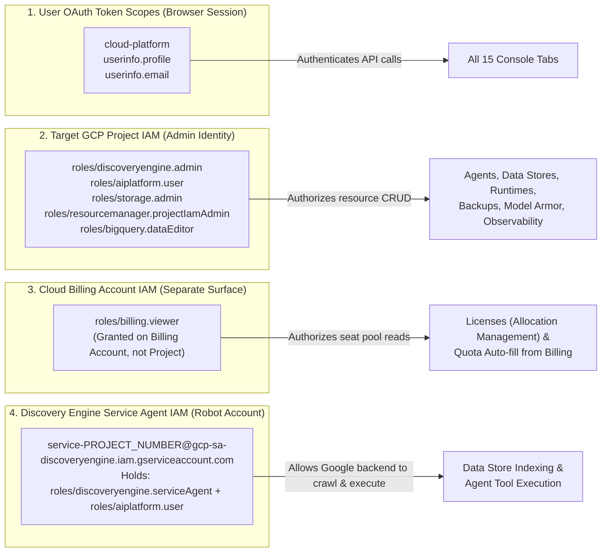
```mermaid
flowchart LR
  subgraph L1["1. User OAuth Token Scopes (Browser Session)"]
    S1["cloud-platform<br/>userinfo.profile<br/>userinfo.email"]
  end

  subgraph L2["2. Target GCP Project IAM (Admin Identity)"]
    S2["roles/discoveryengine.admin<br/>roles/aiplatform.user<br/>roles/storage.admin<br/>roles/resourcemanager.projectIamAdmin<br/>roles/bigquery.dataEditor"]
  end

  subgraph L3["3. Cloud Billing Account IAM (Separate Surface)"]
    S3["roles/billing.viewer<br/>(Granted on Billing Account, not Project)"]
  end

  subgraph L4["4. Discovery Engine Service Agent IAM (Robot Account)"]
    S4["service-PROJECT_NUMBER@gcp-sa-discoveryengine.iam.gserviceaccount.com<br/>Holds: roles/discoveryengine.serviceAgent + roles/aiplatform.user"]
  end

  S1 -->|"Authenticates API calls"| T1["All 15 Console Tabs"]
  S2 -->|"Authorizes resource CRUD"| T2["Agents, Data Stores, Runtimes,<br/>Backups, Model Armor, Observability"]
  S3 -->|"Authorizes seat pool reads"| T3["Licenses (Allocation Management) &<br/>Quota Auto-fill from Billing"]
  S4 -->|"Allows Google backend to crawl & execute"| T4["Data Store Indexing &<br/>Agent Tool Execution"]
```
