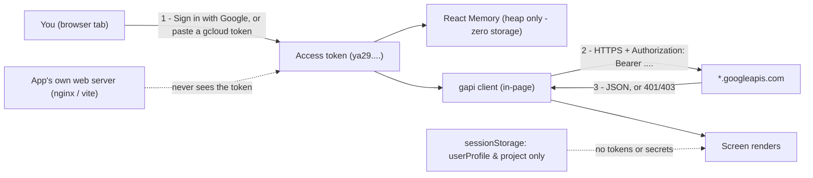
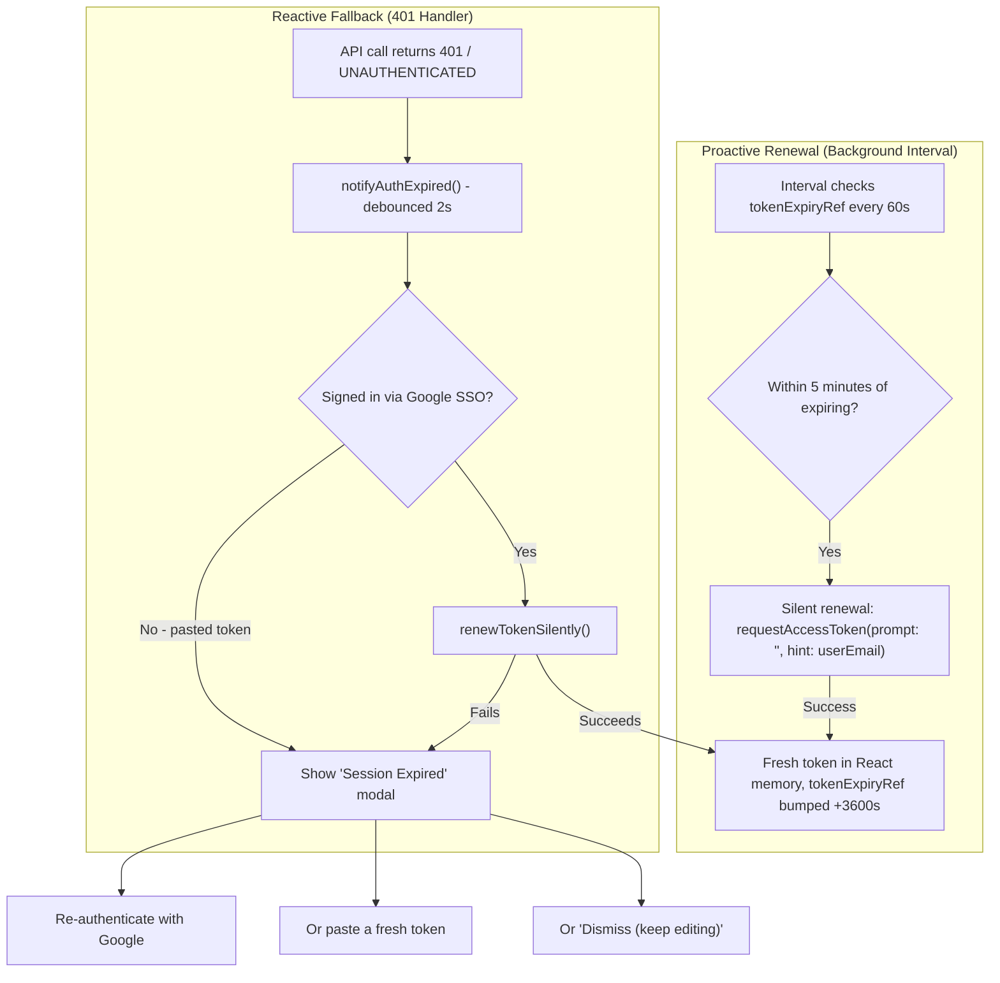

# Chapter 0 — Getting Started, Authentication, and the Global Console

**Who this chapter is for** — Everyone. Read this before any other chapter. It covers what the
application actually is, how to get it running, how to sign in, and every control that stays on
screen no matter which tab you are looking at.

**What you'll be able to do**

- Explain, to your security team, exactly where your credentials go when you use this tool.
- Start the console locally (`npm run dev`) or as a container (Docker / Cloud Run).
- Sign in with Google SSO **or** with a pasted `gcloud` access token — and recover when it expires.
- Run the pre-flight check, read all three result panels, and fix every failure it can report.
- Navigate the 5 sidebar groups and 15 tabs, and switch the active Google Cloud project.
- Turn on **Show Interaction Details** and hand a reproducible `curl` command to Google Cloud Support.

**Before you start**

| Requirement | Detail | Why |
|---|---|---|
| Node.js | `>=18.0.0` (declared in [package.json](file:///usr/local/google/home/wdufrin/Documents/Code/Gemini-Enterprise-Manager/package.json#L5-L7)); the Docker build image is `node:22-alpine` | Vite 8 will not run on older Node |
| A Google Cloud project | Billing enabled | Every screen is scoped to one project |
| Google Cloud SDK (`gcloud`) | Only needed for the pasted-token path and for manual remediation | `gcloud auth print-access-token` |
| Baseline IAM (read-only tour) | `roles/viewer` + `roles/serviceusage.serviceUsageConsumer` | Lets pre-flight list enabled APIs |
| Baseline IAM (normal admin work) | `roles/discoveryengine.admin` **or** `roles/discoveryengine.editor` | The three *critical* permissions the app checks are all `discoveryengine.engines.*` |
| IAM to self-remediate | `roles/serviceusage.serviceUsageAdmin` (enable APIs) and `roles/resourcemanager.projectIamAdmin` (grant the service agent) | Without these the fix buttons will fail with 403 |
| A modern browser | Chrome/Edge/Firefox, third-party script loading allowed | The page loads `accounts.google.com/gsi/client` and `apis.google.com/js/api.js` from [index.html](file:///usr/local/google/home/wdufrin/Documents/Code/Gemini-Enterprise-Manager/index.html#L7-L40) |

---

## At a glance

### What this application IS

Gemini Enterprise Manager is a **static single-page web app**. There is no backend. There is no
server that holds your data. When you click **Refresh**, your *browser* makes an HTTPS call
straight to `discoveryengine.googleapis.com` (or `aiplatform`, `run`, `bigquery`, `logging`,
`serviceusage`, `cloudresourcemanager`, `iam`, `modelarmor`, `dialogflow`, `storage`,
`cloudbilling`, `monitoring`, `agentregistry`) carrying **your** OAuth bearer token.

That design is the whole value proposition and the whole risk, so be clear about both:

- Everything you can do in this tool, you could already do with `curl`. It grants you **zero**
  extra permission. If IAM says no, the app shows you the 403.
- Conversely, the app applies **no policy of its own**. There is no approval workflow, no audit
  trail beyond Google Cloud Audit Logs, and no "are you sure" gate except the ones individual
  screens implement. Your IAM role *is* the security model.

### What this application is NOT

| It is not… | Because… |
|---|---|
| A Google-supported product | It is an Apache-2.0 sample console. `README.md` calls it "production-grade"; treat that as aspirational, not a support commitment. |
| A multi-tenant server | Nothing is stored server-side. Your project ID and token live in your browser tab only. |
| A replacement for the Cloud Console | It exposes `v1alpha` Discovery Engine surfaces the Console does not, and omits plenty the Console has. Most screens carry a **Cloud Console** link for exactly this reason. |
| Safe to expose publicly without thought | The README's Cloud Run recipes use `--allow-unauthenticated`. See the warning below. |

### Where your credentials actually go



1. The token is obtained in your browser.
2. It is held **strictly in transient JavaScript memory (React heap)**. Neither `sessionStorage`,
   `localStorage`, nor `IndexedDB` ever stores an access token. On startup, any legacy
   `agentspace-accessToken` key is defensively purged from browser storage.
3. It is handed to the Google API JavaScript client, which attaches it to every outbound call
   directly to `*.googleapis.com`.
4. The web server that served the HTML never receives, proxies, or logs the token.

> [!NOTE]
> **Zero-Storage Security Posture:** Because the token is never written to browser storage, malicious
> browser extensions, shared-origin scripts, and DevTools storage inspectors find zero credentials at
> rest. When the tab closes, the token is instantly garbage-collected from RAM. On page reload (`F5`),
> the application seamlessly obtains a fresh token in ~150ms via Google Identity Services silent
> refresh (`prompt: ''`).

> [!NOTE]
> The SSO path requests the scope `https://www.googleapis.com/auth/cloud-platform` plus
> `userinfo.profile` and `userinfo.email`
> ([App.tsx:298-301](file:///usr/local/google/home/wdufrin/Documents/Code/Gemini-Enterprise-Manager/App.tsx#L296-L302)).
> `cloud-platform` is the broadest Google Cloud scope there is — it is "everything your IAM roles
> allow". To ensure safety in enterprise environments, always log in with scoped IAM roles (see
> Appendix B) rather than `roles/owner`.

---

## Running the console

### What it's for

You need a copy of the app running somewhere your browser can reach, on an origin your OAuth
client trusts. Two supported shapes: a local dev server, or a container.

### How to: run it locally

1. Open a terminal in the repository root.
2. Run `npm install`.
3. Run `npm run dev`.
4. Open `http://localhost:5173`.

Expected result: the dark **Welcome to Gemini Enterprise Manager** screen.

Other scripts, verbatim from [package.json](file:///usr/local/google/home/wdufrin/Documents/Code/Gemini-Enterprise-Manager/package.json#L8-L21):
`npm run build` (production bundle into `dist/`), `npm run preview`, `npm start`
(serves `dist/` on port **8080**), `npm run typecheck`, `npm run lint`, `npm run test:run`.

> [!WARNING]
> `README.md` tells you to authorize `http://localhost:5173` and `http://localhost:3000` as OAuth
> JavaScript origins. **Nothing in this repo serves on port 3000.** `npm start` uses **8080** and
> `npm run preview` uses Vite's default **4173**. Authorize the port you will actually use, or
> Google sign-in will fail with a redirect/origin error.

### How to: run it in Docker (and Cloud Run)

1. `docker build -t gemini-enterprise-manager .`
2. `docker run -p 8080:8080 -e GOOGLE_CLIENT_ID="<your-id>.apps.googleusercontent.com" gemini-enterprise-manager`
3. Open `http://localhost:8080`.

The [Dockerfile](file:///usr/local/google/home/wdufrin/Documents/Code/Gemini-Enterprise-Manager/Dockerfile) is a two-stage build: `node:22-alpine` runs `npm ci && npm run build`, then
`nginx:alpine` serves `dist/` on port 8080 using [nginx.conf](file:///usr/local/google/home/wdufrin/Documents/Code/Gemini-Enterprise-Manager/nginx.conf).
At container start, [docker-entrypoint.sh](file:///usr/local/google/home/wdufrin/Documents/Code/Gemini-Enterprise-Manager/docker-entrypoint.sh) writes `/usr/share/nginx/html/config.json` from the
`GOOGLE_CLIENT_ID` environment variable and echoes what it wrote to the container log.

### Field reference — configuration

| Setting | Where it is read | Scope | Required? | What happens if unset |
|---|---|---|---|---|
| `custom-google-client-id` | `localStorage`, set by the UI ([App.tsx:104-108](file:///usr/local/google/home/wdufrin/Documents/Code/Gemini-Enterprise-Manager/App.tsx#L103-L114)) | Per browser | No | Falls through to the next source |
| `VITE_GOOGLE_CLIENT_ID` | `.env.local`, read at **build** time ([App.tsx:110](file:///usr/local/google/home/wdufrin/Documents/Code/Gemini-Enterprise-Manager/App.tsx#L110-L114)) | Baked into the bundle | No | Falls through |
| `GOOGLE_CLIENT_ID` | Container env → `config.json` at **runtime** | Per deployment | No | Entrypoint writes `""`, app falls through |
| `/config.json` | Fetched at page load ([App.tsx:116-127](file:///usr/local/google/home/wdufrin/Documents/Code/Gemini-Enterprise-Manager/App.tsx#L116-L128)) | Per deployment | No | Falls through |
| `DEFAULT_GOOGLE_CLIENT_ID` | Hardcoded constant ([AuthWelcomeScreen.tsx:27-28](file:///usr/local/google/home/wdufrin/Documents/Code/Gemini-Enterprise-Manager/components/auth/AuthWelcomeScreen.tsx#L27-L28)) | Last resort | — | Used |

Precedence, highest first: **localStorage → `VITE_GOOGLE_CLIENT_ID` → `/config.json` → hardcoded default.**

### Known limitations & gotchas

- **A client ID is shipped in the repo.** [public/config.json](file:///usr/local/google/home/wdufrin/Documents/Code/Gemini-Enterprise-Manager/public/config.json) contains
  `123456789012-exampleclientid.apps.googleusercontent.com`, identical to the
  hardcoded `DEFAULT_GOOGLE_CLIENT_ID`. It only works for origins its owner has authorized, so on
  your own host SSO will fail until you supply your own. That is not a leak (OAuth client IDs are
  public), but it does mean *"Sign in with Google does nothing"* is the expected first-run symptom
  on a custom domain.
- **Docker ignores `VITE_GOOGLE_CLIENT_ID`.** The Dockerfile passes no build arg, so the only
  container-time knob is `GOOGLE_CLIENT_ID` → `config.json`.
- **`.env.example` documents exactly one variable.** There are no others. Nothing else in this repo
  reads `import.meta.env`.
- **`vite.config.ts` defines no env handling at all** ([vite.config.ts](file:///usr/local/google/home/wdufrin/Documents/Code/Gemini-Enterprise-Manager/vite.config.ts)) — it only configures the React plugin,
  a watch-ignore list, Vitest, and `build.outDir`. `VITE_`-prefixed variables work purely through
  Vite's built-in behaviour.
- **The nginx CSP blocks Cloud Run agent endpoints.** `connect-src` allows only `'self'`,
  `https://*.googleapis.com` and `https://api.github.com`
  ([nginx.conf:17](file:///usr/local/google/home/wdufrin/Documents/Code/Gemini-Enterprise-Manager/nginx.conf#L17)). Any screen that calls a `*.run.app` service directly will
  be blocked in the container build but works fine under `npm run dev` (no CSP). If a feature works
  locally and dies in Docker with a console CSP error, this is why.

---

## Signing in

### What it's for

Two ways to prove who you are. Both end in the same place: a short-lived OAuth 2.0 **access token**
that the app puts in an `Authorization: Bearer` header.

### The screen, explained

The welcome screen ([AuthWelcomeScreen.tsx](file:///usr/local/google/home/wdufrin/Documents/Code/Gemini-Enterprise-Manager/components/auth/AuthWelcomeScreen.tsx)) is a single dark card, top to bottom:

| Region | Control | Notes |
|---|---|---|
| Header | **Welcome to Gemini Enterprise Manager** | — |
| Panel 1 | **Sign In with Google** → **Sign in with Google** button | Disabled while loading |
| Divider | `OR USE ACCESS TOKEN` | — |
| Panel 2 | **Manual Access Token**: a read-only `gcloud auth print-access-token` box with a **Copy** button, then a masked token field and **Set Token** | The Copy button copies the *command*, not a token |
| Panel 2 footer | **▼ Advanced: Configure OAuth Client ID** | Collapsed by default; reveals an input and a **Clear** button |
| Status | Spinners: *Initializing Google API Client… Please wait.* / *Validating access token permissions…* | — |
| Errors | Red banner with the raw `gapiError` text | — |

Once the token validates, the card switches to step 2: a green **API Client Initialized & Token
Validated Successfully!** banner, a **Project ID / Number** field, and two buttons —
**Validate APIs & Permissions** (indigo) and **Enter Application** (green).

````carousel

<!-- slide -->

<!-- slide -->

````

### How to: sign in with Google (recommended)

1. Click **Sign in with Google**.
2. In the Google popup, choose your account and approve the consent screen.
3. Wait for the green **API Client Initialized & Token Validated Successfully!** banner.

Expected result: your name, email and avatar appear in the top-right of the header after you enter
the app. Under the hood the app also calls `https://www.googleapis.com/oauth2/v3/userinfo`
to populate that profile ([App.tsx:316-326](file:///usr/local/google/home/wdufrin/Documents/Code/Gemini-Enterprise-Manager/App.tsx#L315-L329)); if that call fails, sign-in still succeeds and
the failure is only logged to the browser console.

### How to: get and paste an access token (no prior CLI experience needed)

Use this when SSO is blocked by policy, when you are on a locked-down network, or when you need to
act as a service account via `--impersonate-service-account`.

An access token is a long random string that means *"the bearer of this string is allowed to act as
me, for the next hour."* Google's access tokens start with the characters **`ya29.`** — that prefix
is just Google's marker for "this is an OAuth 2.0 access token". It is not a password and it cannot
be renewed; it simply expires.

1. Open a terminal. If you do not have one, open
   [Cloud Shell](https://console.cloud.google.com/) — the `>_` icon in the top-right of the Google
   Cloud Console. Cloud Shell is a terminal in your browser and already has `gcloud` installed.
2. If you are on your own machine and have never used `gcloud`, run `gcloud auth login` first and
   follow the browser prompt. In Cloud Shell you can skip this.
3. Run exactly this:
   ```bash
   gcloud auth print-access-token
   ```
4. One long line is printed, starting `ya29.`. Select the whole line and copy it. Do not include
   spaces or line breaks.
5. Back in Gemini Enterprise Manager, paste it into the **Paste GCP Access Token** field.
6. Press **Enter** or click **Set Token**.

Expected result: the green **API Client Initialized & Token Validated Successfully!** banner.

> [!CAUTION]
> That string is a live credential for the next hour. Do not paste it into chat, a ticket, an email,
> or a screenshot. If you ever do, run `gcloud auth revoke` immediately.

<details>
<summary>Under the hood — what "Set Token" actually does</summary>

`handleSetAccessToken` stores the token in React heap memory (actively removing any legacy tokens from
`sessionStorage`), then calls `initGapiClient(token)`
([App.tsx:257-276](file:///usr/local/google/home/wdufrin/Documents/Code/Gemini-Enterprise-Manager/App.tsx#L257-L276)). `initGapiClient` loads `https://apis.google.com/js/api.js`,
loads the `client` module with a 30-second timeout, enables CORS, and calls `gapi.client.init`
with nine discovery documents — `discoveryengine` v1alpha and v1beta, `aiplatform` v1beta1,
`cloudresourcemanager` v1, `logging` v2, `run` v2, `storage` v1, `serviceusage` v1, `dialogflow` v3
([gapiService.ts:63-141](file:///usr/local/google/home/wdufrin/Documents/Code/Gemini-Enterprise-Manager/services/gapiService.ts#L63-L141)).

**"Validated" is a weaker claim than it sounds.** The green banner means the discovery documents
loaded, not that your token is valid or has any permission. A garbage string can produce the green
banner; you will only find out at the first real API call.
</details>

### How to: use your own OAuth Client ID

Required whenever you host the app on anything other than an origin the built-in client ID trusts.

1. In the Google Cloud Console go to **APIs & Services → Credentials**.
2. **Create Credentials → OAuth client ID → Web application**.
3. Under **Authorized JavaScript origins**, add the exact origin you will browse to, including port
   (for example `http://localhost:5173` or `https://gem.example.com`).
4. Copy the generated Client ID.
5. On the welcome screen, click **▼ Advanced: Configure OAuth Client ID** and paste it.

Expected result: the value is saved to `localStorage` under `custom-google-client-id` and takes
effect immediately. A red **Clear** button appears next to the field; clicking it removes the
override and falls back to `/config.json`, then to the built-in default
([AuthWelcomeScreen.tsx:228-270](file:///usr/local/google/home/wdufrin/Documents/Code/Gemini-Enterprise-Manager/components/auth/AuthWelcomeScreen.tsx#L228-L270)).

> [!NOTE]
> The field saves on **every keystroke**. While you are part-way through pasting, the app is
> briefly configured with a truncated client ID. Harmless, but it explains transient
> "Sign-in failed" errors if you click too fast.

### Token lifetime, proactive renewal, and the Session Expired modal

Google access tokens last roughly **one hour**. The app treats `expires_in` as 3600 seconds when
the response omits it ([App.tsx:310-311](file:///usr/local/google/home/wdufrin/Documents/Code/Gemini-Enterprise-Manager/App.tsx#L309-L313)).



The **Session Expired** modal ([AppModals.tsx:93-213](file:///usr/local/google/home/wdufrin/Documents/Code/Gemini-Enterprise-Manager/components/layout/AppModals.tsx#L93-L213)) is an amber-bordered dialog reading
*"Re-authenticate to continue without losing your current work or page state."* It offers
**Re-authenticate with Google** (only when an SSO token client exists), a paste field with the
placeholder `Paste GCP Bearer token (gcloud auth print-access-token)` and an
**Update Token & Continue** button, and a quiet **Dismiss (keep editing)** link.

> [!IMPORTANT]
> **Dismiss (keep editing)** does not fix anything. It closes the dialog so you can copy your
> unsaved form data somewhere safe. Every subsequent API call will still fail until you supply a
> fresh token.

### Known limitations & gotchas

- **Proactive renewal prevents mid-session expirations.** A background timer evaluates `tokenExpiryRef`
  every 60 seconds and triggers silent renewal whenever a token is within 5 minutes of expiring.
  Admins actively using the console rarely encounter 401 interruptions.
- **On page reload (`F5`), Google SSO sessions restore automatically.** Because Google session cookies
  remain active on `accounts.google.com`, the app silently requests a fresh access token on mount
  via `prompt: ''` in ~150ms without displaying login modals.
- **Manual-token users have pure ephemeral tokens.** Manual pasted tokens (`gcloud auth`) live solely
  in React component heap memory. If the tab is closed or reloaded, the token is instantly wiped,
  prompting re-entry or 1-click Google Sign-In.
- **A failed in-flight write is not retried after re-auth.** If a write call hit a 401 before a token
  refreshed, that specific call was rejected. Redo it once re-authenticated.
- **Sign Out is client-side only.** It clears state, React memory, and profile metadata
  ([App.tsx:185-197](file:///usr/local/google/home/wdufrin/Documents/Code/Gemini-Enterprise-Manager/App.tsx#L185-L197))
  but does **not** revoke the token at Google. The token remains valid at Google until its 1-hour
  expiry. To revoke immediately, run `gcloud auth revoke` or use your Google Account third-party access page.
- **Sign Out preserves project selection.** `agentspace-projectId` and `agentspace-projectNumber`
  survive in `sessionStorage` so the next login immediately remembers your working project.

### Troubleshooting

| Symptom / exact error text | Cause | Fix |
|---|---|---|
| `Google Identity Services script not loaded. Refresh or check network connectivity.` | `accounts.google.com/gsi/client` was blocked | Allow the domain; disable the blocking extension; reload |
| `Google Identity Services client is not initialized. Please check your OAuth Client ID.` | Clicked **Sign in with Google** before GIS finished loading, or the client ID is malformed | Wait a moment and retry; re-check the Advanced client-ID field |
| `Sign-in failed: <error>` | GIS returned an error — usually `idpiframe_initialization_failed` or an unauthorized origin | Add your exact origin (including port) to Authorized JavaScript origins |
| `Failed to initialize Google Sign-In client: <message>` | `initTokenClient` threw | Almost always a malformed client ID |
| `Token configuration failed: Timed out loading the gapi "client" module.` | `apis.google.com` unreachable within 30s | Network/proxy issue |
| `Token configuration failed: Failed to load the gapi "client" module.` | Same, hard failure | Same |
| `Cannot enter application. Ensure the API client is initialized and a project is set.` | Clicked **Enter Application** with no project | Fill in **Project ID / Number** first |
| Green banner, but every screen 401s | The "validation" never tested the token | Get a fresh token |

---

## Pre-flight validation

### What it's for

Before you waste an afternoon debugging a broken agent, this panel answers three questions about
your project: *Are the right APIs switched on? Does the Google-managed robot account have the role
it needs? Do **you** have the permissions to do the work?*

Click **Validate APIs & Permissions** on the welcome screen. The three checks run in parallel
([project.ts:360-375](file:///usr/local/google/home/wdufrin/Documents/Code/Gemini-Enterprise-Manager/services/api/project.ts#L360-L375)).

### The screen, explained

Results appear in [ApiValidationPanel.tsx](file:///usr/local/google/home/wdufrin/Documents/Code/Gemini-Enterprise-Manager/components/auth/ApiValidationPanel.tsx) under four sub-tabs:
**All Checks** (default), **Service Agent**, **User Access**, and **APIs (n/13)**.


### Check 1 — Discovery Engine Service Agent

A *service agent* is a robot account Google creates for you, named
`service-<PROJECT_NUMBER>@gcp-sa-discoveryengine.iam.gserviceaccount.com`. Discovery Engine uses it
to crawl your data stores and run your agents. If it lacks its role, indexing and agent execution
fail with errors that look like your fault but are not.

| Badge | Meaning | What to do |
|---|---|---|
| 🟢 **Service Agent Authorized** | `roles/discoveryengine.serviceAgent` is bound | Nothing. Every role found on that member is listed as a chip. |
| ⚠️ **IAM Inspection Scoped** | You are not allowed to read the project IAM policy, so the check is inconclusive | Ask an admin to confirm, or get `roles/resourcemanager.projectIamViewer` |
| ❌ **Missing Service Agent Role** | Policy read OK, role absent | Click **+ Grant Discovery Engine Service Agent Role** |

The grant button calls `generateServiceIdentity` first (creating the robot account if it does not
exist yet), then read-modify-writes the project IAM policy to add **two** roles:
`roles/discoveryengine.serviceAgent` and `roles/aiplatform.user`
([App.tsx:429-431](file:///usr/local/google/home/wdufrin/Documents/Code/Gemini-Enterprise-Manager/App.tsx#L423-L447),
[project.ts:178-216](file:///usr/local/google/home/wdufrin/Documents/Code/Gemini-Enterprise-Manager/services/api/project.ts#L178-L216)).

> [!CAUTION]
> The grant performs a full-policy read-modify-write **without an etag precondition**
> ([iam.ts:118-131](file:///usr/local/google/home/wdufrin/Documents/Code/Gemini-Enterprise-Manager/services/api/iam.ts#L118-L131)). If another administrator or a Terraform run modifies
> the project IAM policy in the same window, their change can be silently overwritten. Avoid
> clicking this during a concurrent IAM deployment.

**Manual equivalent** (for anyone without `roles/resourcemanager.projectIamAdmin`, to hand to
someone who has it):

```bash
PROJECT_ID=my-project
PROJECT_NUMBER=$(gcloud projects describe "$PROJECT_ID" --format='value(projectNumber)')
SA="service-${PROJECT_NUMBER}@gcp-sa-discoveryengine.iam.gserviceaccount.com"

# Create the service identity if it does not exist yet
gcloud beta services identity create \
  --service=discoveryengine.googleapis.com --project="$PROJECT_ID"

gcloud projects add-iam-policy-binding "$PROJECT_ID" \
  --member="serviceAccount:${SA}" --role="roles/discoveryengine.serviceAgent"

gcloud projects add-iam-policy-binding "$PROJECT_ID" \
  --member="serviceAccount:${SA}" --role="roles/aiplatform.user"
```

> [!NOTE]
> The code also tracks three *recommended* roles for the service agent — `roles/aiplatform.user`,
> `roles/storage.objectViewer`, `roles/bigquery.dataViewer`
> ([project.ts:121-125](file:///usr/local/google/home/wdufrin/Documents/Code/Gemini-Enterprise-Manager/services/api/project.ts#L121-L125)) — but the panel never renders
> `missingRecommendedRoles`. If your data store reads from GCS or BigQuery, verify
> `storage.objectViewer` / `bigquery.dataViewer` yourself; the UI will not tell you.

### Check 2 — Caller / User Permissions Audit

Calls `projects:testIamPermissions` with **11** permissions and reports
`<granted> of <total> Permissions Verified` plus a 2×2 category grid
([project.ts:218-358](file:///usr/local/google/home/wdufrin/Documents/Code/Gemini-Enterprise-Manager/services/api/project.ts#L218-L358)). Click
**▼ View All Granular Permissions Tested** for the per-permission list.

| # | Permission | Category | What it unlocks | Recommended role | Critical? |
|---|---|---|---|---|---|
| 1 | `discoveryengine.engines.get` | Discovery Engine Admin | View Assistants & App Engines | `roles/discoveryengine.admin` | **Yes** |
| 2 | `discoveryengine.engines.update` | Discovery Engine Admin | Modify Assistant & Feature Configuration | `roles/discoveryengine.admin` | **Yes** |
| 3 | `discoveryengine.engines.list` | Discovery Engine Admin | List all Assistants & App Engines | `roles/discoveryengine.admin` | **Yes** |
| 4 | `discoveryengine.dataStores.get` | Discovery Engine Admin | View and query DataStores | `roles/discoveryengine.admin` | No |
| 5 | `discoveryengine.assistants.get` | Discovery Engine Admin | View Assistant chat configs & prompt chips | `roles/discoveryengine.admin` | No |
| 6 | `resourcemanager.projects.get` | IAM & Security | Get project metadata & number | `roles/viewer` | No |
| 7 | `resourcemanager.projects.getIamPolicy` | IAM & Security | Audit project IAM policy & service agents | `roles/resourcemanager.projectIamAdmin` | No |
| 8 | `resourcemanager.projects.setIamPolicy` | IAM & Security | Assign roles to service agents & users | `roles/resourcemanager.projectIamAdmin` | No |
| 9 | `serviceusage.services.list` | Service Management | Check enabled Google Cloud APIs | `roles/serviceusage.serviceUsageViewer` | No |
| 10 | `serviceusage.services.enable` | Service Management | 1-click enable required Google APIs | `roles/serviceusage.serviceUsageAdmin` | No |
| 11 | `aiplatform.reasoningEngines.list` | Vertex AI / Reasoning | List Vertex AI Agent Engines | `roles/aiplatform.user` | No |

Missing any of the three **critical** permissions produces a yellow box:
*"Missing Core Discovery Engine Privileges … Request `roles/discoveryengine.admin` or
`roles/discoveryengine.editor` from your project administrator."*

If the `testIamPermissions` call itself fails, you get a grey notice instead:
*"Could not test project IAM permissions: `<error>`. If you only have resource-scoped access, you
can still proceed into the app."*

> [!WARNING]
> **11 permissions is not full coverage.** No storage, BigQuery, Cloud Run, Cloud Build, Logging,
> Monitoring, Model Armor, Agent Registry or Compute permission is tested. A green
> "11 of 11 Permissions Verified" badge does **not** mean Backup & Recovery, Observability,
> Licenses, ADK Studio or Skills Registry will work.

**Manual equivalent:**

```bash
gcloud projects get-iam-policy my-project \
  --flatten="bindings[].members" \
  --filter="bindings.members:user:you@example.com" \
  --format="table(bindings.role)"
```

### Check 3 — Required Google Cloud APIs

The panel header reads **Required Google Cloud APIs (n of 13 Enabled)**. This is the complete list
copied verbatim from [project.ts:59-73](file:///usr/local/google/home/wdufrin/Documents/Code/Gemini-Enterprise-Manager/services/api/project.ts#L59-L73):

| # | API | Needed by |
|---|---|---|
| 1 | `discoveryengine.googleapis.com` | Everything Gemini Enterprise: engines, assistants, agents, data stores, authorizations, licences |
| 2 | `aiplatform.googleapis.com` | Agent Runtimes (Reasoning Engines), ADK Studio deployments |
| 3 | `run.googleapis.com` | Cloud Run–hosted agents, the licence pruner service |
| 4 | `cloudbuild.googleapis.com` | ADK Studio builds, pruner deployment |
| 5 | `storage.googleapis.com` | Backup & Recovery snapshots, `gs://` document import |
| 6 | `bigquery.googleapis.com` | Observability analytics |
| 7 | `logging.googleapis.com` | Model Armor audit log, error logs |
| 8 | `cloudbilling.googleapis.com` | Licences, cost estimation |
| 9 | `cloudresourcemanager.googleapis.com` | Project ID ↔ number resolution, IAM policy |
| 10 | `iam.googleapis.com` | Service accounts, workload identity pools |
| 11 | `serviceusage.googleapis.com` | This check itself, and the enable button |
| 12 | `dialogflow.googleapis.com` | Dialogflow CX agent inspection |
| 13 | `modelarmor.googleapis.com` | Model Armor templates |

Enabled APIs render green with a tick. Disabled ones render red with a checkbox and a
**[View in Console]** link to `console.cloud.google.com/apis/library/<api>?project=<n>`.

> [!WARNING]
> **Four APIs this console actually uses are NOT in the list**, so pre-flight will pass green while
> the relevant tab fails: `agentregistry.googleapis.com` (Skills Registry),
> `monitoring.googleapis.com` (Quota & Cost Estimator time series),
> `compute.googleapis.com` (load balancers / custom domains), and
> `cloudscheduler.googleapis.com` (scheduled pruning). Enable them by hand if you use those tabs.

> [!NOTE]
> The count `13` is hardcoded in two places
> ([ApiValidationPanel.tsx:137](file:///usr/local/google/home/wdufrin/Documents/Code/Gemini-Enterprise-Manager/components/auth/ApiValidationPanel.tsx#L137) and
> [:491](file:///usr/local/google/home/wdufrin/Documents/Code/Gemini-Enterprise-Manager/components/auth/ApiValidationPanel.tsx#L490-L492)) rather than derived from the array. It happens to
> be correct today; treat a mismatched denominator in a future build as a UI bug, not a real change.

### How to: enable missing APIs in bulk

1. Open the **APIs** sub-tab (or stay on **All Checks**).
2. Tick each disabled API, or use the **Select All** checkbox.
3. Click **Enable *n* Selected API(s)** (yellow button).
4. Watch the **API Enablement Log** panel below.

Expected result: log lines *"Starting to enable N API(s)…"*, *"Enablement operation started: …"*,
repeated *"Polling for operation status…"* every 3 seconds, then
*"API enablement successful! Re-validating…"*, after which the validation re-runs automatically.

<details>
<summary>Under the hood — the API calls</summary>

```bash
# Check
curl -X GET \
  "https://serviceusage.googleapis.com/v1/projects/PROJECT/services?filter=state:ENABLED&pageSize=200" \
  -H "Authorization: Bearer $(gcloud auth print-access-token)"

# Enable
curl -X POST \
  "https://serviceusage.googleapis.com/v1/projects/PROJECT/services:batchEnable" \
  -H "Authorization: Bearer $(gcloud auth print-access-token)" \
  -H "Content-Type: application/json" \
  -d '{"serviceIds":["discoveryengine.googleapis.com","aiplatform.googleapis.com"]}'
```

Or simply: `gcloud services enable discoveryengine.googleapis.com aiplatform.googleapis.com --project=my-project`
</details>

### Known limitations & gotchas

- **`pageSize=200` with no pagination.** `validateEnabledApis` reads one page of enabled services
  and never follows `nextPageToken` ([project.ts:75-82](file:///usr/local/google/home/wdufrin/Documents/Code/Gemini-Enterprise-Manager/services/api/project.ts#L75-L82)). In a project with
  more than 200 enabled services, APIs that *are* enabled can be reported as disabled. Clicking
  enable on them is harmless but the red flags are false.
- **The poll loop has no timeout.** `while (!currentOperation.done)` loops forever every 3 seconds
  ([App.tsx:484-488](file:///usr/local/google/home/wdufrin/Documents/Code/Gemini-Enterprise-Manager/App.tsx#L484-L488)). A stuck operation leaves the button spinning
  indefinitely; reload the page.
- **You cannot re-run pre-flight from inside the app.** The onboarding banner has a
  **Run Preflight Diagnostics** button, but it is only rendered when an `onOpenPreflight` prop is
  supplied — and [App.tsx:604-609](file:///usr/local/google/home/wdufrin/Documents/Code/Gemini-Enterprise-Manager/App.tsx#L604-L609) never supplies it. In practice you always see
  the fallback **Open Engines & Assistants** button instead. To re-run pre-flight you must
  **Sign Out** (or clear `sessionStorage`) and start again.
- **Changing the project clears prior results** silently ([App.tsx:388](file:///usr/local/google/home/wdufrin/Documents/Code/Gemini-Enterprise-Manager/App.tsx#L388)).
- **You can skip the whole thing.** **Enter Application** only requires a project to be set.

### Troubleshooting

| Symptom / exact error text | Cause | Fix |
|---|---|---|
| `Validation check failed: <msg>. Ensure the Service Usage API is enabled.` | `serviceusage.googleapis.com` off, or you lack `serviceusage.services.list` | `gcloud services enable serviceusage.googleapis.com`, or get `roles/serviceusage.serviceUsageViewer` |
| `Failed to grant Service Agent role: <msg>. You need roles/resourcemanager.projectIamAdmin or Project Owner privileges.` | Cannot `setIamPolicy` | Use the manual `gcloud` block above |
| `API enablement failed: <msg>` | Missing `serviceusage.services.enable`, or billing disabled | Get `roles/serviceusage.serviceUsageAdmin`; confirm billing |
| `Operation failed: <message>` | The long-running batch-enable operation returned an error | Read the message; usually an org policy blocking a service |
| ⚠️ **IAM Inspection Scoped** | Cannot read project IAM policy | Inconclusive, not a failure — verify out of band |

---

## The global console chrome

Everything in this section is present on **every** tab.

### The sidebar — 5 groups, 15 tabs

Verified against [Sidebar.tsx:108-151](file:///usr/local/google/home/wdufrin/Documents/Code/Gemini-Enterprise-Manager/components/Sidebar.tsx#L108-L151) and the `Page` enum at
[types.ts:18-41](file:///usr/local/google/home/wdufrin/Documents/Code/Gemini-Enterprise-Manager/types.ts#L18-L41):

| Group | Tabs (exact label) | Route |
|---|---|---|
| **Agent Management** | `GE Agent Manager` · `Skills Registry` · `ADK Studio` · `Agent Runtimes` | `/agents` `/skills` `/builder` `/runtimes` |
| **Knowledge & Resources** | `Connectors & Data Stores` · `Quota & Cost Estimator` | `/datastores` `/quota` |
| **Testing & Analysis** | `Engines & Assistants` · `Architecture` | `/assistant` `/architecture` |
| **Security & Access** | `Authorizations` · `Agent Permissions` · `Model Armor` · `Observability` | `/authorizations` `/permissions` `/model-armor` `/observability` |
| **System** | `Backup & Recovery` · `App Config Audit` · `Licenses` | `/backup` `/config-audit` `/licenses` |
| **Settings & Debug** (footer, expanded only) | `Show Interaction Details` toggle + request history | — |

Other sidebar behaviour:

- Each row has a second, purple **ⓘ** button on its right edge:
  *"Show API commands for `<tab>`"*. See the cURL section below.
- **Collapse Navigation** at the bottom shrinks the rail from `w-64` to `w-16`, showing icons with
  hover tooltips. **The Settings & Debug section, including the cURL toggle and history, is hidden
  entirely while collapsed** ([Sidebar.tsx:194](file:///usr/local/google/home/wdufrin/Documents/Code/Gemini-Enterprise-Manager/components/Sidebar.tsx#L194)). The collapsed state is not
  persisted across reloads.
- The header shows a hardcoded version string, currently `v0.0914.338`
  ([Sidebar.tsx:163](file:///usr/local/google/home/wdufrin/Documents/Code/Gemini-Enterprise-Manager/components/Sidebar.tsx#L163)).

### Pages that exist but are not in the sidebar

Five `Page` enum values have no nav entry. They are **not** dead code — all five have working
routes in [AppRoutes.tsx](file:///usr/local/google/home/wdufrin/Documents/Code/Gemini-Enterprise-Manager/components/layout/AppRoutes.tsx#L70-L119) and are reachable by URL hash:

| Page label | Reachable at | Status |
|---|---|---|
| `A2A Tester` | `#/a2a-tester` | Renders `A2aTesterPage`. Deep-link only. |
| `Cloud Run Agents` | `#/cloud-run` | Renders `CloudRunAgentsPage`. Deep-link only. |
| `Dialogflow Agents` | `#/dialogflow` | Renders `DialogflowAgentsPage`. Deep-link only. |
| `MCP Servers` | `#/mcp-servers` | Renders `McpServersPage`. Deep-link only. |
| `Test G.E. Agent` | `#/chat` | Renders the **same** `AssistantPage` as `Engines & Assistants` ([AppRoutes.tsx:91-92](file:///usr/local/google/home/wdufrin/Documents/Code/Gemini-Enterprise-Manager/components/layout/AppRoutes.tsx#L91-L92)). A duplicate, not a separate feature. |

The `Cloud Run Agents` and `Dialogflow Agents` pages are also surfaced as panels inside
**Agent Runtimes**. Four legacy routes silently redirect ([App.tsx:75-88](file:///usr/local/google/home/wdufrin/Documents/Code/Gemini-Enterprise-Manager/App.tsx#L74-L88)):
`/catalog` → `/agents`, `/connectors` → `/datastores?tab=connectors`,
`/vanity-urls` · `/domains` · `/custom-domains` → `/assistant`, and `/v_*` → `/observability?view=*`.

### Header: breadcrumbs and the project selector

**Breadcrumbs** ([Breadcrumbs.tsx](file:///usr/local/google/home/wdufrin/Documents/Code/Gemini-Enterprise-Manager/components/Breadcrumbs.tsx)) always start with the literal text
`Agent Space` — a legacy product name, not a link — followed by the current tab, then the selected
resource if one is open.

**Project selector** ([HeaderProjectInput.tsx](file:///usr/local/google/home/wdufrin/Documents/Code/Gemini-Enterprise-Manager/components/HeaderProjectInput.tsx)) shows
`Project: my-project (123456789012)`. To change it:

1. Click the project text.
2. Type either a **project ID** (`my-project`) or a **project number** (`123456789012`).
3. Press **Enter** or click **Set**.

**Project ID vs project number.** Both name the same project. The ID is the human string you chose;
the number is the immutable integer Google assigned. Some Google APIs want one, some the other —
so the app keeps both. Typing an ID triggers
`GET https://cloudresourcemanager.googleapis.com/v1/projects/<id>` to resolve the number
([HeaderProjectInput.tsx:53](file:///usr/local/google/home/wdufrin/Documents/Code/Gemini-Enterprise-Manager/components/HeaderProjectInput.tsx#L51-L55)); the app then re-resolves both values and caches
them in `sessionStorage` as `agentspace-projectId` and `agentspace-projectNumber`. Every tab
re-renders against the new project immediately — there is no extra "apply".

> [!WARNING]
> If resolution fails (typo, no `resourcemanager.projects.get`, project deleted) and you typed a
> **non-numeric** value, the app keeps your raw string as the project *number* and leaves the
> project *ID* blank ([App.tsx:389-394](file:///usr/local/google/home/wdufrin/Documents/Code/Gemini-Enterprise-Manager/App.tsx#L389-L394)). The header then reads
> `Project: Not Set` even though calls are being made. The only signal is a red inline tooltip and
> a browser-console `Failed to resolve project details`.

### Location / region and app selectors — not global

There is **no global region picker and no global Gemini Enterprise app picker**. The application
header contains exactly four things: breadcrumbs, the project selector, the help button, and the
profile/token control ([App.tsx:582-602](file:///usr/local/google/home/wdufrin/Documents/Code/Gemini-Enterprise-Manager/App.tsx#L582-L602)).

Region and app are chosen **per screen**. The shared widget is
[ProjectEngineSelector.tsx](file:///usr/local/google/home/wdufrin/Documents/Code/Gemini-Enterprise-Manager/components/common/ProjectEngineSelector.tsx), which offers a **Region Location** dropdown of
`global` / `us` / `eu` ([:38](file:///usr/local/google/home/wdufrin/Documents/Code/Gemini-Enterprise-Manager/components/common/ProjectEngineSelector.tsx#L38)) and a **Gemini Enterprise App ID**
dropdown populated by listing engines in `default_collection`, preferring `default_engine`, with
an **Enter manually** escape hatch. It is currently used by **App Config Audit** only; other tabs
roll their own. Setting the region on one tab does **not** change it on another.

### Help button and the built-in User Manual

The **?** icon in the header ([HelpButton.tsx](file:///usr/local/google/home/wdufrin/Documents/Code/Gemini-Enterprise-Manager/components/HelpButton.tsx)) opens
[UserManualModal.tsx](file:///usr/local/google/home/wdufrin/Documents/Code/Gemini-Enterprise-Manager/components/UserManualModal.tsx) — an 11-section in-app manual (Overview, Agent Management,
Skills Registry, Agent Engines, Builder & Catalog, Knowledge & Data, Security & Governance,
Observability, Operations, Setup & Configuration, API Reference). It is keyboard-accessible
(`role="dialog"`, Escape to close, focus trapping via `useModalA11y`).

> [!NOTE]
> The built-in manual uses **older tab names** than the live sidebar — "Agent Engines",
> "Data Stores", "Builder & Catalog", "Agent Builder". Its **Setup & Configuration** section also
> tells you to *"select the correct location (Global, US, EU) in the configuration bar"*, which
> implies a global control that does not exist. Trust the sidebar and this guide over the in-app
> manual.

### Cloud Console button

[CloudConsoleButton.tsx](file:///usr/local/google/home/wdufrin/Documents/Code/Gemini-Enterprise-Manager/components/CloudConsoleButton.tsx) renders a small **Cloud Console** link that
deep-links to the matching Google Cloud Console page for the current tab — Gen App Builder engines,
data stores, Cloud Run, Dialogflow CX, Model Armor, the licence page, or authorizations, defaulting
to the project dashboard. It is a **per-page** control (present on 10 pages), not a header control.
With no project set it links to `https://console.cloud.google.com/`.

### InfoTooltip

[InfoTooltip.tsx](file:///usr/local/google/home/wdufrin/Documents/Code/Gemini-Enterprise-Manager/components/InfoTooltip.tsx) is the small ⓘ glyph next to individual form fields. It
shows its text on **mouse hover only** — there is no focus or click handler, so it is **not
reachable by keyboard or screen reader**. Any information that appears only in an InfoTooltip is
effectively invisible to keyboard users.

### Onboarding banner

On first ever load, a blue **Welcome to Gemini Enterprise Manager — Quick Start Guide** banner
appears above the page content ([OnboardingBanner.tsx](file:///usr/local/google/home/wdufrin/Documents/Code/Gemini-Enterprise-Manager/components/OnboardingBanner.tsx)). Three status cards —
**1 Authenticate** (✓ Connected / Pending), **2 Set GCP Project** (✓ `<project>` / Not Set),
**3 Preflight Checks** — plus a **Quick Launch** row linking to Engines & Assistants,
Agent Builder (ADK), Agent Runtimes and Quota & Cost Estimator. **Collapse** hides the body;
**✕** or **Don't show again** dismisses it permanently via `localStorage` key
`gem_onboarding_dismissed_v1`. There is no UI to bring it back — clear that key in DevTools.

### Error boundary

[ErrorBoundary.tsx](file:///usr/local/google/home/wdufrin/Documents/Code/Gemini-Enterprise-Manager/components/ErrorBoundary.tsx) wraps both the whole app and each individual page. When a
page crashes you get *"Something went wrong in `<tab name>`"*, the raw error message, and three
buttons: **Try again**, **Reload application**, **Show technical details** (React component stack).
Navigating to another tab resets the boundary automatically.

> [!IMPORTANT]
> React error boundaries catch **render-phase** errors only. Failures inside click handlers,
> `async` callbacks and unhandled promise rejections are **not** caught here — they surface as a
> toast, an inline red banner, or nothing at all. If a button appears to do nothing, open the
> browser console (F12) before assuming success.

---

## Show Interaction Details — the cURL debugger

### What it's for

This is the single most useful feature in the console for a mixed-skill team. Switch it on and the
app records, in a form a machine can re-run, **every** HTTPS request it makes. Two payoffs:

- **Non-engineers** get to see what a button actually did — which Google service, which resource,
  which fields changed.
- **Engineers and support tickets** get a copy-pasteable `curl` command that reproduces the exact
  call outside the browser.

### How to: turn it on and read a request

1. Make sure the sidebar is **expanded** (the toggle is hidden when collapsed).
2. Scroll to **SETTINGS & DEBUG** at the bottom of the sidebar.
3. Flip **Show Interaction Details** on.
4. Do the thing you want to understand — click **Refresh**, save a form, open a tab.
5. A **History (n)** list appears beneath the toggle, newest first, capped at the **last 50** calls.
6. Click an entry to open the **API Details: `<METHOD> <resource>`** dialog.

Reading the history list:

| Badge colour | Method | Plain English |
|---|---|---|
| Blue | `GET` | Reading. Changes nothing. |
| Green | `POST` | Creating something, or invoking an action. |
| Yellow | `PATCH` | Modifying an existing thing. |
| Red | `DELETE` | Removing something. |

Each row shows the method badge, a timestamp, and the last path segment of the URL. Use the
**All / No GET** toggle to hide read traffic and isolate the calls that changed something — this is
the fastest way to answer *"what did that Save button actually modify?"*. **Clear** empties the list.

````carousel

<!-- slide -->

````

### How to: hand a reproducible cURL to Google Cloud Support

1. Turn on **Show Interaction Details**.
2. Reproduce the failure — do the exact thing that breaks.
3. Set the filter to **No GET** if the failure was a save; otherwise leave it on **All**.
4. Click the offending request in **History**.
5. Click **Copy** in the top-right of the code block.
6. Paste it into your support case. Add the timestamp from the history row and your project ID.

The pasted command is directly runnable by anyone with `gcloud` installed — the
`$(gcloud auth print-access-token)` substitution means **they** supply **their own** credential.

> [!TIP]
> Also copy the **error message** shown on the page. The debugger records the *request*, not the
> *response*. Support will need both.

### The per-tab ⓘ API reference

Separate from live capture: the purple **ⓘ** on each sidebar row opens
**API Commands for `<tab>`** ([CurlInfoModal.tsx](file:///usr/local/google/home/wdufrin/Documents/Code/Gemini-Enterprise-Manager/components/CurlInfoModal.tsx)) — a curated, static set of
`curl` templates for that tab's main operations, each with its own **Copy** button. Placeholders are
marked `[YOUR_PROJECT_ID]`, `[YOUR_ACCESS_TOKEN]`, `[LOCATION]`, `[ENGINE_ID]` and so on; the modal
reminds you to substitute them. All 15 sidebar tabs have entries, as do the individual Backup and
Restore scopes and the Architecture scan. Unmapped keys show
*"No specific API command examples are available for …"* rather than silently showing the wrong tab.

### Token redaction — precisely what is and is not protected

**Your access token is never written into the generated cURL.** Before logging, the code replaces
the `Authorization` header value with the literal string `Bearer $(gcloud auth print-access-token)`
([core.ts:186-199](file:///usr/local/google/home/wdufrin/Documents/Code/Gemini-Enterprise-Manager/services/api/core.ts#L184-L200)). Copying and pasting a command from the debugger
cannot leak your bearer token.

Request **bodies** are additionally scrubbed by [redaction.ts](file:///usr/local/google/home/wdufrin/Documents/Code/Gemini-Enterprise-Manager/services/redaction.ts) before display, which is
a genuinely careful piece of code:

- 33 exact key names are always replaced with `[REDACTED]` — `clientSecret`, `refreshToken`,
  `password`, `privateKey`, `apiKey`, `jwt`, `token`, `credential` and so on, matched after
  normalising case, underscores and hyphens.
- 10 substrings catch keys nobody enumerated (users can type arbitrary key names into custom
  action-param editors).
- Known-safe lookalikes are allow-listed so the log stays readable: `tokenUri`,
  `authorizationEndpoint`, `nextPageToken`, plural `authorizations` (a list of resource names).
- Five **value** patterns are scrubbed even under innocent key names: `Bearer …`, any `ya29.…`,
  Google API keys (`AIza…`), PEM private-key blocks, and JWTs.
- It never mutates the real request, never throws, handles cycles, and fails **closed** — an
  internal error yields `[REDACTION FAILED]`, never the raw value.

> [!WARNING]
> Redaction is good, not perfect. Three things are **not** protected:
> **(1) Resource names and IDs are shown in full** — project numbers, engine IDs, data store IDs,
> user emails in IAM bindings, `gs://` bucket paths. That is business-sensitive metadata.
> **(2) Non-secret body content is shown verbatim** — system instructions, prompts, connector
> configuration, display names.
> **(3) The browser DevTools Network tab is not redacted at all.** It shows the real
> `Authorization: Bearer ya29.…`. Never screenshot the Network tab into a ticket.

### Known limitations & gotchas

- **The toggle's own caption is wrong.** It reads *"Intercepts save actions to show cURL
  commands."* ([Sidebar.tsx:215](file:///usr/local/google/home/wdufrin/Documents/Code/Gemini-Enterprise-Manager/components/Sidebar.tsx#L214-L216)). Nothing is intercepted and nothing is
  paused for review. The feature is a passive recorder: requests go out immediately, exactly as
  they would with the toggle off. Do not rely on it as a confirmation step before a destructive
  action.
- **`CurlConfirmationModal` — the "Confirm & Execute" review dialog — is dead code.** It exists at
  [CurlConfirmationModal.tsx](file:///usr/local/google/home/wdufrin/Documents/Code/Gemini-Enterprise-Manager/components/CurlConfirmationModal.tsx) and is fully implemented, but a repository-wide
  search finds **zero** imports of it outside its own file. That is the review step the caption
  promises, and it is not wired up anywhere.
- **History is not retroactive.** Only requests made *after* you flip the toggle are recorded.
  Turn it on, *then* reproduce.
- **50-entry cap, in memory only.** Older calls are dropped; a page reload loses everything.
- **Responses are not captured.** Request line, headers and body only.
- **`X-Goog-User-Project` is added automatically** when a project is known — this is the quota and
  billing attribution header ([core.ts:173-175](file:///usr/local/google/home/wdufrin/Documents/Code/Gemini-Enterprise-Manager/services/api/core.ts#L173-L175)).
- **Retries are logged as separate entries.** `gapiRequest` retries 429/503 up to 3 times with
  exponential backoff ([core.ts:272-286](file:///usr/local/google/home/wdufrin/Documents/Code/Gemini-Enterprise-Manager/services/api/core.ts#L272-L286)), and a global limiter caps
  concurrency at 6. Duplicate-looking rows may be automatic retries, not double-clicks.
- **Body escaping is minimal.** `generateCurlCommand` escapes single quotes only
  ([core.ts:58-64](file:///usr/local/google/home/wdufrin/Documents/Code/Gemini-Enterprise-Manager/services/api/core.ts#L58-L64)). Bodies containing unusual characters may need
  hand-fixing before they run in a shell.

---

## Glossary

| Term | Plain English | Where you'll see it |
|---|---|---|
| **Gemini Enterprise** | Google's enterprise product for search and AI assistants over your own company data. The product this console administers. | The app title; the Cloud Console "Gemini Enterprise" section |
| **Discovery Engine** | The internal/API name for Gemini Enterprise. Same thing, older label. | `discoveryengine.googleapis.com` in every cURL command |
| **Engine / App** | One deployed Gemini Enterprise application — its data, assistant, agents and settings. Usually named `default_engine`. | **Engines & Assistants**; the **Gemini Enterprise App ID** dropdown |
| **Assistant** | The chat persona inside an Engine: its system instructions, model, safety settings and grounding. Usually `default_assistant`. | **Engines & Assistants** |
| **Data Store** | An indexed collection of your content — a GCS bucket, a BigQuery table, a website, or a SaaS connector — that an Assistant can search. | **Connectors & Data Stores** |
| **Agent** | A capability you attach to an Assistant so it can do something beyond answering from documents. | **GE Agent Manager** |
| **ADK** | *Agent Development Kit*. Google's Python framework for writing agents. | **ADK Studio** generates ADK code |
| **Agent Engine / Reasoning Engine** | Vertex AI's managed runtime that hosts a deployed agent. Two names for one thing (`reasoningEngines` in the API). | **Agent Runtimes** |
| **A2A** | *Agent-to-Agent*: an open protocol letting agents call each other over JSON-RPC. | `A2A Tester` (deep link `#/a2a-tester`) |
| **MCP** | *Model Context Protocol*: an open standard for exposing tools to an AI model. | `MCP Servers` (deep link `#/mcp-servers`); ADK Studio "Managed MCPs" |
| **Authorization / OAuth resource** | A saved OAuth 2.0 client config that lets an agent act on a user's behalf in a third-party system (Jira, Salesforce…). | **Authorizations** |
| **Collection** | A folder-like container grouping Engines and Data Stores within a project and location. | `collections/...` in resource paths |
| **`default_collection`** | The single collection Google creates automatically. In practice, always this one. | Hardcoded in most cURL templates |
| **Location / region** | Where your data physically lives and is processed: `global`, `us`, or `eu`. | The **Region Location** dropdown |
| **`global`** | Multi-region. The default. Uses `discoveryengine.googleapis.com`. | Most resource paths |
| **`us` / `eu`** | Data-residency regions. Use a **different hostname** — `us-discoveryengine.googleapis.com`. Resources in one region are invisible from another. | Regional resource paths |
| **Project ID** | The human-readable project name you chose, e.g. `my-gemini-project`. Cannot be changed. | Header **Project:** field |
| **Project number** | The immutable integer Google assigned, e.g. `123456789012`. Same project, different key. | Shown in parentheses after the ID |
| **Bearer token / access token** | A one-hour credential string (`ya29.…`) that proves who you are. Sent as `Authorization: Bearer …`. | Welcome screen; every cURL command |
| **`ya29.`** | The prefix Google puts on OAuth 2.0 access tokens. Seeing it means "this is a live credential". | Output of `gcloud auth print-access-token` |
| **IAM permission** | One atomic ability, e.g. `discoveryengine.engines.update`. | **User Access** pre-flight tab |
| **IAM role** | A named bundle of permissions, e.g. `roles/discoveryengine.admin`. You are granted roles, not permissions. | **Recommended role** column |
| **Service agent** | A robot account Google creates and manages for a service, so that service can act inside your project. | **Service Agent** pre-flight tab |
| **Service Usage** | The Google API that lists and enables other APIs. | The API enablement flow |

---

## Which tab do I need?

| I want to… | Go to | Group |
|---|---|---|
| See every agent attached to my assistant | **GE Agent Manager** | Agent Management |
| Turn an agent on or off | **GE Agent Manager** | Agent Management |
| Upload or version a reusable skill package | **Skills Registry** | Agent Management |
| Publish a skill to everyone in my organisation | **Skills Registry** | Agent Management |
| Generate and deploy a new Python (ADK) agent | **ADK Studio** | Agent Management |
| See which Vertex AI runtimes are deployed, and test one | **Agent Runtimes** | Agent Management |
| Inspect or kill a live agent session | **Agent Runtimes** | Agent Management |
| Add a GCS bucket, BigQuery table or website as knowledge | **Connectors & Data Stores** | Knowledge & Resources |
| Check why a Jira/SharePoint sync is failing | **Connectors & Data Stores** | Knowledge & Resources |
| Find out if I am about to hit a quota limit | **Quota & Cost Estimator** | Knowledge & Resources |
| Estimate next month's bill | **Quota & Cost Estimator** | Knowledge & Resources |
| Change the assistant's system instructions or model | **Engines & Assistants** | Testing & Analysis |
| Chat with the assistant to test it | **Engines & Assistants** | Testing & Analysis |
| Set up a custom domain / vanity URL | **Engines & Assistants** (`/vanity-urls` redirects here) | Testing & Analysis |
| See how engines, data stores and agents connect | **Architecture** | Testing & Analysis |
| Let an agent sign in to a third-party SaaS on a user's behalf | **Authorizations** | Security & Access |
| See who can access an agent or data store | **Agent Permissions** | Security & Access |
| Grant or revoke a user's access | **Agent Permissions** | Security & Access |
| Block prompt injection, jailbreaks, hate speech or PII leakage | **Model Armor** | Security & Access |
| See what got blocked by a safety filter | **Model Armor** | Security & Access |
| Check request volume, latency or error rates | **Observability** | Security & Access |
| Snapshot my configuration before a risky change | **Backup & Recovery** | System |
| Restore or migrate config to another project | **Backup & Recovery** | System |
| Check my project is production-ready | **App Config Audit** | System |
| See who has a Gemini licence and reclaim unused seats | **Licenses** | System |
| Understand what API call the app just made | **Show Interaction Details** toggle (sidebar footer) | Settings & Debug |
| Get a cURL template for a tab's operations | The purple **ⓘ** on that sidebar row | — |

---

## Chapter troubleshooting index

| Error text / symptom | Source | Cause | Fix |
|---|---|---|---|
| `Google Identity Services script not loaded. Refresh or check network connectivity.` | [App.tsx:291](file:///usr/local/google/home/wdufrin/Documents/Code/Gemini-Enterprise-Manager/App.tsx#L290-L293) | GIS script blocked | Allow `accounts.google.com`; reload |
| `Google Identity Services client is not initialized. Please check your OAuth Client ID.` | [App.tsx:284](file:///usr/local/google/home/wdufrin/Documents/Code/Gemini-Enterprise-Manager/App.tsx#L283-L285) | Clicked too early, or bad client ID | Wait, retry, verify client ID |
| `Sign-in failed: <error>` | [App.tsx:305](file:///usr/local/google/home/wdufrin/Documents/Code/Gemini-Enterprise-Manager/App.tsx#L304-L307) | GIS rejected the request | Add your exact origin to Authorized JavaScript origins |
| `Failed to initialize Google Sign-In client: <message>` | [App.tsx:333](file:///usr/local/google/home/wdufrin/Documents/Code/Gemini-Enterprise-Manager/App.tsx#L332-L334) | `initTokenClient` threw | Fix the client ID format |
| `Token configuration failed: <message>` | [App.tsx:268](file:///usr/local/google/home/wdufrin/Documents/Code/Gemini-Enterprise-Manager/App.tsx#L267-L272) | `gapi` init failed | Check network access to `apis.google.com` |
| `Timed out loading the gapi "client" module.` | [gapiService.ts:114](file:///usr/local/google/home/wdufrin/Documents/Code/Gemini-Enterprise-Manager/services/gapiService.ts#L114) | 30s timeout hit | Network/proxy |
| `Failed to load the gapi "client" module.` | [gapiService.ts:113](file:///usr/local/google/home/wdufrin/Documents/Code/Gemini-Enterprise-Manager/services/gapiService.ts#L112-L113) | Hard load failure | Network/proxy |
| `GAPI client has not been initialized. Call initGapiClient first.` | [gapiService.ts:149](file:///usr/local/google/home/wdufrin/Documents/Code/Gemini-Enterprise-Manager/services/gapiService.ts#L147-L150) | An API call fired before sign-in | Reload and sign in again |
| `Cannot enter application. Ensure the API client is initialized and a project is set.` | [App.tsx:510](file:///usr/local/google/home/wdufrin/Documents/Code/Gemini-Enterprise-Manager/App.tsx#L506-L512) | No project set | Enter a project ID or number |
| `Failed to resolve Project ID` (red inline tooltip) | [HeaderProjectInput.tsx:57](file:///usr/local/google/home/wdufrin/Documents/Code/Gemini-Enterprise-Manager/components/HeaderProjectInput.tsx#L56-L58) | Bad ID, or no `resourcemanager.projects.get` | Check spelling; request `roles/viewer` |
| `Validation check failed: <msg>. Ensure the Service Usage API is enabled.` | [App.tsx:417](file:///usr/local/google/home/wdufrin/Documents/Code/Gemini-Enterprise-Manager/App.tsx#L416-L418) | Service Usage off or not permitted | `gcloud services enable serviceusage.googleapis.com` |
| `Failed to grant Service Agent role: <msg>. You need roles/resourcemanager.projectIamAdmin or Project Owner privileges.` | [App.tsx:442](file:///usr/local/google/home/wdufrin/Documents/Code/Gemini-Enterprise-Manager/App.tsx#L439-L444) | Cannot `setIamPolicy` | Use the manual `gcloud` commands |
| `API enablement failed: <msg>` | [App.tsx:498](file:///usr/local/google/home/wdufrin/Documents/Code/Gemini-Enterprise-Manager/App.tsx#L497-L500) | Missing enable permission, or billing off | Grant `roles/serviceusage.serviceUsageAdmin`; check billing |
| `Operation failed: <message>` | [App.tsx:491](file:///usr/local/google/home/wdufrin/Documents/Code/Gemini-Enterprise-Manager/App.tsx#L490-L492) | Batch-enable LRO returned an error | Read the message; often an org policy |
| `Insufficient permissions to inspect project IAM policy (roles/resourcemanager.projectIamViewer or roles/owner required).` | [project.ts:172](file:///usr/local/google/home/wdufrin/Documents/Code/Gemini-Enterprise-Manager/services/api/project.ts#L171-L173) | Cannot read IAM policy | Inconclusive; verify out of band |
| `Could not check service agent status: <msg>` | [project.ts:173](file:///usr/local/google/home/wdufrin/Documents/Code/Gemini-Enterprise-Manager/services/api/project.ts#L173) | Non-permission failure | Read the underlying message |
| `Could not test project IAM permissions: <msg>. If you only have resource-scoped access, you can still proceed into the app.` | [project.ts:355](file:///usr/local/google/home/wdufrin/Documents/Code/Gemini-Enterprise-Manager/services/api/project.ts#L355) | `testIamPermissions` failed | Informational; you may continue |
| `Session Expired` modal appears | [AppModals.tsx:114](file:///usr/local/google/home/wdufrin/Documents/Code/Gemini-Enterprise-Manager/components/layout/AppModals.tsx#L113-L119) | A call returned 401 and silent renewal failed or was unavailable | Re-authenticate, or paste a fresh token |
| `Something went wrong in <tab>` | [ErrorBoundary.tsx:101](file:///usr/local/google/home/wdufrin/Documents/Code/Gemini-Enterprise-Manager/components/ErrorBoundary.tsx#L100-L102) | A page crashed while rendering | **Try again**; if it repeats, **Show technical details** and file a bug |
| `API request exceeded retry budget` | [core.ts:304](file:///usr/local/google/home/wdufrin/Documents/Code/Gemini-Enterprise-Manager/services/api/core.ts#L304) | 4 attempts all hit 429/503 | Wait; check quota in **Quota & Cost Estimator** |
| `No specific API command examples are available for "<name>".` | [CurlInfoModal.tsx:100](file:///usr/local/google/home/wdufrin/Documents/Code/Gemini-Enterprise-Manager/components/CurlInfoModal.tsx#L99-L102) | No curated templates for that key | Expected for some sub-flows; not a fault |
| Header reads `Project: Not Set` but calls still fire | [App.tsx:389-394](file:///usr/local/google/home/wdufrin/Documents/Code/Gemini-Enterprise-Manager/App.tsx#L389-L394) | Project resolution failed; the ID was never populated | Re-enter the project; check the browser console |
| A button appears to do nothing | — | Event-handler errors are not caught by the error boundary | Open DevTools (F12) → Console |
| Works in `npm run dev`, fails in Docker with a CSP error | [nginx.conf:17](file:///usr/local/google/home/wdufrin/Documents/Code/Gemini-Enterprise-Manager/nginx.conf#L17) | `connect-src` excludes `*.run.app` | Extend the CSP, or use the dev server |
