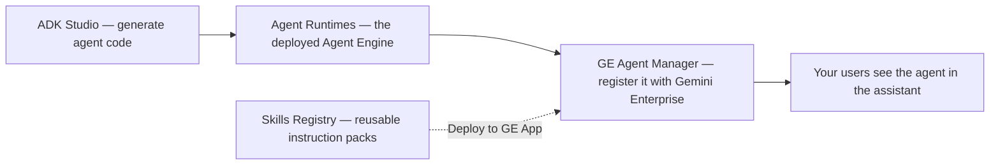
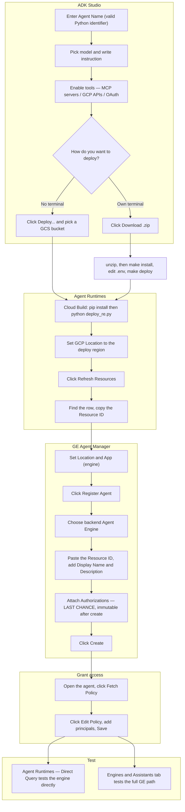

# Chapter 1 — Agent Management

**Who this chapter is for** — Gemini Enterprise administrators who need to get an agent built,
deployed, registered, and reachable by their users. It covers the four tabs in the **Agent
Management** group of the left sidebar.

**What you'll be able to do**

- Register an existing agent with Gemini Enterprise so it appears in your users' assistant.
- Understand exactly which agent backends this app supports (and which it does not).
- Publish and manage enterprise Skills in the Google Cloud Agent Registry.
- Generate a complete, runnable ADK agent project from a form — and know what to do with the ZIP.
- Inspect, query, and delete the Vertex AI Agent Engines your agents actually run on.

**Before you start**

| Requirement | Detail |
|---|---|
| Signed in | The app runs entirely in your browser using **your** OAuth access token. Every API call is made as you. |
| Project ID **and** Project Number | Both are set in the app header and are used by different tabs. Agent Runtimes shows the **Project Number** read-only. |
| A Gemini Enterprise app (engine) | Required for **GE Agent Manager**. The app only ever looks inside the collection `default_collection` and the assistant `default_assistant`. |
| `discoveryengine.googleapis.com` | Enabled. Backs GE Agent Manager. |
| `aiplatform.googleapis.com` | Enabled. Backs Agent Runtimes and ADK deployment. |
| `agentregistry.googleapis.com` | Enabled. Backs Skills Registry. |
| `cloudbuild.googleapis.com`, `storage.googleapis.com` | Only needed if you use ADK Studio's in-app **Deploy** button. |
| IAM for deployment | Agent Engine target: `roles/aiplatform.user`, `roles/storage.objectViewer`. Cloud Run target: `roles/run.admin`, `roles/iam.serviceAccountUser`, `roles/storage.objectViewer`. Verified in [AgentDeploymentModal.tsx](file:///usr/local/google/home/wdufrin/Documents/Code/Gemini-Enterprise-Manager/components/agent-catalog/AgentDeploymentModal.tsx#L357-L361). |
| IAM for managed MCP tools | Generated agents that call Google-managed MCP endpoints need `roles/mcp.toolUser` plus the data role for each service (e.g. `roles/bigquery.dataViewer`, `roles/bigquery.jobUser`). |

---

## At a glance

These four tabs are a pipeline, not four unrelated screens.



| Tab | Route | What it talks to |
|---|---|---|
| **GE Agent Manager** | `/agents` | Discovery Engine (`discoveryengine.googleapis.com`) |
| **Skills Registry** | `/skills-registry` | Agent Registry (`agentregistry.googleapis.com`) |
| **ADK Studio** | `/builder` | Nothing, until you click Deploy or Register. Code generation is 100% local to your browser. |
| **Agent Runtimes** | `/runtimes` | Vertex AI (`{region}-aiplatform.googleapis.com`) and Cloud Run |

Routes are defined in [routeUtils.ts](file:///usr/local/google/home/wdufrin/Documents/Code/Gemini-Enterprise-Manager/utils/routeUtils.ts#L19-L40) and the group is
assembled in [Sidebar.tsx](file:///usr/local/google/home/wdufrin/Documents/Code/Gemini-Enterprise-Manager/components/Sidebar.tsx#L108-L151).

---

## GE Agent Manager

### What it's for

This is the registry your end users actually see. An agent that runs somewhere in Google Cloud —
a Vertex AI Agent Engine, or an HTTP service that speaks the A2A protocol — is invisible to Gemini
Enterprise until you *register* it here. Registering creates an **agent** record under your Gemini
Enterprise app that says "here is the display name, the description, and the address to call."

Think of it as adding an app to a company app store. The app already exists; this is the listing.

### The screen, explained

**Configuration panel (top).** Four controls:

- **Location** — a dropdown with exactly three values: `global`, `us`, `eu`
  ([AgentsPage.tsx](file:///usr/local/google/home/wdufrin/Documents/Code/Gemini-Enterprise-Manager/pages/AgentsPage.tsx#L476-L480)).
- **App (engine)** — the Gemini Enterprise app to look inside. If your project has exactly one
  engine in that location, it is selected for you automatically
  ([AgentsPage.tsx](file:///usr/local/google/home/wdufrin/Documents/Code/Gemini-Enterprise-Manager/pages/AgentsPage.tsx#L154-L160)).
- **Cloud Console** button — opens
  `https://console.cloud.google.com/gemini-enterprise/locations/{location}/engines/{appId}/agentic/agents?project={projectNumber}`.
- **Refresh** — re-lists everything.

> [!IMPORTANT]
> The collection is hard-coded to `default_collection` and the assistant to `default_assistant`.
> A migration function actively overwrites any other value back to those defaults
> ([AgentsPage.tsx](file:///usr/local/google/home/wdufrin/Documents/Code/Gemini-Enterprise-Manager/pages/AgentsPage.tsx#L47-L63)).
> Agents living in a non-default collection are invisible in this app. This is not configurable
> from the UI.

**The agent table.** Sortable columns showing display name, type, state, and actions. Type is read
from the agent definition, with a fallback inference chain when the API doesn't say
([AgentsPage.tsx](file:///usr/local/google/home/wdufrin/Documents/Code/Gemini-Enterprise-Manager/pages/AgentsPage.tsx#L230-L240)):

| Signal in the API response | Type shown |
|---|---|
| `adkAgentDefinition` present | `ADK` |
| `a2aAgentDefinition` present | `A2A` |
| low-code or workflow definition present | `LOW_CODE` |
| an unusual `state` value | `LOW_CODE` |

**State badges** come from the agent's `state` field. A missing state means a *private no-code
agent* — those are read-only in this app (see Known limitations).

````carousel

<!-- slide -->

<!-- slide -->

````

### How to: register a new agent

1. Set **Location** and pick your **App (engine)** at the top of the page.
2. Click **Register Agent**. The registration form opens.
3. Choose the backend type. There are exactly two buttons:
   **Agent Engine** and **HTTP Service (A2A)**
   ([AgentBackendConfig.tsx](file:///usr/local/google/home/wdufrin/Documents/Code/Gemini-Enterprise-Manager/components/agents/form/AgentBackendConfig.tsx#L86-L107)).
4. Fill in **Display Name** and **Description** — both are required.
5. Fill in the backend fields (see the field reference below).
6. Attach an **Authorization** if the agent needs to act as the signed-in user.
7. Click **Create**.

Expected result: the form closes, the list refreshes, and your agent appears with its type badge.

> [!WARNING]
> Authorizations are immutable. Once an agent is created you cannot add, remove, or change its
> authorizations from this app — the edit form renders them disabled with the note
> "Authorization cannot be changed after an agent is created", and the update payload deliberately
> omits `authorizationConfig`
> ([useAgentForm.ts](file:///usr/local/google/home/wdufrin/Documents/Code/Gemini-Enterprise-Manager/hooks/useAgentForm.ts#L525-L532)).
> Get this right the first time, or delete and re-create the agent.

<details>
<summary>Under the hood — the API call this makes</summary>

```
POST https://discoveryengine.googleapis.com/v1alpha/projects/{project}/locations/{location}
     /collections/default_collection/engines/{appId}/assistants/default_assistant/agents
     ?agentId={yourAgentId}
```

For a non-`global` location the host becomes `https://{location}-discoveryengine.googleapis.com`
([core.ts](file:///usr/local/google/home/wdufrin/Documents/Code/Gemini-Enterprise-Manager/services/api/core.ts#L20-L28)).

The body contains `displayName`, `description`, and one of `adkAgentDefinition` or
`a2aAgentDefinition`. Implementation: `createAgent` in
[agents.ts](file:///usr/local/google/home/wdufrin/Documents/Code/Gemini-Enterprise-Manager/services/api/discovery/agents.ts#L47-L60).

Edits use `PATCH` with an `updateMask` assembled from whichever keys are present in the payload
([agents.ts](file:///usr/local/google/home/wdufrin/Documents/Code/Gemini-Enterprise-Manager/services/api/discovery/agents.ts#L64)).
</details>

### How to: deploy, undeploy, or delete an agent

- **Enable / disable** — calls `:enableAgent` or `:disableAgent`
  ([agents.ts](file:///usr/local/google/home/wdufrin/Documents/Code/Gemini-Enterprise-Manager/services/api/discovery/agents.ts#L195-L213)).
- **Share** — calls `:share`; the code strips `/assistants/default_assistant` from the resource
  path before calling
  ([agents.ts](file:///usr/local/google/home/wdufrin/Documents/Code/Gemini-Enterprise-Manager/services/api/discovery/agents.ts#L215-L224)).
- **Delete from the list** — select one or more rows and click delete. You get a confirmation
  modal titled `Confirm Deletion of {n} Agent(s)`, listing each agent and warning
  "This action cannot be undone."
  ([AgentsPage.tsx](file:///usr/local/google/home/wdufrin/Documents/Code/Gemini-Enterprise-Manager/pages/AgentsPage.tsx#L507-L527)).

> [!CAUTION]
> There is a **second** Delete button, and it has no confirmation at all. Open an agent's detail
> view and scroll to **Advanced Actions** — the red **Delete** button there calls the delete API
> immediately on click. No modal, no prompt, no undo.
> See [AgentDetails.tsx:398](file:///usr/local/google/home/wdufrin/Documents/Code/Gemini-Enterprise-Manager/components/agents/AgentDetails.tsx#L398)
> calling `handleDelete` at
> [L133-L144](file:///usr/local/google/home/wdufrin/Documents/Code/Gemini-Enterprise-Manager/components/agents/AgentDetails.tsx#L133-L144).
> Treat that button as live ammunition.

### How to: check who can use an agent

In the agent detail view:

1. Click **Fetch Policy**. This calls `:getIamPolicy` on the agent resource.
2. Review the bindings.
3. Click **Edit Policy** — it stays disabled until step 1 succeeds, with the tooltip
   "Fetch the policy first to get the required ETag".
4. Save. On success you see "IAM Policy updated successfully.", which clears after 5 seconds.

<details>
<summary>Under the hood — the API call this makes</summary>

`getAgentIamPolicy` → `POST {agentResource}:getIamPolicy`
([iam.ts](file:///usr/local/google/home/wdufrin/Documents/Code/Gemini-Enterprise-Manager/services/api/iam.ts#L163-L167)).

`setAgentIamPolicy` → `POST {agentResource}:setIamPolicy`. If the etag is missing it silently
re-fetches the current policy first; that internal warning is swallowed
([iam.ts](file:///usr/local/google/home/wdufrin/Documents/Code/Gemini-Enterprise-Manager/services/api/iam.ts#L169-L191)).
</details>

### Field reference — registration form

| Field | What to enter | Required | Notes / Default |
|---|---|---|---|
| **Agent ID** | Lowercase letters, numbers, hyphens. Max 63 chars. | No (generated if blank) | Pattern `[a-z0-9-]{1,63}`. **Create-only** — cannot be changed later. |
| **Display Name** | What users will see. | **Yes** | — |
| **Description** | What the agent does. Shown to users. | **Yes** | An **AI rewrite** helper is available; it uses `gemini-2.5-flash`. |
| **Backend type** | **Agent Engine** or **HTTP Service (A2A)** | **Yes** | Disabled when editing. Only these two — see limitations. |
| **Agent Engine ID** | The reasoning engine's short ID or full resource name. | **Yes** (Agent Engine mode) | — |
| **Agent Engine Location** | — | — | **Read-only.** Derived from the app location: `us`/`global` → `us-central1`, `eu` → `europe-west1`, anything else → `us-central1` ([types.ts](file:///usr/local/google/home/wdufrin/Documents/Code/Gemini-Enterprise-Manager/components/agents/form/types.ts#L43-L53)). Default `us-central1`. |
| **Invoke URL** | Full HTTPS URL of your A2A endpoint. | **Yes** (A2A mode) | The Cloud Run picker sets this to `{serviceUri}/invoke`. |
| **Source Project ID** | The project owning the backend. | **Yes** when cross-project | — |
| **Created By** | Free text — a team or owner name. | No | Stored inside a synthesized metadata block, not a real API field. |
| **Additional Info** | Free text notes. | No | Same synthesized block. |
| **Authorizations** | Pick from your project's authorizations, or type IDs manually. | No | Default input mode is `manual`. Bare IDs expand to `projects/{project}/locations/global/authorizations/{id}` — **always `global`** ([useAgentForm.ts](file:///usr/local/google/home/wdufrin/Documents/Code/Gemini-Enterprise-Manager/hooks/useAgentForm.ts#L549)). |
| **Organization** (A2A) | Provider organization name for the agent card. | No | Default `My Organization`. |
| **Streaming** (A2A) | Whether the endpoint streams. | No | Default **on**. |
| **DCR extension URI** | Marketplace setup URL. | No | Default `https://cloud.google.com/marketplace/docs/partners/ai-agents/setup-dcr`. |

> [!NOTE]
> **Created By** and **Additional Info** are not first-class API fields. The form packs them into
> the agent's `toolDescription` as a text block, and parses them back out with regular expressions
> when you re-open the agent
> ([useAgentForm.ts](file:///usr/local/google/home/wdufrin/Documents/Code/Gemini-Enterprise-Manager/hooks/useAgentForm.ts#L119-L130)):
>
> ```
> [Agent Metadata]
> Created By: <value or N/A>
> Agent Engine: <path>
> Additional Info: <value or None>
> ```
>
> If you edit that description by any other means, these fields will read back wrong.

### Known limitations & gotchas

- **Only two backend types.** The UI offers `reasoning_engine` and `a2a`. There is **no Dialogflow
  option** in the registration form, despite a Dialogflow page existing elsewhere in the codebase.
- **Private no-code agents are read-only.** If an agent has no `state`, the whole form is disabled
  and you see the banner: *"Editing is disabled for this agent because it is a private no-code
  agent. Its configuration cannot be modified."*
- **The A2A agent card is fabricated.** When you register an A2A agent, the app synthesizes the
  card for you with `protocolVersion: '0.3.0'`, `version: '1.0.0'`, input/output modes
  `['text/plain']`, and exactly one hard-coded skill:
  `{ id: 'chat', name: 'Chat', description: 'Chat', examples: ['Hello'], tags: ['chat'] }`
  ([useAgentForm.ts](file:///usr/local/google/home/wdufrin/Documents/Code/Gemini-Enterprise-Manager/hooks/useAgentForm.ts#L498-L515)).
  There is no UI to change any of it. Your real agent's skills are not represented.
- **Permission errors are hidden by design.** Listing calls `getAgentView` per agent and swallows
  403s, returning `null`
  ([AgentsPage.tsx](file:///usr/local/google/home/wdufrin/Documents/Code/Gemini-Enterprise-Manager/pages/AgentsPage.tsx#L215-L222)).
  The table still renders, but an agent you lack permission on will show sparse or missing detail
  rather than an error. If a row looks empty, suspect IAM.
- **The Cloud Run service scan fails silently.** In A2A mode, clicking to load Cloud Run services
  catches the error and only writes to the browser console
  ([useAgentForm.ts](file:///usr/local/google/home/wdufrin/Documents/Code/Gemini-Enterprise-Manager/hooks/useAgentForm.ts#L403-L413)).
  An empty picker may mean "no services" or "the call failed" — you cannot tell from the UI.
  The picker covers 9 regions only: `us-central1`, `us-east1`, `us-east4`, `us-west1`,
  `europe-west1`, `europe-west2`, `europe-west4`, `asia-east1`, `asia-southeast1`.
- **Sorting by state is slightly wrong.** When an agent has no state, the sort comparator
  substitutes the literal string `'private'`
  ([AgentsPage.tsx](file:///usr/local/google/home/wdufrin/Documents/Code/Gemini-Enterprise-Manager/pages/AgentsPage.tsx#L400-L408)).
  Stateless agents therefore sort alphabetically among the `p`s.
- **Listing is slow on large tenants.** The page walks every assistant × every agent, then issues
  one `getAgentView` per agent.
- **Low-code model list is hard-coded** and includes preview model names that may not exist in your
  project: `gemini-3.1-pro-preview`, `gemini-3.6-flash`, `gemini-3.5-flash`, `gemini-2.5-pro`,
  `gemini-2.5-flash`, `gemini-1.5-pro`, `gemini-1.5-flash`
  ([AgentDetails.tsx](file:///usr/local/google/home/wdufrin/Documents/Code/Gemini-Enterprise-Manager/components/agents/AgentDetails.tsx#L455-L462)).
- **There is no agent catalog or gallery in this tab.** The `components/agent-catalog/` folder is
  used only by ADK Studio's deployment modal.
- **Data store discovery is heuristic.** The "data stores used by this agent" panel walks the
  agent-view JSON looking for any string whose key contains `datastore` and whose value starts with
  `projects/` and contains `/dataStores/`
  ([AgentDetails.tsx](file:///usr/local/google/home/wdufrin/Documents/Code/Gemini-Enterprise-Manager/components/agents/AgentDetails.tsx#L205-L232)).
  Unusual tool schemas will show "No data stores found in this agent's tool configuration."

### Troubleshooting

| Symptom / error text | Cause | Fix |
|---|---|---|
| Agent list is empty but agents exist in Console | Agents are in a non-default collection | Not fixable in-app. Use the Cloud Console link. |
| A row shows no type, no state, no detail | `getAgentView` returned 403 and was swallowed | Grant yourself the Discovery Engine viewer/editor role on that agent. |
| Cloud Run picker is empty in A2A mode | Scan failed silently, or no services in the 9 supported regions | Open the browser console to see the real error; or paste the Invoke URL manually. |
| `AI rewrite failed: {message}` | The `gemini-2.5-flash` call failed | Check `aiplatform.googleapis.com` is enabled and you have `roles/aiplatform.user`. |
| `Please enter some text to rewrite.` | You clicked AI rewrite with an empty description | Type something first. |
| Editing fields are greyed out with a yellow banner | Private no-code agent | Cannot be edited here. Manage it in the Console. |
| **Edit Policy** stays disabled | No policy fetched yet | Click **Fetch Policy** first — the app needs the ETag. |
| Agent deleted unexpectedly | You clicked Delete under **Advanced Actions** | Unrecoverable. Re-register the agent. |

---

## Skills Registry

### What it's for

A **Skill** here is a packaged instruction document — a `SKILL.md` file plus metadata — stored
centrally in the Google Cloud **Agent Registry** so multiple agents can reuse it. Think
"reusable playbook": a brand-voice guide, a sales-proposal structure, an incident postmortem
template. Skills are published once and then deployed into a Gemini Enterprise app.

> [!NOTE]
> This tab is **100% live API** against `https://agentregistry.googleapis.com` (`v1alpha`). There is
> no mock data and no GitHub dependency. The files `services/gitHubService.ts` (imported by nothing)
> and `services/githubApiCache.ts` (used only by ADK Studio's GitHub deploy modal) are unrelated to
> this screen.

### The screen, explained

- **Region selector** — three options, labelled exactly `🌍 Global`, `🇪🇺 EU (Europe)`,
  `🇺🇸 US (United States)`. Default `global`.
- **Stat cards** — Total Central Skills · 🟢 Active in Catalog · 🟡 Draft / Staging · 🏷️ Publishers.
- **Filters** — a publisher dropdown (`All Publishers`) and a status dropdown
  (`All Statuses` / `🟢 Active` / `🟡 Draft / Disabled`), plus a free-text search box.
- **Table** — columns `Skill Name & URN`, `Publisher`, `Status`, `Semantic Trigger & Description`,
  `Actions`. The only action is an eye icon titled "Inspect Skill & Revisions".

> [!WARNING]
> The table has **no sorting and no pagination**. The `nextPageToken` returned by the API is
> discarded, so if your registry has more skills than fit in one API page, the extras are simply
> never shown. There is no indication that this has happened.

**Empty state:** "No Enterprise Skills Found" with a **Publish First Skill** button. If filters are
active you instead get "No skills matched your search filter. Try clearing filters."

**Error state:** a red bar reading
`Failed to fetch enterprise skills from Google Cloud Agent Registry.` with an inline **Retry**.


### How to: publish a new skill

1. Click **Publish First Skill** (empty state) or the publish button in the header.
2. Optionally pick one of the three **templates** to prefill the form:
   - **🛡️ Brand Voice** — "Tone, style & guidelines" → ID `corporate-brand-voice`
   - **💼 Sales Proposals** — "B2B pitch & ROI decks" → ID `enterprise-sales-proposal`
   - **🚨 IT Incident SRE** — "Blameless postmortems" → ID `it-incident-postmortem`
3. Set the **Skill ID** (default `company-brand-voice`) and **Display Name**
   (default `Company Brand Voice`).
4. Choose a **Publisher Namespace**:
   `🏢 Organization Internal (Default)` (`default`),
   `Gemini Enterprise (discoveryengine)` (`discoveryengine.googleapis.com`), or
   `Google Cloud (cloud.google.com)`.
5. Write or paste the `SKILL.md` content.
6. Choose the target state (default **Active**).
7. Click publish.

Expected result: the modal closes and the skill appears in the table.

> [!CAUTION]
> **Your "Active" choice is not honoured on creation.** The create call always sends
> `targetState: 'TARGET_STATE_DRAFT'`
> ([PublishSkillModal.tsx:163](file:///usr/local/google/home/wdufrin/Documents/Code/Gemini-Enterprise-Manager/components/registry/PublishSkillModal.tsx#L163)).
> If you asked for Active, the app then polls up to 10 times at 2.5-second intervals (~25 seconds)
> waiting for the first revision to be ingested, and only then issues a PATCH to activate it.
> That poll **guesses** the resource name — `skills/private-{sanitizedId}` when no publisher is set
> ([L180-L182](file:///usr/local/google/home/wdufrin/Documents/Code/Gemini-Enterprise-Manager/components/registry/PublishSkillModal.tsx#L180-L182))
> — and every poll error is swallowed with a console warning
> ([L204-L206](file:///usr/local/google/home/wdufrin/Documents/Code/Gemini-Enterprise-Manager/components/registry/PublishSkillModal.tsx#L204-L206)).
> **Net effect: a skill can silently stay in DRAFT and the UI will never tell you.** Always re-check
> the Status column after publishing, and use **🟢 Activate in Company Catalog** in the detail modal
> if it is still yellow.

<details>
<summary>Under the hood — the API call this makes</summary>

The `SKILL.md` is zipped in the browser with JSZip, base64-encoded, and sent as
`initialRevision.archiveUploadSource.archiveContent`, with `type: 'SIMPLE'`.

```
POST https://agentregistry.googleapis.com/v1alpha/projects/{p}/locations/{loc}/skills?skillId={id}
PATCH https://agentregistry.googleapis.com/v1alpha/{skillName}?updateMask=...
```

Implementation: `createRegistrySkill`
([registry.ts](file:///usr/local/google/home/wdufrin/Documents/Code/Gemini-Enterprise-Manager/services/api/registry.ts#L49-L58)),
`updateRegistrySkill`
([L60-L73](file:///usr/local/google/home/wdufrin/Documents/Code/Gemini-Enterprise-Manager/services/api/registry.ts#L60-L73)).
A namespace equal to your own project ID is silently dropped from the request
([PublishSkillModal.tsx:172](file:///usr/local/google/home/wdufrin/Documents/Code/Gemini-Enterprise-Manager/components/registry/PublishSkillModal.tsx#L172)).
</details>

### How to: inspect, activate, deploy, or delete a skill

Click the eye icon on a row. The detail modal has three tabs:
**Overview & Specification**, **Revisions (n)**, and **Raw JSON Spec** (with a **Copy JSON** button
that flips to **✓ Copied**).

The footer holds the actions:

| Control | What it does |
|---|---|
| **Delete Skill** (red, far left) | Opens a type-to-confirm dialog — see below. |
| **App:** dropdown | Picks the Gemini Enterprise engine to deploy into. |
| **🚀 Deploy to GE App** | Registers the skill as an agent in that app. Shows **✓ Deployed to GE App!** for 3.5s. |
| **🟢 Activate in Company Catalog** / **🟡 Disable in Company Catalog** | Flips the registry state. |
| **Close** | Dismisses. |

> [!CAUTION]
> **🚀 Deploy to GE App has no confirmation and publishes to everyone.** The call hard-codes
> `state: 'ENABLED'` and `sharingConfig: { scope: 'ALL_USERS' }`
> ([RegistrySkillDetailModal.tsx:119-129](file:///usr/local/google/home/wdufrin/Documents/Code/Gemini-Enterprise-Manager/components/registry/RegistrySkillDetailModal.tsx#L119-L129)).
> One click makes the skill live for your entire organisation. If no engine is selected the app
> auto-picks one: the first engine with `solutionType === 'SOLUTION_TYPE_CHAT'`, else the first
> whose name contains `cosmere`, else simply `engines[0]`
> ([L140](file:///usr/local/google/home/wdufrin/Documents/Code/Gemini-Enterprise-Manager/components/registry/RegistrySkillDetailModal.tsx#L140)).
> **Always set the App dropdown explicitly before clicking Deploy.**

Delete, by contrast, is well guarded: a destructive-confirm dialog titled
`Delete Skill from Registry` that requires you to type the skill's display name, lists three
consequences, and has the button **Delete Skill**
([RegistrySkillDetailModal.tsx:523-539](file:///usr/local/google/home/wdufrin/Documents/Code/Gemini-Enterprise-Manager/components/registry/RegistrySkillDetailModal.tsx#L523-L539)).

### Field reference — Publish Skill

| Field | What to enter | Required | Notes / Default |
|---|---|---|---|
| **Skill ID** | Lowercase, hyphenated identifier. | **Yes** | Default `company-brand-voice`. Error if blank: `Skill ID is required (e.g. sales-pipeline-advisor).` |
| **Display Name** | Human-readable name. | **Yes** | Default `Company Brand Voice`. Error: `Display Name is required.` |
| **Publisher Namespace** | Who owns this skill. | No | Default `default`. A value equal to your project ID is dropped. |
| **Target State** | Active or Draft. | No | UI default **Active** — but see the caution above; creation always sends DRAFT first. |
| **SKILL.md content** | The instruction document. | **Yes in practice** | Zipped and uploaded as the initial revision. |

### Known limitations & gotchas

- **You cannot edit a skill.** There is no edit path — not for the description, not for the
  `SKILL.md`. `createRegistrySkillRevision` is only ever called internally when activating a skill
  that has zero revisions
  ([RegistrySkillDetailModal.tsx:192-200](file:///usr/local/google/home/wdufrin/Documents/Code/Gemini-Enterprise-Manager/components/registry/RegistrySkillDetailModal.tsx#L192-L200)).
  To change a skill you delete and re-publish.
- **The "Use New ID" button lies.** Its label reads `Use New ID ({id}-v2)`, but the code appends a
  random two-digit number: `Math.floor(Math.random() * 90 + 10)`
  ([PublishSkillModal.tsx:277](file:///usr/local/google/home/wdufrin/Documents/Code/Gemini-Enterprise-Manager/components/registry/PublishSkillModal.tsx#L277)).
  You will get e.g. `my-skill-47`, not `my-skill-v2`.
- **Deploy conflicts are resolved silently.** If the agent already exists (HTTP 409), the code
  quietly switches to `updateAgent` and overwrites it
  ([L147-L156](file:///usr/local/google/home/wdufrin/Documents/Code/Gemini-Enterprise-Manager/components/registry/RegistrySkillDetailModal.tsx#L147-L156)).
- **App context is hard-coded** to `appId: 'default_engine'`, `collectionId: 'default_collection'`,
  `assistantId: 'default_assistant'`.
- **No pagination** (see above).

### Troubleshooting

| Symptom / error text | Cause | Fix |
|---|---|---|
| `Failed to fetch enterprise skills from Google Cloud Agent Registry.` | API disabled, wrong region, or no permission | Enable `agentregistry.googleapis.com`; try a different region; check IAM. Use the inline **Retry**. |
| Skill stays 🟡 Draft after publishing as Active | The activation poll timed out or guessed the wrong resource name | Open the skill and click **🟢 Activate in Company Catalog**. |
| `Failed to update state: {message}` | The activate/disable PATCH failed | Usually permissions or a skill with no revisions yet. Wait and retry. |
| `Failed to deploy skill: {message}` | The Discovery Engine agent create/update failed | Check the App dropdown points at a real engine and you can write agents there. |
| `No engines found in project {projectId} ({appLocation}). Please ensure an engine exists in this region.` | No Gemini Enterprise app in that region | Create one, or switch region. |
| `Failed to delete skill: {message}` | Delete rejected | Check permissions; a deployed skill may need to be disabled first. |
| Skills missing from the list | More skills than one API page | Not fixable in-app — use the API or `gcloud` directly. |

---

## ADK Studio

### What it's for

ADK Studio generates a complete Python agent project for you from a form. You describe the agent —
name, model, instructions, which Google Cloud tools it may use — and the app writes the code live,
in your browser, as you type. You then download it as a ZIP, or let the app build and deploy it for
you.

**It is not a wizard.** There are no Next/Back buttons. It is a two-column workbench: settings on
the left, generated code on the right. The page's own heading is **"ADK Prototyper & Code Studio"**
with the subtitle *"Interactive ADK agent code generation, tool composition, and enterprise OAuth
delegation blueprints."*

### If you don't write code — read this first

Here is the honest version of what you get and what you must do.

**What you get:** a ZIP file containing a Python project. It is real, working source code — not a
document and not a configuration file.

**What you must have to use it yourself:**

- Python 3.11 installed.
- The `gcloud` CLI installed, and `gcloud auth application-default login` already run.
- A Google Cloud Storage bucket to use as a staging bucket.
- A terminal, and the willingness to run three or four commands.

**The three commands:**

```bash
unzip my_agent.zip && cd my_agent
make install     # installs the Python dependencies
make deploy      # deploys to Vertex AI Agent Engine
```

**If that sounds like too much:** don't download the ZIP. Use the **🚀 Deploy...** button in the
toolbar instead. That builds and deploys everything using Google Cloud Build — you never touch a
terminal. You only need a GCS bucket to stage the source in.

> [!IMPORTANT]
> Do **not** run `scripts/deploy.sh` from the ZIP. It is broken. The script `cd`s into its own
> `scripts/` directory and then looks for `deploy_re.py` or `app/deploy_re.py` relative to *there* —
> but the ZIP puts the file at `app/deploy_re.py` relative to the project **root**, i.e.
> `../app/deploy_re.py`. Both branches miss, so it always prints `Error: deploy_re.py not found.`
> and exits. Use `make deploy` (or `python -m app.deploy_re` from the project root) instead.
> See [adkDeployScriptTemplate.ts](file:///usr/local/google/home/wdufrin/Documents/Code/Gemini-Enterprise-Manager/services/adkTemplates/adkDeployScriptTemplate.ts#L4-L19)
> vs [agentZipGenerator.ts:121](file:///usr/local/google/home/wdufrin/Documents/Code/Gemini-Enterprise-Manager/utils/agentZipGenerator.ts#L121).

### The screen, explained

**Mode toggle (top).** Two modes:

- **ADK Agent (Engine)** — a full Google ADK agent for Vertex AI Agent Engine.
- **A2A Function (Cloud Run)** — a small Flask service that speaks the A2A JSON-RPC protocol.

**Utility buttons.** **Clear Draft** (titled "Reset form to default state" — no confirmation) and
**Check Build Status**.

**Left column — "1. Configure Agent"** (`AdkBasicSettings` + `AdkToolsConfig` +
`AdkDeploymentConfig`, or the A2A form).

**Right column — "2. Component & Code Explorer"**, with a toolbar:

| Button | Enabled when |
|---|---|
| **📋 Copy File** | agent name is a valid Python identifier |
| **📥 Download .zip** | same |
| **🚀 Deploy...** | same |
| **🔗 Register in GE...** | always |

Code regenerates on every keystroke. If a generator throws, you get an inline comment block
starting `# {label} cannot be generated with the current settings.` instead of a crash
([AgentBuilderPage.tsx](file:///usr/local/google/home/wdufrin/Documents/Code/Gemini-Enterprise-Manager/pages/AgentBuilderPage.tsx#L150-L163)).


### Configuration reference — Basic settings

| Field | What to enter | Required | Notes / Default |
|---|---|---|---|
| **Quick Start Template** | One of five presets. | No | Placeholder "Select a template to auto-fill...". **Selecting one wipes your whole config** — see below. |
| **Agent Name** | A Python identifier. | **Yes** | Pattern `^[A-Za-z_][A-Za-z0-9_]*$`. Invalid input turns the border red. Three toolbar buttons stay disabled until it is valid. |
| **Description** | One line. | No | Default `An agent that can do awesome things.` |
| **Instruction** | The system prompt. | No, but effectively yes | Default `You are an awesome and helpful agent.` |
| **Agent Location** | Deployment region. | No | Only three choices: `us-central1`, `europe-west1`, `asia-east1`. |
| **ADK Framework** | — | — | **Read-only display text**: `Google ADK 2.x`, badge `google-adk ≥ 2.3.0`. |
| **Model** | Gemini model. | No | Default `gemini-2.5-flash`. See the model list below. |

**Model dropdown**, grouped exactly as shown in the UI:

- *Gemini 3.x — Cutting-Edge Reasoning (Global)*: `gemini-3.5-flash` (labelled
  "Recommended - Reasoning Depth"), `gemini-3.5-flash-lite`, `gemini-3.8-flash`,
  `gemini-3.1-pro-preview`, `gemini-3-flash-preview`
- *Gemini 2.x — Production & Auto-Updating*: `gemini-flash-latest`, `gemini-2.5-flash`,
  `gemini-2.5-flash-lite`, `gemini-2.5-pro`

> [!CAUTION]
> **Choosing a Quick Start Template destroys everything you have configured.** The handler builds a
> fresh default config and spreads the template over it — it does not merge with your current state
> ([AdkBasicSettings.tsx:75-147](file:///usr/local/google/home/wdufrin/Documents/Code/Gemini-Enterprise-Manager/components/agent-builder/AdkBasicSettings.tsx#L75-L147)).
> There is no warning and no undo. Pick your template **first**, then configure.

**The five templates** ([starterTemplates.ts](file:///usr/local/google/home/wdufrin/Documents/Code/Gemini-Enterprise-Manager/services/adkTemplates/starterTemplates.ts#L234-L240)):

| Template | Generated agent name | Turns on |
|---|---|---|
| `GCP Logs Reader` | `GCP_Logs_Reader` | Google Search, Cloud Logging MCP, OAuth |
| `GCP Health Monitoring Agent` | `GCP_Health_Monitor` | SCC, Recommender, Service Health, Network Mgmt, Cloud Assist, Logging/Monitoring/Resource Manager MCP, Cloud Run API, Admin Activity, Database Fleet, OAuth, Email, Code Execution |
| `GCP Health Monitoring Agent (API Version)` | `GCP_Health_Monitor_API` | Same domain, direct APIs instead of MCP |
| `GCP BigQuery Expert Agent` | `GCP_BigQuery_Orchestrator` | BigQuery MCP, OAuth, Code Execution |
| `GCP Architecture Diagram Agent` | `GCP_Architecture_Designer` | Google Search, Graphviz, Thinking, Network Mgmt, Compute/Resource Manager/GKE/Cloud SQL MCP, Cloud Run API, Email, OAuth |

> [!WARNING]
> The **GCP BigQuery Expert Agent** template's instruction text tells the model it has an
> `architecture_diagram_agent` sub-agent, but the same template sets `enableGraphvizRendering: false`
> so that tool is never generated. The agent will be prompted to call something that does not exist.

### Tool configuration

The **Agent Tools & Capabilities** card has six collapsible sections (they auto-open if any child is
checked), plus **Expand All** / **Collapse All**:

1. **🧠 Core Capabilities & Reasoning** — thinking toggle with a **Token Budget** input
   (placeholder `Limit (-1)`, helper text "(-1 for unlimited)"), **Code Execution Sub-Agent**,
   **Graphviz Local Renderer**.
2. **🔌 Managed MCP Tool Servers** — badge `{n}/12 active`. Twelve Google-managed MCP endpoints:
   `BigQuery MCP (SQL & Datasets)`, `Cloud Logging MCP`, `Bigtable Admin MCP`,
   `Cloud SQL Admin MCP`, `Cloud Monitoring MCP`, `Compute Engine MCP`, `Firestore MCP`,
   `GKE Kubernetes MCP`, `Resource Manager MCP`, `Cloud Spanner MCP`, `Developer Knowledge MCP`,
   `Maps Grounding Lite MCP`.
3. **⚡ Advanced Enterprise GCP APIs** — badge `{n}/12 active`: `Security Command Center`,
   `GCP Recommender`, `Service Health`, `Network Management`, `Cloud Logging API`,
   `Cloud Monitoring API`, `Cloud Run Discovery`, `Resource Manager`, `Admin Activity Auditing`,
   `Database Fleet Health`, `Gemini Cloud Assist`, `Email Dispatcher`.
4. **🌐 Custom MCP Endpoints** — badge `{n} configured`, with a **Verify Connection** check.
5. **🔐 Authentication & User Impersonation** — badge `OAuth Active` or `ADC / Service Account`.
   Contains **Enable End-User OAuth Delegation** and the ADC-fallback toggle, whose tooltip reads
   "If disabled, tools will fail with an error if no user token is present, instead of defaulting to
   the service account."
6. **📊 Observability & Telemetry** — telemetry (**on by default**) and message logging.

> [!WARNING]
> Four tool features cannot be reached from this panel:
> - **`enableDiscoveryApi`** (the "query Gemini Enterprise" tool) and **`enableBqAnalytics`** have
>   **no checkbox anywhere** in the tools card. They are only settable via a Quick Start Template or
>   the GitHub deploy modal.
> - **`enableStreaming`** and **`enableEvaluation`** exist in the config type and defaults but **no
>   generator reads them** — toggling them changes nothing in the output.

> [!CAUTION]
> Two shipped tools are not what their labels imply.
> **Network Management → `run_connectivity_test`** is a stub: it builds a request with a hardcoded
> `test_id="adk-temp-test"`, never sends it, and returns the literal string
> `"Not fully implemented in template."`
> ([cloudApiToolGenerators.ts:182-183](file:///usr/local/google/home/wdufrin/Documents/Code/Gemini-Enterprise-Manager/services/adkTemplates/tools/cloudApiToolGenerators.ts#L182-L183)).
> Two starter templates enable it and instruct the model to use it.
> **Model Armor** is cosmetic — the generated `model_armor_before_model_callback` reads the template
> name and then `return None`. No Model Armor API is ever called
> ([agentTemplate.ts:498-504](file:///usr/local/google/home/wdufrin/Documents/Code/Gemini-Enterprise-Manager/services/adkTemplates/agentTemplate.ts#L498-L504)).
> Also note **Database Fleet Health** is labelled "Cloud SQL, Spanner & AlloyDB" but the generated
> code only queries Cloud SQL Admin, Spanner, and Firestore — never AlloyDB.

### Deployment settings

The section is literally headed **"Lifecycle Management (WIP)"**
([AdkDeploymentConfig.tsx:71](file:///usr/local/google/home/wdufrin/Documents/Code/Gemini-Enterprise-Manager/components/agent-builder/AdkDeploymentConfig.tsx#L71)).

| Field | Options | Default |
|---|---|---|
| **Deployment Target** | `agent_engine`, `cloud_run` | `agent_engine` |
| **CI/CD Runner** | `none`, `github_actions`, `google_cloud_build` | `none` |
| **Cloud Run Access** | `authenticated`, `public`, `iap` | `authenticated` |

Cloud Run Access controls the flags in the generated Makefile:
`--no-allow-unauthenticated` (authenticated), `--allow-unauthenticated` (public), or
`--no-allow-unauthenticated --iap` (IAP). An unknown value fails **closed** (private).

> [!NOTE]
> This used to hardcode `--allow-unauthenticated`, meaning every agent built here was reachable by
> the entire internet without the user ever being asked. It now defaults to IAM-only. The service
> name is also validated by `assertValidGcpResourceName` before being interpolated into shell
> commands, because `cloudbuild.yaml` runs the Makefile from a `bash -c` step
> ([cicdTemplates.ts:80-101](file:///usr/local/google/home/wdufrin/Documents/Code/Gemini-Enterprise-Manager/services/adkTemplates/cicdTemplates.ts#L80-L101)).

There is also a **Workload Identity Federation** help link that toggles between
"How to set up WIF" and "Hide setup instructions" and prints four
`gcloud iam workload-identity-pools ...` commands, and a button
**Automated CI/CD Workflow Setup** (disabled with the tooltip
"Enter a valid agent name before setting up CI/CD.").

The **ADK STANDARDS VALIDATION** panel lists four checks:
"Standard Folder Structure (app/, tests/)", "Evaluation Configured", "CI/CD Pipeline Configured",
"Design Spec Generated". The first and last are both gated purely on
`isValidAdkAgentName(name) && Boolean(instruction?.trim())` — they are not real inspections.

For GitHub Actions you must supply, in your repository: the secret `GCP_WIF_PROVIDER` and a real
service account email (the generated caller workflow ships the placeholder
`my-service-account@my-project.iam.gserviceaccount.com`). The service account needs
`roles/aiplatform.user`, `roles/run.developer`, and `roles/iam.workloadIdentityUser`.

### How to: download and run the agent yourself

1. Enter a valid **Agent Name**.
2. Configure the model, instruction, and tools.
3. Click **📥 Download .zip**. The file is named `{agentName}.zip` (or `adk_agent.zip`).
4. Unzip it, then in a terminal:

```bash
cd <agent_name>
python3 -m venv .venv && source .venv/bin/activate
pip install -r app/requirements.txt
# edit .env — set GOOGLE_CLOUD_PROJECT, STAGING_BUCKET, DEPLOYMENT_LOCATION
make deploy
```

Expected result: the script either creates a new Agent Engine or updates an existing one with the
same display name, and prints the resource name.

**What is actually in the ZIP**
([agentZipGenerator.ts:101-200](file:///usr/local/google/home/wdufrin/Documents/Code/Gemini-Enterprise-Manager/utils/agentZipGenerator.ts#L101-L200)):

```
<agent_name>.zip
├── app/
│   ├── app.py            always
│   ├── agent.py          always  — the agent itself
│   ├── __init__.py       always
│   ├── requirements.txt  always
│   ├── deploy_re.py      always  — the real deployer
│   ├── auth.py           only if End-User OAuth is on
│   └── tools.py          only if at least one tool is on
├── tests/eval/test_config.json
├── tests/eval/evalsets/basic.evalset.json
├── scripts/launch_local.sh
├── scripts/deploy.sh                    <-- BROKEN, see warning above
├── deployment/terraform/main.tf         <-- contains only "# Terraform config placeholder"
├── installation_scripts/install_graphviz.sh   only if Graphviz is on
├── agent.py              3-line shim re-exporting root_agent from app.agent
├── .env, .gitignore, .gcloudignore
├── README.md, DESIGN_SPEC.md, Makefile
├── Dockerfile                    only if target is cloud_run
├── cloudbuild.yaml               only if runner is google_cloud_build
└── .github/workflows/deploy.yaml only if runner is github_actions
```

The **A2A ZIP** is much simpler — five flat files: `main.py`, `Dockerfile`, `requirements.txt`,
`deploy.sh`, `env.yaml`, named `{serviceName}-source.zip`.

**Generated Makefile targets**
([cicdTemplates.ts:75-142](file:///usr/local/google/home/wdufrin/Documents/Code/Gemini-Enterprise-Manager/services/adkTemplates/cicdTemplates.ts#L75-L142)):

| Target | What it runs |
|---|---|
| `make install` | `pip install -r app/requirements.txt` |
| `make test` | `pytest tests/unit` (if present), then `adk eval ./app tests/eval/evalsets/basic.evalset.json --config_file_path=tests/eval/test_config.json` |
| `make deploy` | Alias for `deploy-agent-engine` (`python -m app.deploy_re`) or `deploy-cloud-run` (`gcloud run deploy`) |

### How to: deploy without a terminal

1. Click **🚀 Deploy...**.
2. Pick a **GCS bucket** for staging.
3. Confirm the target (Agent Engine or Cloud Run) and environment variables.
4. Click deploy. You'll see `Build triggered! ID: {id}`.
5. Use **Check Build Status** in the page header to follow it.

<details>
<summary>Under the hood — the API call this makes</summary>

The browser builds the ZIP, writes `.env` from your environment variables plus
`STAGING_BUCKET=gs://<bucket>`, uploads to
`gs://{bucket}/source/{agentName}-{timestamp}.zip`, then submits a Cloud Build with
`timeout: '1200s'`
([AgentDeploymentModal.tsx:225-341](file:///usr/local/google/home/wdufrin/Documents/Code/Gemini-Enterprise-Manager/components/agent-catalog/AgentDeploymentModal.tsx#L225-L341)).

**Agent Engine** — one step on `python:3.11`:
```
pip install --upgrade pip && \
pip install --root-user-action=ignore -r requirements.txt && \
pip install --root-user-action=ignore "google-cloud-aiplatform[adk,agent_engines]>=1.75.0" && \
python deploy_re.py
```
`DEPLOYMENT_LOCATION=us-central1` is injected if absent.

**Cloud Run** — three steps: `docker build -t {region}-docker.pkg.dev/{project}/cloud-run-source-deploy/{name} .`,
`docker push`, then a `gcr.io/google.com/cloudsdktool/cloud-sdk` bash step.
</details>

> [!WARNING]
> The Cloud Build upload uses a **different, flatter file layout** than the ZIP: no `app/` directory,
> no `__init__.py`, no README, no Makefile, no tests
> ([AgentBuilderPage.tsx:206-228](file:///usr/local/google/home/wdufrin/Documents/Code/Gemini-Enterprise-Manager/pages/AgentBuilderPage.tsx#L206-L228)).
> The GitHub push uses a **third** layout
> ([L238-L280](file:///usr/local/google/home/wdufrin/Documents/Code/Gemini-Enterprise-Manager/pages/AgentBuilderPage.tsx#L238-L280)),
> including a different pair of eval files. Three delivery paths, three project shapes. Debugging
> one does not tell you about the others.

### How to: register straight from the Studio

Click **🔗 Register in GE...**. The modal defaults to `location: 'global'`,
`collectionId: 'default_collection'`, `assistantId: 'default_assistant'`. For A2A it appends
`/invoke` to the URL if you left it off.

Success message: `Successfully registered agent "{name}" (ID: {id}) in Gemini Enterprise!`

> [!NOTE]
> Engine and authorization lists in this modal fail silently (`console.warn` only). If the dropdowns
> look empty, the load failed. This path also never sets an icon or starter prompts — use
> **GE Agent Manager** afterwards if you want those.

### Known limitations & gotchas

- **Six generated files have no preview tab.** `ADK_TABS` contains only seven entries: `agent.py`,
  `deploy_re.py`, `.env`, `requirements.txt`, `README.md`, `auth.py` (if OAuth), `tools.py` (if
  tools) ([types.ts:278-286](file:///usr/local/google/home/wdufrin/Documents/Code/Gemini-Enterprise-Manager/services/adkTemplates/types.ts#L278-L286)).
  `app.py`, `__init__.py`, `Makefile`, `Dockerfile`, `cloudbuild.yaml`, and
  `.github/workflows/deploy.yml` ship in the ZIP but you cannot read them before downloading.
- **ADK version `2.2` does not deploy anything.** Its `deploy_re.py` loads the agent, runs a single
  local chat turn, prints the reply, and logs "Antigravity Agent Execution Completed Successfully."
  It never calls `agent_engines.create`. The test suite pins this as known-broken. Use the default
  version.
- **The `cloud_run` deployment target does not produce a working project.** It adds a Dockerfile
  whose `CMD` is `gunicorn ... main:app` — but the ADK ZIP contains no `main.py` and no
  FastAPI/uvicorn server. `deploy_re.py` only ever targets Agent Engine.
- **`deployment/terraform/main.tf` is an empty stub** — the single line
  `# Terraform config placeholder`.
- **README contradicts the ZIP layout.** It lists `agent.py`, `.env`, `requirements.txt` etc. as if
  they were at the root and tells you to run `python deploy_re.py`; in the ZIP they are inside
  `app/`.
- **Two different eval configurations.** The ZIP ships rubric-based scoring (threshold `0.7`);
  the GitHub push ships `tool_trajectory_avg_score: 1.0` and `response_match_score: 0.8` against an
  evalset expecting the literal reply `"Hello! How can I help you today?"` — which will fail for
  almost any real agent.
- **Custom MCP endpoints get no authentication.** Unlike the 12 managed endpoints, custom ones are
  built with no `header_provider`
  ([agentTemplate.ts:236](file:///usr/local/google/home/wdufrin/Documents/Code/Gemini-Enterprise-Manager/services/adkTemplates/agentTemplate.ts#L236)),
  so any endpoint needing a bearer token will return 401.
- **"Disable ADC fallback" is not fully enforced.** It gates `auth.py` only. The MCP header provider
  and the Discovery tool both call `google.auth.default()` unconditionally
  ([mcpToolGenerators.ts:28-40](file:///usr/local/google/home/wdufrin/Documents/Code/Gemini-Enterprise-Manager/services/adkTemplates/tools/mcpToolGenerators.ts#L28-L40)).
  Do not rely on this toggle for zero-trust guarantees.
- **Tools without OAuth silently fail at runtime.** `tools.py` imports `get_user_credentials` from
  `auth.py`, but `auth.py` is only included when OAuth is enabled. The fallback stub returns `None`,
  so every API tool answers `"Error: Authentication required."`
- **Three different Python versions in one project.** GitHub Actions pins `3.10`, `cloudbuild.yaml`
  uses `python:3.11`, the Dockerfile uses `python:3.11-slim`.
- **Hard-coded regions.** `CLOUD_RUN_DEPLOY_REGION = "us-central1"` in the Makefile generator, with
  no UI control; `deploy_re.py` forces `us-central1` whenever the location is empty or `global`.
- **Generated `agent.py` monkey-patches private ADK/MCP internals** (the MCP
  `StreamableHTTPTransport._handle_post_request` and ADK's `_dereference_schema`). Both are wrapped
  in `try/except ImportError: pass`, so an upstream refactor will silently disable them
  ([agentTemplate.ts:387-466](file:///usr/local/google/home/wdufrin/Documents/Code/Gemini-Enterprise-Manager/services/adkTemplates/agentTemplate.ts#L387-L466)).
- **`DESIGN_SPEC.md` contains a fabricated example exchange** ("User: Hello / Agent: Hello! How can
  I help you today?") regardless of what your agent actually does.
- **The generated A2A service sets `Access-Control-Allow-Origin: '*'`** when CORS is enabled, and
  publishes your full system instruction as the public agent-card `description`.
- **`cloudbuild.yaml` never interpolates your project ID** — you must create the Cloud Build trigger
  yourself and grant the Cloud Build service account deploy permissions.
- **The tests only prove the code compiles.** `tests/codegen/codegenMatrix.test.ts` runs
  `py_compile` across ~50 configurations and asserts string shapes (no shell injection, correct
  Cloud Run access flags, correct thinking config). It does not prove anything runs, that
  dependencies are sufficient, or that deployment succeeds.

### Troubleshooting

| Symptom / error text | Cause | Fix |
|---|---|---|
| **Download .zip**, **Copy File**, **Deploy** all greyed out | Agent Name is not a valid Python identifier | Use letters, digits, underscores; don't start with a digit. |
| Code pane shows `# {label} cannot be generated with the current settings.` | A generator threw for your config | Change the offending setting (usually a tool needing a missing sub-field, e.g. BQ analytics without a dataset ID). |
| `Error: deploy_re.py not found.` | You ran `scripts/deploy.sh` | Run `make deploy` or `python -m app.deploy_re` from the project root. |
| `No GCS bucket selected. Please select a bucket for staging.` | Bucket not chosen in the deploy modal | Pick one. |
| `Deployment failed` / `Validation failed: {message}` | Cloud Build rejected the request | Check `cloudbuild.googleapis.com` is enabled and you hold the deploy roles. |
| Deployment succeeds but nothing appears in Agent Runtimes | You selected ADK version `2.2` | The 2.2 deploy script only runs one local chat turn. Use the default version. |
| All tools return `Error: Authentication required.` | Tools enabled, OAuth disabled | Enable **End-User OAuth Delegation**, or deploy with ADC available. |
| Managed MCP tool returns 403 | Missing `roles/mcp.toolUser` or the data role | Grant both. |
| Custom MCP endpoint returns 401 | Custom endpoints get no auth headers | Use a managed endpoint, or add auth to the generated code by hand. |
| Everything I configured vanished | You picked a Quick Start Template | Reconfigure. Pick templates first next time. |

---

## Agent Runtimes

### What it's for

This tab shows the *machines* — the Vertex AI Agent Engines (and A2A Cloud Run services) that
actually execute your agents. GE Agent Manager shows the listing; this shows the running thing
behind the listing. Use it to confirm a deployment landed, see how many conversations are open,
inspect the deployment spec, and clean up engines you no longer need.

### The screen, explained

**Configuration card.**

- **Project ID / Number** — **read-only**. It mirrors the header. Shows italic `Not set` if empty.
- **GCP Location** — a dropdown with nine regions:
  `us-central1` (default), `us-east1`, `us-east4`, `us-west1`, `europe-west1`, `europe-west2`,
  `europe-west4`, `asia-east1`, `asia-southeast1`.
- **Cloud Console** button →
  `https://console.cloud.google.com/vertex-ai/agents/agent-engines?project={projectNumber}`.
- **Refresh Resources** button (shows `Loading...` while busy).

> [!IMPORTANT]
> **One region at a time.** There is no "all regions" option. Changing the dropdown immediately
> refetches — there is no Apply button. If an engine is missing, check the other eight regions
> before concluding it doesn't exist.

**The table.** Its header actually reads **Available Agents** (not "Agent Runtimes").

| Column | Sortable | Content |
|---|---|---|
| *(checkbox)* | no | Row select; header checkbox selects all |
| **Display Name** | yes | The engine's display name |
| **Type** | yes | `Agent Engine` (purple pill) or `Cloud Run (A2A)` (teal pill) |
| **Resource ID** | yes | Last path segment, monospace |
| **Used By Agents** | yes (by count) | Clickable agent names, or italic `Not in use` |
| **Actions** | no | See below |

Sort indicators are `↑` and `↓`. Default is unsorted (API order). Clicking an agent name in
**Used By Agents** jumps you to GE Agent Manager with that agent open for editing.

**Row actions.** Agent Engine rows get: a session-count pill (green and clickable when > 0, grey and
disabled at 0, titled `{n} active session(s)`), **Direct Query**, **Agent Card**, **Details**,
**Delete**. Cloud Run rows get only **Direct Query**, **Details**, **Delete**.

When rows are selected, the header shows `{n} selected` and a red **Delete Selected** button.

Empty state: `No available agent resources found in this location.`


### How to: confirm a deployment landed

1. Set **GCP Location** to the region you deployed into (ADK Studio defaults to `us-central1`).
2. Click **Refresh Resources**.
3. Find your engine by **Display Name** — this is the agent name you typed in ADK Studio.

Expected result: a row with type `Agent Engine` and a **Resource ID**. Copy that ID; you need it
when registering in GE Agent Manager.

### How to: inspect an engine

Click **Details**. You get two tabs.

**Details tab** shows: `Full Resource Name`, `Location`, `Created On`, `Last Modified`, then a
**Deployment Specification** section with `Agent Framework`, `Python Version`, `Pickle GCS URI`,
`Requirements GCS URI`, and **Environment Variables**. Empty values render as `Not set`.

It also shows `Agents Using This Engine ({n})`, an **Active Sessions** section with a
**View Active Sessions** button, and a **Content Security** card offering **Enable via CLI** for
Model Armor. That button opens a modal with a copyable command:

```
gcloud services content-security add \
  "https://{location}-aiplatform.googleapis.com/v1beta1/{engineName}:query" \
  modelarmor.googleapis.com \
  --project="{projectId}"
```

**Metrics tab** embeds the Agent Engine metrics viewer, filtered by `tool_id`.

### How to: test an engine without leaving the app

Click **Direct Query**. A 450×600 chat panel opens in the bottom-right, headed
`Direct Query: {displayName}`. Type in the box (placeholder `Type a direct query...`) and press
Enter or click **Send**. The info icon (`Show cURL commands`) shows the request for every turn.

<details>
<summary>Under the hood — the API call this makes</summary>

```
POST https://{location}-aiplatform.googleapis.com/v1beta1/{engineName}:streamQuery
Authorization: Bearer <your token>
Content-Type: application/json
X-Goog-User-Project: {projectId}

{ "input": { "message": "<your text>", "user_id": "<effectiveUserId>" } }
```

`effectiveUserId` is `oid:{your OID}` when available, otherwise the random session UUID
([DirectQueryChatWindow.tsx](file:///usr/local/google/home/wdufrin/Documents/Code/Gemini-Enterprise-Manager/components/agent-engines/DirectQueryChatWindow.tsx#L71)).
Note the cURL modal always prints the session UUID as `user_id`, even when the live request used
`oid:` — so the copied command is not byte-identical to what was sent.
</details>

Cloud Run (A2A) rows open a similar panel that POSTs JSON-RPC to `{serviceUri}/invoke`.

> [!WARNING]
> Two documented endpoints in this area disagree with the code:
> - The **Agent Card** modal's help text tells you the card lives at `/.well-known/agent-card.json`,
>   but the app fetches `/a2a/v1/card`
>   ([AgentCardModal.tsx:177](file:///usr/local/google/home/wdufrin/Documents/Code/Gemini-Enterprise-Manager/components/agent-engines/AgentCardModal.tsx#L177)
>   vs [vertexReasoning.ts:142](file:///usr/local/google/home/wdufrin/Documents/Code/Gemini-Enterprise-Manager/services/api/vertexReasoning.ts#L142)).
> - The Cloud Run query panel's generated cURL targets `{uri}/message`, while the app calls
>   `{uri}/invoke`.
>
> Trust the code paths above, not the copied snippets.

### How to: terminate sessions

1. Click the green session-count pill on an Agent Engine row.
2. The modal **Terminate Sessions** appears: "Are you sure you want to terminate active sessions for
   **{displayName}**?"
3. Click **Terminate All**.

Expected result: the pill drops to `0`.

> [!CAUTION]
> The pill showing `0` afterwards is **not proof that it worked.** Session deletes run under
> `Promise.allSettled` and the results are never inspected; the count is optimistically set to zero
> regardless of failures
> ([useAgentEngines.ts:437-448](file:///usr/local/google/home/wdufrin/Documents/Code/Gemini-Enterprise-Manager/hooks/useAgentEngines.ts#L437-L448)).
> Click **Refresh Resources** to see the true count.

### How to: delete a runtime

1. Select rows (or click **Delete** on a single row).
2. The modal `Confirm Deletion of {n} Resource(s)` lists each resource and warns:
   "This action cannot be undone. Active sessions (direct queries) will be automatically terminated
   before deletion."
3. Click **Delete**.

<details>
<summary>Under the hood — the API call this makes</summary>

For each Agent Engine: list sessions → delete each session → then

```
DELETE https://{location}-aiplatform.googleapis.com/v1beta1/{engineName}?force=true
```

The returned long-running operation is polled every 5 seconds, up to 60 times (300 seconds)
([useAgentEngines.ts:342-364](file:///usr/local/google/home/wdufrin/Documents/Code/Gemini-Enterprise-Manager/hooks/useAgentEngines.ts#L342-L364)).

For Cloud Run: `DELETE https://{region}-run.googleapis.com/v2/{name}` — **the LRO is not polled**,
so the list may still show the service immediately afterwards.
</details>

> [!CAUTION]
> Two things the modal does not tell you:
> 1. `?force=true` **cascades**, deleting child resources server-side. The modal only mentions
>    sessions.
> 2. Clicking **Delete** on a single row **silently discards** any checkboxes you had already
>    ticked, replacing the selection with just that row
>    ([useAgentEngines.ts:337-340](file:///usr/local/google/home/wdufrin/Documents/Code/Gemini-Enterprise-Manager/hooks/useAgentEngines.ts#L337-L340)).
>    The modal's list does reflect the new selection — read it before confirming.

### Known limitations & gotchas

- **"Used By Agents" can under-report — and you might delete a live engine because of it.** The
  mapping is built by walking collections → engines → assistants → agents across the three
  hard-coded Discovery locations `['global', 'us', 'eu']`. Every failure is a `console.warn` only:
  `[AgentEngines] Failed to enumerate agents under collection "{name}" in "{loc}". Agent list may be
  incomplete.` and `[AgentEngines] Failed to list collections in location "{loc}". Agent list may be
  incomplete.` A row can read `Not in use` while an agent is bound to it.
- **Cloud Run listing failures are entirely invisible.** `console.warn("Cloud Run fetch failed", e)`
  and nothing else
  ([useAgentEngines.ts:245-247](file:///usr/local/google/home/wdufrin/Documents/Code/Gemini-Enterprise-Manager/hooks/useAgentEngines.ts#L245-L247)).
  Agent Engine failures *do* surface as `Agent Engines: {message}`.
- **Non-A2A Cloud Run services are hidden.** A service is listed only if it has an `AGENT_URL` or
  `PROVIDER_ORGANIZATION` env var, or its name contains `a2a`
  ([useAgentEngines.ts:51-55](file:///usr/local/google/home/wdufrin/Documents/Code/Gemini-Enterprise-Manager/hooks/useAgentEngines.ts#L51-L55)).
  The types `Cloud Run (Agent)` and `Cloud Run Service` exist in the code but are never produced.
- **Session counts cap at 100 and are silently wrong above that.** Only the first page is counted;
  `nextPageToken` is ignored. A count failure yields `undefined`, which simply hides the pill —
  indistinguishable from "no sessions".
- **Engine listing is one page of 200.** No pagination.
- **The permission-warnings panel is dead UI.** `permissionWarnings` is only ever set to `[]`, so it
  can never render.
- **Three names for one screen**: route/label `Agent Runtimes`, table header `Available Agents`,
  component folder `agent-engines`.
- **Session counts do not update after a Direct Query.** Only a full **Refresh Resources** updates
  them.

### Troubleshooting

| Symptom / error text | Cause | Fix |
|---|---|---|
| `Project ID/Number and Location are required to list resources.` | Project Number not set in the header | Set it in the app header. |
| `Agent Engines: {message}` | The Vertex list call failed | Usually `aiplatform.googleapis.com` disabled or missing `roles/aiplatform.user`. |
| `No available agent resources found in this location.` | Wrong region, or nothing deployed there | Try the other eight regions. |
| `Failed to fetch resources.` | Generic outer failure | Check network and token; click **Refresh Resources**. |
| A2A Cloud Run services missing | Fetch failed silently, or they lack the A2A markers | Check the browser console; add `AGENT_URL` to the service. |
| `Operation timed out after 300s waiting for completion. It may still be running in Google Cloud: {operation}` | The delete LRO exceeded 60 polls | It is probably still progressing. Refresh in a few minutes. |
| `Operation failed: {message}` | The delete LRO failed server-side | Read the message; often a child resource still references the engine. |
| `Failed to delete some resources:` followed by `- {id}: {reason}` | Partial batch failure | Retry the listed ones individually. |
| `Failed to clear sessions: {message}` | Session listing failed | Refresh and retry. |
| Session pill missing on a row | Session count call failed, or the engine has no sessions API | Not distinguishable in the UI. Use **Details → View Active Sessions**. |
| `Failed to fetch full engine details.` | `getReasoningEngine` failed | Check IAM on that specific engine. |
| `Failed to retrieve agent card for this engine.` | Engine was not deployed with A2A enabled | Redeploy with `enable_a2a=True`. Ignore the modal's `/.well-known/` advice. |
| Deleted a Cloud Run service but it still shows | The Cloud Run delete LRO is not polled | Click **Refresh Resources** again after a few seconds. |

---

## Pages in this group that are not in the sidebar

Three page components exist and have working routes but are not in the navigation. Verified by
grepping every reference to `Page.CLOUD_RUN_AGENTS`, `Page.DIALOGFLOW_AGENTS`, and
`Page.A2A_TESTER` across the repository.

| Page | Route | Reachable? |
|---|---|---|
| **A2A Tester** | `/a2a-tester` | **Yes, but not from the sidebar.** The sidebar entry is commented out at [Sidebar.tsx:129](file:///usr/local/google/home/wdufrin/Documents/Code/Gemini-Enterprise-Manager/components/Sidebar.tsx#L129). The only in-app navigation is the **Test A2A Endpoint** button on a Cloud Run node in the **Architecture** tab ([DetailsPanel.tsx:156](file:///usr/local/google/home/wdufrin/Documents/Code/Gemini-Enterprise-Manager/components/architecture/DetailsPanel.tsx#L156)). |
| **Cloud Run Agents** | `/cloud-run` | **No.** Zero navigation sources anywhere in the app. It renders only if you type the URL. |
| **Dialogflow Agents** | `/dialogflow` | **No.** Same — URL only. |

> [!NOTE]
> This explains the missing Dialogflow option in the GE Agent Manager registration form. A
> Dialogflow CX page exists (titled `Dialogflow CX Agents`, listing agents and offering a test chat
> that hard-codes `languageCode: "en"`), but it is not part of the supported navigation and
> Dialogflow agents cannot be registered with Gemini Enterprise from this app.

The router also redirects several legacy paths
([routeUtils.ts:57-68](file:///usr/local/google/home/wdufrin/Documents/Code/Gemini-Enterprise-Manager/utils/routeUtils.ts#L57-L68)):
`/v_*` → Observability, `/catalog` → GE Agent Manager, `/connectors` → Connectors & Data Stores,
and `/domains` · `/custom-domains` · `/vanity-urls` → Assistant.

---

## End-to-end: build, deploy, register, grant, test

This is the path the code actually supports.



> [!IMPORTANT]
> Step **C5** is the one that catches people. Authorizations cannot be changed after creation. If
> you get it wrong, your only remedy is to delete the agent and register it again.

Shortcut: ADK Studio's **🔗 Register in GE...** button collapses S2 and S3 into one dialog. It is
faster, but it never sets an icon or starter prompts, and its dropdowns fail silently — so for a
production agent, do the full path above.

---

## Chapter troubleshooting index

Every error string this chapter's code can surface.

### GE Agent Manager

| Error / symptom | Cause | Fix |
|---|---|---|
| `AI rewrite failed: {message}` | Vertex `gemini-2.5-flash` call failed | Enable `aiplatform.googleapis.com`; grant `roles/aiplatform.user`. |
| `Please enter some text to rewrite.` | AI rewrite clicked with an empty field | Enter text first. |
| Empty agent list | Non-default collection, or wrong location/engine | Only `default_collection` is visible. Check Location and App. |
| Row with missing type/state | 403 on `getAgentView`, swallowed | Fix IAM on that agent. |
| Empty Cloud Run picker | Scan failed silently, or no services in the 9 regions | Check the console; paste the URL manually. |
| Form disabled + yellow banner | Private no-code agent | Not editable here. |
| **Edit Policy** disabled | No ETag yet | Click **Fetch Policy**. |
| `IAM Policy updated successfully.` disappears | Intentional — clears after 5s | None. |
| Agent gone with no prompt | **Advanced Actions → Delete** has no confirmation | Unrecoverable. Re-register. |

### Skills Registry

| Error / symptom | Cause | Fix |
|---|---|---|
| `Failed to fetch enterprise skills from Google Cloud Agent Registry.` | API disabled / wrong region / IAM | Enable `agentregistry.googleapis.com`; use **Retry**. |
| `Skill ID is required (e.g. sales-pipeline-advisor).` | Blank Skill ID | Enter one. |
| `Display Name is required.` | Blank display name | Enter one. |
| `Failed to update state: {message}` | Activate/disable PATCH failed | Check permissions; skill may have no revision yet. |
| `Failed to deploy skill: {message}` | Discovery Engine agent create/update failed | Verify the App dropdown and write permissions. |
| `Failed to delete skill: {message}` | Delete rejected | Disable it first; check IAM. |
| `No engines found in project {projectId} ({appLocation}). Please ensure an engine exists in this region.` | No GE app in that region | Create one or change region. |
| Skill stuck 🟡 Draft after choosing Active | Activation poll timed out / guessed wrong name | Open it and click **🟢 Activate in Company Catalog**. |
| Skill deployed to everyone unexpectedly | **🚀 Deploy to GE App** hardcodes `ALL_USERS` with no confirmation | Disable it, then manage sharing in the Console. |
| `Use New ID ({id}-v2)` produced a different ID | Label is wrong; code appends a random 2-digit number | Set the ID manually. |
| Some skills never appear | No pagination | Use the API directly. |

### ADK Studio

| Error / symptom | Cause | Fix |
|---|---|---|
| Toolbar buttons disabled | Invalid Agent Name | Must match `^[A-Za-z_][A-Za-z0-9_]*$`. |
| `# {label} cannot be generated with the current settings.` | Generator threw | Fix the incomplete tool config. |
| `Error: deploy_re.py not found.` | `scripts/deploy.sh` is broken | Use `make deploy`. |
| `Error: Failed to get access token. Please run 'gcloud auth login' first.` | `launch_local.sh` has no gcloud token | Run `gcloud auth login`. |
| `No GCS bucket selected. Please select a bucket for staging.` | No bucket chosen | Pick one in the deploy modal. |
| `Deployment failed` | Cloud Build submit failed | Enable `cloudbuild.googleapis.com`; check roles. |
| `Validation failed: {message}` | Pre-flight validation rejected the config | Read the message; usually the agent name. |
| `{name} is not a valid Google Cloud resource name` | Agent name unsafe for shell interpolation | Rename using lowercase letters, digits, hyphens. |
| `Error: Authentication required.` (at runtime) | Tools on, OAuth off | Enable End-User OAuth Delegation. |
| `Not fully implemented in template.` (at runtime) | `run_connectivity_test` is a stub | Don't rely on it; remove the tool. |
| Deploy "succeeds" but no engine exists | ADK version `2.2` never deploys | Use the default version. |
| Cloud Run target won't start | No `main.py` for the gunicorn `CMD` | Use the Agent Engine target. |
| `Project ID is required.` / `Target Engine ID is required.` / `Agent Display Name or Name is required.` | Register-in-GE modal validation | Fill the field. |

### Agent Runtimes

| Error / symptom | Cause | Fix |
|---|---|---|
| `Project ID/Number and Location are required to list resources.` | Project Number unset | Set it in the header. |
| `Agent Engines: {message}` | Vertex list failed | Enable `aiplatform.googleapis.com`; grant `roles/aiplatform.user`. |
| `Failed to fetch resources.` | Generic failure | Refresh; check the token. |
| `No available agent resources found in this location.` | Wrong region | Check the other eight. |
| `Operation timed out after 300s waiting for completion. It may still be running in Google Cloud: {operation}` | Delete LRO exceeded 60 polls | Wait and refresh. |
| `Operation failed: {message}` | Delete LRO failed | Read the message. |
| `Failed to delete some resources:` + `- {id}: {reason}` | Partial batch failure | Retry individually. |
| `Failed to clear sessions: {message}` | Session listing failed | Refresh and retry. |
| `Failed to fetch full engine details.` | `getReasoningEngine` failed | Check IAM. |
| `Failed to fetch active sessions.` | Session list failed | Check IAM; retry. |
| `Failed to delete session {id}` | Session delete failed | Retry. |
| `Failed to retrieve agent card for this engine.` | Not deployed with A2A | Redeploy with `enable_a2a=True`. |
| `No agent card data available.` | Engine returned an empty card | Same. |
| `Reasoning Engine Stream API Error: {status} - {text}` | Direct Query failed | Check the status: 403 = IAM, 404 = wrong engine/region. |
| `Error: Failed to get response from agent.` | Direct Query got no usable reply | Check Cloud Logging for the engine. |
| `HTTP {status}: {text}` | Non-A2A Cloud Run query failed | Check the service's auth settings. |
| Row says `Not in use` but an agent uses it | Enumeration failed silently | Verify in GE Agent Manager before deleting. |
| Session pill missing | Count call failed, or no sessions | Use **Details → View Active Sessions**. |
| My checkbox selection vanished | Clicking a row's **Delete** replaces the selection | Read the modal's list before confirming. |
