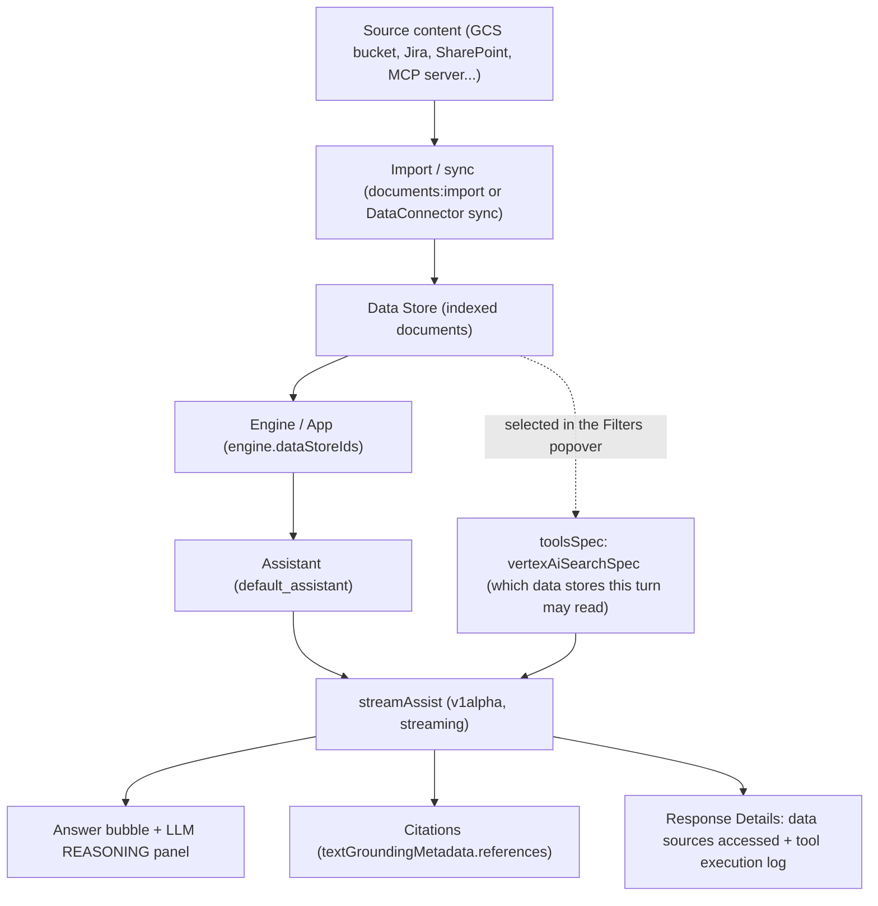
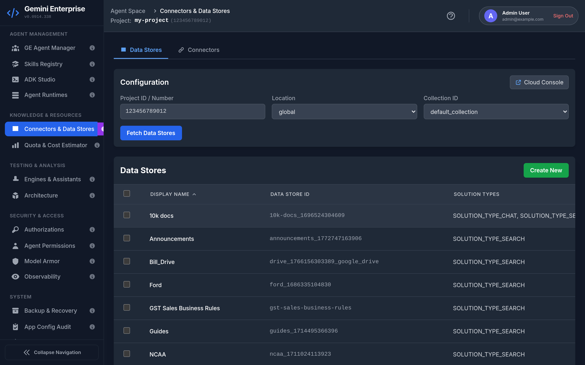
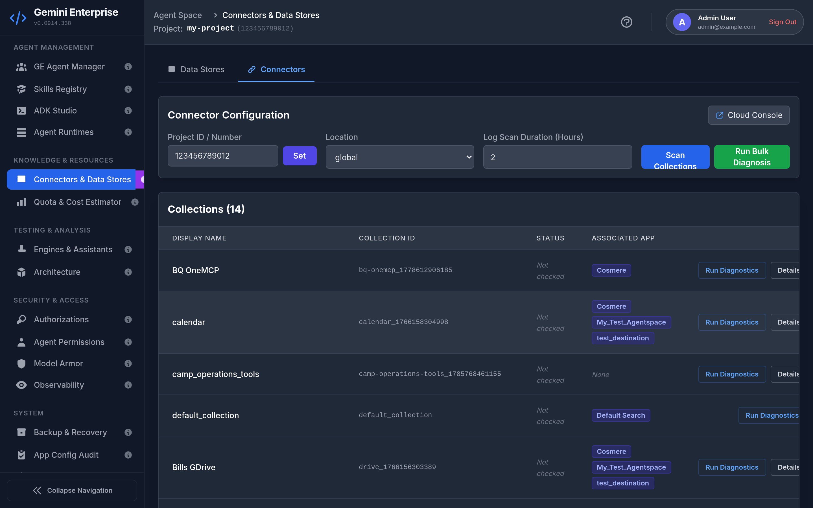
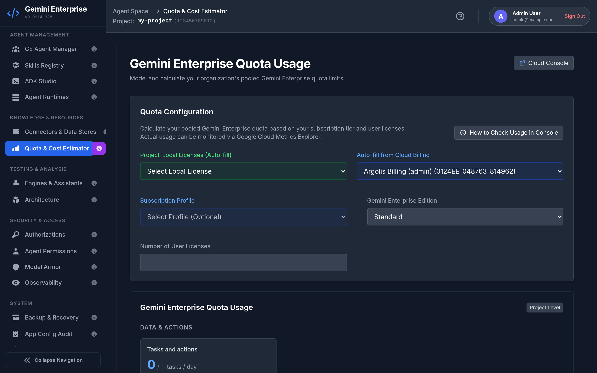
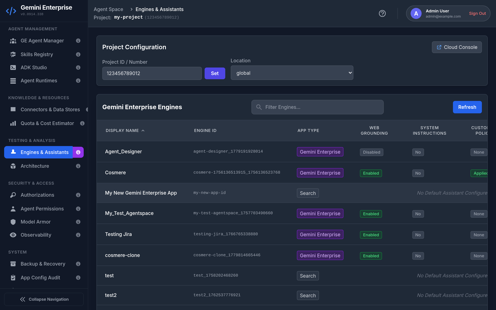
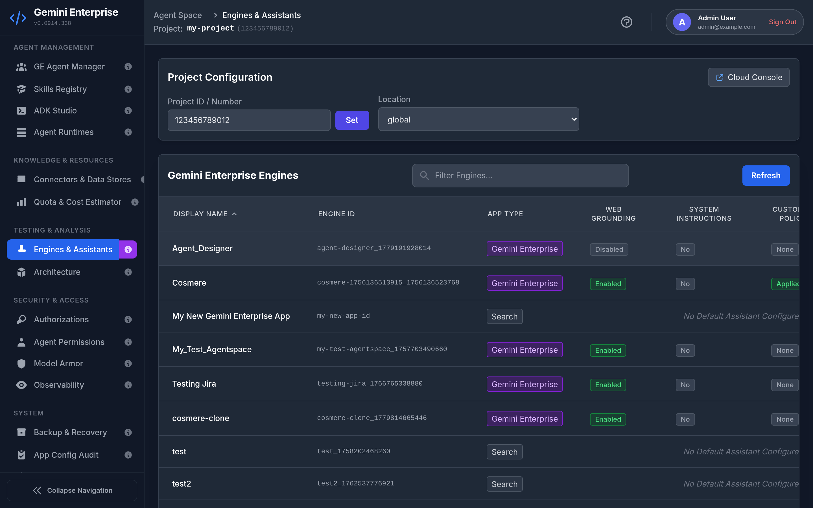
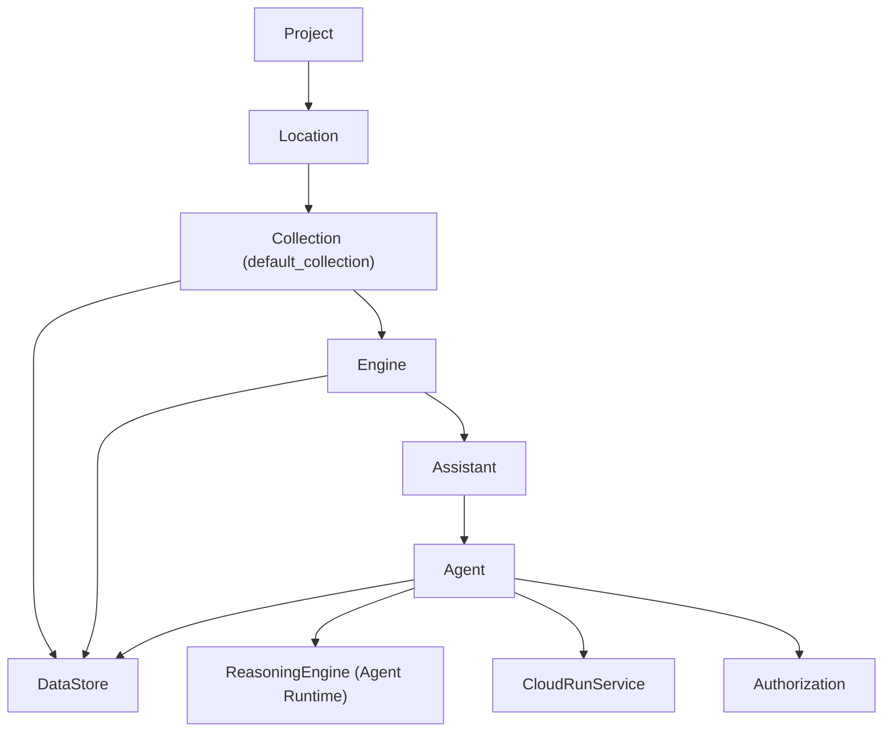
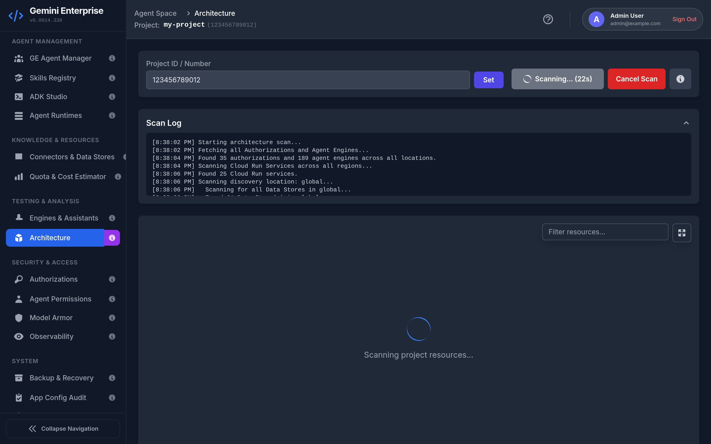

# Chapter 2 — Knowledge, Resources, and Testing

**Who this chapter is for** — Administrators who need to get content *into* Gemini Enterprise, keep an eye on what that content costs in quota, then prove the whole thing actually answers questions correctly.

**What you'll be able to do**

- Create a Discovery Engine **data store**, import documents into it, and query it without leaving the app.
- Diagnose a broken third-party connector (Jira, SharePoint, Salesforce, …) and read its real failure reason.
- Model your pooled Gemini Enterprise quota against your licence count and see live 24-hour usage.
- Open any engine in a live chat playground, restrict it to specific data stores, and inspect the citations and tool calls behind an answer.
- Scan the whole project and see a topology graph of every agent, engine, data store, runtime, and authorization — and how they link.

**Before you start**

| Requirement | Why | Where it bites if missing |
|---|---|---|
| Project **ID** *and* **Number** configured | Almost every call needs the number for `X-Goog-User-Project`; console deep links need it too | All four tabs show `Not set (configure on Agents page)` |
| `discoveryengine.googleapis.com` enabled | Data stores, engines, assistants, agents | Every list call 403s |
| `roles/discoveryengine.admin` (or editor) | Create / edit / delete data stores and engines | Create + Delete buttons return 403 |
| `roles/discoveryengine.viewer` **and** `roles/resourcemanager.organizationViewer` | Detecting whether ACL-aware (identity-restricted) data stores are supported | **Connected DataStores** tab silently disappears — see [checkDataStoreAclSupport](file:///usr/local/google/home/wdufrin/Documents/Code/Gemini-Enterprise-Manager/services/api/dataStores.ts#L106-L117) |
| `monitoring.timeSeries.list` | Live quota usage numbers | Every quota card reads **Unavailable** |
| `roles/storage.objectAdmin` on a staging bucket + a CORS rule on it | Browser-side upload of documents before import | Upload dies with a CORS error; the app prints the exact `gcloud` fix |
| `logging.logEntries.list` | Connector diagnostics pulls recent error logs | Diagnostics warns `Could not fetch Cloud Logging entries.` |
| `roles/run.viewer` | Cloud Run services appear in the architecture scan | Scan logs `NOTE: Could not scan Cloud Run in <loc>: <msg>` and simply omits them |

---

## At a glance

These four tabs are the "content in, answers out" half of the product. Two of them live under **Knowledge & Resources** and two under **Testing & Analysis**:

| Tab | Group | One-line job |
|---|---|---|
| **Connectors & Data Stores** | Knowledge & Resources | Where your content lives and how it gets indexed |
| **Quota & Cost Estimator** | Knowledge & Resources | How much of your pooled daily quota you're burning |
| **Engines & Assistants** | Testing & Analysis | Configure the app your users talk to, and talk to it yourself |
| **Architecture** | Testing & Analysis | A map of everything and how it's wired |

### How an answer actually gets made

This is the path your content takes, end to end. Every arrow below corresponds to a real call in the codebase.



**Reading it in plain English:** content is imported into a **data store**; a **data store** is attached to an **engine**; an engine exposes an **assistant**; when you ask a question the assistant is told which data stores it is allowed to read this turn, it retrieves matching passages, the model writes an answer from those passages, and the passages it used come back as **citations**. "Grounding" is exactly that: forcing the model to answer *from retrieved text* instead of from memory. A citation is the receipt.

> [!NOTE]
> The sidebar shows 15 tabs. Three pages exist in the code but are **not** in the sidebar and are still reachable: **MCP Servers** at `#/mcp-servers` ([AppRoutes.tsx](file:///usr/local/google/home/wdufrin/Documents/Code/Gemini-Enterprise-Manager/components/layout/AppRoutes.tsx#L95-L96)), **A2A Tester** at `#/a2a-tester` (also reachable from the Architecture details panel), and **Test G.E. Agent**. `Page.CHAT` and `Page.A2A_TESTER` are explicitly commented out of the nav in [Sidebar.tsx](file:///usr/local/google/home/wdufrin/Documents/Code/Gemini-Enterprise-Manager/components/Sidebar.tsx#L128-L129).

---

## Connectors & Data Stores

Route: `#/datastores` (the alias `#/connectors` also lands here). Source: [DataStoresPage.tsx](file:///usr/local/google/home/wdufrin/Documents/Code/Gemini-Enterprise-Manager/pages/DataStoresPage.tsx).

### What it's for

A **data store** is a labelled bucket of indexed content. You put documents in it; Gemini Enterprise searches it. Nothing your users ask can be answered from your own content unless that content is in a data store that is attached to their engine.

This tab has two sub-tabs. **Data Stores** manages the containers and the documents inside them. **Connectors** manages *collections* — the plumbing that pulls content in from a third-party system like Jira or SharePoint on a schedule.

### The screen, explained

At the top is a configuration panel, then a sub-tab switcher, then the list.

**Configuration panel** ([DataStoresPage.tsx](file:///usr/local/google/home/wdufrin/Documents/Code/Gemini-Enterprise-Manager/pages/DataStoresPage.tsx#L465-L521))

| Control | Behaviour |
|---|---|
| **Project ID** / **Project Number** | Read-only here. Placeholder is `Not set (configure on Agents page)` — set them on **GE Agent Manager** |
| **Location** | `global`, `us`, or `eu`. Changing it re-queries |
| **Collection ID** | A dropdown *only* if the project has more than one collection; otherwise read-only text |
| **Fetch Data Stores** | Runs the list call |
| Cloud Console button | Opens `console.cloud.google.com/gen-app-builder/data-stores?project=<projectNumber>` |

**Sub-tabs** — **Data Stores** and **Connectors** ([L411-L442](file:///usr/local/google/home/wdufrin/Documents/Code/Gemini-Enterprise-Manager/pages/DataStoresPage.tsx#L411-L442)). You can deep-link straight to the second one with `?tab=connectors`.

**The list** ([DataStoreList.tsx](file:///usr/local/google/home/wdufrin/Documents/Code/Gemini-Enterprise-Manager/components/datastores/DataStoreList.tsx)) has a checkbox column, **Display Name**, **Data Store ID**, **Solution Types**, and **Actions** (View, Edit, Delete). Above it sit **Create New** (green) and **Delete Selected** (red) plus an `N selected` counter. With no results you get `No data stores found for the provided configuration.`

> [!WARNING]
> The pager is off by one. The footer renders `Page {currentPage + 1}` at [DataStoreList.tsx#L206](file:///usr/local/google/home/wdufrin/Documents/Code/Gemini-Enterprise-Manager/components/datastores/DataStoreList.tsx#L206) while the page index already starts at `1` ([DataStoresPage.tsx#L89](file:///usr/local/google/home/wdufrin/Documents/Code/Gemini-Enterprise-Manager/pages/DataStoresPage.tsx#L89)). **The first page of results is labelled "Page 2."** Cosmetic only — the data is correct.



### How to: create a data store

1. Confirm **Location** and **Collection ID** are the ones you want — a data store cannot be moved afterwards.
2. Click **Create New**.
3. Enter a **Display Name** (what humans see).
4. Enter a **Data Store ID**. Lowercase letters, digits and hyphens only, 1–63 characters. The hint reads *"A unique ID for the data store. Must use lowercase, numbers, and hyphens."* This ID is permanent.
5. Choose a **Default Parser**. The three options are labelled verbatim:
   - `Digital Parser - Default for all file types unless overridden.`
   - `Layout Parser - Recommended for HTML, PDF, or DOCX files for RAG.`
   - `OCR Parser - For scanned PDFs or PDFs with text inside images.`
6. Optionally set **Parser Overrides** per file type — `pdf`, `docx`, `xlsx`, `pptx`, `html`. Each defaults to `Use Default ({defaultParser})`.
7. Click create. You'll see `Submitting data store creation request...` then `Provisioning Data Store in Google Cloud... (this may take 2-4 minutes)`.

**Expected result:** the modal closes and the new store appears in the list. The app polls the long-running operation every 5 seconds for up to 60 attempts (5 minutes); if it's still going you get `Data Store creation is taking longer than expected. It is still provisioning in Google Cloud: <operation>` — which is informational, not a failure.

> [!IMPORTANT]
> **This app can only create one kind of data store: an unstructured, generic, search-solution store.** The creation payload is hard-coded at [CreateDataStoreModal.tsx#L111-L117](file:///usr/local/google/home/wdufrin/Documents/Code/Gemini-Enterprise-Manager/components/datastores/CreateDataStoreModal.tsx#L111-L117) to `industryVertical: 'GENERIC'`, `solutionTypes: ["SOLUTION_TYPE_SEARCH"]`, `contentConfig: "CONTENT_REQUIRED"`.
> There is **no** option anywhere in this UI to create a BigQuery-backed, website/sitemap, structured, media, healthcare, or third-party-connector data store. For those, use the Google Cloud Console. Existing stores of any type will still be *listed*, *queried* and *deleted* here.

<details>
<summary>Under the hood — the API call this makes</summary>

```http
POST https://discoveryengine.googleapis.com/v1beta/projects/{project}/locations/{location}/collections/{collection}/dataStores?dataStoreId={dataStoreId}
```

```json
{
  "displayName": "My Docs",
  "industryVertical": "GENERIC",
  "solutionTypes": ["SOLUTION_TYPE_SEARCH"],
  "contentConfig": "CONTENT_REQUIRED",
  "documentProcessingConfig": { "defaultParsingConfig": { "digitalParsingConfig": {} } }
}
```

Source: [createDataStore](file:///usr/local/google/home/wdufrin/Documents/Code/Gemini-Enterprise-Manager/services/api/dataStores.ts#L128-L137). Returns a long-running operation which the UI polls.
</details>

### How to: import documents into a data store

Click **View** on a row to open [DataStoreDetails.tsx](file:///usr/local/google/home/wdufrin/Documents/Code/Gemini-Enterprise-Manager/components/datastores/DataStoreDetails.tsx). The detail view shows **Full Resource Name**, **Data Store ID**, **Industry Vertical**, **Solution Types** and **Content Config**, three buttons (**Query Data Store** teal, **Edit** indigo, **Delete Data Store** red), an import panel and the document list.

The import panel is two steps:

1. **Step 1: Select GCS Bucket for Staging** — pick a bucket and click **Load**. Every import goes through Cloud Storage; there is no direct browser→index path.
2. **Step 2: Select or Upload Document** — two sub-tabs:
   - **Select Existing File** — optionally type a prefix (placeholder `Folder path (optional, e.g., my-docs/)`), click **Load Files**, pick one.
   - **Upload New File** — choose a local file. Accepted extensions: `.pdf .txt .html .htm .md .markdown .csv .json .xlsx .docx .pptx`. The same list filters what's shown from the bucket ([L164-L166](file:///usr/local/google/home/wdufrin/Documents/Code/Gemini-Enterprise-Manager/components/datastores/DataStoreDetails.tsx#L164-L166)).
3. Click the import button — it reads **Import Selected File**, **Upload & Import New File**, or **Importing...** depending on state.
4. Watch the **Import Log**. It polls every 5 seconds up to 60 times, logging `Polling operation status... (n/60)`.

**Expected result:** the log reports success and the document appears in the list below (100 per page, with **Load More Documents**). Indexing can lag the operation by a few minutes.

> [!CAUTION]
> Browser uploads to GCS require a CORS rule on the bucket. If it's missing, the upload fails and the app prints the exact fix into the log before throwing `GCS upload failed due to bucket CORS policy on gs://<bucket>. See instructions above.` The printed remedy ([L196-L206](file:///usr/local/google/home/wdufrin/Documents/Code/Gemini-Enterprise-Manager/components/datastores/DataStoreDetails.tsx#L196-L206)) is:
> ```bash
> echo '[{"origin":["*"],"method":["GET","PUT","POST","HEAD"],"responseHeader":["Content-Type"],"maxAgeSeconds":3600}]' > cors.json
> gcloud storage buckets update gs://<bucket> --cors-file=cors.json
> ```
> `"origin":["*"]` is broad. Narrow it to the origin you serve this app from before using it on a bucket that holds anything sensitive.

<details>
<summary>Under the hood — the import call</summary>

```http
POST .../dataStores/{dataStoreId}/branches/default_branch/documents:import
```
```json
{
  "reconciliationMode": "INCREMENTAL",
  "gcsSource": { "inputUris": ["gs://bucket/path/file.pdf"], "dataSchema": "content" }
}
```
`INCREMENTAL` means *add/update*, never delete. Source: [importDocuments](file:///usr/local/google/home/wdufrin/Documents/Code/Gemini-Enterprise-Manager/services/api/dataStores.ts#L560-L577). Documents are listed via `GET .../branches/default_branch/documents?pageSize=100`.
</details>

### How to: rename or delete a data store

**Rename** — click **Edit**. Only **Display Name** is editable; the ID is shown read-only ([EditDataStoreModal.tsx](file:///usr/local/google/home/wdufrin/Documents/Code/Gemini-Enterprise-Manager/components/datastores/EditDataStoreModal.tsx)). The PATCH builds its `updateMask` from whatever keys are in the payload ([updateDataStore](file:///usr/local/google/home/wdufrin/Documents/Code/Gemini-Enterprise-Manager/services/api/dataStores.ts#L139-L154)).

**Delete** — tick rows and click **Delete Selected**, or use **Delete Data Store** in the detail view. You get a confirmation that says, verbatim: `This action cannot be undone and will delete all documents within the store(s).`

> [!CAUTION]
> Deleting a data store destroys every document in it. If an engine still references it, that engine keeps a dangling ID — the Architecture scan will flag it as a placeholder node. Detach it from the engine first. Partial failures surface as `Failed to delete N data store(s):` followed by one line per store.

### How to: query a data store directly

Click **Query Data Store**. The modal ([DataStoreQueryModal.tsx](file:///usr/local/google/home/wdufrin/Documents/Code/Gemini-Enterprise-Manager/components/datastores/query/DataStoreQueryModal.tsx)) gives you a query box, a **Results per query** control, an **Auth** toggle (**Default** or **WIF**) and a code icon tooltipped `View exportable code snippets`.

This bypasses the engine and the model completely — it's raw retrieval. Use it to answer "is this content even indexed?" before you blame the assistant.

<details>
<summary>Under the hood — the search call</summary>

`POST .../dataStores/{id}/servingConfigs/default_serving_config:search` — see [QueryCodeGenerator.tsx#L79](file:///usr/local/google/home/wdufrin/Documents/Code/Gemini-Enterprise-Manager/components/datastores/query/QueryCodeGenerator.tsx#L79). The **WIF** option signs the request with a Workforce Identity Federation token so you can test what a *specific end user* is allowed to see, rather than what your admin account can see.
</details>

### The Connectors sub-tab

Source: [ConnectorsPage.tsx](file:///usr/local/google/home/wdufrin/Documents/Code/Gemini-Enterprise-Manager/pages/ConnectorsPage.tsx) over [useConnectorsPage.ts](file:///usr/local/google/home/wdufrin/Documents/Code/Gemini-Enterprise-Manager/hooks/useConnectorsPage.ts).

A **collection** is the wrapper around a connector. The header card (`Connector Configuration`) has editable **Project ID** / **Project Number**, a **Location**, a **Log Scan Duration (Hours)** box (default `2`, minimum `1`), and two buttons: **Scan Collections** (blue) and **Run Bulk Diagnosis** (green).

The table is headed `Collections (N)` with columns **Display Name** (editable inline via a pencil icon, with Save/Cancel), **Collection ID**, **Status**, **Associated App**, **Action**. Status renders as `PASS`, `FAIL`, `N/A`, `CHECKING`, or italic `Not checked`. Per-row actions: **Run Diagnostics**, **Details**, **Duplicate**, **Delete** — Delete is hidden for `default_collection`.

> [!WARNING]
> The **Associated App** column is a guess, not a lookup. [getAssociatedApps](file:///usr/local/google/home/wdufrin/Documents/Code/Gemini-Enterprise-Manager/hooks/useConnectorsPage.ts#L146-L170) matches any data store whose ID `startsWith` or `includes` the collection ID, then finds engines referencing those stores. `default_collection` is hard-coded to return `["Default Search"]`. Worse, the data-store lookup it searches only ever queries `collectionId: "default_collection"` ([L96-L99](file:///usr/local/google/home/wdufrin/Documents/Code/Gemini-Enterprise-Manager/hooks/useConnectorsPage.ts#L96-L99)). Treat this column as a hint; confirm real linkage on the **Architecture** tab.

### How to: diagnose a failing connector

1. Set **Log Scan Duration (Hours)** to cover the period you care about.
2. Click **Run Diagnostics** on one row, or **Run Bulk Diagnosis** for all of them.
3. Read the **Status** badge, then click **Details** for the full story.

Diagnostics runs a fixed sequence ([connectorDiagnostics.ts](file:///usr/local/google/home/wdufrin/Documents/Code/Gemini-Enterprise-Manager/components/connectors/connectorDiagnostics.ts)):

| Step | What it checks |
|---|---|
| `Fetch DataConnector` | Connector exists; reports `Connector Active`, `Connector State: FAILED`, `Sync Error: <msg>` or `Connector Error: <msg>` |
| `Fetch Recent Operations` | Recent sync operations; `Sync Failures Detected: N failed operations in the last 24h.` |
| `Operation Failed: <name>` | One entry per failed operation; may add `Import errors written to GCS prefix: <prefix>` |
| `Verify MCP Connectivity` | **Only** when `dataSource === 'custom_mcp'`. Can report `MCP Server returned empty tools list` or `MCP Connectivity Failed: <msg>` |
| `Fetch Recent Error Logs` | Cloud Logging over your chosen window; `Validation Failed: N Recent Errors` |

`default_collection` short-circuits to `N/A` with `Not Applicable for Default Connector` / `Default connector does not require validation.`

> [!WARNING]
> **Any** error log entry inside the scan window flips the overall verdict to `FAIL` ([L257-L266](file:///usr/local/google/home/wdufrin/Documents/Code/Gemini-Enterprise-Manager/components/connectors/connectorDiagnostics.ts#L257-L266)), even if the connector is syncing perfectly. A long **Log Scan Duration** makes false FAILs more likely. Also, only the **first 5** operations are retained (`recentOps.slice(0, 5)`), so a busy connector's older failures are invisible here.

### The connector Details modal

[ConnectorDetailsModal.tsx](file:///usr/local/google/home/wdufrin/Documents/Code/Gemini-Enterprise-Manager/components/ConnectorDetailsModal.tsx) — four tabs:

- **Diagnostics** — the step list above, plus collapsibles for **Raw Data Connector State**, **Recent Operations (N)** (auto-opens and gains the suffix `(Failures Detected)` if any op errored) and **Recent Error Logs (N)**. Three canned remediations are matched on the error text ([L151-L175](file:///usr/local/google/home/wdufrin/Documents/Code/Gemini-Enterprise-Manager/components/ConnectorDetailsModal.tsx#L151-L175)): `JIRA_INVALID_AUTH` → *Jira Authentication Error*; `FORBIDDEN`/`403`/`PERMISSION_DENIED` → *Access Denied (403)*; `NOT_FOUND`/`404` → *Resource Not Found (404)*. Anything else gets no advice.
- **Pre-Flight Checklist** — headed `Pre-Flight Readiness Checklist` ([ConnectorVerificationTab.tsx](file:///usr/local/google/home/wdufrin/Documents/Code/Gemini-Enterprise-Manager/components/connectors/ConnectorVerificationTab.tsx)). The vendor is auto-detected by lowercased substring match against the connector JSON and name, across JIRA, JIRA_DC, CONFLUENCE, CONFLUENCE_DC, SALESFORCE, SERVICENOW, ENTRA_ID, SHAREPOINT, OUTLOOK, TEAMS, ONEDRIVE, SLACK, DROPBOX, NOTION, ZENDESK, BOX, GITHUB, HUBSPOT, LINEAR, MONDAY, SHOPIFY, and a GENERIC fallback. It distinguishes `INGESTION` from `FEDERATED` data modes for the 12 vendors that support both.
- **Filters** — indexing include/exclude rules, with a badge counting active rules. The banner reads `Indexing Filters: N active rules configured` or `None configured (indexing all accessible data)`. Available keys are per-vendor ([filterDefinitions.ts](file:///usr/local/google/home/wdufrin/Documents/Code/Gemini-Enterprise-Manager/components/connectors/filters/filterDefinitions.ts)) — SharePoint offers `Path`, `Site`, `Folder`, `InformationProtectionLabelId`, `FileType`; OneDrive offers `Path`, `User`, `Folder`, `FileType`.
- **Configuration** — relabelled **BYOMCP Settings & JSON** when `dataSource === 'custom_mcp'` ([L233](file:///usr/local/google/home/wdufrin/Documents/Code/Gemini-Enterprise-Manager/components/ConnectorDetailsModal.tsx#L233)). Holds auth settings, agent guidelines, advanced params, discovered tools, and a raw JSON editor.



### Connector credentials, and how they relate to Authorizations

Connector credentials (client ID, client secret, refresh token, instance/tenant IDs) are stored inside the connector itself, under `dataConnector.params` and `actionConfig.actionParams`. **Nothing on this tab reads or writes `projects/*/locations/*/authorizations/*`.** The **Authorizations** tab governs a different resource — OAuth clients that *agents* use for *tool* calls. The two are unrelated except that the Architecture scanner draws Agent → Authorization edges.

The in-modal **Token Help** panel points at [docs/Connectors_Auth_Guide.md](file:///usr/local/google/home/wdufrin/Documents/Code/Gemini-Enterprise-Manager/docs/Connectors_Auth_Guide.md), which covers exactly two families — Atlassian (Jira / Confluence) and Microsoft (SharePoint / Teams / Outlook) — and both require the `offline_access` scope so a refresh token is issued. That doc is consistent with the in-app panel.

### How to: clone a connector to another project

For a supported vendor, **Copy cURL** produces a ready-to-run `:setUpDataConnector` request ([L584-L699](file:///usr/local/google/home/wdufrin/Documents/Code/Gemini-Enterprise-Manager/components/ConnectorDetailsModal.tsx#L584-L699)). It builds `{ collectionId: "<id>-clone", collectionDisplayName: "Cloned <id>", dataConnector: {...} }`, redacts `client_id`, `client_secret`, `refresh_token`, `instance_id`, `tenant_id` and `azure_tenant` to `[YOUR_...]` placeholders, strips `static_ip_enabled`, and leaves a literal `PROJECT_ID` for you to substitute. The button appears only for a 28-vendor allowlist (jira, confluence, sharepoint, onedrive, ms-onedrive, outlook, ms-outlook, teams, ms-teams, entraid, entra, azure_active_directory, salesforce, servicenow, slack, box, dropbox, notion, zendesk, github, gitlab, hubspot, linear, monday, shopify, asana, smartsheet, trello, workday).

> [!CAUTION]
> The redaction applies to the **cURL button only**. The raw JSON block rendered below it on the Configuration tab is **not** redacted — real secrets are visible on screen. Do not screen-share or screenshot that panel.

**Duplicate** (the table action) is stricter than the cURL button. It refuses unless `connectorType === 'THIRD_PARTY_FEDERATED'` **and** the source is one of `jira, confluence, sharepoint, onedrive, ms-onedrive, teams, ms-teams, outlook, ms-outlook` ([L235-L258](file:///usr/local/google/home/wdufrin/Documents/Code/Gemini-Enterprise-Manager/hooks/useConnectorsPage.ts#L235-L258)).

### BYO-MCP (bring your own MCP server)

If a connector's `dataSource` is `custom_mcp`, the Configuration tab becomes **BYOMCP Settings & JSON** ([BYOMCPConfigTab.tsx](file:///usr/local/google/home/wdufrin/Documents/Code/Gemini-Enterprise-Manager/components/connectors/BYOMCPConfigTab.tsx)) with sections for auth settings, agent guidelines, advanced params, discovered tools, and a validating raw-JSON editor.

> [!WARNING]
> **Refresh Tools has no confirmation and no diff.** [handleRefreshMcpTools](file:///usr/local/google/home/wdufrin/Documents/Code/Gemini-Enterprise-Manager/components/ConnectorDetailsModal.tsx#L82-L144) queries the MCP server, marks **every** discovered tool `enabled: true`, and **replaces** `bapConfig.enabledActions` with the complete list. Any deliberate disabling you had configured is silently undone. Success reads `Tools refreshed successfully! Updated dynamicTools and bapConfig.`

<details>
<summary>Under the hood — how tools are discovered</summary>

[listMcpTools](file:///usr/local/google/home/wdufrin/Documents/Code/Gemini-Enterprise-Manager/services/api/mcp.ts#L66-L111) posts JSON-RPC `{"jsonrpc":"2.0","id":0,"method":"tools/list"}`. For first-party Google endpoints it deliberately sends **no credentials** and uses `Content-Type: text/plain;charset=UTF-8` to dodge a CORS preflight those endpoints answer with 404 — there's a long comment explaining this at [L80-L99](file:///usr/local/google/home/wdufrin/Documents/Code/Gemini-Enterprise-Manager/services/api/mcp.ts#L80-L99). Failures surface as `MCP endpoint <url> returned HTTP <status>: <body>`.

The separate **MCP Servers** page (`#/mcp-servers`, not in the sidebar) is a discovery helper: pick a **GCP Region** from 9 options and click **Scan for Services** to find Cloud Run services that might be MCP servers. See [McpServersPage.tsx](file:///usr/local/google/home/wdufrin/Documents/Code/Gemini-Enterprise-Manager/pages/McpServersPage.tsx).
</details>

### Field reference — Create Data Store

| Field | What to enter | Required | Notes / Default |
|---|---|---|---|
| **Display Name** | Human-readable name | Yes | Editable later |
| **Data Store ID** | `[a-z0-9-]{1,63}` | Yes | **Permanent** |
| **Default Parser** | Digital / Layout / OCR | Yes | Digital |
| **Parser Overrides** | Per-type parser for `pdf`, `docx`, `xlsx`, `pptx`, `html` | No | `Use Default ({defaultParser})` |

### Field reference — Connector Configuration header

| Field | What to enter | Required | Notes / Default |
|---|---|---|---|
| **Project ID** | GCP project ID | Yes | Editable here |
| **Project Number** | Numeric project number | Yes | Needed for `X-Goog-User-Project` |
| **Location** | `global` / `us` / `eu` | Yes | `global` |
| **Log Scan Duration (Hours)** | Hours of Cloud Logging to scan | Yes | `2`, minimum `1` |

### Known limitations & gotchas

- **Only generic unstructured search stores can be created here.** No GCS-source, BigQuery, website, structured, media, or connector store types. See the IMPORTANT callout above.
- **Pagination label is off by one** — first page says "Page 2".
- **Collection fetch failures are swallowed** to `console.warn` ([DataStoresPage.tsx#L133-L135](file:///usr/local/google/home/wdufrin/Documents/Code/Gemini-Enterprise-Manager/pages/DataStoresPage.tsx#L133-L135)). If collections can't be listed you just see a read-only Collection ID and no explanation.
- **Engine and data-store fetch failures on the Connectors tab are swallowed** to `console.error` ([useConnectorsPage.ts#L90-L103](file:///usr/local/google/home/wdufrin/Documents/Code/Gemini-Enterprise-Manager/hooks/useConnectorsPage.ts#L90-L103)), which is why **Associated App** can be silently empty.
- **Raw connector JSON is unredacted** on screen.
- **Refresh Tools re-enables everything** without asking.
- Only the **first 5** operations are shown in diagnostics.
- [DiscoveryActionsCard.tsx](file:///usr/local/google/home/wdufrin/Documents/Code/Gemini-Enterprise-Manager/components/discovery/DiscoveryActionsCard.tsx) is **dead code** — imported nowhere. Its "List Engines" / "List Agents" buttons are not reachable in the app. Ignore any older documentation that mentions a "Discovery Actions" card.

### Troubleshooting

| Symptom / exact error | Cause | Fix |
|---|---|---|
| `No data stores found for the provided configuration.` | Wrong Location or Collection ID, or genuinely none | Try `global`, `us`, `eu` in turn; confirm the collection |
| First page reads "Page 2" | Off-by-one in the pager | Cosmetic; ignore |
| `Data Store creation is taking longer than expected. It is still provisioning in Google Cloud: <op>` | Provisioning exceeded 5 min of polling | Wait, then click **Fetch Data Stores** again |
| `GCS upload failed due to bucket CORS policy on gs://<bucket>. See instructions above.` | Bucket has no CORS rule | Apply the printed `gcloud storage buckets update` command |
| `Failed to delete N data store(s):` | Permissions, or store in use | Read the per-store lines; detach from engines first |
| `MCP endpoint <url> returned HTTP <status>: <body>` | MCP server down, wrong URL, or auth rejected | Verify the URL responds to `tools/list`; check the auth settings |
| `MCP Server returned empty tools list` | Server reachable but exposes nothing | Fix the server's tool registration |
| Status `FAIL` but the connector looks fine | Any log error in the window forces FAIL | Lower **Log Scan Duration (Hours)**; read the actual log entries |
| **Associated App** empty for a working connector | Heuristic matching + swallowed fetch errors | Confirm linkage on **Architecture** |

---

## Quota & Cost Estimator

Route: `#/quota`. Source: [GEQuotaUsagePage.tsx](file:///usr/local/google/home/wdufrin/Documents/Code/Gemini-Enterprise-Manager/pages/GEQuotaUsagePage.tsx) → [CostsUI.tsx](file:///usr/local/google/home/wdufrin/Documents/Code/Gemini-Enterprise-Manager/components/dashboard/CostsUI.tsx).

### What it's for

Gemini Enterprise quota is **pooled**: your daily allowance for each capability is your licence count multiplied by a per-licence rate. This tab lets you enter (or auto-fill) your licence count and edition, then shows your modelled daily ceiling next to the last 24 hours of real usage pulled from Cloud Monitoring.

> [!WARNING]
> **Despite the tab name, this page contains no cost, price, or currency logic of any kind.** There is nothing in [CostsUI.tsx](file:///usr/local/google/home/wdufrin/Documents/Code/Gemini-Enterprise-Manager/components/dashboard/CostsUI.tsx) that reads a price list, a billing SKU, or a rate card. It estimates **quota units**, not money.
> Further, every per-licence multiplier is a **hard-coded constant in the front-end source** ([L246-L267](file:///usr/local/google/home/wdufrin/Documents/Code/Gemini-Enterprise-Manager/components/dashboard/CostsUI.tsx#L246-L267)) — not fetched from any API. If Google changes an entitlement, this page keeps showing the old number until someone edits the code and redeploys.
> **Never use this page as billing truth, a contractual limit, or evidence in a support case.** Confirm real entitlements with your Google Cloud account team and real spend in Cloud Billing.

Note also that the in-page heading is `Gemini Enterprise Quota Usage`, which does not match the sidebar label **Quota & Cost Estimator**.

### The screen, explained

| Region | Contents |
|---|---|
| Header | Title `Gemini Enterprise Quota Usage`, subtitle *"Model and calculate your organization's pooled Gemini Enterprise quota limits."*, Cloud Console button to `console.cloud.google.com/gemini-enterprise/user-license?project=<p>` |
| **How to Check Usage in Console** | Collapsible 4-step walkthrough for verifying numbers in the Console |
| Auto-fill row | **Project-Local Licenses (Auto-fill)** (green) and **Auto-fill from Cloud Billing** (blue) |
| Inputs | **Subscription Profile**, **Project Region (Auto-fill)**, **Gemini Enterprise Edition**, **Number of User Licenses** |
| Panel | Heading `Gemini Enterprise Quota Usage` with a `Project Level` badge |
| Cards | Three groups: `Data & actions`, `Unified search & assistant`, `Agents` |
| Footer | **How Quota Pooling Works** explainer |

**Project Region (Auto-fill)** offers `All Regions (Total Pooled)`, `Global`, `US`, `EU`. **Gemini Enterprise Edition** is `Standard` or `Plus`. **Number of User Licenses** has a minimum of 1.



### The multipliers (hard-coded)

Daily limit = **licences × multiplier**.

| Capability | Card title | Unit | Standard | Plus |
|---|---|---|---|---|
| Tasks and actions | `Tasks and actions` | tasks / day | 160 | 200 |
| Text answer generation | `Text answer generation` | generations / day | 160 | 200 |
| Image generation | `Image generation` | images / day | 5 | 10 |
| Video generation | `Video generation` | videos / day | 2 | 3 |
| Grounding with Google Search | `Grounding with Google search` | queries / day | 160 | 200 |
| Web grounding for enterprise | `Web grounding for enterprise` | queries / day | 160 | 200 |
| Idea generation | `Idea generation` | ideas / day | 1 | 1 |
| Deep research | `Deep research` | queries / day | 3 | 10 |

Source: [CostsUI.tsx#L246-L281](file:///usr/local/google/home/wdufrin/Documents/Code/Gemini-Enterprise-Manager/components/dashboard/CostsUI.tsx#L246-L281).

### Where the live numbers come from

Each card queries one Cloud Monitoring metric of the form `discoveryengine.googleapis.com/quota/<SUFFIX>/usage`, filtered to `resource.type="discoveryengine.googleapis.com/Location"`, aligned with `ALIGN_SUM` over an `86400s` window covering the **last 24 hours**. One request per metric, fired together via `Promise.allSettled` ([L318-L326](file:///usr/local/google/home/wdufrin/Documents/Code/Gemini-Enterprise-Manager/components/dashboard/CostsUI.tsx#L318-L326)) — the Monitoring API only allows a single `metric.type` per call.

| Capability | Standard metric suffix | Plus metric suffix |
|---|---|---|
| Tasks and actions | `tasks_and_actions_tier_enterprise_regional` | `tasks_and_actions_tier_enterprise_plus_regional` |
| Text answer generation | `text_answer_gen_tier_enterprise_standard_regional` | `text_answer_gen_tier_enterprise_plus_regional` |
| Image generation | `image_gen_tier_enterprise_regional` | `image_gen_tier_enterprise_plus_regional` |
| Video generation | `video_gen_numbers_tier_enterprise_regional` | `video_gen_numbers_tier_enterprise_plus_regional` |
| Grounding with Google Search | `grounding_with_search_tier_enterprise_regional` | `grounding_with_search_tier_enterprise_plus_regional` |
| Web grounding | `web_grounding_for_enterprise_tier_enterprise_regional` | `web_grounding_for_enterprise_tier_enterprise_plus_regional` |
| Idea generation | `idea_gen_start_instance_tier_enterprise_standard_regional` | `idea_gen_start_instance_tier_enterprise_regional` |
| Deep research | `deep_research_query_total_tier_enterprise_standard_regional` | `deep_research_query_total_tier_enterprise_regional` |

> [!WARNING]
> Look at the last two rows. Six capabilities switch to a `..._plus_regional` metric on the Plus edition, but **Idea generation and Deep research do not** — their "Plus" suffix is `..._tier_enterprise_regional`, with no `_plus_` ([L293-L314](file:///usr/local/google/home/wdufrin/Documents/Code/Gemini-Enterprise-Manager/components/dashboard/CostsUI.tsx#L293-L314)). Either those two metrics genuinely have different names upstream, or this is a copy-paste bug. On a Plus tenancy, verify those two cards against the Console before trusting them.

### How to: model your quota

1. Click **Project-Local Licenses (Auto-fill)** to read licence configs directly from the project, or **Auto-fill from Cloud Billing** to sum licences across the billing account.
2. If you used the billing path, pick a **Subscription Profile**.
3. Optionally narrow **Project Region (Auto-fill)**.
4. Confirm **Gemini Enterprise Edition** — this changes both the multipliers and which metric is queried.
5. Adjust **Number of User Licenses** by hand if the auto-fill is wrong.

**Expected result:** every card shows `used / limit` with a coloured bar — blue normally, **yellow above 75%**, **red above 90%** ([QuotaCard L391-L423](file:///usr/local/google/home/wdufrin/Documents/Code/Gemini-Enterprise-Manager/components/dashboard/CostsUI.tsx#L391-L423)). If you leave the licence box blank the denominator shows `-`.

> [!IMPORTANT]
> **There is no Refresh button and no time-range control.** The data refetches only when the **project number** or the **edition** changes ([L389](file:///usr/local/google/home/wdufrin/Documents/Code/Gemini-Enterprise-Manager/components/dashboard/CostsUI.tsx#L389)). To get fresh numbers, reload the page or toggle the edition and back. Changing licence count or region recalculates the *limit* but does **not** re-query usage.

<details>
<summary>Under the hood — the auto-fill chain</summary>

**Billing path:** `listBillingAccounts` → `listBillingAccountLicenseConfigs` → sum `licenseConfigDistributions`, filtered to `projects/<p>/locations/<loc>` when a region is selected.

**Project-local path:** `listLicenseConfigsUsageStats` probed across `['global','us','eu']`, then `getLicenseConfig` for `licenseCount` and `subscriptionTier`. Tier mapping: `GEMINI_ENTERPRISE_PLUS` → Plus, `GEMINI_ENTERPRISE` → Standard, and anything matching `*internal_only_agent_space` falls back to Standard.

Both paths hide their failures: the project-licence catch only does `console.error` ([L236-L240](file:///usr/local/google/home/wdufrin/Documents/Code/Gemini-Enterprise-Manager/components/dashboard/CostsUI.tsx#L236-L240)) and the per-region probe has a completely empty `catch (_e)` ([L188-L190](file:///usr/local/google/home/wdufrin/Documents/Code/Gemini-Enterprise-Manager/components/dashboard/CostsUI.tsx#L188-L190)). A region you lack permission on is indistinguishable from a region with zero licences.
</details>

### Field reference

| Field | What to enter | Required | Notes / Default |
|---|---|---|---|
| **Subscription Profile** | Billing-account licence config | No | Only populated after billing auto-fill |
| **Project Region (Auto-fill)** | `All Regions (Total Pooled)` / `Global` / `US` / `EU` | No | All Regions |
| **Gemini Enterprise Edition** | `Standard` / `Plus` | Yes | Standard; **re-triggers the metric fetch** |
| **Number of User Licenses** | Integer ≥ 1 | Yes | Auto-filled or manual; changes limits only |

### Known limitations & gotchas

- **No cost calculation exists.** The "Cost Estimator" half of the tab name is unbacked by code.
- **All multipliers are front-end constants**, not live entitlements.
- **No refresh control and a fixed 24-hour window.**
- **Idea generation / Deep research Plus metrics look wrong** (missing `_plus_`).
- **Auto-fill failures are silent** — an empty licence count may mean "none found" or "no permission".
- Cards read `Unavailable` (amber) with the footnote `Requires monitoring.timeSeries.list` when a metric can't be fetched; a banner summarises `N metric(s) could not be fetched and are marked as Unavailable.`

### Troubleshooting

| Symptom / exact error | Cause | Fix |
|---|---|---|
| `Missing 'monitoring.timeSeries.list' permission to view live usage.` | Caller lacks Monitoring Viewer | Grant `roles/monitoring.viewer` on the project |
| `Failed to fetch live usage metrics from Cloud Monitoring.` | API disabled or transient | Enable `monitoring.googleapis.com`; reload |
| `Failed to load live usage metrics from Cloud Monitoring.` | Same, at initial load | As above |
| `N metric(s) could not be fetched and are marked as Unavailable.` | Subset failed | Check which cards are amber; usually a metric that doesn't exist on your tier |
| `Failed to load billing accounts.` | No `billing.accounts.list` | Grant Billing Account Viewer, or enter licences manually |
| `Failed to load subscription profiles.` | No licence configs on the billing account | Enter licences manually |
| Card shows `Unavailable` + `Requires monitoring.timeSeries.list` | That single metric failed | See rows above |
| Limit shows `-` | Licence count blank | Enter **Number of User Licenses** |
| Numbers look stale | No auto-refresh | Reload the page |

---

## Engines & Assistants

Route: `#/assistant`. Source: [AssistantPage.tsx](file:///usr/local/google/home/wdufrin/Documents/Code/Gemini-Enterprise-Manager/pages/AssistantPage.tsx).

### What it's for

An **engine** (also called an app) is the thing your users actually talk to. It bundles a set of data stores, a set of agents, and a configuration — system instructions, web grounding, retention, safety. Every engine exposes an **assistant**, which is the conversational front door.

This tab lists every engine in a location, lets you edit its configuration, and — most usefully — lets you **chat with it right here** to see whether it answers correctly and what it cited.

### The screen, explained

**Project Configuration** sits at the top: Project ID, Project Number, Location, and a Cloud Console button to `console.cloud.google.com/gemini-enterprise/apps?project=<p>`. All calls from this page pin `collectionId: 'default_collection'` and `assistantId: 'default_assistant'`.

**The engine table** ([AssistantListTable.tsx](file:///usr/local/google/home/wdufrin/Documents/Code/Gemini-Enterprise-Manager/components/assistants/page/AssistantListTable.tsx)) has a search box (placeholder `Filter Engines...`), a **Refresh** button, and 10 rows per page:

| Column | Meaning |
|---|---|
| **Display Name** | The engine's name |
| **Engine ID** | Resource ID |
| **App Type** | Derived, not stored — see below |
| **Web Grounding** | Active only if `webGroundingType` is `WEB_GROUNDING_TYPE_GOOGLE_SEARCH` or `WEB_GROUNDING_TYPE_ENTERPRISE_WEB_SEARCH` |
| **System Instructions** | Badge. Tooltip: `Custom system instructions configured (may cause issues for Gemini Enterprise). Click to view/edit.` or `No custom system instructions` |
| **Customer Policy** | Whether a policy (e.g. retention) is set |
| **Vertex Agents** | Count of attached Vertex AI agent configs |
| Actions | Green chat-bubble icon (`Chat with Assistant`) and **View / Edit** |

**App Type** is computed in [determineAppType](file:///usr/local/google/home/wdufrin/Documents/Code/Gemini-Enterprise-Manager/hooks/useAssistantList.ts#L42-L69): `SOLUTION_TYPE_CHAT` → `Chat`; `SOLUTION_TYPE_SEARCH` with `appType === 'APP_TYPE_INTRANET'` → `Gemini Enterprise`, otherwise `Search`; `SOLUTION_TYPE_RECOMMENDATION` → `Recommendation`; `SOLUTION_TYPE_GENERATIVE_CHAT` → `Gemini Enterprise`; anything else is title-cased. Empty list shows `No engines found in this location.`

Every column is sortable (displayName, engineId, solutionType, webGrounding, instructions, policy, vertexAgents).

### The detail view

Clicking **View / Edit** opens [AssistantDetailView.tsx](file:///usr/local/google/home/wdufrin/Documents/Code/Gemini-Enterprise-Manager/components/assistants/page/AssistantDetailView.tsx), with **Backup Usage Logging** (blue) and **Backup Analytics** (green) in the header and eight tabs:

| Tab | Badge | Notes |
|---|---|---|
| **Overview** | — | Engine + assistant configuration forms |
| **Agents** | — | Agents attached to this assistant |
| **Skills** | `Capabilities` | |
| **User Memories** | `Personalization` | |
| **Connected DataStores** | `Beta` | **Only appears if ACL support was detected** |
| **Notebooks** | — | |
| **History** | — | |
| **Customize** | — | Vanity URL provisioning and teardown |

> [!NOTE]
> **Connected DataStores** is conditional. On load the page probes whether this project supports ACL-aware (identity-restricted) data stores ([AssistantPage.tsx#L98-L154](file:///usr/local/google/home/wdufrin/Documents/Code/Gemini-Enterprise-Manager/pages/AssistantPage.tsx#L98-L154)). The probe needs `roles/discoveryengine.viewer` and `roles/resourcemanager.organizationViewer`; without them the tab simply isn't rendered, and if you were already on it you get bounced off. You can force the answer with the `localStorage` key `feature_flag_datastore_acls` set to `'true'` or `'false'`.

The **Customize** tab hosts vanity-URL provisioning *and* teardown together — a deliberate choice, per a source comment, so nobody provisions a billed load balancer and then can't find the button to remove it.

### Key configuration fields

**Assistant editor** ([AssistantDetailsForm.tsx](file:///usr/local/google/home/wdufrin/Documents/Code/Gemini-Enterprise-Manager/components/assistants/AssistantDetailsForm.tsx)):

| Field | What to enter | Required | Notes / Default |
|---|---|---|---|
| **Display Name (Read-only)** | — | — | Disabled input |
| **Web Grounding Type** | `Disabled` / `Google Search (not Data Residency compliant)` / `Enterprise Web Search (Data Residency compliant)` | No | See warning below |
| **System & Style Instructions** | Free text | No | Orange warning: *User-added instructions may impact Gemini Enterprise behavior* |
| **Chat History Retention (Days)** | Integer | No | Stored in the Customer Policy |
| Model Armor section | Safety templates | No | |
| Feature management | `enableEndUserAgentCreation`, `disableLocationContext`, `defaultWebGroundingToggleOff`, `vertexAiSearchToolConfig` | No | |
| **App-level IAM Permissions** | Collapsible viewer | — | |
| **Attached Vertex AI Agent Configs** | Remove only | — | **You cannot add one here** |

Before saving, an **API Command Preview (Pending Changes)** block shows the exact request with a copy button, captioned *"This command reflects the changes you are about to save."* Then click **Save Changes**.

> [!WARNING]
> **Web Grounding Type has a data-residency consequence and the UI says so in the option label itself.** `Google Search (not Data Residency compliant)` sends queries to public Google Search. If you are bound by EU/US data-residency commitments, use `Enterprise Web Search (Data Residency compliant)` or `Disabled`.

**Engine editor** ([EngineDetailsForm.tsx](file:///usr/local/google/home/wdufrin/Documents/Code/Gemini-Enterprise-Manager/components/assistants/EngineDetailsForm.tsx)) adds `marketplaceAgentVisibility` (5 options including `Show All Marketplace Agents`), a **Disable Analytics** checkbox, model configuration, search engine config (`searchTier`, `requiredSubscriptionTier`, `searchAddOnLlm`), web-app UI settings (`enableWebApp`, `enableAutocomplete`, `enableQualityFeedback`), mobile access (`mobile-app-access`, `qr-code-widget`), IdP configuration, a collapsible **Connected DataStores & Permissions (Beta)** (ACL-gated), **Prompt Chips Administration**, and a **Raw GE App Configuration JSON** viewer.

### How to: chat with an engine (the playground)

1. Click the green chat-bubble icon on an engine row.
2. A floating chat window opens bottom-right (450 × 600).
3. Optionally click **Filters (N)** and choose which data stores this conversation may read.
4. Type a question and press Enter, or click **Send**.
5. Click the **(i)** icon on any response to open **Response Details**.

**Expected result:** an answer bubble appears. If the model produced reasoning, it renders above the answer in an italic **LLM REASONING** panel. Citations render from the response's grounding metadata.

Source: [ChatWindow.tsx](file:///usr/local/google/home/wdufrin/Documents/Code/Gemini-Enterprise-Manager/components/agents/ChatWindow.tsx).

**Window controls:** the header shows the engine display name, a **Default | WIF** auth toggle, a **Filters (N)** popover, a purple **Memories** button, an info **(i)** button (tooltip `Show Assistant API commands (streamAssist)`) and a close `×`.

**The Filters popover** is headed `Active Data Stores` with **Select All** and **Clear All**. It resolves the engine's linked stores by intersecting `engine.dataStoreIds` with the project's data store list; if nothing matches you see `No linked data stores found.` **All stores are selected by default.**

> [!WARNING]
> **"Clear All" does the opposite of what you'd expect.** The retrieval restriction (`toolsSpec`) is only built when at least one store is selected; with zero selected it is sent as `undefined` ([ChatWindow.tsx#L253-L257](file:///usr/local/google/home/wdufrin/Documents/Code/Gemini-Enterprise-Manager/components/agents/ChatWindow.tsx#L253-L257)). So clearing every checkbox **removes the restriction entirely** and lets the assistant use all of its data stores, rather than none. To test "no grounding", disable grounding on the engine instead.

#### Grounding and citations, in plain English

- **Grounding** means the assistant is required to find real passages in your indexed content, and write its answer from those passages.
- A **citation** is the record of which passage was used. In the response payload they arrive as `answer.replies[].groundedContent.textGroundingMetadata.references`.
- If an answer has no citations, it was not grounded in your content — it came from the model's general knowledge or from web grounding. That's the single most useful signal in this playground.

> [!IMPORTANT]
> The answer bubble is rendered as **plain text** with `white-space: pre-wrap`. There is **no markdown rendering, no clickable links, and no inline citation markers** in the bubble. To see which sources were used, open **Response Details** — that is the only place the grounding is surfaced in a readable form.

#### Response Details

[ResponseDetailsModal.tsx](file:///usr/local/google/home/wdufrin/Documents/Code/Gemini-Enterprise-Manager/components/agents/ResponseDetailsModal.tsx), titled **Response Details**, has two sections:

- **Data Sources Accessed** (green) — one entry per data store, showing the data store ID and its full resource path.
- **Tool Execution Log** (blue) — one entry per tool call, with an `Input:` code block and an `Output:`.

If neither is present: `No detailed tool or data store information was found for this response.`

> [!WARNING]
> Two caveats on this modal. First, tool names are **inferred by regex** — it matches `print\(([^.]+)\.search` in the generated code and labels the result `Tool: <var>`, falling back to `Code Execution`. Second, any data store whose tool output contains `permission_denied` or `access was denied` is **removed from the Data Sources Accessed list** ([L109-L123](file:///usr/local/google/home/wdufrin/Documents/Code/Gemini-Enterprise-Manager/components/agents/ResponseDetailsModal.tsx#L109-L123)). A store the assistant tried and was blocked on looks identical to a store it never touched — which makes ACL misconfiguration genuinely hard to spot here. Check Cloud Logging when an answer is inexplicably thin.

````carousel

<!-- slide -->

````

<details>
<summary>Under the hood — the streaming call</summary>

```http
POST https://discoveryengine.googleapis.com/v1alpha/projects/{p}/locations/{l}/collections/{c}/engines/{e}/assistants/{a}:streamAssist
Authorization: Bearer <token>
Content-Type: application/json
X-Goog-User-Project: <projectNumber>
```
```json
{ "query": { "text": "..." }, "toolsSpec": { "...": "..." }, "session": "projects/.../sessions/..." }
```

Source: [streamChat](file:///usr/local/google/home/wdufrin/Documents/Code/Gemini-Enterprise-Manager/services/api/vertexReasoning.ts#L173-L220). Errors are thrown as `Chat API Error: <status> <statusText> - <first 500 chars of body>...`.

The response is a stream, decoded by [streamParser.ts](file:///usr/local/google/home/wdufrin/Documents/Code/Gemini-Enterprise-Manager/services/streamParser.ts), which copes with NDJSON, streamed JSON arrays, SSE envelopes (`data:`, `event:`, `id:`, `retry:`, comments, `[DONE]`), escaped quotes and braces inside strings, and objects split across network chunks.

The handler reads `sessionInfo.session` (to keep the conversation), `answer.diagnosticInfo` (when `answer.state === 'SUCCEEDED'`), `answer.assistSkippedReasons`, the grounding references, and `groundedContent.content` — where a part with both `.thought` and `.text` becomes the **LLM REASONING** panel and a plain `.text` part becomes the answer.

**Sessions:** a session is created before the first message with `userPseudoId` set to your email, so history is attributed to you. If that fails it silently falls back to anonymous auto-creation with only a `console.warn` ([L296-L298](file:///usr/local/google/home/wdufrin/Documents/Code/Gemini-Enterprise-Manager/components/agents/ChatWindow.tsx#L296-L298)).
</details>

### How to: test as a specific end user (WIF)

Switch the header toggle from **Default** to **WIF**. The panel tries to auto-discover your workforce pool from the engine's ACL config (`idpConfig.externalIdpConfig.workforcePoolName`), then lists pools and providers, fetches the provider's OIDC discovery document, opens a sign-in popup, and exchanges the resulting token via STS. Click **Apply & Close**.

If auto-discovery can't work, expand **Advanced: paste token manually** and supply a token yourself.

This is how you verify document-level ACLs: sign in as a user who *shouldn't* see a document and confirm they don't.

### Known limitations & gotchas

- **"Clear All" in the data-store filter disables the restriction** instead of blocking everything.
- **Answers render as plain text** — no markdown, no links, no inline citations.
- **Blocked data stores are hidden** from Response Details rather than flagged.
- **Tool names are regex-guessed** from generated code.
- **There is no Stop button** — a long stream must run to completion or you close the window.
- The message input submits on the deprecated React `onKeyPress` event, which can misbehave in some browsers/IMEs.
- **You cannot attach a new Vertex AI agent config from the assistant editor** — only remove existing ones.
- **Display Name is read-only** in the assistant editor.
- Session-creation failure degrades silently to an anonymous session.
- Clicking a row for an engine with no assistant shows: `This engine (<name>) has not been fully initialized with an assistant yet. Please open the Assistant configuration or check Discovery Engine status.`

### Troubleshooting

| Symptom / exact error | Cause | Fix |
|---|---|---|
| `No engines found in this location.` | Wrong location, or none exist | Try `global`, `us`, `eu`; click **Refresh** |
| `This engine (<name>) has not been fully initialized with an assistant yet. Please open the Assistant configuration or check Discovery Engine status.` | Engine has no `default_assistant` | Finish provisioning in the Console |
| `Failed to load agents for this assistant.` | Agent list call failed | Check `discoveryengine` permissions |
| `Chat API Error: <status> <statusText> - <body>...` | streamAssist rejected the call | Read the body; usually IAM, a bad `toolsSpec`, or an unprovisioned assistant |
| `Failed to get response from agent.` | Stream failed or produced nothing | Retry; check the network tab |
| `[The agent ignored the greeting as it was not a direct question. Please ask a specific question to get a response.]` | `NON_ASSIST_SEEKING_QUERY_IGNORED` | Ask a real question, not "hi" |
| `[The agent processed your request but did not provide a response. Please try rephrasing or ask something else.]` | Empty reply | Rephrase; confirm content is indexed |
| `No linked data stores found.` | Engine has no `dataStoreIds`, or they don't resolve | Attach data stores to the engine |
| `This provider is not configured for OIDC. Only OIDC providers support automatic sign-in.` | SAML workforce provider | Use **Advanced: paste token manually** |
| `Sign-in failed.` / `Token exchange failed.` | Popup blocked, or STS rejected the token | Allow popups; verify the workforce pool config |
| **Connected DataStores** tab missing | ACL probe failed or unsupported | Grant `roles/discoveryengine.viewer` + `roles/resourcemanager.organizationViewer`, or set `feature_flag_datastore_acls` in `localStorage` |
| Answer has no citations | Not grounded in your content | Check the store is attached, indexed, and selected in **Filters** |

---

## Architecture

Route: `#/architecture`. Source: [ArchitecturePage.tsx](file:///usr/local/google/home/wdufrin/Documents/Code/Gemini-Enterprise-Manager/pages/ArchitecturePage.tsx).

### What it's for

This tab crawls your project and draws a map of everything Gemini Enterprise is using — projects, locations, collections, engines, assistants, agents, agent runtimes, data stores, authorizations and Cloud Run services — with lines showing what is wired to what. It is the fastest way to answer "what is this engine actually connected to?" and "is anything orphaned?"

### The screen, explained

**Top bar:** Project ID, Project Number, a **Scan Project** button (which becomes `Scanning... (Ns)` with a live timer), a red **Cancel Scan** button that appears only while scanning, and an info button that opens the cURL reference for the scan.

**Metric cards:** **Agents**, **Agent Engines**, **Data Stores**, **Cloud Run Services**.

> [!NOTE]
> Only 4 of the 10 node types get a metric card ([L241-L256](file:///usr/local/google/home/wdufrin/Documents/Code/Gemini-Enterprise-Manager/pages/ArchitecturePage.tsx#L241-L256)). Engines, assistants, authorizations, collections and locations are drawn on the canvas but not counted. "Agent Engines" counts `ReasoningEngine` nodes — the same resource the sidebar calls **Agent Runtimes**.

**Scan Log:** a collapsible panel that auto-expands when a scan starts and auto-collapses when it finishes. Read it — it is where every partial failure is reported.

**Floating toolbar:** a view switcher with **Graph** and **Table (WCAG)** (aria-label `Accessible Table Matrix View (WCAG 2.1.1)`), a search box (placeholder `Filter resources...`) with a clear `×`, and a full-screen toggle.

Before your first scan the canvas reads `No Architecture to Display` / `Click "Scan Project" to begin.` During a scan it reads `Scanning project resources...`.

### What gets discovered, and where

[useArchitectureScanner.ts](file:///usr/local/google/home/wdufrin/Documents/Code/Gemini-Enterprise-Manager/hooks/useArchitectureScanner.ts) sweeps fixed location lists:

| Resource | Locations scanned |
|---|---|
| Discovery Engine (engines, data stores, assistants, agents) | `global`, `us`, `eu` |
| Agent Runtimes (ReasoningEngine) | `us-central1`, `us-east1`, `us-east4`, `us-west1`, `europe-west1`, `europe-west2`, `europe-west4`, `asia-east1`, `asia-southeast1` |
| Cloud Run services | `us-central1`, `us-east1`, `us-west1`, `europe-west1`, `asia-northeast1` |

> [!WARNING]
> These lists are hard-coded. **Anything outside them is invisible** — a Cloud Run service in `asia-south1`, or an agent runtime in `australia-southeast1`, will never appear, and no warning is shown. Also, only `default_collection` is scanned ([L221-L226](file:///usr/local/google/home/wdufrin/Documents/Code/Gemini-Enterprise-Manager/hooks/useArchitectureScanner.ts#L221-L226)), so resources in custom collections are omitted entirely.

### Node types and what the colours mean

| Node type | Accent colour | What it is |
|---|---|---|
| Project | Blue | The GCP project root |
| Location | Emerald | A region/multi-region |
| Collection | Gray | Always `default_collection` |
| Engine | Violet | An app |
| Assistant | Orange | The conversational front door |
| Agent | Pink | An agent registered on the assistant |
| ReasoningEngine | Red | An Agent Runtime |
| DataStore | Cyan | Indexed content |
| Authorization | Amber | An OAuth client for agent tools |
| CloudRunService | Teal | A container service (often an A2A endpoint) |

Each card shows an icon, the type in small caps, the label and a short ID; hovering shows the full resource name. Source: [Node.tsx](file:///usr/local/google/home/wdufrin/Documents/Code/Gemini-Enterprise-Manager/components/architecture/Node.tsx).

> [!IMPORTANT]
> **There are no health or status badges on nodes.** Nothing in [Node.tsx](file:///usr/local/google/home/wdufrin/Documents/Code/Gemini-Enterprise-Manager/components/architecture/Node.tsx) renders health, uptime, or a red/green indicator. Older documentation describing "Architecture Health Badges" is describing a feature that does not exist. Node colour encodes **type only**.

### What the edges mean



| Edge | Derived from |
|---|---|
| Engine → DataStore | `engine.dataStoreIds` |
| Agent → ReasoningEngine | `adkAgentDefinition.provisionedReasoningEngine.reasoningEngine` |
| Agent → ReasoningEngine / CloudRunService | the `url` inside `a2aAgentDefinition.jsonAgentCard` |
| Agent → Authorization | `authorizationConfig.toolAuthorizations` plus `authorizations` |
| Agent → DataStore | a recursive walk of the agent view for any string containing `/dataStores/` ([L371-L379](file:///usr/local/google/home/wdufrin/Documents/Code/Gemini-Enterprise-Manager/hooks/useArchitectureScanner.ts#L371-L379)) |

That last one is a heuristic: it finds a data store reference anywhere in the agent's JSON. It catches real links that a stricter parser would miss, but it can also draw an edge from a data store ID that merely appears in a prompt or description.

### How to: scan and read the graph

1. Confirm Project ID and Project Number.
2. Click **Scan Project** and watch the elapsed-time counter.
3. When it completes, expand **Scan Log** and read any `NOTE:`, `WARNING:` or `SKIPPED_EDGE:` lines.
4. Hover a node to highlight everything upstream and downstream of it.
5. Click a node to *filter* the canvas down to its connected subgraph and open the details panel.
6. Use **Filter resources...** to find something by label, ID, or type.

**Expected result:** a graph laid out in horizontal rows, one row per node type, with animated `smoothstep` edges. The view auto-fits after each change.

> [!NOTE]
> **The layout is grouped by type, not by dependency.** [ArchitectureGraph.tsx](file:///usr/local/google/home/wdufrin/Documents/Code/Gemini-Enterprise-Manager/components/architecture/ArchitectureGraph.tsx#L102-L140) places all nodes of a type in one row with a fixed 320px horizontal and 200px vertical gap. Edges therefore frequently run sideways or backwards across the canvas. It is not a dependency diagram — don't read top-to-bottom as a call order.

> [!WARNING]
> **Search hides edges as well as nodes.** Any edge with a filtered-out endpoint is dropped ([L86-L89](file:///usr/local/google/home/wdufrin/Documents/Code/Gemini-Enterprise-Manager/components/architecture/ArchitectureGraph.tsx#L86-L89)), so a searched node usually appears completely isolated. That is a rendering artefact, not a finding. Clear the search and click the node instead.

### How to: cancel a scan

Click **Cancel Scan**.

> [!CAUTION]
> **Cancelling throws away everything the scan found.** [cancelScan](file:///usr/local/google/home/wdufrin/Documents/Code/Gemini-Enterprise-Manager/hooks/useArchitectureScanner.ts#L79-L86) only sets a flag that is checked between loop iterations — no `AbortSignal` is passed to any API call, so in-flight requests keep running and still bill against your quota. Worse, the cancel path returns early and skips `setNodes` / `setEdges` ([L410-L411](file:///usr/local/google/home/wdufrin/Documents/Code/Gemini-Enterprise-Manager/hooks/useArchitectureScanner.ts#L410-L411)), so **the canvas is left empty** and all partial results are discarded. On a large project, let the scan finish.

### The details panel

Clicking a node opens [DetailsPanel.tsx](file:///usr/local/google/home/wdufrin/Documents/Code/Gemini-Enterprise-Manager/components/architecture/DetailsPanel.tsx) on the right. It always shows **Full Resource Name**, **Created** and **Last Updated**, plus type-specific fields:

| Node type | Extra fields | Action button |
|---|---|---|
| Agent | Status, Description | **Test in Playground** → opens **Engines & Assistants** on that engine |
| ReasoningEngine | Location | **Direct Query** |
| DataStore | Content Config | — |
| Engine | Solution Type | — |
| Authorization | Client ID (`serverSideOauth2.clientId`) | — |
| CloudRunService | URL, Location, Image | **Test A2A Endpoint** → opens the (sidebar-hidden) **A2A Tester** |

Every node also gets a **View in Cloud Console** link, built per type in [getGcpConsoleUrl](file:///usr/local/google/home/wdufrin/Documents/Code/Gemini-Enterprise-Manager/components/architecture/DetailsPanel.tsx#L29-L72).

### The Table (WCAG) view

[ArchitectureMatrixTable.tsx](file:///usr/local/google/home/wdufrin/Documents/Code/Gemini-Enterprise-Manager/components/architecture/ArchitectureMatrixTable.tsx) renders the same topology as a sortable table (`aria-label="Architecture Topology Matrix"`, sticky header) with columns **Resource Name**, **Type**, **Called By (Inbound)**, **Connects To (Outbound)** and **Actions**.

> [!TIP]
> Use this view for anything you need to read carefully or copy out — auditing orphans, listing every consumer of a data store, or working with a screen reader. It is genuinely easier to scan than the graph.



### Known limitations & gotchas

- **Hard-coded location lists** — resources outside them are silently invisible.
- **Only `default_collection` is scanned.**
- **Cancel discards all results** and does not abort in-flight requests.
- **No export of any kind** — there is no PNG, SVG, JSON or CSV export anywhere in the architecture components.
- **No health badges** on nodes.
- **Layout is by type, not dependency.**
- **Searching isolates nodes** by dropping their edges.
- Partial failures are logged, not surfaced as banners — if you don't open **Scan Log**, a missing region looks like a missing resource.
- Engines referencing a data store that wasn't found get a **placeholder node** plus a warning in the log — that is your orphan detector.

### Troubleshooting

| Symptom / exact log line | Cause | Fix |
|---|---|---|
| `Project ID/Number is required to scan the architecture.` | Missing project config | Set both on **GE Agent Manager** |
| `NOTE: Could not scan Agent Engines in <loc>: <msg>` | Vertex AI API disabled or no permission in that region | Enable `aiplatform.googleapis.com`; grant viewer |
| `NOTE: Could not scan Cloud Run in <loc>: <msg>` | Cloud Run API disabled or no `roles/run.viewer` | Enable + grant |
| `NOTE: Could not scan for Data Stores in <loc>: <msg>` | Discovery Engine permission in that location | Grant `roles/discoveryengine.viewer` |
| `WARNING: Could not fetch authorizations: <msg>` | No permission on authorizations | Grant viewer; Agent → Authorization edges will be missing |
| `WARNING: Could not list assistants for engine '<n>': <msg>` | Engine not fully provisioned | Check the engine in the Console |
| `WARNING: Could not list agents for assistant '<n>': <msg>` | Permission or provisioning | As above |
| `WARNING: Failed to parse A2A agent card JSON for agent '<n>': <msg>` | Malformed `jsonAgentCard` | Fix the agent card; the A2A edge is skipped |
| `WARNING: Engine '<n>' links to DataStore '<id>' which was not found in the initial scan. Adding a placeholder node.` | **Orphaned reference** — store deleted or in an unscanned location/collection | Detach it from the engine, or confirm where it lives |
| `WARNING: Could not fetch details for DataStore <id>: <msg>` | Permission on that store | Grant viewer |
| `NOTE: Could not get full details for engine '<n>' to find linked data stores: <msg>` | Engine get failed | Engine → DataStore edges will be missing |
| `NOTE: Could not get agent view for <n> to find data stores: <msg>` | Agent view failed | Agent → DataStore edges will be missing |
| `SKIPPED_EDGE: Cannot draw link from X to Y as one of the resources was not found in the scan.` | One endpoint outside the scanned scope | Usually a hard-coded-location gap |
| `FATAL ERROR: <msg>` | Scan aborted | Read the message; typically auth expiry — reload and re-auth |
| Canvas empty after clicking **Cancel Scan** | Results are discarded on cancel | Re-run and let it finish |
| A node looks isolated | Search dropped its edges | Clear **Filter resources...** |

---

## Chapter troubleshooting index

Every error string this chapter's code can produce.

| Error / message (verbatim) | Where | Cause | Fix |
|---|---|---|---|
| `Not set (configure on Agents page)` | Data Stores config panel | Project ID/Number unset | Set them on **GE Agent Manager** |
| `No data stores found for the provided configuration.` | Data store list | Wrong location/collection | Try `global`/`us`/`eu` |
| `This action cannot be undone and will delete all documents within the store(s).` | Delete confirm | Informational | Confirm only if intended |
| `Failed to delete N data store(s):` | Delete | Permission or in-use | Read per-store lines |
| `Submitting data store creation request...` | Create modal | Progress | Wait |
| `Provisioning Data Store in Google Cloud... (this may take 2-4 minutes)` | Create modal | Progress | Wait |
| `Data Store creation is taking longer than expected. It is still provisioning in Google Cloud: <op>` | Create modal | Poll timed out at 5 min | Re-fetch later |
| `Polling operation status... (n/60)` | Import log | Progress | Wait |
| `GCS upload failed due to bucket CORS policy on gs://<bucket>. See instructions above.` | Import | Missing CORS rule | Run the printed `gcloud storage buckets update` |
| `MCP endpoint <url> returned HTTP <status>: <body>` | MCP tools | Endpoint error | Verify URL/auth |
| `MCP Server returned empty tools list` | Connector diagnostics | Server exposes no tools | Fix tool registration |
| `MCP Connectivity Failed: <msg>` | Connector diagnostics | Unreachable | Check network/URL |
| `Tools refreshed successfully! Updated dynamicTools and bapConfig.` | BYOMCP | Success — **also re-enabled every tool** | Re-disable unwanted tools |
| `Not Applicable for Default Connector` / `Default connector does not require validation.` | Diagnostics | `default_collection` | Expected |
| `Connector Active` | Diagnostics | Healthy | — |
| `Connector State: FAILED` | Diagnostics | Connector in FAILED state | Re-auth / re-run setup |
| `Sync Error: <msg>` | Diagnostics | Last sync failed | Read the message |
| `Connector Error: <msg>` | Diagnostics | Connector-level error | Read the message |
| `Sync Failures Detected: N failed operations in the last 24h.` | Diagnostics | Failed operations | Inspect **Recent Operations** |
| `Import errors written to GCS prefix: <prefix>` | Diagnostics | Per-document import errors | Read the GCS error files |
| `Validation Failed: N Recent Errors` | Diagnostics | Error logs in the window | Lower the scan window; read logs |
| `Check Failed: <msg>` | Diagnostics | A diagnostic step threw | Read the message |
| `Could not list operations. Diagnostics might be incomplete.` | Diagnostics | No operations permission | Grant viewer |
| `Could not fetch Cloud Logging entries.` | Diagnostics | No `logging.logEntries.list` | Grant `roles/logging.viewer` |
| `Indexing Filters: N active rules configured` / `None configured (indexing all accessible data)` | Filters tab | Informational | — |
| `Project ID/Number is required to scan for services.` | MCP Servers page | Missing project config | Set it |
| `Failed to fetch Cloud Run services.` | MCP Servers page | No `roles/run.viewer` | Grant it |
| `Missing 'monitoring.timeSeries.list' permission to view live usage.` | Quota | No Monitoring Viewer | Grant `roles/monitoring.viewer` |
| `Failed to fetch live usage metrics from Cloud Monitoring.` | Quota | API disabled/transient | Enable `monitoring.googleapis.com` |
| `Failed to load live usage metrics from Cloud Monitoring.` | Quota | Same, at load | As above |
| `N metric(s) could not be fetched and are marked as Unavailable.` | Quota | Subset failed | Check amber cards |
| `Requires monitoring.timeSeries.list` | Quota card footnote | That metric failed | As above |
| `Failed to load billing accounts.` | Quota | No billing list permission | Enter licences manually |
| `Failed to load subscription profiles.` | Quota | No licence configs | Enter licences manually |
| `No engines found in this location.` | Engines list | Wrong location | Try `global`/`us`/`eu` |
| `This engine (<name>) has not been fully initialized with an assistant yet. Please open the Assistant configuration or check Discovery Engine status.` | Engines list | No `default_assistant` | Finish provisioning |
| `Failed to load agents for this assistant.` | Detail view | Agent list failed | Check permissions |
| `Chat API Error: <status> <statusText> - <body>...` | Playground | streamAssist rejected | Read the body |
| `Failed to get response from agent.` | Playground | Stream failed | Retry |
| `[The agent ignored the greeting as it was not a direct question. Please ask a specific question to get a response.]` | Playground | Query skipped | Ask a real question |
| `[The agent processed your request but did not provide a response. Please try rephrasing or ask something else.]` | Playground | Empty reply | Rephrase |
| `No linked data stores found.` | Filters popover | No resolvable `dataStoreIds` | Attach stores to the engine |
| `No detailed tool or data store information was found for this response.` | Response Details | No diagnostic info returned | Expected for ungrounded answers |
| `This provider is not configured for OIDC. Only OIDC providers support automatic sign-in.` | WIF panel | SAML provider | Paste a token manually |
| `Sign-in failed.` | WIF panel | Popup blocked / auth failed | Allow popups |
| `Token exchange failed.` | WIF panel | STS rejected the token | Check the workforce pool |
| `Project ID/Number is required to scan the architecture.` | Architecture | Missing project config | Set it |
| `NOTE: Could not scan Agent Engines in <loc>: <msg>` | Scan log | Region permission/API | Enable + grant |
| `NOTE: Could not scan Cloud Run in <loc>: <msg>` | Scan log | Region permission/API | Enable + grant |
| `NOTE: Could not scan for Data Stores in <loc>: <msg>` | Scan log | Location permission | Grant viewer |
| `WARNING: Could not fetch authorizations: <msg>` | Scan log | No permission | Grant viewer |
| `WARNING: Could not list assistants for engine '<n>': <msg>` | Scan log | Provisioning/permission | Check engine |
| `WARNING: Could not list agents for assistant '<n>': <msg>` | Scan log | Provisioning/permission | Check assistant |
| `WARNING: Failed to parse A2A agent card JSON for agent '<n>': <msg>` | Scan log | Malformed agent card | Fix the JSON |
| `WARNING: Engine '<n>' links to DataStore '<id>' which was not found in the initial scan. Adding a placeholder node.` | Scan log | Orphaned reference | Detach or locate the store |
| `WARNING: Could not fetch details for DataStore <id>: <msg>` | Scan log | Permission | Grant viewer |
| `NOTE: Could not get full details for engine '<n>' to find linked data stores: <msg>` | Scan log | Engine get failed | Check permissions |
| `NOTE: Could not get agent view for <n> to find data stores: <msg>` | Scan log | Agent view failed | Check permissions |
| `SKIPPED_EDGE: Cannot draw link from X to Y as one of the resources was not found in the scan.` | Scan log | Endpoint out of scope | Expected for unscanned regions |
| `Architecture scan cancelled by user.` / `Architecture scan cancelled.` | Scan log | You cancelled | Re-run; results were discarded |
| `FATAL ERROR: <msg>` | Scan log | Scan aborted | Usually auth expiry — reload |
