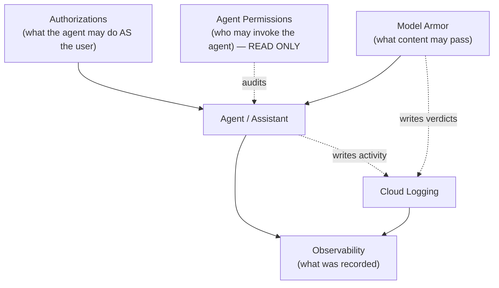
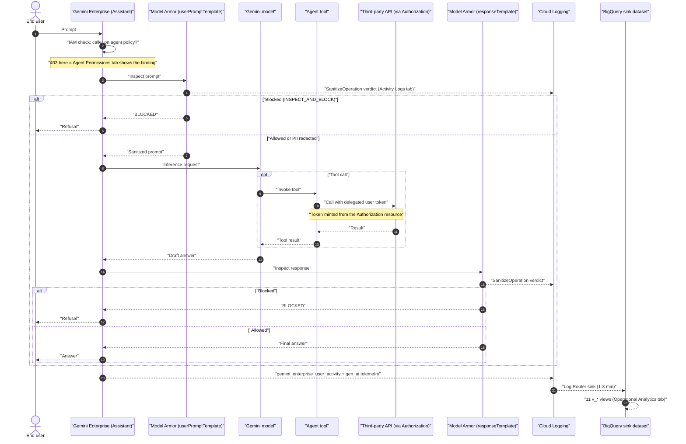

# Chapter 3 — Security & Access

**Who this chapter is for** — Administrators who decide *what an agent may do on a user's behalf*, *who may talk to an agent*, *what content is allowed through*, and *what gets recorded*. If you own the audit story for Gemini Enterprise, this is your chapter.

**What you'll be able to do**

- Create, inspect, edit and delete Discovery Engine **Authorization** resources, and know exactly where the OAuth client secret travels.
- Audit which humans, groups and service accounts can reach each agent across `global`, `us` and `eu` — and know precisely what this app can and cannot change.
- Build a **Model Armor** safety template, attach it to an app, and tune thresholds without blocking your security team's own questions.
- Stand up BigQuery-backed **Observability**, understand the 11 analytics views, and keep the query bill under control.

**Before you start**

| Prerequisite | Detail |
|---|---|
| Project ID or number | Set on the **GE Agent Manager** tab. Several tabs here render "Not set (configure on Agents page)" until you do. |
| Enabled APIs | `discoveryengine.googleapis.com`, `cloudresourcemanager.googleapis.com`, `iam.googleapis.com`, `modelarmor.googleapis.com`, `logging.googleapis.com`, `bigquery.googleapis.com` |
| Signed in | The app calls Google APIs **directly from your browser** with your own OAuth token. Everything you do here runs as *you*, not as a service account. |
| Existing resources | At least one Discovery Engine engine ("app") with an assistant. Observability additionally needs a Cloud Logging **sink** that writes to BigQuery. |
| IAM | See [Least-privilege IAM roles for this chapter](#least-privilege-iam-roles-for-this-chapter). |

> [!IMPORTANT]
> This app has **no backend**. Every request in this chapter is issued by your browser to `googleapis.com` using your signed-in identity ([core.ts](file:///usr/local/google/home/wdufrin/Documents/Code/Gemini-Enterprise-Manager/services/api/core.ts#L158-L212)). There is no server-side audit trail of what the *console* did — only the normal Cloud Audit Logs of what *your user* did.

---

## At a glance

Four tabs, four different layers of the same question: *is this safe?*



| Tab | Reads | Writes | Backing API |
|---|---|---|---|
| **Authorizations** | Yes | **Yes** — create / patch / delete | Discovery Engine `v1alpha` |
| **Agent Permissions** | Yes | **No** — audit only | Cloud Resource Manager `v1` + Discovery Engine `v1alpha` |
| **Model Armor** | Yes | **Partial** — create template, attach to assistant | Model Armor `v1` + Discovery Engine `v1alpha` |
| **Observability** | Yes | **Yes** — creates and drops BigQuery views | Cloud Logging `v2` + BigQuery `v2` |

---

## Authorizations

### What it's for

A Discovery Engine **Authorization** is a stored OAuth 2.0 client configuration. It lets an agent act *as the signed-in end user* against some other system — read their Gmail, list their Drive files, query their Jira, call a Google Cloud API on their behalf.

You are not storing a token here. You are storing the *recipe* Gemini Enterprise uses to go get a token: which OAuth client to use, where to send the user to consent, and where to exchange the resulting code. When a user first hits an agent that needs it, they get a consent screen; after that, Gemini Enterprise injects their token into the agent's tool context.

One Authorization can be reused by many agents. Deleting one breaks every agent that references it.

### The screen, explained

The tab has two views: a list and a form.

**Configuration panel** (top, always visible)

| Control | Behaviour |
|---|---|
| **Project ID / Number** | Read-only echo of the project set elsewhere. Shows `Not set (configure on Agents page)` when empty. |
| **Region** | Dropdown: **Global**, **US (Multi-region)**, **EU (Multi-region)**. |
| **Refresh Authorizations** | Re-runs the scan. Label flips to `Loading...`. |

> [!NOTE]
> The **Region** dropdown is a *display filter*, not a scope limiter. The page always calls `listAuthorizations` against all three locations — `global`, `us`, `eu` — on every refresh ([AuthorizationsPage.tsx:123-141](file:///usr/local/google/home/wdufrin/Documents/Code/Gemini-Enterprise-Manager/pages/AuthorizationsPage.tsx#L123-L141)) and then filters the table down to the selected one ([line 394](file:///usr/local/google/home/wdufrin/Documents/Code/Gemini-Enterprise-Manager/pages/AuthorizationsPage.tsx#L394)). New Authorizations, however, *are* created in the selected region.

**Show Advanced Tools (Workforce Pool Validator)** — a link that expands a separate Workforce Identity Pool checker. Unrelated to OAuth Authorizations; useful when your users sign in via an external IdP.

**Partial results banner** — if any of the three regions, or any collection / engine / assistant / agent listing fails, the page still renders what it got and shows a banner with the per-resource reason and HTTP status. It does not silently pretend the list is complete.

**Authorization Resources table** ([AuthList.tsx](file:///usr/local/google/home/wdufrin/Documents/Code/Gemini-Enterprise-Manager/components/authorizations/AuthList.tsx#L64-L140))

| Column | Contents |
|---|---|
| (checkbox) | Multi-select for bulk delete |
| **Auth ID** | Last path segment of the resource name |
| **Region** | `global` (blue pill) or the multi-region (green pill) |
| **Client ID** | The OAuth client ID, or `N/A` |
| **Used By Agent** | Live scan result — agent display names, `Scanning...`, or `Not in use` |
| (actions) | **View** · **ADK Code** · **Edit** · **Delete** |

Header buttons: **Create New Authorization** (green) and, once anything is ticked, **Delete Selected** (red) with an `N selected` counter.

> [!TIP]
> The **Used By Agent** column is the single most valuable thing on this screen. Before you delete anything, make sure it says `Not in use`. The scan walks every collection → engine → assistant → agent in all three regions and matches both `agent.authorizations` and `agent.authorizationConfig.toolAuthorizations` ([AuthorizationsPage.tsx:231-248](file:///usr/local/google/home/wdufrin/Documents/Code/Gemini-Enterprise-Manager/pages/AuthorizationsPage.tsx#L231-L248)).

![The Authorizations tab, captured while the list is still loading. The Configuration panel shows the read-only **Project ID / Number** echo (here the project *number*, 123456789012), the **Region** dropdown set to *Global* with the helper text "Select the region where you want to manage authorizations.", and the refresh button in its `Loading...` state. Remember that this dropdown filters what the table displays -- the fetch underneath always covers global, us and eu. Below it sits the **Show Advanced Tools (Workforce Pool Validator)** link. The spinner marks where the Authorization Resources table renders once the tri-region fetch and the Used By Agent scan complete.](../assets/20-authorizations.png)

### How to: create an Authorization

Before you touch this screen you need an OAuth client from the identity provider that owns the data.

- **Google APIs** — Google Cloud console → **APIs & Services → Credentials → Create Credentials → OAuth client ID → Web application**. Add `https://vertexaisearch.cloud.google.com/oauth-redirect` as an Authorized redirect URI. Copy the client ID and client secret.
- **Microsoft Entra ID** — Entra admin centre → **App registrations → New registration**. Add the same redirect URI as a Web platform. Copy the **Application (client) ID**, the **Directory (tenant) ID**, and create a **Client secret** under *Certificates & secrets*.

Then:

1. Click **Create New Authorization**.
2. Enter the **Authorization ID** — a short unique ID such as `gmail-delegation`. (You may paste a full resource name; only the last segment is used.)
3. Choose a **Provider**: **Google** or **Microsoft Entra ID**. This prefills sensible scopes and token URI.
4. For Microsoft only, enter the **Tenant ID**. The **OAuth Token URI** updates itself to `https://login.microsoftonline.com/<tenant>/oauth2/v2.0/token`.
5. Paste the **OAuth 2.0 Client ID**.
6. Paste the **OAuth 2.0 Client Secret**. The field is masked. Read the warning below before you do this on a shared screen.
7. Set **OAuth 2.0 Scopes** as a **comma-separated** list. Hover the `i` icon for common Google scopes.
8. Leave **OAuth Redirect URI** at `https://vertexaisearch.cloud.google.com/oauth-redirect` unless your IdP requires otherwise.
9. Leave **Auto-generate Auth URI** ticked. The **Authorization URI** field builds itself from provider + client ID + redirect URI + scopes. Untick it only if you need a URI this app cannot express.
10. Check the **cURL Command Preview** on the right — it mirrors exactly what will be sent.
11. Click **Create**.

**Expected result:** you return to the list and it refreshes. Your new Authorization appears under the region you had selected, with `Not in use` in the last column until you attach it to an agent.

<details><summary>Under the hood — the API call this makes</summary>

```bash
curl -X POST \
     -H "Authorization: Bearer $(gcloud auth print-access-token)" \
     -H "Content-Type: application/json" \
     -H "X-Goog-User-Project: PROJECT_ID" \
     -d '{
  "serverSideOauth2": {
    "clientId": "...",
    "clientSecret": "[YOUR_CLIENT_SECRET]",
    "authorizationUri": "https://accounts.google.com/o/oauth2/auth?client_id=...&redirect_uri=...&scope=...&response_type=code&access_type=offline&prompt=consent",
    "tokenUri": "https://oauth2.googleapis.com/token"
  }
}' \
     "https://discoveryengine.googleapis.com/v1alpha/projects/PROJECT_ID/locations/global/authorizations?authorizationId=AUTH_ID"
```

For `us` / `eu` the host becomes `us-discoveryengine.googleapis.com` / `eu-discoveryengine.googleapis.com`. Source: [dataStores.ts:604-618](file:///usr/local/google/home/wdufrin/Documents/Code/Gemini-Enterprise-Manager/services/api/dataStores.ts#L604-L618).

</details>

> [!WARNING]
> **The `scopes` and `redirectUri` fields are never sent to the API as fields.** The submit payload contains only `clientId`, `clientSecret`, `authorizationUri` and `tokenUri` ([AuthForm.tsx:282-300](file:///usr/local/google/home/wdufrin/Documents/Code/Gemini-Enterprise-Manager/components/authorizations/AuthForm.tsx#L282-L300)). Scopes exist purely to build the query string inside the Authorization URI. If you untick **Auto-generate Auth URI** and hand-write a URI, whatever you typed in **Scopes** is discarded.

### Client secret handling — read this before you type one

This is the one field in the product that can cause a real breach. Here is exactly what the code does with it, verified line by line.

| Question | Answer | Source |
|---|---|---|
| Is it sent over the wire from the browser? | **Yes.** In plaintext JSON, over TLS, straight from your browser to `discoveryengine.googleapis.com`. There is no proxy or backend. | [core.ts:202-212](file:///usr/local/google/home/wdufrin/Documents/Code/Gemini-Enterprise-Manager/services/api/core.ts#L202-L212) |
| Is it displayed on screen? | **No.** The input is `type="password"`. | [AuthForm.tsx:397](file:///usr/local/google/home/wdufrin/Documents/Code/Gemini-Enterprise-Manager/components/authorizations/AuthForm.tsx#L397) |
| Is it in the cURL preview pane? | **No.** Replaced with the literal string `[YOUR_CLIENT_SECRET]` before rendering — for both create and update. | [AuthForm.tsx:210-212](file:///usr/local/google/home/wdufrin/Documents/Code/Gemini-Enterprise-Manager/components/authorizations/AuthForm.tsx#L210-L212), [252-255](file:///usr/local/google/home/wdufrin/Documents/Code/Gemini-Enterprise-Manager/components/authorizations/AuthForm.tsx#L252-L255) |
| Is it logged into the **Show Interaction Details** cURL history? | **No.** Every request body passes through `redactRequestBody` before it reaches the debug logger. `clientSecret` normalises to `clientsecret`, which is in the sensitive-key set, so it renders as `[REDACTED]`. | [core.ts:191-199](file:///usr/local/google/home/wdufrin/Documents/Code/Gemini-Enterprise-Manager/services/api/core.ts#L191-L199), [redaction.ts:60-93](file:///usr/local/google/home/wdufrin/Documents/Code/Gemini-Enterprise-Manager/services/redaction.ts#L60-L93) |
| Is my bearer token logged? | **No.** Replaced with the literal `Bearer $(gcloud auth print-access-token)`. | [core.ts:186-190](file:///usr/local/google/home/wdufrin/Documents/Code/Gemini-Enterprise-Manager/services/api/core.ts#L186-L190) |
| Does the debug history persist? | **No.** Last 50 entries, in memory only, gone on reload. | [GlobalDebugContext.tsx:55](file:///usr/local/google/home/wdufrin/Documents/Code/Gemini-Enterprise-Manager/context/GlobalDebugContext.tsx#L55) |
| Does the API ever hand the secret back? | **No.** `getAuthorization` returns `clientId`, `authorizationUri` and `tokenUri`. The View modal has no secret field at all, and the Edit form deliberately blanks it. | [ViewAuthModal.tsx:160-212](file:///usr/local/google/home/wdufrin/Documents/Code/Gemini-Enterprise-Manager/components/authorizations/ViewAuthModal.tsx#L160-L212), [AuthForm.tsx:113](file:///usr/local/google/home/wdufrin/Documents/Code/Gemini-Enterprise-Manager/components/authorizations/AuthForm.tsx#L113) |

> [!CAUTION]
> Redaction is **display-only by design**. The comment at the top of [redaction.ts](file:///usr/local/google/home/wdufrin/Documents/Code/Gemini-Enterprise-Manager/services/redaction.ts#L17-L32) says so explicitly: callers keep passing the *original* object to the transport layer. That means:
> - **Browser DevTools → Network → Request Payload shows your client secret in cleartext.**
> - **A HAR file exported from that session contains it.**
> - A browser extension with request-reading permission can see it.
>
> Screenshots and copy-pasted bug reports are safe. DevTools captures and HAR files are **not**. Treat any HAR taken while creating an Authorization as a credential and destroy it.

> [!TIP]
> Practical hygiene: create Authorizations from a clean browser profile with no extensions, don't record a HAR while doing it, and rotate the client secret at the IdP if you ever suspect a capture. Rotation is cheap — see the update flow below.

### How to: edit an Authorization

1. In the table, click **Edit** on the row.
2. The form loads in **Update Authorization** mode. **Authorization ID** shows the full resource name and is disabled. A read-only **Region** field appears.
3. Change what you need. Leave **OAuth 2.0 Client Secret** blank to keep the existing one; type a new value to rotate it.
4. Watch the cURL preview — it shows `# No changes detected.` until something actually differs.
5. Click **Update**.

**Expected result:** back to the list, refreshed. Only the fields you changed are in the `updateMask`.

<details><summary>Under the hood — the API call this makes</summary>

```bash
curl -X PATCH \
     -H "Authorization: Bearer $(gcloud auth print-access-token)" \
     -H "Content-Type: application/json" \
     -H "X-Goog-User-Project: PROJECT_ID" \
     -d '{"serverSideOauth2": {"clientSecret": "[YOUR_CLIENT_SECRET]"}}' \
     "https://discoveryengine.googleapis.com/v1alpha/projects/PROJECT_ID/locations/global/authorizations/AUTH_ID?updateMask=serverSideOauth2.clientSecret"
```

The mask is assembled field-by-field from what actually differs: `serverSideOauth2.clientId`, `serverSideOauth2.authorizationUri`, `serverSideOauth2.tokenUri`, `serverSideOauth2.clientSecret` ([AuthForm.tsx:304-313](file:///usr/local/google/home/wdufrin/Documents/Code/Gemini-Enterprise-Manager/components/authorizations/AuthForm.tsx#L304-L313)). If the mask is empty, **no call is made at all** — the form just closes.

</details>

> [!WARNING]
> **Opening Edit can silently rewrite a hand-crafted Authorization URI.** On load, the form forces **Auto-generate Auth URI** back on regardless of what is stored ([AuthForm.tsx:120-122](file:///usr/local/google/home/wdufrin/Documents/Code/Gemini-Enterprise-Manager/components/authorizations/AuthForm.tsx#L120-L122)). It then re-derives the URI from scopes and redirect URI that it *parsed back out of the stored URI*. Any parameter the parser doesn't understand — `login_hint`, `hd`, a custom `state`, a non-standard `prompt` — is dropped, the regenerated URI now differs from the stored one, so `serverSideOauth2.authorizationUri` lands in the update mask and **Update** overwrites it.
>
> If you have a hand-built Authorization URI, untick **Auto-generate Auth URI** and paste the original back before saving, or do the edit with `curl` instead.

### How to: delete an Authorization

1. Confirm the **Used By Agent** column reads `Not in use`.
2. Click **Delete** on a single row, or tick several and click **Delete Selected**.
3. A modal titled `Confirm Deletion of N Authorization(s)` lists each ID with its client ID and warns: *"This action cannot be undone and may break agents that rely on them."*
4. Click **Delete**.

**Expected result:** the list refreshes. Any per-item failures are collected and shown as a combined error listing each name and message; deletion of the others still proceeds ([AuthorizationsPage.tsx:306-325](file:///usr/local/google/home/wdufrin/Documents/Code/Gemini-Enterprise-Manager/pages/AuthorizationsPage.tsx#L306-L325)).

> [!CAUTION]
> The confirmation is generic. **The app does not block deletion of an Authorization that the usage scan just found attached to live agents**, and it does not repeat the agent names in the modal. Check the table before you click.

### How to: attach an Authorization to an agent

This tab **cannot** attach anything. Attachment happens on the agent itself, via `authorizations` / `authorizationConfig.toolAuthorizations` on the agent resource — see the **GE Agent Manager** chapter. What this tab gives you is the read-back: once attached, the agent's display name appears in **Used By Agent** after the next refresh.

For the ADK code side, click **ADK Code** on any row (or **View** → **ADK Python Blueprint** tab). It renders a ready-to-copy `tool_oauth_delegation.py` snippet showing how to pull the delegated user token out of `ToolContext` inside an ADK tool. Click **Copy Python Snippet**.

### Field reference — Create / Update Authorization

| Field | What to enter | Required | Notes / Default |
|---|---|---|---|
| **Authorization ID** | Unique short ID, e.g. `gmail-delegation` | Yes | Default `your-auth-id`. Disabled when editing. Full resource paths are accepted; only the last segment is used. |
| **Provider** | `Google` or `Microsoft Entra ID` | Yes (create only) | Default `Google`. Not shown when editing — it is inferred from the stored URIs. |
| **Tenant ID** | Entra Directory (tenant) ID | Only for Microsoft | Drives the token URI. |
| **OAuth 2.0 Client ID** | From your IdP | Yes | Default `your-oauth-client-id` — **change it**. |
| **OAuth 2.0 Client Secret** | From your IdP | Yes on create | Masked. Blank on edit = keep existing. |
| **OAuth 2.0 Scopes** | Comma-separated scope URLs | Yes | Google default `https://www.googleapis.com/auth/cloud-platform`. Microsoft default `https://graph.microsoft.com/Mail.Read,https://graph.microsoft.com/Calendars.Read,offline_access`. Not sent as a field — folded into the Authorization URI. |
| **OAuth Redirect URI** | Must match the IdP registration | No (but effectively yes) | Default `https://vertexaisearch.cloud.google.com/oauth-redirect`. |
| **Authorization URI** | Consent endpoint | Yes | Auto-generated by default. Disabled while auto-generate is ticked. |
| **OAuth Token URI** | Token exchange endpoint | No | Google default `https://oauth2.googleapis.com/token`. |

### Known limitations & gotchas

- **`cloud-platform` is the default scope.** It is an extremely broad grant. Replace it with the narrowest scope the tool actually needs.
- **No scope validation.** Typos are accepted and only surface as a failed consent screen for your end users.
- **The Region dropdown does not limit the scan** — you always pay three `listAuthorizations` calls plus a full multi-region agent crawl per refresh.
- **The agent usage scan is expensive.** Collections → engines → assistants → agents, sequentially, across three regions. On a large estate this takes a while; the **Used By Agent** column shows `Scanning...` throughout.
- **No pagination in the UI.** `listAuthorizations` requests `pageSize=200` and the page ignores `nextPageToken` ([dataStores.ts:580-592](file:///usr/local/google/home/wdufrin/Documents/Code/Gemini-Enterprise-Manager/services/api/dataStores.ts#L580-L592)). Beyond 200 Authorizations in one region, the rest are invisible.
- **Edit rewrites non-standard Authorization URIs** — see the warning above.
- The API version is `v1alpha`. Field names and behaviour can change without notice.

### Troubleshooting

| Symptom / exact error text | Cause | Fix |
|---|---|---|
| `Project ID/Number is required to list authorizations.` | No project set | Set it on **GE Agent Manager**. |
| `No authorizations found for the provided project number.` | None exist in the **selected region** | Switch the **Region** dropdown — the resource may live in `us` or `eu`. |
| Banner: `Failed to load authorizations for region 'eu': ...` | Region not enabled, or missing permission | Grant `discoveryengine.authorizations.list`; ignore if you do not use that multi-region. |
| `Authorization with ID <id> not found in the current list.` | Clicked **Edit** on a stale row | Click **Refresh Authorizations**. |
| `Authorization ID cannot be empty.` | ID field blank or only slashes | Enter a valid ID. |
| Create returns `ALREADY_EXISTS` | ID collision in that region | Pick a different ID or delete the old one. |
| `Failed to delete some authorizations:` followed by a list | Per-item failures | Read each line; usually a 403 or the resource was already gone. |
| Users see "invalid redirect_uri" at consent | Redirect URI not registered at the IdP | Add `https://vertexaisearch.cloud.google.com/oauth-redirect` to the OAuth client. |

---

## Agent Permissions

### What it's for

This tab answers one question: **who can currently reach each agent?** It sweeps every Gemini Enterprise app in `global`, `us` and `eu`, pulls the IAM policy attached to each agent, folds in the inherited project-level roles, and lays the result out as a filterable table you can export to CSV.

It is an **audit tool**. Read it as a report, not a control panel.

> [!IMPORTANT]
> **This tab cannot grant or revoke anything.** There is no Add, Edit, Save or Remove control anywhere on it, and the page never calls `setAgentIamPolicy` — the only IAM functions it imports are `getProjectIamPolicy`, `listResources` and `getAgentIamPolicy` ([AgentPermissionsPage.test.tsx:24-28](file:///usr/local/google/home/wdufrin/Documents/Code/Gemini-Enterprise-Manager/pages/AgentPermissionsPage.test.tsx#L24-L28)). To actually change access, use **Edit IAM Policy for Agent** in **GE Agent Manager** → agent details (covered below, because that is where the risk is).

### The screen, explained

**Configuration bar** — a **Project ID / Number** input and a single blue **Refetch All Locations** button (label `Loading...` while running). There is no region selector: it always scans all three.

**Partial results banner** — every failure is captured individually with its HTTP status: project IAM policy, engines per location, assistants per app, agents per assistant, and IAM policy per agent. If the scan returns nothing *and* there were failures, the empty state says **"Permissions Could Not Be Fully Retrieved"** rather than pretending there are no permissions. That distinction is deliberate and tested.

**Results toolbar** — `Showing X of Y records`, plus **View Python Script** and **Export to CSV** (downloads `agent_permissions_export.csv`).

![The Agent Permissions tab in its initial state, before any scan has run. The Configuration bar holds the **Project ID / Number** input, a **Set** button and the blue **Refetch All Locations** button. The body shows the neutral empty state -- **"No agent permissions found."** with the sub-line *"Select a project and click refetch to globally scan all agent permissions."* This is the *good* empty state: if the scan had run and hit errors it would instead read **"Permissions Could Not Be Fully Retrieved"**. Learn to tell those two apart -- one means no access is granted, the other means the tool could not find out.](../assets/21-agent-permissions.png)

**Permission matrix** — six columns, each with its own free-text filter box in the header:

| Column | Contents |
|---|---|
| **Location** | `global`, `us` or `eu` |
| **Gemini Enterprise App** | Engine display name, falling back to its ID |
| **Agent Name** | Agent display name |
| **Agent Type** | `ADK`, `Low-Code`, the raw `agentType`, or `N/A` |
| **User ID** | Principal with its prefix stripped, suffixed ` (Inherited)` for project-level roles |
| **Permission** | Pill: `owner` (purple), `user` (blue), `unknown` (grey) |

### How to: audit who can reach your agents

1. Confirm the **Project ID / Number**.
2. Click **Refetch All Locations**. You'll see *"Fetching IAM policies..."*.
3. Wait. The scan is sequential: project policy → for each of 3 locations → engines → assistants → agents → per-agent `getIamPolicy`.
4. Read the partial-results banner if one appears. **A 403 here means the report is incomplete, not that access is absent.**
5. Filter by typing in any column header — e.g. `owner` in **Permission**, or a domain fragment in **User ID**.
6. Click **Export to CSV** for evidence.

**Expected result:** one row per (agent, principal, coarse permission) combination.

<details><summary>Under the hood — the API calls this makes</summary>

Project-level inherited roles:

```bash
curl -X POST \
  -H "Authorization: Bearer $(gcloud auth print-access-token)" \
  -H "Content-Type: application/json" \
  -d '{"options": {"requestedPolicyVersion": 3}}' \
  "https://cloudresourcemanager.googleapis.com/v1/projects/PROJECT_ID:getIamPolicy"
```

Per-agent policy (note: a **GET**, not the usual POST):

```bash
curl -X GET \
  -H "Authorization: Bearer $(gcloud auth print-access-token)" \
  -H "X-Goog-User-Project: PROJECT_ID" \
  "https://discoveryengine.googleapis.com/v1alpha/projects/PROJECT_ID/locations/global/collections/default_collection/engines/ENGINE_ID/assistants/ASSISTANT_ID/agents/AGENT_ID:getIamPolicy"
```

Sources: [iam.ts:118-123](file:///usr/local/google/home/wdufrin/Documents/Code/Gemini-Enterprise-Manager/services/api/iam.ts#L118-L123) and [iam.ts:163-167](file:///usr/local/google/home/wdufrin/Documents/Code/Gemini-Enterprise-Manager/services/api/iam.ts#L163-L167).

</details>

> [!TIP]
> Click **View Python Script** for a standalone script that reproduces this scan with `google.auth` + `requests`. It is **more accurate than the UI**: its CSV columns are `Location, App Name, Agent Name, Member, Role` — it prints the **real role ID**, which the on-screen table throws away. Use the script for compliance evidence.

### How the `owner` / `user` / `unknown` pill is decided

This is a **case-insensitive substring match on the role string**, not a capability model ([AgentPermissionsPage.tsx:217-221](file:///usr/local/google/home/wdufrin/Documents/Code/Gemini-Enterprise-Manager/pages/AgentPermissionsPage.tsx#L217-L221)):

| Role string contains | Pill |
|---|---|
| `admin`, `editor` or `owner` | `owner` |
| `viewer` or `user` | `user` |
| anything else | `unknown` |

Checked in that order, so `roles/discoveryengine.admin` → `owner`, `roles/discoveryengine.viewer` → `user`, a custom `roles/agentOwnerAudit` → `owner` (because it contains "owner"), and `roles/discoveryengine.agentUser` → `user`.

Only project roles matching `roles/owner`, `roles/editor`, `roles/viewer` or `roles/discoveryengine.` are pulled in as inherited ([lines 140-148](file:///usr/local/google/home/wdufrin/Documents/Code/Gemini-Enterprise-Manager/pages/AgentPermissionsPage.tsx#L140-L148)).

> [!WARNING]
> **The table never shows the actual role ID, and it de-duplicates across roles.** Rows are keyed on `<member>-<owner|user>` within each agent ([line 229](file:///usr/local/google/home/wdufrin/Documents/Code/Gemini-Enterprise-Manager/pages/AgentPermissionsPage.tsx#L229)), so a principal holding both `roles/discoveryengine.admin` directly *and* `roles/owner` at the project appears **once**, as a single `owner` row, and the `(Inherited)` marker reflects whichever binding was seen first — explicit bindings are processed first, so an inherited-only grant can be masked. **IAM conditions are not displayed at all.** For anything that has to stand up in an audit, use the Python script output.

### `allUsers` and `allAuthenticatedUsers`

> [!CAUTION]
> This tab does **not** flag public bindings. `member.replace(/^(user:|serviceAccount:|group:|domain:)/, '')` strips known prefixes ([line 226](file:///usr/local/google/home/wdufrin/Documents/Code/Gemini-Enterprise-Manager/pages/AgentPermissionsPage.tsx#L226)); `allUsers` and `allAuthenticatedUsers` have no prefix, so they render as plain grey text in the **User ID** column with no warning, no red badge, and — unless the role name happens to contain a matching substring — an `unknown` pill.
>
> **Make this part of your routine:** after each scan, type `all` into the **User ID** filter. Any row is an escalation.

And on the write side:

> [!CAUTION]
> The **Edit IAM Policy for Agent** modal accepts `allUsers` and `allAuthenticatedUsers` without objection. The member box is free text split on whitespace and commas ([SetIamPolicyModal.tsx:92-104](file:///usr/local/google/home/wdufrin/Documents/Code/Gemini-Enterprise-Manager/components/agents/SetIamPolicyModal.tsx#L92-L104)); the helper panel lists only `user:`, `group:`, `serviceAccount:`, `principal://` and `principalSet://` ([lines 200-209](file:///usr/local/google/home/wdufrin/Documents/Code/Gemini-Enterprise-Manager/components/agents/SetIamPolicyModal.tsx#L200-L209)) but nothing validates against that list. There is no confirmation step, no warning banner, and no domain-restricted-sharing pre-check. **A single typo can make an internal agent world-reachable.** Enforce the `constraints/iam.allowedPolicyMemberDomains` org policy so the API rejects it even if the UI does not.

### The write path and etag / lost-update risk

Where changes actually happen: **GE Agent Manager → select an agent → Edit IAM Policy**.

The modal is a genuine read-modify-write. Behaviour, verified:

- The role field is a **free-text input**, not a dropdown. New bindings default to `roles/discoveryengine.agentUser` ([line 69](file:///usr/local/google/home/wdufrin/Documents/Code/Gemini-Enterprise-Manager/components/agents/SetIamPolicyModal.tsx#L69)). Any string can be typed; a typo'd role ID fails server-side.
- Bindings with no members or an empty role are **silently dropped** on save ([line 140](file:///usr/local/google/home/wdufrin/Documents/Code/Gemini-Enterprise-Manager/components/agents/SetIamPolicyModal.tsx#L140)).
- IAM **conditions** are supported: title, description, and a CEL expression. If any binding has a condition, `version` is forced to `3`.
- **Concurrency is protected — at the modal.** Submit is blocked outright if the fetched policy had no etag: *"Cannot update policy: ETag is missing. Please fetch the policy again."* ([lines 131-134](file:///usr/local/google/home/wdufrin/Documents/Code/Gemini-Enterprise-Manager/components/agents/SetIamPolicyModal.tsx#L131-L134)). Otherwise `finalPolicy.etag = currentPolicy.etag` is set explicitly.

> [!WARNING]
> **There is a lost-update hole one layer down.** `setAgentIamPolicy` in [iam.ts:169-191](file:///usr/local/google/home/wdufrin/Documents/Code/Gemini-Enterprise-Manager/services/api/iam.ts#L169-L191) tries to be helpful: if the caller supplies no etag, it re-fetches the current policy to get one. But if that re-fetch **throws**, it only `console.warn`s and then issues the `setIamPolicy` **with no etag at all** — an unconditional overwrite that will happily clobber a concurrent change made by another admin or by `gcloud`.
>
> The interactive modal never hits this path because it refuses to submit without an etag. The **Backup & Recovery** restore flow does call `setAgentIamPolicy` ([restoreOperations.ts:166](file:///usr/local/google/home/wdufrin/Documents/Code/Gemini-Enterprise-Manager/services/backup/restoreOperations.ts#L166), [:255](file:///usr/local/google/home/wdufrin/Documents/Code/Gemini-Enterprise-Manager/services/backup/restoreOperations.ts#L255)) and is therefore exposed. Do IAM restores in a maintenance window with no other admins editing, and re-run this Agent Permissions scan afterwards to confirm the result.

### Field reference — Edit IAM Policy for Agent

| Field | What to enter | Required | Notes / Default |
|---|---|---|---|
| **Role** | Full role ID, e.g. `roles/discoveryengine.agentUser` | Yes | Free text. New bindings prefill `roles/discoveryengine.agentUser`. Not validated client-side. |
| **Members** | One or more principals | Yes | Whitespace- or comma-separated. Duplicates are merged. `allUsers` is accepted. |
| **Condition → Title** | Short label | No | Only if you add a condition. |
| **Condition → Description** | Free text | No | |
| **Condition → Expression** | CEL, e.g. `request.time < timestamp("2026-01-01T00:00:00Z")` | Yes if a condition exists | Forces policy `version: 3`. |

### Known limitations & gotchas

- **Read-only tab.** No grant/revoke here.
- **Coarse permission bucketing** hides the real role ID; conditions are invisible.
- **Public principals are not highlighted.**
- **Sequential, unbounded scan.** No pagination on engines / assistants / agents; no concurrency control beyond the global 6-request limiter. Large estates are slow.
- **No etag concern on this tab** (it never writes), but see the write-path warning above.
- Results are cleared whenever the project number changes ([lines 28-30](file:///usr/local/google/home/wdufrin/Documents/Code/Gemini-Enterprise-Manager/pages/AgentPermissionsPage.tsx#L28-L30)).

### Troubleshooting

| Symptom / exact error text | Cause | Fix |
|---|---|---|
| `Project must be selected to list permissions.` | No project | Enter a project ID or number. |
| `Permissions Could Not Be Fully Retrieved` | One or more calls returned an error, often 403 | Read the banner; grant the missing permission and refetch. |
| Banner: `Could not fetch inherited project IAM policy: ...` | Missing `resourcemanager.projects.getIamPolicy` | Grant `roles/iam.securityReviewer` (or `roles/viewer`). The agent-level scan still runs. |
| Banner: `Failed listing apps in location 'us': ...` | API off in that multi-region, or no access | Safe to ignore if unused. |
| Banner: `Could not fetch IAM policy for agent '<name>': ...` | Missing `discoveryengine.*.getIamPolicy` | Grant `roles/discoveryengine.admin`. |
| `No agent permissions found.` with **no** banner | Genuinely no bindings found | Confirm agents exist; project-level roles alone should still produce `(Inherited)` rows. |
| Row shows `No Members` / `unknown` | Agent policy is empty and no inherited role matched the filter | Normal for a brand-new agent. |
| `Cannot update policy: ETag is missing. Please fetch the policy again.` (write path) | Fetched policy had no etag | Close the modal, reload the agent, reopen. |

---

## Model Armor

### What it's for

Model Armor is Google Cloud's content-safety gate. It inspects text **going into** the model (the user's prompt) and **coming out of** it (the model's answer), and can block or redact. You define a reusable **template** — a bundle of filters and thresholds — and attach it to an assistant.

Four things it can check:

| Filter | What it does |
|---|---|
| **Responsible AI** | Scores text for Hate Speech, Harassment, Sexually Explicit and Dangerous Content, and blocks above your chosen confidence level. |
| **Sensitive Data Protection** | Finds PII and replaces it inline. As generated here: phone numbers and email addresses only. |
| **Prompt Injection & Jailbreak** | Detects attempts to override the system instructions. |
| **Malicious URI** | Blocks known-bad URLs. |

### The screen, explained

Header: **Model Armor Manager** with a shield icon, subtitle *"Monitor content safety violations and configure protection policies."*, and a **Cloud Console** button that deep-links to a pre-filtered Logs Explorer query. Two tabs: **Activity Logs** and **Policy Configuration**.

![The Model Armor tab as it opens. It lands on **Activity Logs**, not on Policy Configuration -- the first thing the page does is ask you to look at violations, not to create a template. The controls read left to right: **Search Filters** (placeholder `e.g. jsonPayload.sanitizationResult.verdict="BLOCKED"`), **Time Range** defaulting to **Last 7 Days**, an unticked **Blocked Only** checkbox, and the blue **Fetch Logs** button. Beneath them a grey info line shows the base filter the app always applies: `resource.type="modelarmor.googleapis.com/SanitizeOperation"`; anything you type is ANDed onto it. The empty state reads **"No Logs Found -- No violation logs matched your criteria. Try adjusting your filters or ensure Model Armor is active on your resources."** On this project no template is attached to anything, so there is nothing to log.](../assets/22-model-armor.png)

#### Tab: Activity Logs

| Control | Behaviour |
|---|---|
| **Search Filters** | Free-text Cloud Logging filter. Placeholder: `e.g. jsonPayload.sanitizationResult.verdict="BLOCKED"` |
| **Time Range** | `Last 24 Hours`, `Last 3 Days`, `Last 7 Days`, `Last 30 Days`. Default **Last 7 Days**. |
| **Blocked Only** | Checkbox. Adds a verdict filter for both `BLOCKED` and `MODEL_ARMOR_SANITIZATION_VERDICT_BLOCK`. |
| **Fetch Logs** | Runs the query. Results render as cards. |

> [!WARNING]
> **You only ever see 50 entries.** The query hardcodes `pageSize: 50` and the UI ignores `nextPageToken` ([monitoring.ts:95-106](file:///usr/local/google/home/wdufrin/Documents/Code/Gemini-Enterprise-Manager/services/api/monitoring.ts#L95-L106)). On a busy day, 50 newest entries over 30 days is a keyhole. Use **Cloud Console** for any real investigation.

#### Tab: Policy Configuration

Three stacked panels plus an optional modal.

1. **Active Policies Viewer** — every Model Armor template in the project, with **Refresh List** and a per-template **Clone** button. Each shows an attachment status: **Protected** (an assistant really references it), **Not attached** (scan completed, nothing references it), or **Unknown** (the scan could not read that assistant's config). The distinction is deliberate — the note reads *"Unknown may or may not be protected."*
2. **Attached Protection Panel** — the inverse view: every engine/assistant and whether it is **Protected** or **Not protected**.
3. **Policy Template Generator** — where you build and deploy.
4. **Clone Template Modal** — copy an existing template to another project/location/ID.

> [!NOTE]
> Templates are listed with a location wildcard: `GET https://modelarmor.googleapis.com/v1/projects/{p}/locations/-/templates` ([modelArmor.ts:32-38](file:///usr/local/google/home/wdufrin/Documents/Code/Gemini-Enterprise-Manager/services/api/modelArmor.ts#L32-L38)). You see templates from every location in one list.

### How to: create a safety template

1. Go to **Policy Configuration**.
2. In **Policy Template Generator**, optionally click a preset:
   - **Best Practice: Input Filter** — PII on, all four RAI filters at `HIGH`, jailbreak on, malicious URI off. Names it `my-safety-policy-input`, binds as Input.
   - **Best Practice: Output Filter** — PII on, RAI at `HIGH`, jailbreak **off**, malicious URI **on**. Names it `my-safety-policy-output`, binds as Output.
   - **Strict Compliance** — PII on, all RAI at `LOW_AND_ABOVE`, jailbreak on, malicious URI on. Names it `my-safety-policy-strict`, binds as Both.
3. Set the **Template ID**.
4. Tick/untick the four **Responsible AI Filters** and pick a confidence level for each: **Low & above**, **Medium & above**, **High only**.
5. Toggle **Sensitive Data Protection (PII)**, **Prompt Injection Defense**, **Malicious URI Filter**.
6. Review the generated cURL on the right.
7. Click **Create Template**.

**Expected result:** a green box reading `Created projects/.../templates/<id>.` If the API accepts the request but returns no name, you instead get an honest *"The API accepted the request but returned no template name. Use 'Refresh List' above to confirm it exists."* — the app does not claim success it cannot prove.

<details><summary>Under the hood — the API call this makes</summary>

```bash
curl -X POST \
  -H "Authorization: Bearer $(gcloud auth print-access-token)" \
  -H "Content-Type: application/json" \
  -d '{
  "filterConfig": {
    "raiSettings": { "raiFilters": [
      {"filterType":"HATE_SPEECH","confidenceLevel":"HIGH"},
      {"filterType":"HARASSMENT","confidenceLevel":"HIGH"},
      {"filterType":"SEXUALLY_EXPLICIT","confidenceLevel":"HIGH"},
      {"filterType":"DANGEROUS_CONTENT","confidenceLevel":"HIGH"}
    ]},
    "sdpSettings": { "sdpFilters": [
      {"infoType":"PHONE_NUMBER","filterConfig":{"replaceWithInfoTypeConfig":{}}},
      {"infoType":"EMAIL_ADDRESS","filterConfig":{"replaceWithInfoTypeConfig":{}}}
    ]},
    "piAndJailbreakFilterSettings": {"filterEnforcement":"ENABLED","confidenceLevel":"MEDIUM_AND_ABOVE"},
    "maliciousUriFilterSettings": {"filterEnforcement":"ENABLED"}
  },
  "templateMetadata": {"ignorePartialInvocationFailures": false, "enforcementType": "INSPECT_AND_BLOCK"}
}' \
  "https://modelarmor.googleapis.com/v1/projects/PROJECT_ID/locations/global/templates?templateId=TEMPLATE_ID"
```

Payload shape: [PolicyGenerator.tsx:121-166](file:///usr/local/google/home/wdufrin/Documents/Code/Gemini-Enterprise-Manager/components/model-armor/PolicyGenerator.tsx#L121-L166).

</details>

> [!WARNING]
> **The generator always creates the template in `global`.** The resource name is hardcoded as `projects/{projectId}/locations/global/templates/{id}` ([PolicyGenerator.tsx:168](file:///usr/local/google/home/wdufrin/Documents/Code/Gemini-Enterprise-Manager/components/model-armor/PolicyGenerator.tsx#L168)) even when the engine you attach it to lives in `us` or `eu`. If your data-residency posture forbids a global Model Armor resource, use **Clone Template Modal** (which does expose a **Target Location**) or the API directly.

### How to: attach a template to an app

1. In the generator, pick a **Target App to Attach To**. Default is `-- Create template only, do not attach --`.
2. Choose **Bind Template As**: **Input Filter (User Prompt)**, **Output Filter (Model Response)**, or **Both (Prompt & Response)**.
3. Choose **If Model Armor cannot evaluate a request**:
   - **Fail Closed – reject the request (recommended)** — the default, and what the API does when `failureMode` is unset.
   - **Fail Open – let it through unfiltered** — the UI turns the helper text red: *"during a Model Armor outage this app will pass prompts and responses through with no filtering at all. Chat stays up, your protection does not."*
4. Read the grey box showing what is *currently* attached to that assistant (input template, output template, failure mode).
5. Make sure you have already clicked **Create Template**.
6. Click **Attach Now**.

**Expected result:** *"Verified from the API response: `<assistant>` on `<app>` now reports this template (failure mode: FAIL_CLOSED)."*

<details><summary>Under the hood — the API call this makes</summary>

```bash
curl -X PATCH \
  -H "Authorization: Bearer $(gcloud auth print-access-token)" \
  -H "Content-Type: application/json" \
  -d '{"customerPolicy":{"modelArmorConfig":{"userPromptTemplate":"projects/P/locations/global/templates/T","failureMode":"FAIL_CLOSED"}}}' \
  "https://discoveryengine.googleapis.com/v1alpha/projects/P/locations/global/collections/default_collection/engines/E/assistants/default_assistant?updateMask=customerPolicy"
```

The app performs a **merge**, not a replace: it spreads the existing `customerPolicy` and the existing `modelArmorConfig` before setting its own keys ([PolicyGenerator.tsx:181-194](file:///usr/local/google/home/wdufrin/Documents/Code/Gemini-Enterprise-Manager/components/model-armor/PolicyGenerator.tsx#L181-L194), [:287-303](file:///usr/local/google/home/wdufrin/Documents/Code/Gemini-Enterprise-Manager/components/model-armor/PolicyGenerator.tsx#L287-L303)). Sibling settings such as `bannedPhrases` survive — this is covered by a regression test.

</details>

> [!IMPORTANT]
> **Attach does not create.** If you attach before creating, the assistant points at a template that does not exist. With `FAIL_CLOSED` your users get errors; with `FAIL_OPEN` you have a filter that filters nothing. The UI says so: *"It does not create the template – do step 1 first, or the app will point at a template that does not exist."*

> [!NOTE]
> If the PATCH succeeds but the response does not echo your template back, the app refuses to celebrate: *"The API accepted the update but its response does not show this template attached. Treat this app as unprotected and re-check with 'Refresh List'."* Believe it and investigate.

### How to: clone a template

1. Click **Clone** on a row in **Active Policies Viewer**.
2. Set **Target GCP Project ID**, **Target Location** and **New Template ID** (prefilled `<source>-clone`).
3. Submit.

Cloning issues a fresh `createModelArmorTemplate` against the target. It is the only way in this app to get a template into a non-global location.

### Editing and deleting templates

> [!WARNING]
> **You cannot edit or delete a Model Armor template from this app.** The entire Model Armor service layer is two functions — `fetchModelArmorTemplates` and `createModelArmorTemplate` ([modelArmor.ts](file:///usr/local/google/home/wdufrin/Documents/Code/Gemini-Enterprise-Manager/services/api/modelArmor.ts)). There is no PATCH and no DELETE anywhere in the codebase. Re-running **Create Template** with an existing ID returns `ALREADY_EXISTS`; it does not update.
>
> To change a template: `gcloud model-armor templates update` or the REST `PATCH`. To remove one: `gcloud model-armor templates delete`. **Detach it from every assistant first** — deleting a template that an assistant still references will, under `FAIL_CLOSED`, take that app's chat down.

> [!WARNING]
> **There is no sanitize / test path in this app.** Model Armor exposes `:sanitizeUserPrompt` and `:sanitizeModelResponse` for dry-running content against a template; nothing in this codebase calls them. You cannot preview what a template would do to a sample prompt from here — test with `gcloud model-armor templates sanitize-user-prompt`, then verify via **Activity Logs**.

### Threshold tuning

Only the values below exist in the UI. Anything else is not offered.

| Setting | UI option | Sent as | Expected behaviour |
|---|---|---|---|
| RAI filter | *(unticked)* | filter omitted entirely | No blocking for that category. Nothing logged for it. |
| RAI filter | **Low & above** | `LOW_AND_ABOVE` | Most aggressive. Blocks even low-confidence matches. **Highest false-positive rate** — expect security, HR-policy, legal and medical queries to be blocked. |
| RAI filter | **Medium & above** | `MEDIUM_AND_ABOVE` | Middle ground. Moderate false positives; most everyday business language passes. |
| RAI filter | **High only** | `HIGH` | Blocks only high-confidence violations. **Lowest false-positive rate**, highest chance a borderline item slips through. |
| Prompt Injection Defense | on / off | `filterEnforcement: ENABLED \| DISABLED`, `confidenceLevel: MEDIUM_AND_ABOVE` (**hardcoded, no UI control**) | Binary. You cannot loosen or tighten the jailbreak threshold from this app. |
| Malicious URI Filter | on / off | `filterEnforcement: ENABLED \| DISABLED` | Binary. No threshold. |
| Sensitive Data Protection | on / off | `sdpFilters` for `PHONE_NUMBER` + `EMAIL_ADDRESS` with `replaceWithInfoTypeConfig` | **Redacts, does not block.** The turn continues with `[EMAIL_ADDRESS]` substituted. Only these two infoTypes. |
| Enforcement type | *(none)* | `INSPECT_AND_BLOCK` (**hardcoded**) | Always enforcing. There is no inspect-only / monitor mode in this UI. |
| `ignorePartialInvocationFailures` | *(none)* | `false` (**hardcoded**) | A partial filter failure is treated as a failure. |

> [!TIP]
> A practical starting posture for an internal knowledge assistant: **two templates**, not one.
> - **Input template** — RAI at `High only`, Prompt Injection Defense **on**, PII **on**, Malicious URI **off**.
> - **Output template** — RAI at `High only`, Prompt Injection Defense **off** (your own system prompt produced the text; scanning it for jailbreaks costs latency and buys nothing), PII **on**, Malicious URI **on**.
>
> That is exactly what the **Best Practice: Input Filter** and **Best Practice: Output Filter** presets build. Start there, watch **Activity Logs**, and only tighten to `Medium & above` for a category you can prove is leaking.

### Known limitations & gotchas

- **No edit. No delete. No sanitize/test.**
- **Activity Logs are capped at 50 entries**, no pagination.
- **Templates are always created in `global`** by the generator.
- **Jailbreak confidence is hardcoded** to `MEDIUM_AND_ABOVE`.
- **SDP covers two infoTypes only** — phone number and email address. No names, credit cards, national IDs, or custom infoTypes.
- **`enforcementType` is hardcoded to `INSPECT_AND_BLOCK`** — no audit-only rollout mode from this UI.
- **Display bug: templates created here will show SDP as inactive.** The generator writes `filterConfig.sdpSettings.sdpFilters` ([PolicyGenerator.tsx:150-152](file:///usr/local/google/home/wdufrin/Documents/Code/Gemini-Enterprise-Manager/components/model-armor/PolicyGenerator.tsx#L150-L152)), but the badge renderer reads `filterConfig.sdpSettings.basicConfig.filterEnforcement === 'ENABLED'` ([types.ts:57](file:///usr/local/google/home/wdufrin/Documents/Code/Gemini-Enterprise-Manager/components/model-armor/types.ts#L57)). Those are different shapes, so **Active Policies Viewer** will show SDP off for a template that genuinely has it on. Verify with `gcloud model-armor templates describe`, not the badge.
- The attach flow targets `default_assistant`, or the first assistant if that is absent ([PolicyGenerator.tsx:172-179](file:///usr/local/google/home/wdufrin/Documents/Code/Gemini-Enterprise-Manager/components/model-armor/PolicyGenerator.tsx#L172-L179)). Multi-assistant apps need the copy-command path.

### Troubleshooting

| Symptom / exact error text | Cause | Fix |
|---|---|---|
| `Project ID is required to fetch logs.` | No project set | Set it on **GE Agent Manager**. |
| `Set a Project ID before creating a template.` | Project is unset or still the `[YOUR_PROJECT_ID]` placeholder | Set a real project. |
| `Template ID is required.` | Blank Template ID | Enter one. |
| `Failed to create the Model Armor template.` + API message | Usually 403 or `ALREADY_EXISTS` | Grant `roles/modelarmor.admin`; or pick a new ID — create cannot update. |
| `Select a target app first.` | Clicked **Attach Now** with no app chosen | Pick one from **Target App to Attach To**. |
| `Cannot attach: this app's assistant configuration could not be read (...)` | Assistant lookup 403'd or failed | Grant read on the engine, or use **Copy Attach Command**. |
| `Cannot attach: this app reports no assistants, so there is nothing to attach the template to.` | Engine has no assistant | Create an assistant first. |
| `The API accepted the update but its response does not show this template attached.` | PATCH succeeded, read-back disagrees | **Treat the app as unprotected.** Click **Refresh List** and re-check. |
| Template status shows `Unknown` | An assistant config could not be read during the scan | Fix the permission and refresh. Do **not** read `Unknown` as "safe". |
| Badge shows SDP off on a template you enabled it for | Known display bug (see above) | Verify with `gcloud model-armor templates describe`. |
| `Failed to fetch violation logs.` | Logging API off, or missing `logging.logEntries.list` | Enable the API; grant `roles/logging.viewer`. |
| Zero log entries right after a test | Sink latency | Model Armor logs land in ~5–15s; wait and refetch. |

---

## Observability

### What it's for

Gemini Enterprise writes audit and telemetry logs into Cloud Logging. On their own they are unreadable. This tab finds the **BigQuery log sink** you already configured, deploys a set of **SQL views** that turn those raw JSON logs into readable tables, and charts them.

It answers: how much is this being used, by whom, with which agents, burning how many tokens, through which connectors, and are people happy with the answers?

### The screen, explained

**Header** — title **Observability**, an **Agent Telemetry Policy & Coverage** button (`Policy Hub`), a **Data Dictionary & Tables Reference** button, and a **Cloud Console** button to Logs Explorer.

### Agent Observability Policy & Telemetry Coverage Hub

Source: [AgentObservabilityPolicyModal.tsx](file:///usr/local/google/home/wdufrin/Documents/Code/Gemini-Enterprise-Manager/components/dashboard/operational/AgentObservabilityPolicyModal.tsx).

Clicking **Agent Telemetry Policy & Coverage** opens the Policy Hub modal, which addresses the fundamental two-tier logging boundary in Google Cloud Gemini Enterprise.

#### The Observability Gap

When an enterprise administrator turns on usage logging on an App Engine, Google Cloud routes high-level user questions and search queries to Cloud Logging and BigQuery (`discoveryengine_googleapis_com_gemini_enterprise_user_activity`).

However, **child agent execution traces, reasoning step durations, token breakdowns, and tool invocation parameters are NOT emitted by default.** Because trace ingestion and prompt logging represent distinct billing and data-governance boundaries, every newly created no-code agent starts with `observabilityConfig.observabilityEnabled = false`.

The Policy Hub provides two concrete solutions to enforce company-wide observability across all agents:

#### Option 1: Automated Event-Driven Sync (Cloud Function + Eventarc)

For organizations requiring hands-off, automated enforcement whenever developers create new agents:
- **Architecture**: A Cloud Audit Logs filter catches `AgentService.CreateAgent` and `AgentService.UpdateAgent` events and dispatches them via Eventarc to a serverless Cloud Function.
- **Auto-Remediation**: The Cloud Function receives the event payload and immediately calls `AgentService.UpdateAgent` to patch `observabilityConfig.observabilityEnabled = true`.
- **Deployable Artifacts**: The modal provides production-ready, copy-pasteable assets including:
  - `main.py` Python Cloud Function utilizing Google Application Default Credentials (ADC).
  - `requirements.txt` specifying required SDK dependencies.
  - Complete `gcloud functions deploy` command with `--trigger-event-filters` targeting Cloud Audit Logs.

#### Option 2: Bulk Sweep in Manager

For immediate compliance auditing and one-click remediation directly in the web console:
- **Multi-Engine Audit**: Discovers every Discovery Engine App Engine and attached agent in the active project and location.
- **Compliance Assessment**: Evaluates each agent's telemetry flags against the administrator's target policy (OpenTelemetry traces enabled, with an optional toggle for sensitive data logging).
- **One-Click Sync**: Executes batch updates via `bulkEnforceAgentsObservability` to bring all unmonitored agents into full compliance in seconds.
- **Non-blocking Legacy Handling**: Identifies older agents using deprecated Dialogflow `authorizations` schemas and isolates them so they do not block batch synchronization.

**Log Router Sinks & Tables panel**

- Lists only sinks whose destination starts with `bigquery.googleapis.com/` ([ObservabilityPage.tsx:66-68](file:///usr/local/google/home/wdufrin/Documents/Code/Gemini-Enterprise-Manager/pages/ObservabilityPage.tsx#L66-L68)). Pub/Sub, GCS and log-bucket sinks are not shown.
- Each card shows the sink name, its dataset, a **Click to select** / **● Selected** hint, and a badge:

| Badge | Means |
|---|---|
| **4 Core Tables (Full Sink)** | Filter mentions both `gen_ai` and user activity — the richest option. |
| **User & Assistant Logs** | Filter mentions user activity. |
| **Search Logs Only** | Filter pins `methodName="Search"` with no negation. |
| **BQ Sink** | Anything else that writes to BigQuery. |

- One sink is auto-selected by a four-tier preference: full sink → user-activity-not-search-only → any user-activity → first BigQuery sink ([lines 70-99](file:///usr/local/google/home/wdufrin/Documents/Code/Gemini-Enterprise-Manager/pages/ObservabilityPage.tsx#L70-L99)). Click any card to override.
- **Tables in `<dataset>`** lists the tables with date shards collapsed (`_YYYYMMDD` stripped) and each marked `Partitioned`.

> [!IMPORTANT]
> **This page does not configure log export.** There is no create-sink button. It *discovers* sinks via `logging.googleapis.com/v2/.../sinks`. If **BigQuery Sinks** reads `No BigQuery log sinks found.`, go to Cloud Console → **Logging → Log Router → Create sink**, destination BigQuery dataset, with a filter covering `discoveryengine.googleapis.com/gemini_enterprise_user_activity` and the `gen_ai` streams. A **Log Analytics linked dataset** also works — it surfaces as an `_AllLogs` table.

**Dashboard tabs** — **Live Activity** and **Operational Analytics** (badged `11 Views`).

![Sink discovery on a project with three BigQuery sinks. The header chip reads **Active Dataset: User_Backups**. Note the three different badges: `bq_logs` carries the plain grey **BQ Sink** badge (dataset `Argolis_billing_data` -- nothing to do with Gemini Enterprise, but it is still offered because the only test applied is "destination starts with bigquery.googleapis.com/"); `gemini_enterprise_search_audit_logs` carries the purple **Search Logs Only** badge; and `gemini_enterprise_user_audit_logs` is the auto-selected one, showing the blue **Active** pill, the emerald **4 Core Tables (Full Sink)** badge and **- Selected**. The **Tables in User_Backups** grid below lists the four `discoveryengine_googleapis_com_*` log tables alongside installed `v_*` analytics views (`v_admin_feedback_review`, `v_agent_feedback`, `v_agent_feedback_detailed`, `v_consolidated_ai_choices`, `v_consolidated_user_activity`) -- so this dataset already has views deployed and will show **Live**, not **Mock**, data. It also contains `legal_holds` and `export_errors`, which belong to Backup & Recovery, not to logging.](../assets/23-observability.png)

### Live Activity

One consolidated BigQuery query over the raw, date-sharded activity tables. Controls: a **Time Range** select — **1 Day** (default), **7 Days**, **30 Days**.

| Time range | Bucket | Time label format |
|---|---|---|
| 1 Day | 15 minutes | `%H:%M` |
| 7 Days | 1 hour | `%m-%d %H:00` |
| 30 Days | 1 day | `%Y-%m-%d` |

Only these method names count: `WriteUserEvent`, `StreamAssist`, `Assist`, `Search`. KPIs are **Total Queries**, **Total Sessions**, **Unique Users** and **Used Agents**. Charts are [recharts](file:///usr/local/google/home/wdufrin/Documents/Code/Gemini-Enterprise-Manager/components/dashboard/ObservabilityDashboard.tsx) area/bar/pie.

Behaviour worth knowing:

- Results are cached in memory keyed `projectId:datasetId:timeRange`. The cache is cleared when the dataset or table list changes, and on reload.
- If BigQuery returns `jobComplete: false`, the page polls the job every 1.5s up to 30 times (**45s ceiling**) and then throws *"BigQuery query timed out after multiple polling attempts."* If there is no job reference to poll it says so rather than rendering zeros.
- Shard pruning: only tables whose `_YYYYMMDD` suffix is on or after the window start are unioned in ([lines 162-172](file:///usr/local/google/home/wdufrin/Documents/Code/Gemini-Enterprise-Manager/pages/ObservabilityPage.tsx#L162-L172)).

> [!WARNING]
> **The "errors" series on the Live Activity volume chart is hardcoded to zero.** Every bucket is pushed with `errors: 0` ([ObservabilityPage.tsx:461-465](file:///usr/local/google/home/wdufrin/Documents/Code/Gemini-Enterprise-Manager/pages/ObservabilityPage.tsx#L461-L465)). It is not computed from anything. A flat zero error line here means **nothing is being measured**, not that nothing is failing. Use Cloud Logging or Error Reporting for real error rates.

### Operational Analytics — the 11 views

This is the real reporting layer. Each view is a `CREATE OR REPLACE VIEW` the app can deploy into your dataset. Below is the complete, code-verified list — names exactly as they appear in BigQuery.

| # | View name | UI title | Category | The business question it answers |
|---|---|---|---|---|
| 1 | `v_consolidated_user_activity` | User Activity & Sessions | User Interactions | *Who used which agent, when, and in what session?* The backbone timeline — every interaction with user email, agent name, method and session ID. |
| 2 | `v_consolidated_user_messages` | Consolidated User Messages | User Interactions | *What did people actually type, and how rich were the turns?* Per-turn message envelopes with author role and part counts. |
| 3 | `v_gemini_assist_activity` | Gemini Assist Activity | Gemini Enterprise | *What was asked, what came back, and did it finish cleanly?* Prompt, full synthesized answer, completion state. |
| 4 | `v_gemini_search_activity` | Gemini Search Operations | Gemini Enterprise | *What are people searching the corpus for, and what came back?* Search keywords, caller email, returned document IDs. |
| 5 | `v_gemini_genai_telemetry` | GenAI Telemetry & Tool Invocations | Model & Telemetry | *Where are my tokens and tool calls going?* Input/output tokens, tool names with arguments, finish reason, reasoning step number. **Your cost-attribution view.** |
| 6 | `v_consolidated_ai_choices` | AI Generation Choices | Model & Telemetry | *Why did generations stop?* `STOP` / `MAX_TOKENS` / `SAFETY` / `RECITATION`. A `MAX_TOKENS` spike means answers are being cut off. A `SAFETY` spike means your filters are firing. |
| 7 | `v_user_connector_usage` | Connector Usage (All-Time) | Connectors & Tools | *Which enterprise systems are agents actually reaching into, ever?* Invocation counts per connector, split into Agent Tool vs Search Data Source. |
| 8 | `v_user_connector_usage_30d` | Connector Usage (Past 30 Days) | Connectors & Tools | *Which connectors are still live?* Rolling 30-day counts with first/last usage — your decommissioning evidence. |
| 9 | `v_agent_feedback` | Agent Feedback Summary | Feedback & Quality | *Are users happy?* Thumbs up vs thumbs down counts, reason codes, comments. Your CSAT input. |
| 10 | `v_admin_feedback_review` | Admin Feedback Review | Feedback & Quality | *Show me the bad answers so I can fix them.* Each rating joined to the exact prompt and the exact reply. The triage queue. |
| 11 | `v_agent_feedback_detailed` | Detailed Feedback Turns | Feedback & Quality | *Which specific agent and engine produced this bad answer?* Turn-level, with agent display name, agent ID, engine name and assist token. |

> [!NOTE]
> The **Data Dictionary & Tables Reference** modal shows **12** entries — these 11 views plus a `Live Activity Query` pseudo-entry describing the direct query, which is **not** a BigQuery object. Its three tabs are **Views**, **Metrics** and **Tables**. Sources: [analyticsMetadata.ts:61-103](file:///usr/local/google/home/wdufrin/Documents/Code/Gemini-Enterprise-Manager/components/dashboard/operational/analyticsMetadata.ts#L61-L103) and [ObservabilityDataDictionaryModal.tsx:39](file:///usr/local/google/home/wdufrin/Documents/Code/Gemini-Enterprise-Manager/components/dashboard/operational/ObservabilityDataDictionaryModal.tsx#L39).

Category filter chips above the charts: **All Analytics Views**, **User Activity**, **GenAI Telemetry & Tokens**, **Connector Usage**, **AI Model Choices**, **Agent Feedback**.

### How to: deploy an analytics view

1. Open **Observability → Operational Analytics**.
2. Check the status line: *"Target BigQuery Dataset: `<dataset>` (N of 11 Views deployed)"*.
3. Use the **Jump to Detailed View (11 Views)** dropdown. Each entry is marked 🟢 `[Live]` or 🟡 `[Mock]`.
4. Select a 🟡 view.
5. Click **+ Add View to BigQuery**.

**Expected result:** *"Successfully created view `<dataset>.<view_name>` in BigQuery!"*. The table list refreshes and the view flips to 🟢 Live.

<details><summary>Under the hood — the API call this makes</summary>

```bash
curl -X POST \
  -H "Authorization: Bearer $(gcloud auth print-access-token)" \
  -H "Content-Type: application/json" \
  -d '{"query": "CREATE OR REPLACE VIEW `PROJECT.DATASET.v_consolidated_user_activity` AS SELECT ...", "useLegacySql": false}' \
  "https://bigquery.googleapis.com/bigquery/v2/projects/PROJECT_ID/queries"
```

DDL is generated per view by `getDdl(projectId, dataset, tableNames)` and adapts to which raw tables exist ([useOperationalDashboardState.ts:542-543](file:///usr/local/google/home/wdufrin/Documents/Code/Gemini-Enterprise-Manager/hooks/useOperationalDashboardState.ts#L542-L543)).

</details>

> [!TIP]
> Click the `?` next to any view's buttons to see its full `CREATE VIEW` SQL and the `SELECT` used to populate the table, each with a copy button. Paste them into a Terraform or Dataform pipeline so your views are reproducible instead of click-deployed.

### How to: drop, recreate and repair views

- **Drop View** (installed views) — click it and an inline red confirm appears: *"Drop view? [Yes] [Cancel]"*. Runs `DROP VIEW IF EXISTS`.
- **Recreate View** (broken views, amber button) — re-runs the DDL.
- **Drop** (broken views, small grey button) — **fires immediately with no confirmation** ([ViewControlHeader.tsx:209-217](file:///usr/local/google/home/wdufrin/Documents/Code/Gemini-Enterprise-Manager/components/dashboard/operational/ViewControlHeader.tsx#L209-L217)).
- **Repair All** — loops every broken view and re-runs its DDL. Reports *"Successfully repaired and upgraded N view(s) in BigQuery!"*.

> [!CAUTION]
> The small **Drop** button on a *broken* view has **no confirmation step** — one click executes `DROP VIEW IF EXISTS` against your dataset. The confirm only exists on the healthy-view path. Views are cheap to recreate (all DDL is in the app), but if you have hand-edited a view in place, that edit is gone.

> [!NOTE]
> **`CREATE OR REPLACE` means your customisations are overwritten.** If you tuned `v_gemini_genai_telemetry` by hand, clicking **Recreate View** or **Repair All** silently reverts it to the app's definition. Keep local edits in a separate, differently named view.

### Mock data

> [!CAUTION]
> When a view is not installed, the app renders **simulated rows from a bundled snapshot** instead of an empty table ([useOperationalDashboardState.ts:239-242](file:///usr/local/google/home/wdufrin/Documents/Code/Gemini-Enterprise-Manager/hooks/useOperationalDashboardState.ts#L239-L242)). It is labelled — a `MOCK` badge, a 🟡 `[Mock]` marker in the dropdown, and a banner reading *"Views labeled MOCK display simulated data until created in this dataset."* — and if no dataset is found at all the header says *"No BigQuery dataset identified from log sinks. Showing offline mock analytics."*
>
> The labelling is honest, but a screenshot of a `MOCK` chart looks exactly like a screenshot of a real one. **Before you put any number from this tab into a report, confirm the header reads `11 of 11 Views deployed` and the view is 🟢 Live.**

> [!WARNING]
> **Hardcoded fallback dataset.** When the selected dataset has no `_AllLogs` table, the DDL generator falls back to the literal path `` `<projectId>.ge_analytics_link._AllLogs` `` ([views/helpers.ts](file:///usr/local/google/home/wdufrin/Documents/Code/Gemini-Enterprise-Manager/components/dashboard/operational/views/helpers.ts#L32-L41)). Unless you happen to have a dataset named exactly `ge_analytics_link`, views depending on `_AllLogs` — `v_gemini_assist_activity` and `v_gemini_search_activity` — will fail to create or query with `Not found: Dataset ... ge_analytics_link`.

> [!NOTE]
> The app also recognises legacy view names and treats them as installed: `v_user_activity`, `v_genai_telemetry`, `v_ai_choices`, `v_feedback`, `v_detailed_feedback`, `v_user_messages`, `v_assist_activity`, `v_search_activity` ([useOperationalDashboardState.ts:180-192](file:///usr/local/google/home/wdufrin/Documents/Code/Gemini-Enterprise-Manager/hooks/useOperationalDashboardState.ts#L180-L192)). Queries are rewritten to hit the alias.

### BigQuery cost — read before you leave this tab open

Every query here is **on-demand**, billed on bytes scanned.

| Cost factor | Detail |
|---|---|
| **No byte cap** | `runBigQueryQuery` sends only `{ query, useLegacySql: false }` ([bigquery.ts:207-221](file:///usr/local/google/home/wdufrin/Documents/Code/Gemini-Enterprise-Manager/services/api/bigquery.ts#L207-L221)). No `maximumBytesBilled`, no `dryRun`, no `maxResults`. **Nothing in this app can stop a runaway scan.** |
| **Full JSON column reads** | The Live Activity query does `TO_JSON_STRING(jsonPayload)` per row, union'd across every matching shard. `jsonPayload` is the widest column in the table. |
| **Time range multiplies directly** | Switching 1 Day → 30 Days is roughly a 30× scan. Each distinct range is a separate cache key, so flipping back and forth re-bills. |
| **Views are not materialised** | These are logical views. Every chart render re-scans the underlying tables. |
| **Per-view chart queries** | Opening **Operational Analytics** fires separate `SELECT ... LIMIT` queries for daily activity, agent popularity, token totals, tool invocations, connector usage, top users, AI choices and feedback. |
| **Caching is weak** | In-memory only, keyed `projectId:datasetId:timeRange`, cleared on dataset/table change and on page reload. |

> [!TIP]
> Controls that actually work:
> 1. Set a **custom quota** on the BigQuery API: *Query usage per day per user*. This is the only hard stop, because the app sets no byte cap.
> 2. Partition and **cluster** your sink tables; partition pruning is what keeps these queries affordable.
> 3. Add a **table expiration** on the sink dataset so old shards age out.
> 4. Leave **Time Range** on **1 Day** for routine checks; reserve 30 Days for monthly reporting.
> 5. Keep the tab **closed** when you are not using it — opening **Operational Analytics** fires a batch of queries immediately.
> 6. Set a **BigQuery budget alert** before you roll this out to a team.

### Field reference — Observability controls

| Control | What it does | Default |
|---|---|---|
| **BigQuery sink card** | Selects the active dataset for all queries on the page | Auto-picked by the 4-tier heuristic |
| **Time Range** (Live Activity) | 1 Day / 7 Days / 30 Days | 1 Day |
| **Dashboard tab** | Live Activity / Operational Analytics | Live Activity |
| **Jump to Detailed View** | Opens one of the 11 views | Global Overview |
| **Filter Charts** chips | Narrows the overview grid to one category | All Analytics Views |
| **+ Add View to BigQuery** | Runs `CREATE OR REPLACE VIEW` | — |
| **Drop View** | Runs `DROP VIEW IF EXISTS` (confirm on healthy views only) | — |
| **Recreate View** / **Repair All** | Re-runs DDL for broken views | — |
| **Data Dictionary & Tables Reference** | Views / Metrics / Tables reference modal | Closed |

### Known limitations & gotchas

- **Only BigQuery sinks are discovered.** Pub/Sub, GCS and log-bucket sinks are invisible.
- **The app never creates a sink.** Do that in Cloud Console.
- **Live Activity "errors" is hardcoded to `0`.**
- **45-second polling ceiling** on the Live Activity query.
- **Mock rows for uninstalled views** — labelled, but still simulated.
- **No `maximumBytesBilled`** — no cost guardrail in the app.
- **`ge_analytics_link` is hardcoded** as the `_AllLogs` fallback dataset.
- **`CREATE OR REPLACE`** overwrites hand-tuned views.
- **Broken-view Drop has no confirmation.**
- Sink → BigQuery latency is typically 1–3 minutes, and up to ~5 minutes when a new daily shard is being created at `00:00 UTC`.

### Troubleshooting

| Symptom / exact error text | Cause | Fix |
|---|---|---|
| `No BigQuery log sinks found.` | No sink writes to BigQuery | Create one in **Logging → Log Router**. |
| `Failed to fetch BigQuery tables: ...` | Missing dataset access, or dataset in another project | Grant `roles/bigquery.metadataViewer` on the dataset; confirm project ID vs number. |
| `No tables found or unable to list.` | Dataset exists but is empty | Wait for the first logs, or widen the sink filter. |
| `BigQuery query timed out after multiple polling attempts.` | Query exceeded ~45s | Reduce **Time Range**; partition/cluster the sink tables. |
| `BigQuery reported the query as incomplete but returned no job reference to poll.` | Malformed BigQuery response | Retry; if persistent, file a support case with the request ID. |
| `Failed to create view: ... Access Denied` | Cannot write to the dataset | Grant `roles/bigquery.dataEditor` on the dataset and `roles/bigquery.jobUser` on the project. |
| `Failed to create view: Not found: Dataset ...ge_analytics_link` | `_AllLogs` fallback path (see warning) | Point the sink at a Log Analytics linked dataset containing `_AllLogs`, or create the views manually with corrected SQL. |
| A view shows a red/amber **broken** state | Its query failed — usually a missing source table | Read the message; click **Recreate View** or **Repair All**. |
| Charts show plausible data but the header says `0 of 11 Views deployed` | You are looking at **mock** data | Deploy the views. Do not report these numbers. |
| Error line reads `Failed to refresh BigQuery tables: ...` (toast) | Manual refresh failed | Check dataset permissions. |
| Numbers look stale after a test | Sink latency + in-memory cache | Wait 1–3 minutes, then toggle **Time Range** to bust the cache. |

---

## Least-privilege IAM roles for this chapter

Grant at the **project** level unless noted. Roles marked *(read-only)* are enough for an auditor who will not change anything.

| Tab / action | Permission actually needed | Predefined role (exact ID) |
|---|---|---|
| Authorizations — list & view | `discoveryengine.authorizations.list`, `.get` | `roles/discoveryengine.viewer` *(read-only)* |
| Authorizations — create / update / delete | `discoveryengine.authorizations.create`, `.update`, `.delete` | `roles/discoveryengine.admin` |
| Authorizations — "Used By Agent" scan | list collections, engines, assistants, agents | `roles/discoveryengine.viewer` *(read-only)* |
| Agent Permissions — inherited project roles | `resourcemanager.projects.getIamPolicy` | `roles/iam.securityReviewer` *(read-only)*, or `roles/viewer` |
| Agent Permissions — per-agent policy read | `discoveryengine.agents.getIamPolicy` | `roles/discoveryengine.admin` |
| Edit IAM Policy for Agent (write path, in GE Agent Manager) | `discoveryengine.agents.setIamPolicy` | `roles/discoveryengine.admin` |
| Model Armor — list templates | `modelarmor.templates.list`, `modelarmor.templates.get` | `roles/modelarmor.viewer` *(read-only)* |
| Model Armor — create / clone template | `modelarmor.templates.create` | `roles/modelarmor.editor`, or `roles/modelarmor.admin` |
| Model Armor — delete / update template *(CLI only — not in this app)* | `modelarmor.templates.delete`, `modelarmor.templates.update` | `roles/modelarmor.admin` |
| Model Armor — attach template to an assistant | `discoveryengine.assistants.update` | `roles/discoveryengine.admin` |
| Model Armor — read violation logs | `logging.logEntries.list` | `roles/logging.viewer` *(read-only)* |
| Observability — discover log sinks | `logging.sinks.list`, `logging.sinks.get` | `roles/logging.viewer` *(read-only)* |
| Observability — list dataset tables | `bigquery.tables.list`, `bigquery.tables.get` | `roles/bigquery.metadataViewer` *(read-only)* on the dataset |
| Observability — run queries | `bigquery.jobs.create` | `roles/bigquery.jobUser` on the project |
| Observability — read table/view data | `bigquery.tables.getData` | `roles/bigquery.dataViewer` *(read-only)* on the dataset |
| Observability — create / drop views | `bigquery.tables.create`, `bigquery.tables.update`, `bigquery.tables.delete` | `roles/bigquery.dataEditor` on the dataset |

> [!TIP]
> Two sensible bundles:
> - **Security auditor (no writes):** `roles/discoveryengine.viewer`, `roles/iam.securityReviewer`, `roles/modelarmor.viewer`, `roles/logging.viewer`, `roles/bigquery.jobUser`, plus `roles/bigquery.dataViewer` + `roles/bigquery.metadataViewer` on the log dataset. Everything renders; nothing can be changed.
> - **Platform administrator:** add `roles/discoveryengine.admin`, `roles/modelarmor.editor`, and `roles/bigquery.dataEditor` on the log dataset.
>
> `roles/discoveryengine.admin` grants both `getIamPolicy` and `setIamPolicy` on agents — there is no read-only split for agent IAM. Scope it tightly.

---

## Where Model Armor and logging sit in a user request

The path a single end-user question takes, with the two enforcement points and the two logging streams marked.



Read it as four control points:

1. **IAM on the agent** decides whether the request happens at all. Audited on **Agent Permissions**; changed in **GE Agent Manager**.
2. **Model Armor input filter** decides whether the prompt reaches the model. If Model Armor is unreachable, `failureMode` decides: `FAIL_CLOSED` refuses, `FAIL_OPEN` passes it through unfiltered.
3. **The Authorization** decides what the agent may reach on the user's behalf — the widest blast radius on the page, because the token is the *user's*.
4. **Model Armor output filter** is the last gate before the user sees anything.

Everything from steps 2–4 lands in Cloud Logging. Only what your **sink filter** captures reaches BigQuery, and only what you have **deployed views** for is readable on the Observability tab.

---

## Chapter troubleshooting index

| Error string (verbatim) | Tab | Cause | Fix |
|---|---|---|---|
| `Project ID/Number is required to list authorizations.` | Authorizations | No project | Set on **GE Agent Manager** |
| `No authorizations found for the provided project number.` | Authorizations | None in the selected region | Switch the **Region** dropdown |
| `Failed to load authorizations for region '<loc>': <msg>` | Authorizations | Region API off or 403 | Grant `discoveryengine.authorizations.list` |
| `Could not list collections for location '<loc>': <msg>` | Authorizations | Collection listing failed | Grant read on Discovery Engine |
| `Could not list engines for collection '<id>': <msg>` | Authorizations | Engine listing failed | Grant read on Discovery Engine |
| `Could not list assistants for app '<id>': <msg>` | Authorizations | Assistant listing failed | Grant read on Discovery Engine |
| `Could not list agents for assistant '<id>': <msg>` | Authorizations | Agent listing failed | Grant read on Discovery Engine |
| `Authorization with ID <id> not found in the current list.` | Authorizations | Stale row | **Refresh Authorizations** |
| `Failed to fetch authorization <id> for editing.` | Authorizations | GET failed | Check permission and region |
| `Failed to fetch details for authorization.` | Authorizations | GET failed from **View** | As above |
| `Authorization ID cannot be empty.` | Authorizations | Blank ID | Enter an ID |
| `Failed to save authorization.` | Authorizations | POST/PATCH failed | Read the API message; often 403 or `ALREADY_EXISTS` |
| `Failed to delete some authorizations:` + per-item list | Authorizations | Partial delete failure | Read each line |
| `Project ID must be set.` (cURL preview) | Authorizations | Project unset | Set the project |
| `# No changes detected. Modify the form to see the update command.` | Authorizations | Nothing differs | Informational — not an error |
| `No OAuth2 configuration found for this authorization.` | Authorizations | Resource has no `serverSideOauth2` | Created outside this app; inspect via API |
| `Project must be selected to list permissions.` | Agent Permissions | No project | Enter one |
| `Permissions Could Not Be Fully Retrieved` | Agent Permissions | One or more calls errored | Read the banner |
| `Could not fetch inherited project IAM policy: <msg>` | Agent Permissions | Missing `resourcemanager.projects.getIamPolicy` | `roles/iam.securityReviewer` |
| `Failed listing apps in location '<loc>': <msg>` | Agent Permissions | Engine listing failed | Ignore if the multi-region is unused |
| `Could not fetch IAM policy for agent '<name>': <msg>` | Agent Permissions | Missing `getIamPolicy` on the agent | `roles/discoveryengine.admin` |
| `No agent permissions found.` | Agent Permissions | Genuinely empty (no banner) | Confirm agents exist |
| `Cannot update policy: ETag is missing. Please fetch the policy again.` | GE Agent Manager (write path) | No etag on the fetched policy | Reload the agent and reopen the modal |
| `Project ID is required to fetch logs.` | Model Armor | No project | Set it |
| `Failed to fetch violation logs.` | Model Armor | Logging API off / missing permission | Enable API; `roles/logging.viewer` |
| `Set a Project ID before creating a template.` | Model Armor | Placeholder project | Set a real one |
| `Template ID is required.` | Model Armor | Blank ID | Enter one |
| `Failed to create the Model Armor template.` | Model Armor | 403 or `ALREADY_EXISTS` | `roles/modelarmor.editor`; or use a new ID |
| `Select a target app first.` | Model Armor | No app chosen | Pick one |
| `Cannot attach: this app's assistant configuration could not be read (...)` | Model Armor | Assistant read failed | Fix permission or use the copy command |
| `Cannot attach: this app reports no assistants, so there is nothing to attach the template to.` | Model Armor | No assistant | Create one |
| `Failed to attach the template to this app.` | Model Armor | PATCH failed | `discoveryengine.assistants.update` |
| `The API accepted the update but its response does not show this template attached. Treat this app as unprotected and re-check with "Refresh List".` | Model Armor | Read-back mismatch | Treat as unprotected; investigate |
| `The API accepted the request but returned no template name. Use "Refresh List" above to confirm it exists.` | Model Armor | No name echoed | **Refresh List** |
| `Failed to fetch policies and associations.` | Model Armor | Template list or engine scan failed | Check Model Armor + Discovery Engine permissions |
| `Could not list apps in "<loc>": <msg>` | Model Armor | Engine listing failed | Ignore if unused |
| `Could not read assistant config for "<app>" (<loc>): <msg>` | Model Armor | Assistant read failed — status becomes `Unknown` | Do **not** read `Unknown` as protected |
| `No BigQuery log sinks found.` | Observability | No BigQuery sink | Create one in Log Router |
| `Failed to fetch BigQuery tables: <msg>` | Observability | Dataset access | `roles/bigquery.metadataViewer` |
| `No tables found or unable to list.` | Observability | Empty dataset | Wait for logs |
| `BigQuery query timed out after multiple polling attempts.` | Observability | >45s | Reduce **Time Range**; partition tables |
| `BigQuery reported the query as incomplete but returned no job reference to poll.` | Observability | Malformed response | Retry |
| `BigQuery query failed` / `BigQuery polling failed` | Observability | Query error | Read the nested API message |
| `Failed to create view: <msg>` | Observability | No write access, or missing source table | `roles/bigquery.dataEditor`; check `_AllLogs` |
| `Failed to repair views: <msg>` | Observability | Bulk DDL failed | Repair views one at a time |
| `Failed to drop view: <msg>` | Observability | No delete permission | `roles/bigquery.dataEditor` |
| `Failed to refresh BigQuery tables: <msg>` (toast) | Observability | Table list failed | Check dataset permissions |
| `No BigQuery dataset identified from log sinks. Showing offline mock analytics.` | Observability | No sink selected | Create/select a BigQuery sink — **numbers shown are fake** |
| `Views labeled MOCK display simulated data until created in this dataset.` | Observability | Views not deployed | Deploy them before reporting anything |
