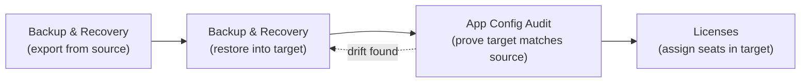
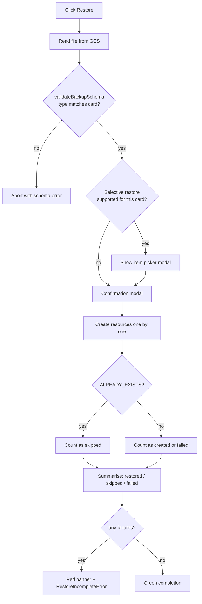
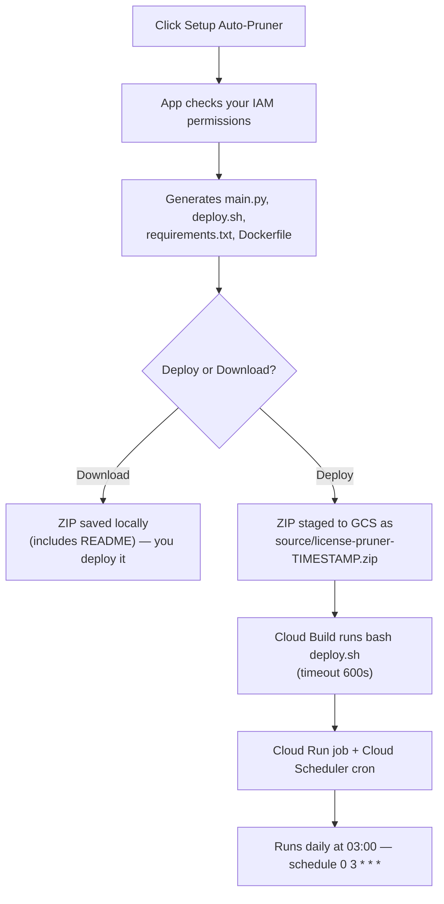
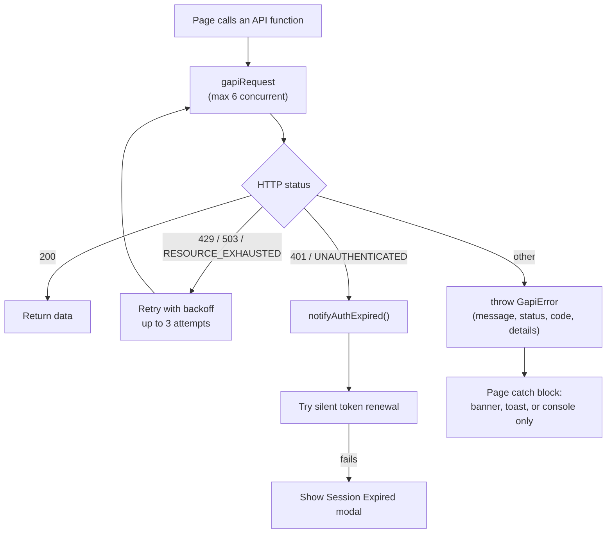
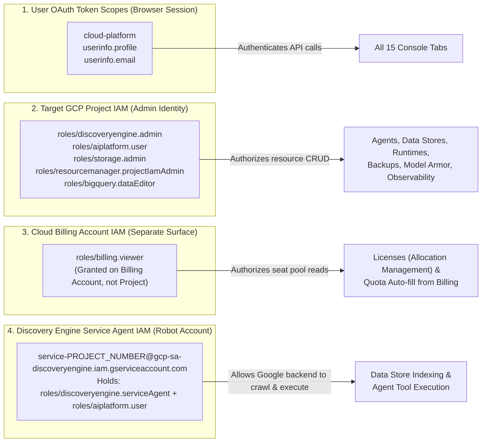

# Chapter 4 — System: Backup & Recovery, App Config Audit, and Licenses

**Who this chapter is for** — Administrators who have to move a Gemini Enterprise app between
projects, prove that two environments match before a cutover, or control who holds a paid seat.

**What you'll be able to do**

- Export your Gemini Enterprise configuration to a Cloud Storage bucket, and restore it into another project.
- Know precisely which resources are captured by a backup — and which are silently left behind.
- Run a read-only parity audit between a source and a destination app, and export it as a report.
- See every user who holds a licence, find the ones who never sign in, and reclaim those seats.
- Deploy an automated, scheduled licence pruner into your own project.

**Before you start**

| Requirement | Detail |
|---|---|
| Signed in | You must be signed in with Google. The app requests the `https://www.googleapis.com/auth/cloud-platform`, `.../auth/userinfo.profile` and `.../auth/userinfo.email` scopes — see [App.tsx](file:///usr/local/google/home/wdufrin/Documents/Code/Gemini-Enterprise-Manager/App.tsx#L296-L301). |
| Core IAM roles | `roles/discoveryengine.admin` on **both** the source and the target project. Backup/restore and licences all fail without it. |
| Storage roles | `roles/storage.admin` (or `objectAdmin` + `buckets.list`) on the project that owns the backup bucket. The bucket dropdown is populated by listing buckets. |
| Agent Engine restore | `roles/aiplatform.user` on the target project. |
| Auto-pruner deploy | `roles/cloudbuild.builds.editor` plus the ability to grant roles to the Cloud Build service account. See [Appendix B](#appendix-b--complete-iam--api-prerequisites-matrix). |
| Enabled APIs | At minimum `discoveryengine`, `storage`, `aiplatform`, `cloudresourcemanager`, `serviceusage`. The full 13-API list is in [Appendix B](#appendix-b--complete-iam--api-prerequisites-matrix). |
| A GCS bucket | Backups are written to a bucket **you already own**. The app never creates one for you. |

> [!IMPORTANT]
> Everything in this chapter operates on **live production resources**. Backup and the Config
> Audit are safe. Restore and the Licenses tab are not — both can destroy or duplicate data.
> Read the **Known limitations & gotchas** section of a tab before you use it for the first time.

---

## At a glance

The three **System** tabs are the lifecycle tools. You typically use them in this order when
promoting an app from a dev project to production:



| Tab | Mutates anything? | What it touches |
|---|---|---|
| **Backup & Recovery** | Yes — restore and delete are destructive | Discovery Engine, Vertex AI Agent Engines, NotebookLM, Cloud Storage |
| **App Config Audit** | **No.** Read-only by design | Discovery Engine, Agent Registry, licence counts |
| **Licenses** | Yes — revoke and delete are destructive | Discovery Engine user stores, Cloud Billing, Cloud Run, Cloud Build |

---

## Backup & Recovery

### What it's for

This tab copies your Gemini Enterprise configuration out of one Google Cloud project and into a
JSON file in a Cloud Storage bucket, and copies it back in again — into the same project or a
different one. It is how you clone a working app into a new environment, and how you keep a
recoverable snapshot before a risky change.

It is a **configuration** backup, not a data backup. It captures the definitions of your engines,
assistants, agents, data store settings and authorizations. It does not capture the documents you
have indexed.

### The screen, explained

The page is laid out in three bands — see [BackupPage.tsx](file:///usr/local/google/home/wdufrin/Documents/Code/Gemini-Enterprise-Manager/pages/BackupPage.tsx).

1. **Configuration header** (top) — where you tell the tool which project, location, app, Agent
   Engine and bucket to work against. Every card below inherits these values.
2. **Metadata Scope Notice** — a standing banner reminding you that backups capture configuration
   metadata, not indexed content. It is not dismissible.
3. **Eight backup/restore cards** — one per resource family. Each card has a **Backup** button on
   the left and a restore row on the right.
4. **Log console** — appended to live during any operation. It is wiped at the start of every new
   operation.

Every card is built from the same component, [BackupRestoreCard.tsx](file:///usr/local/google/home/wdufrin/Documents/Code/Gemini-Enterprise-Manager/components/backup/BackupRestoreCard.tsx), so the controls are identical:

| Control | Behaviour |
|---|---|
| **Backup** | Runs the export. Label changes to **Backing up to GCS...** while it runs. |
| **-- Select Backup File --** | Dropdown of existing backup files in the bucket, filtered to this card's resource type. |
| **Restore** | Enabled only once a file is selected. Opens a confirmation modal. |
| **Download** | Downloads the selected JSON to your computer. |
| **Delete** | Permanently deletes the selected file from the bucket. Opens a confirmation modal. |
| ⓘ | Shows the equivalent REST/cURL commands. Tooltip is `Show backup API command` / `Show restore API command`. |


### What is actually backed up

There are exactly eight cards, declared at [BackupPage.tsx#L46-L111](file:///usr/local/google/home/wdufrin/Documents/Code/Gemini-Enterprise-Manager/pages/BackupPage.tsx#L46-L111). This table is the honest inventory — it was read out of [backupOperations.ts](file:///usr/local/google/home/wdufrin/Documents/Code/Gemini-Enterprise-Manager/services/backup/backupOperations.ts), not from any older documentation.

| Card | Scope | What the export really contains | GCS filename prefix |
|---|---|---|---|
| **All Discovery Resources** | Global | Collections filtered to `/default_collection`, the engines inside them, and assistants filtered to `/default_assistant`. **Nothing else.** | `agentspace-discovery-backup` |
| **Single Agent Engine** | Global | One Vertex AI Reasoning (Agent) Engine definition, from the **Agent Engine Location** you selected. | contains `-reasoning-engine-` |
| **Single Assistant** | Global | The `default_assistant` object plus the agents attached to it, plus each agent's IAM policy. | contains `-assistant-` |
| **Agents** | Global | The agent definitions attached to the assistant, plus their IAM policies. | contains `-agents-` |
| **Data Stores** | Global | Data store **configuration objects only** — name, industry vertical, solution types, content config. **Not the indexed documents.** | `agentspace-data-stores-backup` |
| **Authorizations** | Global | Authorization resources (OAuth connections). Client **secrets are not returned by the API** and are not in the file. | `agentspace-authorizations-backup` |
| **NotebookLMs** | User Specific | Notebooks belonging to the signed-in user. | `agentspace-notebooklm-backup` |
| **Chat History** | User Specific | Sessions and their turns for the signed-in user. | `agentspace-chat-history-backup` |

> [!WARNING]
> **"All Discovery Resources" is not a complete snapshot.** Despite the name, it contains only
> collections, engines and assistants — see [backupOperations.ts#L58-L133](file:///usr/local/google/home/wdufrin/Documents/Code/Gemini-Enterprise-Manager/services/backup/backupOperations.ts#L58-L133). To capture an app fully you must run the
> **Agents**, **Data Stores** and **Authorizations** cards as well. Earlier documentation claimed
> this one card covered all six — it does not.

### What is NOT backed up

Be explicit with yourself about this list before you rely on a backup for disaster recovery.

- **Indexed documents and their content.** Data store *settings* are saved; the corpus is not.
- **OAuth client secrets** on authorizations. The API never returns them, so the restore side
  prompts you to re-enter them.
- **Licence assignments.** Who holds a seat is not part of any backup. Use the Licenses tab's
  **Export Data** button separately.
- **IAM policy of the project itself.** Only per-agent IAM policies are captured.
- **Model Armor templates, Observability config, Quota settings, Cloud Run services.**
- **Other users' notebooks and chat history.** The last two cards are scoped to *you*, the signed-in
  user, which is why they are labelled `User Specific`.
- **Anything in an Agent Engine location other than the one selected** — only `us-central1`,
  `europe-west1` and `asia-east1` are offered.

### How to: back up a resource type

1. Fill in the **Configuration header** — at minimum **Target Project ID**, **Target Project
   Number**, **Target Location (Discovery)** and **Target Gemini Enterprise ID**.
2. Choose a **Backup Bucket (GCS)** from the dropdown. If the dropdown is empty, see
   [Troubleshooting](#troubleshooting-2) below.
3. Find the card for the resources you want, and click **Backup**.
4. Watch the log console. Each step is appended as it completes.

**Expected result:** a line in the log confirming the upload, and a new file in your bucket named
`<prefix>-<timestamp>.json` — for example `agentspace-discovery-backup-2025-03-14T09-12-04-517Z.json`.
The file appears in that card's **-- Select Backup File --** dropdown after the next refresh.

<details>
<summary>Under the hood — the API calls this makes</summary>

The exports are ordinary Discovery Engine `list`/`get` calls, assembled client-side and then
uploaded. For example **All Discovery Resources** calls, in order:

```
GET  https://discoveryengine.googleapis.com/v1alpha/projects/{project}/locations/{loc}/collections
GET  https://discoveryengine.googleapis.com/v1beta/{collection}/engines
GET  https://discoveryengine.googleapis.com/v1alpha/{engine}/assistants
```

Collections are then filtered client-side to those ending in `/default_collection`, and assistants
to those ending in `/default_assistant`.

The upload is a direct, un-retried `fetch` to the GCS JSON upload endpoint —
[uploadFileToGcs](file:///usr/local/google/home/wdufrin/Documents/Code/Gemini-Enterprise-Manager/services/api/cloudStorage.ts):

```
POST https://storage.googleapis.com/upload/storage/v1/b/{bucket}/o?uploadType=media&name={file}
Content-Type: application/json
Authorization: Bearer <token>
```

Every backup file is wrapped with three metadata fields — `type`, `createdAt` and `sourceConfig` —
which is how the restore side knows what it is looking at.
</details>

### How to: restore a backup into a project

> [!CAUTION]
> Restore writes into whatever project is in the **Target Project ID** field — which may not be the
> project the backup came from. Read the confirmation modal. It names the destination project and
> makes you type that project ID to proceed.

1. Set the **Configuration header** to the **destination**. This is the single most common mistake:
   the header is the *target*, not the source.
2. On the relevant card, pick a file from **-- Select Backup File --**.
3. Click **Restore**.
4. A confirmation modal lists the consequences. Type the **target project ID** exactly into the
   confirmation box.
5. Click **Restore into `<project>`**.
6. Watch the log console for the per-resource results.

**Expected result:** a summary line of the form `restored=12, skipped=3, failed=0`. A red banner
appears if anything failed.



> [!NOTE]
> The schema check runs on **restore**, not on backup. A malformed or mismatched file is caught at
> the moment you try to use it — see [useBackupOperations.ts#L643-L700](file:///usr/local/google/home/wdufrin/Documents/Code/Gemini-Enterprise-Manager/hooks/useBackupOperations.ts#L643-L700).

### How to: restore only some items (selective restore)

Some cards open an item picker before the confirmation modal, letting you cherry-pick.

1. Select the backup file and click **Restore**.
2. The **Restore Selection** modal appears — *"Select the items you wish to restore from the backup
   file."*
3. Tick the items you want, or use **Select All** / **Deselect All**.
   Items that cannot be restored are greyed out with a red reason next to them.
4. Click **Restore N Item(s)**.
5. Complete the confirmation modal as above.

**Expected result:** only the ticked items are attempted; the rest are absent from the outcome
summary entirely (they are not counted as "skipped").

### How to: download or delete a backup file

- **Download** — select a file, click **Download**. The JSON is saved by your browser.
- **Delete** — select a file, click **Delete**, then type the **exact filename** into the
  confirmation box. This is permanent; there is no undo and no trash.

> [!CAUTION]
> Delete removes the object from Cloud Storage immediately. If your bucket does not have object
> versioning enabled, the backup is gone. Consider enabling versioning on your backup bucket.

### Field reference

Fields are defined in [BackupConfigHeader.tsx#L66-L178](file:///usr/local/google/home/wdufrin/Documents/Code/Gemini-Enterprise-Manager/components/backup/BackupConfigHeader.tsx#L66-L178).

| Field | What to enter | Required | Notes / Default |
|---|---|---|---|
| **Target Project ID** | The destination project's ID, e.g. `my-ge-prod`. | Yes | Also used as the typed confirmation keyword on restore. |
| **Target Project Number** | The destination project's numeric ID. | Yes | Used to build resource paths and the `X-Goog-User-Project` header. |
| **Target Location (Discovery)** | Where the Gemini Enterprise app lives. | Yes | Dropdown: `global`, `us`, `eu`. Default `global`. |
| **Target Gemini Enterprise ID** | The app (engine) ID in the destination. | Yes | |
| **Agent Engine Location** | Vertex AI region for Agent Engines. | Only for the Agent Engine card | Dropdown: `us-central1`, `europe-west1`, `asia-east1`. **No other region is selectable.** |
| **Target Agent Engine** | Which Agent Engine to back up or restore into. | Only for the Agent Engine card | Populated by listing engines in the chosen region. |
| **Backup Bucket (GCS)** | The bucket that holds backup files. | Yes | Dropdown, populated by listing buckets in the project. Files are written at the bucket **root**, not in a folder. |

> [!NOTE]
> The collection and assistant IDs are **not** editable in the UI. They are hardcoded to
> `default_collection` and `default_assistant` — [useBackupOperations.ts#L100-L107](file:///usr/local/google/home/wdufrin/Documents/Code/Gemini-Enterprise-Manager/hooks/useBackupOperations.ts#L100-L107). Non-default collections
> and assistants are invisible to this tab.

### Known limitations & gotchas

Every item here was verified in source. None of them are hypothetical.

1. **Restoring Agents always creates new agents.** There is no update path. Run the same agents
   restore twice and you get two copies of every agent, with new IDs. The same is true for
   **NotebookLMs** and **Agent Engines**. Only collections, engines, data stores and authorizations
   treat `ALREADY_EXISTS` as a benign skip.
2. **The "Single Assistant" card's restore only restores its agents.** The assistant object itself
   (its `displayName` and `generationConfig`) is written only via the **All Discovery Resources**
   path — [useBackupOperations.ts#L380-L410](file:///usr/local/google/home/wdufrin/Documents/Code/Gemini-Enterprise-Manager/hooks/useBackupOperations.ts#L380-L410).
3. **Cross-project name rewriting is partial.** Only authorization resource names and the ADK
   agent's `provisionedReasoningEngine.reasoningEngine` reference are rewritten to the new project
   — [restoreOperations.ts#L109-L145](file:///usr/local/google/home/wdufrin/Documents/Code/Gemini-Enterprise-Manager/services/backup/restoreOperations.ts#L109-L145). Everything else keeps its original ID. If a resource ID
   embeds the old project, it will carry over.
4. **The backup file dropdown does not paginate.** The listing call fetches one page, and GCS caps
   a page at 1000 objects. In a long-lived bucket, older backups become invisible in the UI (they
   are still in the bucket — use the Cloud Console).
5. **A failed Agents restore can look silent.** Because the Agents card's handler discards its
   outcome object ([useBackupOperations.ts#L560-L562](file:///usr/local/google/home/wdufrin/Documents/Code/Gemini-Enterprise-Manager/hooks/useBackupOperations.ts#L560-L562)), a restore in which every agent failed still ends
   with the neutral log line `Restore process for Agents finished.` and **no red banner**. Always
   read the individual log lines for this card; do not trust the absence of a banner.
6. **Chat History backup degrades quietly.** If a session's turns cannot be fetched, a summary stub
   is written in its place with no log line.
7. **Download bypasses automatic re-authentication.** If your token expired, **Download** fails with
   a bare `Failed to download object: 401` instead of showing the **Session Expired** prompt.
   Refresh the page and sign in again.
8. **Logs are cleared at the start of every operation** and are never persisted. Copy anything you
   need before starting the next action.
9. **The ⓘ button on "Single Agent Engine" has no content.** It shows
   `No specific API command examples are available for "Backup - ReasoningEngine".` The examples were
   registered under a different key. Harmless, but not a bug in your setup.
10. **Long operations have hard timeouts.** Engine operations poll for 300 s; Agent Engine restores
    poll for 600 s. Exceeding that produces a timeout error even if the server-side operation
    eventually succeeds.

### Troubleshooting

| Symptom / exact error text | Cause | Fix |
|---|---|---|
| **Backup Bucket (GCS)** dropdown is empty | The bucket listing call failed; the error is logged to the browser console only. | Confirm `storage.googleapis.com` is enabled and you hold `storage.buckets.list` on the project. Open DevTools → Console for the real error. |
| Backup file dropdown is empty although files exist | Either the filename prefix does not match that card, or you are past the first 1000 objects in the bucket. | Check the object name matches the prefix in the table above. Clean out old backups or use a dedicated bucket. |
| `Invalid backup file: expected type "<X>" but found "<Y>"` | You selected a file produced by a different card. | Pick the file whose prefix matches the card. |
| `Restore of <section> did not complete: N of M resource(s) failed. <detail>` | Some resources could not be created in the target. | Read the per-resource lines in the log. Usually missing IAM in the target, or a referenced resource (data store, authorization) that does not exist there yet. |
| `<Resource> operation timed out after 300s` | The Discovery Engine long-running operation did not finish in the poll budget. | Check the operation in Cloud Console; it may have completed. Re-run only if it genuinely failed — re-running agents creates duplicates. |
| `Agent Engine restore timed out after 600s` | Vertex AI Agent Engine creation is slow or stuck. | Verify in Vertex AI Console before retrying. |
| `Lost contact with the Agent Engine restore operation after N consecutive polling failures` | Five consecutive poll requests failed (network or permission). | Check `aiplatform.googleapis.com` access and network stability. |
| `GCS Upload Failed: 403 - ...` | No write permission on the bucket. | Grant `roles/storage.objectAdmin` on the bucket. |
| `Failed to download object: 401` | Expired token on the raw download path. | Reload the page and sign in again. |
| Restore succeeded but the agent does not work in the target | A referenced authorization or data store was not restored, or the client secret is missing. | Restore **Authorizations** and **Data Stores** first, then re-enter OAuth client secrets. |

---

## App Config Audit

### What it's for

This tab compares two Gemini Enterprise apps — a source and a destination — and tells you, setting
by setting, where they differ. It is the pre-cutover checklist: you run it after a restore to prove
the new environment actually matches the old one.

It changes nothing. The page advertises this with two badges, **Read-Only Parity Check** and
**Zero Mutations**, and the code contains no write calls on this path.

### The screen, explained

The page heading is **App Configuration Audit** (the sidebar label is the shorter
`App Config Audit`) — [ConfigAuditPage.tsx](file:///usr/local/google/home/wdufrin/Documents/Code/Gemini-Enterprise-Manager/pages/ConfigAuditPage.tsx).

1. **Two selector panels**, side by side — Source on the left, Destination on the right. Each is a
   **Project ID or Number** field, a **Region Location** dropdown, and a **Gemini Enterprise App ID**
   field with an `Enter manually` / `Select from list` toggle.
2. **Action bar** — the **Run Parity Audit** button and the two export buttons.
3. **Progress indicator** — a labelled bar that steps through the five pillars.
4. **Summary card** — an overall score out of 100 with a verdict and a coloured dot.
5. **Filter toolbar** — a status dropdown offering `All Statuses`,
   `Differences Only (⚠️ / ❌)` and `Matches Only (✅)`.
6. **Comparison table** — columns `Pillar`, `Asset / Component`, `Source Setting`,
   `Destination Setting`, `Status`, `Guidance / Remediation`.

````carousel

<!-- slide -->

````

### What it checks — the complete rule catalogue

The audit runs five pillars in sequence. This table is the full set of checks, taken from
[configAuditService.ts](file:///usr/local/google/home/wdufrin/Documents/Code/Gemini-Enterprise-Manager/services/configAuditService.ts).

Status values are `MATCH` ✅, `DRIFT` ⚠️, `MISSING_IN_TARGET` ❌, `INFO` ℹ️ and `UNKNOWN` ⚪.

#### Pillar 1 — Engine & Identity Provider (progress 15%)

| Check (internal id) | What it compares | Severity if different | Why you should care | Remediation |
|---|---|---|---|---|
| `src-engine-inaccessible` | Whether the source app could be read at all | `UNKNOWN` | You cannot audit what you cannot see — the whole report is meaningless. | Fix read access on the source project first. |
| `tgt-engine-inaccessible` | Whether the destination app could be read | `UNKNOWN` | Same, for the destination. | Grant `roles/discoveryengine.viewer` or higher on the target. |
| `engine-solution-type` | The engine's solution type | `DRIFT` | A search app and an assistant app behave completely differently for end users. | Recreate the destination app with the matching solution type — it cannot be changed in place. |
| `engine-search-tier` | The configured search tier | `DRIFT` | The wrong tier silently changes result quality and your bill. | Update the tier on the destination engine. |
| `engine-idp-mode` | Identity provider mode (Google vs third-party / workforce federation) | `DRIFT` | Users may be unable to sign in at all, or see documents they should not. | Reconfigure the destination IdP to match. |
| `engine-widget-cid` | The widget config / client ID | `DRIFT` | An embedded widget on your intranet will point at the wrong app. | Re-issue or align the widget configuration. |
| `location-alignment` | Source region vs destination region | `DRIFT` | Data residency and latency; some features are region-limited. | Confirm the difference is intentional. |

#### Pillar 2 — Grounding Data Stores (progress 40%)

| Check | What it compares | Severity | Why you should care | Remediation |
|---|---|---|---|---|
| `src-datastores-error` / `tgt-datastores-error` | Whether the data store list could be fetched | `UNKNOWN` | Silence is not the same as "none". | Grant `discoveryengine.dataStores.list`. |
| `no-source-datastores` | Source has zero data stores | `INFO` | Nothing to ground against — the app will answer from the model only. | Informational. |
| `ds-<id>` (one row per source data store) | Presence of a matching data store in the destination | `MISSING_IN_TARGET` if absent, else `MATCH` | Missing grounding is the number-one cause of "the assistant got dumber after we migrated". | Restore or recreate the data store, then re-index it. |

#### Pillar 3 — Skills & Tools (progress 65%)

| Check | What it compares | Severity | Why you should care | Remediation |
|---|---|---|---|---|
| `src-skills-error` / `tgt-skills-error` | Whether the Agent Registry could be read | `UNKNOWN` | Skills may exist but be unreadable. | Enable `agentregistry.googleapis.com` and grant read access. |
| `no-source-skills` | Source has no registered skills | `INFO` | Nothing to compare. | Informational. |
| `skill-<id>` (one row per source skill) | Presence of the matching skill in the destination | `MISSING_IN_TARGET` if absent | Agents will fail at runtime when they try to call a tool that is not registered. | Register the skill in the destination registry. |

#### Pillar 4 — Authorizations (progress 80%)

| Check | What it compares | Severity | Why you should care | Remediation |
|---|---|---|---|---|
| `src-auths-error` / `tgt-auths-error` | Whether authorizations could be listed | `UNKNOWN` | Auth gaps are invisible until a user hits them. | Grant read on authorizations in both projects. |
| `auth-<id>` (one row per source authorization) | Presence of the matching authorization in the destination | `MISSING_IN_TARGET` if absent | Users get an OAuth consent failure mid-conversation. | Recreate the authorization and re-enter its client secret. |

#### Pillar 5 — Licenses & Quotas (progress 95%)

| Check | What it compares | Severity | Why you should care | Remediation |
|---|---|---|---|---|
| `license-stats-active` | Assigned-user counts, source vs destination | `INFO` | Nobody can use the new app until seats are assigned there. | Assign licences in the destination via the **Licenses** tab. |
| `license-stats-error` | Whether licence stats could be read | `UNKNOWN` | Count reads as zero when it is really "unknown". | Grant `discoveryengine.userStores.list`. |

> [!WARNING]
> The licence row frequently reports `0 Assigned Users` even when seats exist. The audit sums a
> response field that the licence API does not return under that name —
> [configAuditService.ts#L537-L544](file:///usr/local/google/home/wdufrin/Documents/Code/Gemini-Enterprise-Manager/services/configAuditService.ts#L537-L544) versus the declared shape in [licenses.ts#L162-L167](file:///usr/local/google/home/wdufrin/Documents/Code/Gemini-Enterprise-Manager/services/api/licenses.ts#L162-L167). Treat this
> row as decorative and confirm real numbers on the **Licenses** tab.

### How the score is calculated

```
score = max(0, 100 − 15 × (missing checks) − 5 × (drift checks))
```

If there were **zero** actionable checks — because everything came back `UNKNOWN` — the score is
`null` and the verdict is *"Unable to assess"*, not 100. That is deliberate: a permissions failure
must never look like a clean bill of health.

| Score | Verdict | Dot |
|---|---|---|
| 90–100 | Ready for Cutover | 🟢 |
| 70–89 | Minor Remediations Recommended | 🟡 |
| Below 70 | Blockers Detected in Target | 🔴 |
| `null` | Unable to assess | ⚪ |

### How to: run a parity audit

1. In the **Source** panel, enter the **Project ID or Number**, pick the **Region Location**, and set
   the **Gemini Enterprise App ID**. Use **Select from list** if you want to pick it from a dropdown
   rather than type it.
2. Repeat in the **Destination** panel.
3. Click **Run Parity Audit**.
4. Watch the progress bar move through Engine & IdP → Grounding DataStores → Skills & Tools →
   Authorizations → Licenses & Quotas.

**Expected result:** the summary card shows a score and verdict, and the comparison table fills with
one row per check.

> [!TIP]
> Set the status filter to `Differences Only (⚠️ / ❌)` immediately. On a real app the table is long,
> and only the differences need action.

<details>
<summary>Under the hood — the API calls this makes</summary>

The audit is pure `GET` traffic against Discovery Engine and the Agent Registry, run once per side:

```
GET https://{loc}-discoveryengine.googleapis.com/v1beta/projects/{p}/locations/{loc}/collections/default_collection/engines/{engineId}
GET .../v1beta/projects/{p}/locations/{loc}/collections/default_collection/dataStores?pageSize=100
GET .../v1alpha/projects/{p}/locations/{loc}/authorizations
GET https://discoveryengine.googleapis.com/v1/projects/{p}/locations/{loc}/userStores/{store}/userLicenses
GET https://agentregistry.googleapis.com/... (skills)
```

For `global`, the host is `https://discoveryengine.googleapis.com` with no region prefix.

Errors matching `401`, `403`, `PERMISSION_DENIED`, `UNAUTHENTICATED`, `forbidden` or
`insufficient scopes` are classified as **access failures** and become `UNKNOWN` rows rather than
`MISSING_IN_TARGET` — see [isAccessFailure](file:///usr/local/google/home/wdufrin/Documents/Code/Gemini-Enterprise-Manager/services/configAuditService.ts#L51-L62). This is why the audit never
falsely accuses a target of being empty when you simply lack permission.
</details>

### How to: export the audit report

With a completed audit on screen:

- Click the Markdown export to get `ge-config-audit-<source>-to-<target>.md`.
- Click the JSON export to get `ge-config-audit-<source>-to-<target>.json`.

The Markdown file has three sections, generated by
[generateAuditMarkdown](file:///usr/local/google/home/wdufrin/Documents/Code/Gemini-Enterprise-Manager/services/configAuditService.ts#L612-L705):

1. **Executive Summary** — a table with the score, verdict and counts.
2. **Granular Audit Matrix** — the full comparison table.
3. **Recommended Cutover Actions** — a bullet list of the remediations for every non-matching row.

The Markdown version is the one to attach to a change-management ticket. The JSON version is the one
to diff in CI.

### Field reference

| Field | What to enter | Required | Notes / Default |
|---|---|---|---|
| **Project ID or Number** | Either form is accepted. | Yes | One per side. |
| **Region Location** | The Discovery Engine location of that app. | Yes | Must match how the app was created; `global` is the common case. |
| **Gemini Enterprise App ID** | The engine ID. | Yes | Toggle between `Enter manually` and `Select from list`. The list shows `-- Select Gemini Enterprise App --` and `+ Enter Custom App ID...`. |

### Known limitations & gotchas

1. **Data stores are capped at 100 per side** and there is no pagination. If you have more, the
   report is incomplete but does not say so.
2. **Skills are not paginated either.** Same risk.
3. **Identity-provider detection is a substring match.** The code decides an engine uses workforce
   federation by testing whether the engine name contains `wif`. Any engine whose ID happens to
   contain those three letters is misclassified.
4. **The licence row is unreliable** — see the warning above.
5. **`UNKNOWN` rows do not lower the score, but they do not raise it either.** A report full of
   `UNKNOWN` yields *Unable to assess*. Fix permissions and re-run rather than shipping the report.
6. **Only `default_collection` is inspected.** Apps in a non-default collection are out of scope.
7. **The audit does not check Model Armor, Observability, or quota limits** despite "Quotas" in the
   pillar name — only licence counts are read.

### Troubleshooting

| Symptom / exact error text | Cause | Fix |
|---|---|---|
| Score shows *Unable to assess* ⚪ | Every check returned `UNKNOWN` — almost always missing read access on one or both sides. | Grant `roles/discoveryengine.viewer` on both projects and re-run. |
| Many rows show ⚪ **UNKNOWN** with a permission message | A 401/403 on that specific API. | Check which pillar; grant the corresponding read permission from [Appendix B](#appendix-b--complete-iam--api-prerequisites-matrix). |
| Everything shows ❌ **MISSING_IN_TARGET** | The destination app ID or region is wrong, so you are comparing against an empty/nonexistent app. | Re-check **Gemini Enterprise App ID** and **Region Location** on the destination side. |
| Licence row says `0 Assigned Users` | Known field-name defect in the audit. | Verify on the **Licenses** tab instead. |
| A data store you know exists is reported missing | Beyond the 100-item cap, or in a non-default collection. | Verify manually in the Console. |
| **Run Parity Audit** does nothing | A required field is empty. | Fill all three fields on both sides. |

---

## Licenses

### What it's for

This tab shows every user who holds a Gemini Enterprise seat in your project, lets you assign,
revoke or delete those seats in bulk, and helps you find seats that are being paid for but never
used. It also lets you deploy a scheduled job that does the cleanup automatically.

### Where the numbers come from

> [!IMPORTANT]
> The user list comes from the **Discovery Engine user store**, not from Cloud Identity and not from
> the Admin SDK. A person who exists in your Google Workspace directory but has never been granted
> a Gemini Enterprise licence will **not** appear here.

Reads go to:

```
GET https://discoveryengine.googleapis.com/v1/projects/{project}/locations/{loc}/userStores/{store}/userLicenses?pageSize=1000
```

Results are cached in your browser in IndexedDB (database `GeminiLicenseCache`, store
`user_licenses`), keyed by `"<projectNumber>:<userStoreId>"` —
[licenseCache.ts](file:///usr/local/google/home/wdufrin/Documents/Code/Gemini-Enterprise-Manager/services/licenseCache.ts).

**The cache lives for 15 minutes** (`DEFAULT_LICENSE_CACHE_TTL_MS = 15 * 60 * 1000`). Within that
window the page loads instantly from cache and shows a pill reading
`Cached (N users) • Synced HH:MM:SS` with a **Sync Now** link. After 15 minutes the cache is treated
as expired and a fresh fetch happens.

> [!WARNING]
> You can be looking at a list that is up to 15 minutes old. Before any destructive action, click
> **Sync Now** and confirm the timestamp updates. Acting on stale data is how the wrong person loses
> access.

### The screen, explained

Three tabs across the top:

| Tab | Purpose |
|---|---|
| **User Assignments** | The main per-user table and all bulk actions. |
| **Allocation Management (Billing Account)** | Total seats purchased against the billing account, and how many are consumed. |
| **Group License Assignments** | Manage licence assignment by Google Group, via a deployed Cloud Run service. |

On **User Assignments** the action row contains, left to right:
**Apply (N)** · **Refresh List** · **Export Data** · **Prune Inactive** · **Setup Auto-Pruner**,
preceded by the bulk-action dropdown.

The bulk-action dropdown offers:

- `Select Target License...` (disabled placeholder)
- `Revoke License`
- `Delete Users`
- `Apply: <displayName> (Exp: YYYY-MM-DD)` — one entry per licence configuration in the project

The table columns are: a selection checkbox, **User Principal**, **State**, **License Config**,
**License ID**, **Last Login**, **Actions**. Page size is 25 / 50 / 100 / 250, defaulting to 50.
Filters sit above the columns: a contains-match on principal, a **State** dropdown
(`All States` / `ASSIGNED` / `UNASSIGNED`), a contains-match on config, and a date filter with
`>`, `<` and `=` operators.

While a full fetch is running you see `Fetching from Google Cloud... N loaded`.


### What "revoke" and "delete" actually do

This distinction matters more than any other thing on this page.

| Action | API flag sent | Effect |
|---|---|---|
| **Revoke License** | `deleteUnassignedUserLicenses: false` | The seat is released. The **user record stays** in the user store, moving to state `UNASSIGNED`. Their history is retained. Reversible — re-assign the licence. |
| **Delete Users** | `deleteUnassignedUserLicenses: **true**` | The seat is released **and the unassigned user record is removed from the user store**. Not reversible from this UI. |

Both go to the same endpoint:

```
POST https://discoveryengine.googleapis.com/v1/projects/{p}/locations/{loc}/userStores/{store}:batchUpdateUserLicenses
```

> [!CAUTION]
> **Delete Users** is the destructive one. It removes the user record, not just the seat. The user
> loses access to Gemini Enterprise immediately and their per-user artifacts (such as the notebooks
> and chat history that the Backup tab describes as `User Specific`) may become unreachable.
> Test this against a non-production user store before you run it at scale.

### How to: assign, revoke or delete seats in bulk

1. Click **Refresh List** (or **Sync Now**) so you are acting on current data.
2. Use the filters to narrow the table — for example State = `UNASSIGNED`.
3. Tick the users you want to act on.
4. Choose the action from the dropdown:
   - `Apply: <licence name>` to grant that licence,
   - `Revoke License` to release the seat,
   - `Delete Users` to release the seat and remove the record.
5. Click **Apply (N)** — the number is the count of selected users.
6. For **Revoke** and **Delete** a confirmation modal appears. Type `REVOKE` or `DELETE`
   respectively, in **upper case**, exactly.
7. Confirm.

**Expected result:** a success toast, and the table updates to reflect the new state.

> [!WARNING]
> **Assigning** a licence has *no* confirmation step — [useLicenseManagement.ts#L478-L485](file:///usr/local/google/home/wdufrin/Documents/Code/Gemini-Enterprise-Manager/hooks/useLicenseManagement.ts#L478-L485).
> Selecting 500 users and choosing `Apply: <licence>` commits immediately when you click **Apply**.
> Check your selection count before clicking.

<details>
<summary>Under the hood — the API calls this makes</summary>

All three operations post to `:batchUpdateUserLicenses` in chunks of **100 users**:

```http
POST https://discoveryengine.googleapis.com/v1/projects/{p}/locations/{loc}/userStores/{store}:batchUpdateUserLicenses
Content-Type: application/json

{
  "inlineSource": {
    "userLicenses": [ { "userPrincipal": "user@example.com", "licenseConfig": "..." } ],
    "updateMask": "userPrincipal,licenseConfig"
  },
  "deleteUnassignedUserLicenses": false
}
```

- **Revoke** sends `deleteUnassignedUserLicenses: false` with the update mask shown.
- **Delete** sends `deleteUnassignedUserLicenses: true` with the same mask.
- **Assign** sends **no `updateMask` at all**. The source carries an explicit comment at
  [licenses.ts#L80](file:///usr/local/google/home/wdufrin/Documents/Code/Gemini-Enterprise-Manager/services/api/licenses.ts#L80): *"API limitation: updateMask breaks the reassignment
  payload, setting it to NO_LICENSE. Do not include it."* If you automate this yourself, reproduce
  that quirk or your assignments will silently no-op.

Each chunk returns a long-running operation, polled up to 45 times at 2-second intervals.
</details>

### How to: find and remove inactive seats (the pruner)

The **Prune Inactive** button opens a modal titled **Prune Inactive Licenses**, subtitled
*"Identify and revoke licenses with no recent user activity"* —
[PruneLicensesModal.tsx](file:///usr/local/google/home/wdufrin/Documents/Code/Gemini-Enterprise-Manager/components/license/PruneLicensesModal.tsx).

1. Click **Prune Inactive**.
2. Set **Inactive threshold (Days)**. Default is `30`; minimum is `1`.
3. Decide whether to tick **Include never-logged-in users**. Leave it off for a conservative first
   pass — a user provisioned yesterday has no login record.
4. The **Dry-Run Preview Result** panel updates live, showing the count and a three-column table of
   **Principal**, **Last Login** and **Assigned Date**.
5. *(Recommended)* Click **Export Inactive Users (CSV)**. You get
   `license_prune_dryrun_<days>days_<count>_users.csv` — keep it as your record of who was affected.
6. Type `PRUNE` in the confirmation box. This box is case-insensitive.
7. Click **Confirm Prune (N)**.

**Expected result:** the listed users are **revoked** (not deleted), and the affected rows disappear
from the table.

> [!NOTE]
> The dry-run preview is genuinely read-only — it is computed from the already-loaded list in your
> browser and issues no API calls. You can open the modal, explore thresholds and close it with
> total safety.

> [!WARNING]
> After the prune, the pruned users vanish from the table entirely rather than flipping to
> `UNASSIGNED` — [useLicenseManagement.ts#L436-L439](file:///usr/local/google/home/wdufrin/Documents/Code/Gemini-Enterprise-Manager/hooks/useLicenseManagement.ts#L436-L439). They are **not** deleted; the display is simply
> wrong. Click **Refresh List** and they reappear correctly as `UNASSIGNED`.

### How to: deploy the automated pruner

**Setup Auto-Pruner** does not prune anything itself. It generates a small containerised job and
deploys it into *your* project on a schedule — [usePrunerDeployment.ts](file:///usr/local/google/home/wdufrin/Documents/Code/Gemini-Enterprise-Manager/hooks/usePrunerDeployment.ts).



1. Click **Setup Auto-Pruner**.
2. Review the permission check. It verifies you hold `roles/discoveryengine.admin`,
   `roles/logging.logWriter` and `roles/serviceusage.serviceUsageConsumer`.
3. Choose **Download** to inspect the generated code first, or **Deploy** to submit it to Cloud Build.
4. If deploying, you may be prompted to grant roles to the Cloud Build service account
   `<projectNumber>@cloudbuild.gserviceaccount.com`.

**Expected result:** a Cloud Run job and a Cloud Scheduler entry in your project, running on the
cron schedule `0 3 * * *` (03:00 daily).

> [!CAUTION]
> Two things about this deployment deserve your full attention.
>
> 1. **The deployed pruner deletes; the in-app button revokes.** The generated `main.py` sends
>    `"deleteUnassignedUserLicenses": True` — [prunerTemplates.ts#L143](file:///usr/local/google/home/wdufrin/Documents/Code/Gemini-Enterprise-Manager/components/license/pruner/prunerTemplates.ts#L143). The scheduled job is
>    therefore **more destructive** than the manual **Prune Inactive** button, running unattended
>    every night. Download and read the generated code before you deploy it.
> 2. **The grant block is broad.** It asks for `roles/resourcemanager.projectIamAdmin`,
>    `roles/iam.serviceAccountAdmin`, `roles/run.admin`, `roles/cloudscheduler.admin`,
>    `roles/iam.serviceAccountUser` and `roles/serviceusage.serviceUsageConsumer` on the Cloud Build
>    service account — [usePrunerDeployment.ts#L268-L295](file:///usr/local/google/home/wdufrin/Documents/Code/Gemini-Enterprise-Manager/hooks/usePrunerDeployment.ts#L268-L295). `projectIamAdmin` plus
>    `serviceAccountAdmin` on a build service account is effectively project-admin. Grant it for the
>    deployment, then remove it.

### Allocation Management (Billing Account)

This tab reads seat allocation from the **billing account**, not the project. If your account has
many projects on one billing account, the totals here span all of them while the **User
Assignments** tab shows only the current project. A mismatch between the two is normal and not a
defect.

Reading it requires billing-account-level permission (`roles/billing.viewer` on the *billing
account*, which is a separate IAM surface from the project). Without it the tab is empty and the
failure is logged to the browser console only.

### Group License Assignments

Assigns licences by Google Group rather than one user at a time, by deploying a helper Cloud Run
service. You can trigger a run on demand; the resulting toast reports the message the service
returned.

> [!WARNING]
> The region for this service is hardcoded to `us-central1` —
> [useGroupLicensing.ts#L54](file:///usr/local/google/home/wdufrin/Documents/Code/Gemini-Enterprise-Manager/hooks/useGroupLicensing.ts#L54). A service you deployed in any other region is invisible
> here and cannot be managed from this tab.

Deleting a group service requires typing the **service name** into the confirmation box, exactly,
including case.

### Field reference

| Field / control | What to enter | Required | Notes / Default |
|---|---|---|---|
| **User Principal** filter | Any substring of an email. | No | Contains-match, not exact. |
| **State** filter | `All States`, `ASSIGNED`, `UNASSIGNED` | No | Default `All States`. |
| **License Config** filter | Any substring of the config name. | No | Contains-match. |
| Date filter | A date plus `>`, `<` or `=`. | No | Applies to **Last Login**. |
| Page size | 25 / 50 / 100 / 250 | No | Default `50`. |
| Bulk action dropdown | One of the actions listed above. | Yes, to enable **Apply** | Starts on the disabled `Select Target License...`. |
| **Inactive threshold (Days)** | Whole number of days. | Yes | Default `30`, minimum `1`. |
| **Include never-logged-in users** | Checkbox. | No | Off by default. |
| Prune confirmation | `PRUNE` | Yes | **Case-insensitive** — input is trimmed and upper-cased. |
| Revoke / Delete confirmation | `REVOKE` / `DELETE` | Yes | **Case-sensitive** — the generic destructive modal compares exactly. |

> [!NOTE]
> Yes, those two confirmation boxes behave differently. The prune modal accepts `prune`; the bulk
> revoke/delete modal does not accept `revoke`. Type in upper case everywhere and you will never hit
> it — [DestructiveConfirmModal.tsx#L90](file:///usr/local/google/home/wdufrin/Documents/Code/Gemini-Enterprise-Manager/components/common/DestructiveConfirmModal.tsx#L90).

### Known limitations & gotchas

1. **15-minute cache.** The list you see may be stale. Always **Sync Now** before acting.
2. **Assign has no confirmation.** Only revoke and delete are gated.
3. **Bulk operations are not transactional.** They run in chunks of 100. If chunk 4 of 10 fails, the
   first three are already committed. On failure the on-screen list is not updated at all, so the UI
   shows the *pre-action* state even though part of the action succeeded. **Refresh List** to see
   the truth.
4. **Post-prune display is wrong** until you refresh (see the warning above).
5. **The scheduled pruner deletes rather than revokes** (see the caution above).
6. **The licence list is fetched with `pageSize=1000`.** Very large user stores may require multiple
   fetches; watch the `Fetching from Google Cloud... N loaded` counter settle before acting.
7. **Group licensing is `us-central1`-only.**
8. **Several dropdowns fail silently.** Licence configs, billing accounts, and the billing
   permission probe all log to the browser console and leave the control empty rather than showing
   an error.
9. **`deleteUnassignedUserLicenses` is interpreted server-side.** The app sends the flag; the scope
   of what gets deleted is decided by the Discovery Engine service, not by the app.

### Troubleshooting

| Symptom / exact error text | Cause | Fix |
|---|---|---|
| User list is empty but you know seats exist | Wrong project number, wrong location, or wrong user store ID. | Verify the project and location selectors. Remember this reads the Discovery Engine user store, not Cloud Identity. |
| A recently changed user shows the old state | 15-minute IndexedDB cache. | Click **Sync Now**, or **Refresh List**. |
| **Apply (N)** is greyed out | No users selected, or the action dropdown is still on `Select Target License...`. | Tick at least one row and choose an action. |
| Confirmation button stays disabled | Keyword mismatch. The bulk modal is case-sensitive. | Type `REVOKE` / `DELETE` / `PRUNE` in capitals. |
| `PERMISSION_DENIED` on a licence update | Missing `roles/discoveryengine.admin`. | Grant it on the project that owns the user store. |
| Licence assignment appears to succeed but the user still has no access | Known API quirk — assign must be sent **without** an update mask. If you are scripting this yourself, that is your bug. | Use the UI, or drop `updateMask` from your payload. |
| Allocation tab is blank | No billing-account-level permission. | Grant `roles/billing.viewer` on the **billing account**, not the project. |
| Auto-pruner deployment fails in Cloud Build | The Cloud Build service account lacks the roles listed above. | Accept the in-app grant prompt, or grant them manually, then re-run. |
| Group service you deployed is not listed | It is not in `us-central1`. | Redeploy to `us-central1` or manage it from the Cloud Run console. |
| Pruned users reappear after refresh as `UNASSIGNED` | Correct behaviour — prune revokes, it does not delete. | None. Use **Delete Users** if you truly want the records gone. |

---

## Chapter troubleshooting index

Every error string the three System tabs can surface, with cause and fix.

| Error text (verbatim) | Surfaced by | Cause | Fix |
|---|---|---|---|
| `Invalid backup file: expected type "<X>" but found "<Y>"` | Backup restore | File/card mismatch. | Select a file whose prefix matches the card. |
| `Restore of <section> did not complete: N of M resource(s) failed. <detail>` | Backup restore | Partial failure. | Read the log lines; usually target IAM or a missing dependency. |
| `<Resource> operation timed out after 300s` | Backup restore | Discovery Engine LRO exceeded the 60 × 5 s poll budget. | Check the operation in Console before retrying. |
| `Agent Engine restore timed out after 600s` | Backup restore | Vertex AI LRO exceeded the 60 × 10 s budget. | Check Vertex AI Console before retrying. |
| `Lost contact with the Agent Engine restore operation after N consecutive polling failures` | Backup restore | 5 consecutive poll errors. | Check network and `aiplatform` access. |
| `GCS Upload Failed: <status> - <body>` | Backup | Raw upload path failed. | 403 → grant `storage.objects.create`; 404 → bucket does not exist. |
| `Failed to download object: <status> - <body>` | Backup download | Raw download path failed. | 401 → reload and sign in; 403 → grant `storage.objects.get`. |
| `No specific API command examples are available for "Backup - ReasoningEngine".` | ⓘ on the Agent Engine card | Missing registration for that key. | Cosmetic. Ignore. |
| `Restore process for Agents finished.` **with no success or failure detail** | Backup restore (Agents) | The Agents handler discards its outcome. | Read the individual log lines to confirm success. |
| `Unable to assess` / ⚪ score | Config Audit | Every check returned `UNKNOWN`. | Grant read access on both projects and re-run. |
| `0 Assigned Users` in the licence pillar | Config Audit | Known field-name defect. | Verify on the Licenses tab. |
| `Session Expired` modal | Anywhere | OAuth token expired; silent renewal failed. | Click **Re-authenticate with Google**. |
| `Token configuration failed: <e>` | Sign-in | OAuth client misconfiguration. | Check the OAuth Client ID configuration. |
| `Google Identity Services script not loaded. Refresh or check network connectivity.` | Sign-in | `accounts.google.com` blocked or slow. | Check network/proxy, reload. |
| `Google Identity Services client is not initialized. Please check your OAuth Client ID.` | Sign-in | Missing or invalid client ID. | Configure a valid OAuth Client ID. |
| `Sign-in failed: <error>` | Sign-in | User cancelled or consent denied. | Retry and accept the consent screen. |
| `Validation check failed: <e>. Ensure the Service Usage API is enabled.` | Setup validation | `serviceusage.googleapis.com` disabled. | `gcloud services enable serviceusage.googleapis.com`. |
| `Failed to grant Service Agent role: <e>. You need roles/resourcemanager.projectIamAdmin or Project Owner privileges.` | Setup validation | Insufficient IAM to modify the policy. | Ask a project owner to run the grant. |
| `GAPI client has not been initialized. Call initGapiClient first.` | Any tab, early | The Google API client script has not finished loading. | Reload the page. If persistent, `apis.google.com` is blocked. |
| `Unknown API Error` | Any tab | The API returned an unparseable error body. | Open DevTools → Network, find the failing request, read the raw response. |
| `An unknown error occurred.` | Any tab | Generic fallback from the error formatter. | Same as above. |

---

## Appendix A — Error message index

This appendix is guide-wide. It applies to every tab, not just this chapter.

### How errors flow through the app

Almost every Google Cloud call in the app goes through a single function,
[gapiRequest](file:///usr/local/google/home/wdufrin/Documents/Code/Gemini-Enterprise-Manager/services/api/core.ts#L158-L306). Understanding what it does explains most of the behaviour you
will see.



Key facts:

- **Concurrency is capped at 6** in-flight requests.
- **Retries happen automatically** for `429`, `503` and `RESOURCE_EXHAUSTED`, up to 3 attempts, with
  backoff of roughly 2 s, 4 s, 8 s plus jitter. You do not need to retry these yourself — wait.
- **`status: 0` means the response never arrived.** That is a network, DNS, proxy or CORS failure,
  *not* a permission problem. This is the single most useful diagnostic in the whole app.
- **Two calls bypass all of this**: the GCS upload and download helpers use raw `fetch`. They get no
  retry and no **Session Expired** prompt.

### Telling 401 from 403 — and the three different causes of 403

Nina, this is the section to read. These two numbers look similar and mean completely different
things.

| You see | It means | How to be sure | Fix |
|---|---|---|---|
| **401** | *We don't know who you are.* Your sign-in token expired or was never sent. | The **Session Expired** modal usually appears on its own within a second or two. | Click **Re-authenticate with Google**. If the modal does not appear, reload the page and sign in again. |
| **403** | *We know who you are, and you're not allowed.* | The message body tells you which of the three cases below applies. | See the decision table immediately below. |

**Three different things produce a 403. Here is how to tell them apart:**

| Clue in the error text | Real cause | Fix |
|---|---|---|
| Contains `PERMISSION_DENIED` and names a permission, e.g. `discoveryengine.engines.list` | **Missing IAM role.** Your account genuinely lacks that permission. | Grant the matching role from [Appendix B](#appendix-b--complete-iam--api-prerequisites-matrix). |
| Contains `SERVICE_DISABLED`, `has not been used in project`, or `Enable it by visiting https://console.developers.google.com/apis/api/...` | **The API is turned off** in that project. Nothing to do with your permissions. | Enable the API. The message contains a direct link, or use the `gcloud services enable` block in Appendix B. |
| Contains `caller does not have permission` on a *billing account* or an *organization* resource | **Wrong IAM surface.** You have project access but the resource is owned elsewhere. | Grant the role on the billing account or org, not on the project. Common with the **Allocation Management (Billing Account)** tab. |

> [!TIP]
> Open your browser's DevTools (F12) → **Network** tab, click the red failing request, and read the
> **Response** panel. The raw Google error message is far more specific than anything the UI shows.
> Paste that text into a support ticket.

### Full error index

| Error text or HTTP code | Where it appears | What it actually means | Fix, in order of likelihood |
|---|---|---|---|
| **HTTP 400** / `INVALID_ARGUMENT` | Any create or update | The request body was malformed, or a field value is not accepted — wrong region, bad resource ID, missing required field. | 1. Check region/location selectors match how the resource was created. 2. Check IDs for typos and stray whitespace. 3. For restore, the backup file may be from an incompatible version. |
| **HTTP 401** / `UNAUTHENTICATED` | Anywhere | Your OAuth token expired (typically after ~1 hour) or was never issued. | 1. Use the **Session Expired** → **Re-authenticate with Google** prompt. 2. Reload the page. 3. If it recurs immediately, third-party cookies or the `accounts.google.com` domain may be blocked. |
| **HTTP 403** / `PERMISSION_DENIED` | Anywhere | See the decision table above — missing IAM, disabled API, or wrong IAM surface. | Follow the three-way table above. |
| **HTTP 403** with `SERVICE_DISABLED` | First use of a feature | That Google Cloud API is not enabled on the project. | Enable it (Appendix B has a one-line `gcloud` command for all 13). |
| **HTTP 404** / `NOT_FOUND` | Get / list / restore | The resource path does not exist **in the project and location you asked for**. Nine times out of ten the location is wrong, not the ID. | 1. Check **Location** / **Region** — a `global` app is invisible from `us`. 2. Check the project ID vs project number. 3. Confirm the resource still exists in the Console. |
| **HTTP 409** / `ALREADY_EXISTS` | Restore, create | Something with that ID is already there. During restore of collections, engines, data stores and authorizations this is handled for you and counted as **skipped**. | Usually nothing. If you intended to overwrite, delete the existing resource first — restore never overwrites. |
| **HTTP 429** / `RESOURCE_EXHAUSTED` | Bulk operations, audits | You hit a Google Cloud quota or rate limit. The app already retried 3 times with backoff. | 1. Wait a minute and retry. 2. Reduce batch size — select fewer users, audit fewer stores. 3. If persistent, request a quota increase for that API. |
| **HTTP 500 / 503** | Anywhere | Google-side error. `503` is retried automatically; `500` is not. | 1. Retry. 2. Check the Google Cloud Status Dashboard. 3. If reproducible, file a ticket with the raw response body. |
| `status: 0` / request shows as failed with no status | Anywhere | The response never arrived: network down, VPN/proxy blocking, or a CORS rejection. | 1. Check your connection. 2. Disable ad-blockers and privacy extensions for this page. 3. Corporate proxies frequently block `*.googleapis.com` — ask your network team. |
| Browser console: `Access to fetch ... has been blocked by CORS policy` | Anywhere | The browser refused the cross-origin response — usually a proxy rewriting responses, or an API endpoint that is not enabled. | 1. Confirm the API is enabled. 2. Try from a network without a corporate proxy. 3. Try an incognito window with extensions off. |
| `Unknown API Error` | Anywhere | The error body could not be parsed into anything meaningful. | Read the raw response in DevTools → Network. |
| `An unknown error occurred.` | Anywhere | Generic fallback in the error formatter. | Same as above. |
| `GAPI client has not been initialized. Call initGapiClient first.` | On page load | `https://apis.google.com/js/api.js` did not load within 30 s. | 1. Reload. 2. Unblock `apis.google.com`. 3. Check for a script-blocking extension. |
| `[gapiRequest] Rate limited / service unavailable (...). Retrying attempt N/3 in Nms...` | Browser console only | Informational — the automatic retry is working. | Nothing. Wait. |
| `[gapiRequest] Authentication credential expired or invalid (401 UNAUTHENTICATED) for <METHOD> <path>. Re-authentication triggered.` | Browser console only | Informational — re-auth was triggered. | Nothing; the modal will appear if silent renewal fails. |
| `Session Expired` (modal) | Anywhere | Silent token renewal failed. | Click **Re-authenticate with Google**. Your in-progress form data is preserved. |
| `GCS Upload Failed: <status> - <body>` | Backup | Raw, un-retried upload. | 403 → `storage.objects.create` on the bucket; 404 → bucket missing; 0 → network. |
| `Failed to download object: <status> - <body>` | Backup download | Raw, un-retried download. | 401 → reload and sign in; 403 → `storage.objects.get`. |
| A dropdown is simply empty, with no error anywhere in the UI | Buckets, backup files, apps, Agent Engines, licence configs, billing accounts, project names | Several list calls log their failure to the browser console and leave the control blank. **An empty dropdown does not mean "no results".** | Open DevTools → Console and read the logged error. Then fix the underlying permission or enable the API. |

> [!IMPORTANT]
> If you remember one thing from this appendix: **an empty dropdown in this app is not evidence of
> an empty project.** Check the browser console before concluding a resource does not exist.

---

## Appendix B — Complete IAM & API prerequisites matrix

This appendix is guide-wide.

### Every Google Cloud API the app touches

The app validates exactly thirteen APIs on startup —
[validateEnabledApis](file:///usr/local/google/home/wdufrin/Documents/Code/Gemini-Enterprise-Manager/services/api/project.ts#L59-L73).

| API | Why the app needs it |
|---|---|
| `discoveryengine.googleapis.com` | The core of everything: engines, assistants, agents, data stores, authorizations, licences. |
| `aiplatform.googleapis.com` | Vertex AI Agent (Reasoning) Engines — list, back up, restore. |
| `run.googleapis.com` | Cloud Run agents, the group-licensing service, the auto-pruner job. |
| `cloudbuild.googleapis.com` | Builds and deploys the auto-pruner and the group-licensing service. |
| `storage.googleapis.com` | Backup bucket listing, upload, download, delete; build source staging. |
| `bigquery.googleapis.com` | Analytics and observability queries. |
| `logging.googleapis.com` | Reading logs for the Observability tab and deployed jobs. |
| `cloudbilling.googleapis.com` | The **Allocation Management (Billing Account)** licence tab. |
| `cloudresourcemanager.googleapis.com` | Project metadata, project number lookup, IAM policy read/write, permission probing. |
| `iam.googleapis.com` | Service-account inspection and role grants. |
| `serviceusage.googleapis.com` | Detecting which APIs are enabled, and the one-click enable button. |
| `dialogflow.googleapis.com` | Dialogflow CX agent integration. |
| `modelarmor.googleapis.com` | The Model Armor safety-template tab. |

Additional hosts the app calls that are **not** on the startup validation list — so a failure here
surfaces as a runtime 403 rather than a friendly setup warning:

| Host | Used by |
|---|---|
| `agentregistry.googleapis.com` | Skills Registry, and the Skills pillar of the Config Audit. |
| `monitoring.googleapis.com` | Metrics panels. |
| `compute.googleapis.com`, `dns.googleapis.com` | Networking inspection. |
| `sts.googleapis.com`, `oauth2.googleapis.com`, `www.googleapis.com` | Token exchange and user profile. |
| `<location>-aiplatform.googleapis.com` | Regional Vertex AI calls. |
| `<location>-discoveryengine.googleapis.com` | Regional Discovery Engine calls (anything not `global`). |
| `api.github.com` | The ADK Studio sample browser, which fetches real samples from the public `google/adk-samples` repository. |

> [!NOTE]
> The GitHub call is genuinely to GitHub's public API. It is not a mock or a stub — if GitHub is
> unreachable from your network, that panel will fail rather than show placeholder content.

### Role → what it unlocks → what breaks without it

| Role | What it unlocks | Tabs that break without it |
|---|---|---|
| `roles/discoveryengine.admin` | Full read/write on engines, assistants, agents, data stores, authorizations and user licences. **The single most important role.** | Nearly everything: GE Agent Manager, Engines & Assistants, Connectors & Data Stores, Authorizations, Backup & Recovery, Licenses. |
| `roles/discoveryengine.viewer` | Read-only equivalent. Enough for auditing. | App Config Audit (reads only), read-only views elsewhere. |
| `roles/aiplatform.user` | List, create and restore Vertex AI Agent Engines. | Agent Runtimes; the **Single Agent Engine** backup/restore card. |
| `roles/storage.admin` | Create/list buckets, read/write/delete objects. | Backup & Recovery entirely — the bucket dropdown stays empty. |
| `roles/storage.objectAdmin` | Object-level read/write/delete (narrower than above). | Backup upload/download/delete; you also need `storage.buckets.list` for the dropdown. |
| `roles/viewer` | `resourcemanager.projects.get` — project metadata and number. | Project selection; the project-number field cannot auto-populate. |
| `roles/resourcemanager.projectIamAdmin` | Read and write the project IAM policy. | Agent Permissions; the service-agent grant helper; the auto-pruner grant step. |
| `roles/serviceusage.serviceUsageViewer` | See which APIs are enabled. | The startup readiness check reports everything as unknown. |
| `roles/serviceusage.serviceUsageAdmin` | Enable APIs from inside the app. | The one-click **Enable API** buttons. |
| `roles/cloudbuild.builds.editor` | Submit builds. | **Setup Auto-Pruner**; group-licensing service deployment. |
| `roles/run.admin` | Deploy and manage Cloud Run services and jobs. | Cloud Run agents; auto-pruner; group licensing. |
| `roles/cloudscheduler.admin` | Create the cron trigger. | The auto-pruner's schedule. |
| `roles/iam.serviceAccountUser` | Act as a service account during deployment. | Any Cloud Run / Cloud Build deployment. |
| `roles/logging.viewer` | Read logs. | Observability. |
| `roles/bigquery.dataViewer` | Query analytics datasets. | Analytics panels. |
| `roles/billing.viewer` **on the billing account** | Read seat allocation. | **Allocation Management (Billing Account)**. Note: this is granted on the *billing account*, not the project. |
| `roles/modelarmor.viewer` / `roles/modelarmor.admin` | Read / manage safety templates. | Model Armor. |

### The eleven permissions the app actually probes

On startup the app runs `testIamPermissions` against exactly these —
[validateUserPermissions](file:///usr/local/google/home/wdufrin/Documents/Code/Gemini-Enterprise-Manager/services/api/project.ts#L218-L301). The three marked **critical** must pass or the app
is effectively unusable.

| Permission | Category | What it is for | Recommended role | Critical |
|---|---|---|---|---|
| `discoveryengine.engines.get` | Discovery Engine Admin | View Assistants & App Engines | `roles/discoveryengine.admin` | ✅ |
| `discoveryengine.engines.update` | Discovery Engine Admin | Modify Assistant & Feature Configuration | `roles/discoveryengine.admin` | ✅ |
| `discoveryengine.engines.list` | Discovery Engine Admin | List all Assistants & App Engines | `roles/discoveryengine.admin` | ✅ |
| `discoveryengine.dataStores.get` | Discovery Engine Admin | View and query DataStores | `roles/discoveryengine.admin` | |
| `discoveryengine.assistants.get` | Discovery Engine Admin | View Assistant chat configs & prompt chips | `roles/discoveryengine.admin` | |
| `resourcemanager.projects.get` | IAM & Security | Get project metadata & number | `roles/viewer` | |
| `resourcemanager.projects.getIamPolicy` | IAM & Security | Audit project IAM policy & service agents | `roles/resourcemanager.projectIamAdmin` | |
| `resourcemanager.projects.setIamPolicy` | IAM & Security | Assign roles to service agents & users | `roles/resourcemanager.projectIamAdmin` | |
| `serviceusage.services.list` | Service Management | Check enabled Google Cloud APIs | `roles/serviceusage.serviceUsageViewer` | |
| `serviceusage.services.enable` | Service Management | 1-click enable required Google APIs | `roles/serviceusage.serviceUsageAdmin` | |
| `aiplatform.reasoningEngines.list` | Vertex AI / Reasoning | List Vertex AI Agent Engines | `roles/aiplatform.user` | |

### The Discovery Engine service agent

Separate from *your* permissions, the Discovery Engine **service agent** needs its own roles to
reach your data. The app can grant these for you if you hold `projectIamAdmin`.

| Item | Value |
|---|---|
| Service agent identity | `service-<PROJECT_NUMBER>@gcp-sa-discoveryengine.iam.gserviceaccount.com` |
| Required role | `roles/discoveryengine.serviceAgent` |
| Recommended additional | `roles/aiplatform.user`, `roles/storage.objectViewer`, `roles/bigquery.dataViewer` |

### Copy-paste: grant a colleague full admin of this tool

Run this as a project owner. It enables every API the app validates and grants the full
administrative role set.

```bash
# --- EDIT THESE TWO LINES ---
export PROJECT_ID="your-project-id"
export ADMIN="user:colleague@example.com"   # or serviceAccount:... or group:...
# ----------------------------

gcloud config set project "$PROJECT_ID"

# 1. Enable every API the app validates on startup.
gcloud services enable \
  discoveryengine.googleapis.com \
  aiplatform.googleapis.com \
  run.googleapis.com \
  cloudbuild.googleapis.com \
  storage.googleapis.com \
  bigquery.googleapis.com \
  logging.googleapis.com \
  cloudbilling.googleapis.com \
  cloudresourcemanager.googleapis.com \
  iam.googleapis.com \
  serviceusage.googleapis.com \
  dialogflow.googleapis.com \
  modelarmor.googleapis.com \
  --project="$PROJECT_ID"

# Not on the startup check, but needed for the Skills Registry.
gcloud services enable agentregistry.googleapis.com --project="$PROJECT_ID"

# 2. Grant the full admin role set.
for ROLE in \
  roles/discoveryengine.admin \
  roles/aiplatform.user \
  roles/storage.admin \
  roles/run.admin \
  roles/cloudbuild.builds.editor \
  roles/cloudscheduler.admin \
  roles/iam.serviceAccountUser \
  roles/logging.viewer \
  roles/bigquery.dataViewer \
  roles/serviceusage.serviceUsageAdmin \
  roles/resourcemanager.projectIamAdmin \
  roles/viewer
do
  gcloud projects add-iam-policy-binding "$PROJECT_ID" \
    --member="$ADMIN" \
    --role="$ROLE" \
    --condition=None
done

# 3. Grant the Discovery Engine service agent access to your data.
PROJECT_NUMBER="$(gcloud projects describe "$PROJECT_ID" --format='value(projectNumber)')"
SA="serviceAccount:service-${PROJECT_NUMBER}@gcp-sa-discoveryengine.iam.gserviceaccount.com"
for ROLE in \
  roles/discoveryengine.serviceAgent \
  roles/aiplatform.user \
  roles/storage.objectViewer \
  roles/bigquery.dataViewer
do
  gcloud projects add-iam-policy-binding "$PROJECT_ID" \
    --member="$SA" --role="$ROLE" --condition=None
done
```

> [!CAUTION]
> `roles/resourcemanager.projectIamAdmin` lets the holder grant themselves any role in the project.
> It is included because the app's IAM helpers and the auto-pruner deployment need it. If your
> colleague only needs day-to-day administration, omit that one line and grant it temporarily when
> a task actually requires it.

Billing-account access is a separate surface and must be granted separately:

```bash
export BILLING_ACCOUNT_ID="XXXXXX-XXXXXX-XXXXXX"
gcloud billing accounts add-iam-policy-binding "$BILLING_ACCOUNT_ID" \
  --member="$ADMIN" --role="roles/billing.viewer"
```

### Copy-paste: grant a read-only auditor

Enough to run the **App Config Audit**, browse every tab and export reports — and nothing more.
Nothing in this set can modify a resource.

```bash
# --- EDIT THESE TWO LINES ---
export PROJECT_ID="your-project-id"
export AUDITOR="user:auditor@example.com"
# ----------------------------

for ROLE in \
  roles/discoveryengine.viewer \
  roles/viewer \
  roles/serviceusage.serviceUsageViewer \
  roles/logging.viewer \
  roles/storage.objectViewer
do
  gcloud projects add-iam-policy-binding "$PROJECT_ID" \
    --member="$AUDITOR" \
    --role="$ROLE" \
    --condition=None
done
```

What the auditor **cannot** do with this set, and which tab will show it:

| Blocked action | Where they will notice |
|---|---|
| Run a backup or restore | Backup & Recovery — the bucket dropdown is empty and **Backup** fails with 403. |
| Assign, revoke or delete licences | Licenses — reads work; **Apply** fails with `PERMISSION_DENIED`. |
| Enable an API | Setup checks show the API as disabled with no working fix button. |
| Deploy the auto-pruner or group service | Cloud Build submit fails with 403. |
| Modify engine or assistant configuration | Any save action fails with `PERMISSION_DENIED` on `discoveryengine.engines.update`. |
| See billing allocation | Allocation Management tab is blank (needs billing-account-level `roles/billing.viewer`). |


